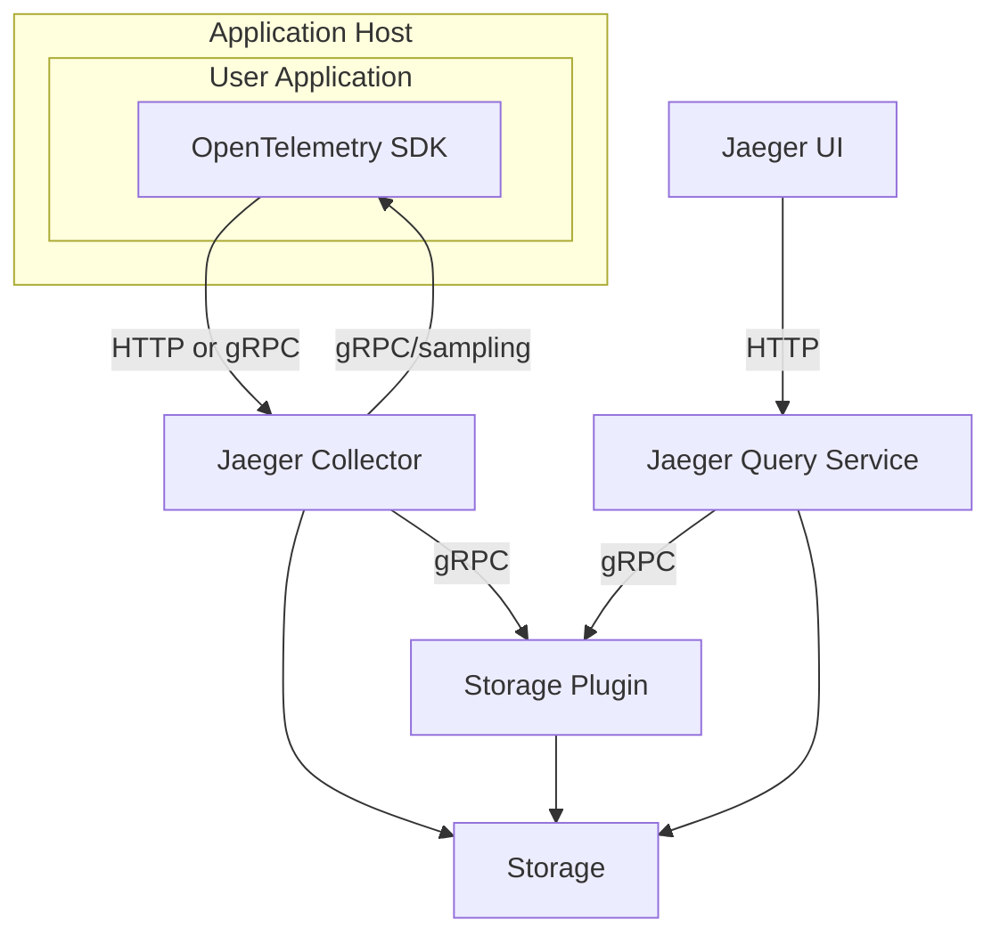

[](https://stand-with-ukraine.pp.ua)


[![Slack chat][slack-img]](#get-in-touch)
[![Unit Tests][ci-img]][ci]
[![Coverage Status][cov-img]][cov]
[![Project+Community stats][community-badge]][community-stats]
[![FOSSA Status][fossa-img]][fossa]
[![OpenSSF Scorecard][openssf-img]][openssf]
[![OpenSSF Best Practices][openssf-bp-img]][openssf-bp] 
[![CLOMonitor][clomonitor-img]][clomonitor]
[![Artifact Hub][artifacthub-img]][artifacthub]


# Jaeger - a Distributed Tracing System

💥💥💥 Jaeger v2 is out! Read the [blog post](https://medium.com/jaegertracing/jaeger-v2-released-09a6033d1b10) and [try it out](https://www.jaegertracing.io/docs/latest/getting-started/).



Jaeger is a distributed tracing platform created by [Uber Technologies](https://eng.uber.com/distributed-tracing/) and donated to [Cloud Native Computing Foundation](https://cncf.io).

See Jaeger [documentation][doc] for getting started, operational details, and other information.

Jaeger is hosted by the [Cloud Native Computing Foundation](https://cncf.io) (CNCF) as the 7th top-level project, graduated in October 2019. See the CNCF [Jaeger incubation announcement](https://www.cncf.io/blog/2017/09/13/cncf-hosts-jaeger/) and [Jaeger graduation announcement](https://www.cncf.io/announcement/2019/10/31/cloud-native-computing-foundation-announces-jaeger-graduation/).

## Get Involved

Jaeger is an open source project with open governance. We welcome contributions from the community, and we would love your help to improve and extend the project. Here are [some ideas](https://www.jaegertracing.io/get-involved/) for how to get involved. Many of them do not even require any coding.

## Version Compatibility Guarantees

Occasionally, CLI flags can be deprecated due to, for example, usability improvements or new functionality.
In such situations, developers introducing the deprecation are required to follow [these guidelines](./CONTRIBUTING.md#deprecating-cli-flags).

In short, for a deprecated CLI flag, you should expect to see the following message in the `--help` documentation:
```
(deprecated, will be removed after yyyy-mm-dd or in release vX.Y.Z, whichever is later)
```

A grace period of at least **3 months** or **two minor version bumps** (whichever is later) from the first release
containing the deprecation notice will be provided before the deprecated CLI flag _can_ be deleted.

For example, consider a scenario where v1.28.0 is released on 01-Jun-2021 containing a deprecation notice for a CLI flag.
This flag will remain in a deprecated state until the later of 01-Sep-2021 or v1.30.0 where it _can_ be removed on or after either of those events.
It may remain deprecated for longer than the aforementioned grace period.

## Go Version Compatibility Guarantees

The Jaeger project attempts to track the currently supported versions of Go, as [defined by the Go team](https://go.dev/doc/devel/release#policy).
Removing support for an unsupported Go version is not considered a breaking change.

Starting with the release of Go 1.21, support for Go versions will be updated as follows:

1. Soon after the release of a new Go minor version `N`, updates will be made to the build and tests steps to accommodate the latest Go minor version.
2. Soon after the release of a new Go minor version `N`, support for Go version `N-2` will be removed and version `N-1` will become the minimum required version.

## Related Repositories

### Components

 * [UI](https://github.com/jaegertracing/jaeger-ui)
 * [Data model](https://github.com/jaegertracing/jaeger-idl)

### Documentation

  * Published: https://www.jaegertracing.io/docs/
  * Source: https://github.com/jaegertracing/documentation

## Building From Source

See [CONTRIBUTING](./CONTRIBUTING.md).

## Contributing

See [CONTRIBUTING](./CONTRIBUTING.md).

Thanks to all the people who already contributed!

<a href="https://github.com/jaegertracing/jaeger/graphs/contributors">
  
</a>

### Maintainers

Rules for becoming a maintainer are defined in the [GOVERNANCE](./GOVERNANCE.md) document.
The official maintainers of the Jaeger project are listed in the [MAINTAINERS](./MAINTAINERS.md) file.
Please use `@jaegertracing/jaeger-maintainers` to tag them on issues / PRs.

Some repositories under [jaegertracing](https://github.com/jaegertracing) org have additional maintainers.

## Project Status Meetings

The Jaeger maintainers and contributors meet regularly on a video call. Everyone is welcome to join, including end users. For meeting details, see https://www.jaegertracing.io/get-in-touch/.

## Roadmap

See https://www.jaegertracing.io/docs/roadmap/

## Get in Touch

Have questions, suggestions, bug reports? Reach the project community via these channels:

 * [Slack chat room `#jaeger`][slack] (need to join [CNCF Slack][slack-join] for the first time)
 * [`jaeger-tracing` mail group](https://groups.google.com/forum/#!forum/jaeger-tracing)
 * GitHub [issues](https://github.com/jaegertracing/jaeger/issues) and [discussions](https://github.com/jaegertracing/jaeger/discussions)

## Security

Third-party security audits of Jaeger are available in https://github.com/jaegertracing/security-audits. Please see [Issue #1718](https://github.com/jaegertracing/jaeger/issues/1718) for the summary of available security mechanisms in Jaeger.

## Adopters

Jaeger as a product consists of multiple components. We want to support different types of users,
whether they are only using our instrumentation libraries or full end to end Jaeger installation,
whether it runs in production or you use it to troubleshoot issues in development.

Please see [ADOPTERS.md](./ADOPTERS.md) for some of the organizations using Jaeger today.
If you would like to add your organization to the list, please comment on our
[survey issue](https://github.com/jaegertracing/jaeger/issues/207).

## License

Copyright (c) The Jaeger Authors. [Apache 2.0 License](./LICENSE).

[doc]: https://jaegertracing.io/docs/
[ci-img]: https://github.com/jaegertracing/jaeger/actions/workflows/ci-unit-tests.yml/badge.svg?branch=main
[ci]: https://github.com/jaegertracing/jaeger/actions/workflows/ci-unit-tests.yml?query=branch%3Amain
[cov-img]: https://codecov.io/gh/jaegertracing/jaeger/branch/main/graph/badge.svg
[cov]: https://codecov.io/gh/jaegertracing/jaeger/branch/main/
[fossa-img]: https://app.fossa.com/api/projects/git%2Bgithub.com%2Fjaegertracing%2Fjaeger.svg?type=shield
[fossa]: https://app.fossa.io/projects/git%2Bgithub.com%2Fjaegertracing%2Fjaeger?ref=badge_shield
[openssf-img]: https://api.securityscorecards.dev/projects/github.com/jaegertracing/jaeger/badge
[openssf]: https://securityscorecards.dev/viewer/?uri=github.com/jaegertracing/jaeger
[openssf-bp-img]: https://www.bestpractices.dev/projects/1273/badge
[openssf-bp]: https://www.bestpractices.dev/projects/1273
[clomonitor-img]: https://img.shields.io/endpoint?url=https://clomonitor.io/api/projects/cncf/jaeger/badge
[clomonitor]: https://clomonitor.io/projects/cncf/jaeger
[artifacthub-img]: https://img.shields.io/endpoint?url=https://artifacthub.io/badge/repository/jaegertracing
[artifacthub]: https://artifacthub.io/packages/search?repo=jaegertracing


[community-badge]: https://img.shields.io/badge/Project+Community-stats-blue.svg
[community-stats]: https://all.devstats.cncf.io/d/54/project-health?orgId=1&var-repogroup_name=Jaeger
[hotrod-tutorial]: https://medium.com/jaegertracing/take-jaeger-for-a-hotrod-ride-233cf43e46c2
[slack]: https://cloud-native.slack.com/archives/CGG7NFUJ3
[slack-join]: https://slack.cncf.io
[slack-img]: https://img.shields.io/badge/slack-join%20chat%20%E2%86%92-brightgreen?logo=slack
