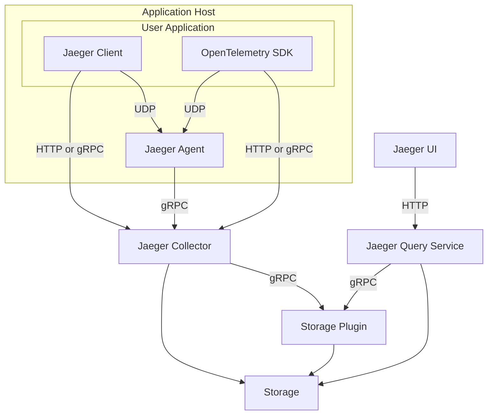

[![Slack chat][slack-img]](#get-in-touch)
[![Project+Community stats][community-badge]][community-stats]
[![Unit Tests][ci-img]][ci]
[![Coverage Status][cov-img]][cov]
[![FOSSA Status][fossa-img]][ci]
[](https://bestpractices.coreinfrastructure.org/projects/1273)


# Jaeger - a Distributed Tracing System



Jaeger, inspired by [Dapper][dapper] and [OpenZipkin](https://zipkin.io),
is a distributed tracing platform created by [Uber Technologies][ubeross]
and donated to [Cloud Native Computing Foundation](https://cncf.io).
It can be used for monitoring microservices-based distributed systems:

  * Distributed context propagation
  * Distributed transaction monitoring
  * Root cause analysis
  * Service dependency analysis
  * Performance / latency optimization

See also:

  * Jaeger [documentation][doc] for getting started, operational details, and other information.
  * Blog post [Evolving Distributed Tracing at Uber](https://eng.uber.com/distributed-tracing/).
  * Tutorial / walkthrough [Take Jaeger for a HotROD ride][hotrod-tutorial].

Jaeger is hosted by the [Cloud Native Computing Foundation](https://cncf.io) (CNCF) as the 7th top-level project (graduated in October 2019). If you are a company that wants to help shape the evolution of technologies that are container-packaged, dynamically-scheduled and microservices-oriented, consider joining the CNCF. For details about who's involved and how Jaeger plays a role, read the CNCF [Jaeger incubation announcement](https://www.cncf.io/blog/2017/09/13/cncf-hosts-jaeger/) and [Jaeger graduation announcement](https://www.cncf.io/announcement/2019/10/31/cloud-native-computing-foundation-announces-jaeger-graduation/).

## Get Involved

Jaeger is an open source project with open governance. We welcome contributions from the community, and we would love your help to improve and extend the project. Here are [some ideas](https://www.jaegertracing.io/get-involved/) for how to get involved. Many of them do not even require any coding.

## Features

### High Scalability

Jaeger backend is designed to have no single points of failure and to scale with the business needs.
For example, any given Jaeger installation at Uber is typically processing several billions of spans per day.

### Native support for OpenTracing

Jaeger backend, Web UI, and instrumentation libraries have been designed from the ground up to support the [OpenTracing standard](https://opentracing.io/specification/).
  * Represent traces as directed acyclic graphs (not just trees) via [span references](https://github.com/opentracing/specification/blob/master/specification.md#references-between-spans)
  * Support strongly typed span _tags_ and _structured logs_
  * Support general distributed context propagation mechanism via _baggage_

#### OpenTelemetry

Jaeger project recommends OpenTelemetry SDKs for instrumentation, instead of Jaeger's native SDKs [that are now deprecated](https://www.jaegertracing.io/docs/latest/client-libraries/#deprecating-jaeger-clients).

The OpenTracing and OpenCensus projects have merged into a new CNCF project called [OpenTelemetry](https://opentelemetry.io). The Jaeger and OpenTelemetry projects have different goals. OpenTelemetry aims to provide APIs and SDKs in multiple languages to allow applications to export various telemetry data out of the process, to any number of metrics and tracing backends. The Jaeger project is primarily the tracing backend that receives tracing telemetry data and provides processing, aggregation, data mining, and visualizations of that data. The Jaeger client libraries do overlap with OpenTelemetry in functionality. OpenTelemetry natively supports Jaeger as a tracing backend and makes Jaeger native clients unnecessary. For more information please refer to a blog post [Jaeger and OpenTelemetry](https://medium.com/jaegertracing/jaeger-and-opentelemetry-1846f701d9f2).

### Multiple storage backends

Jaeger supports two popular open source NoSQL databases as trace storage backends: Cassandra and Elasticsearch.
There is also embedded database support using [Badger](https://github.com/dgraph-io/badger).
There are ongoing community experiments using other databases, such as ScyllaDB, InfluxDB, Amazon DynamoDB.
Jaeger also ships with a simple in-memory storage for testing setups.

### Modern Web UI

Jaeger Web UI is implemented in Javascript using popular open source frameworks like React. Several performance
improvements have been released in v1.0 to allow the UI to efficiently deal with large volumes of data and to display
traces with tens of thousands of spans (e.g. we tried a trace with 80,000 spans).

### Cloud Native Deployment

Jaeger backend is distributed as a collection of Docker images. The binaries support various configuration methods,
including command line options, environment variables, and configuration files in multiple formats (yaml, toml, etc.)
Deployment to Kubernetes clusters is assisted by [Kubernetes templates](https://github.com/jaegertracing/jaeger-kubernetes)
and a [Helm chart](https://github.com/jaegertracing/helm-charts).

### Observability

All Jaeger backend components expose [Prometheus](https://prometheus.io/) metrics by default (other metrics backends are
also supported). Logs are written to standard out using the structured logging library [zap](https://github.com/uber-go/zap).

### Security

Third-party security audits of Jaeger are available in https://github.com/jaegertracing/security-audits. Please see [Issue #1718](https://github.com/jaegertracing/jaeger/issues/1718) for the summary of available security mechanisms in Jaeger.

### Backwards compatibility with Zipkin

Although we recommend instrumenting applications with OpenTelemetry, if your organization has already invested in the instrumentation
using Zipkin libraries, you do not have to rewrite all that code. Jaeger provides backwards compatibility with Zipkin
by accepting spans in Zipkin formats (Thrift or JSON v1/v2) over HTTP. Switching from Zipkin backend is just a matter
of routing the traffic from Zipkin libraries to the Jaeger backend.

## Version Compatibility Guarantees

Occasionally, CLI flags can be deprecated due to, for example, usability improvements or new functionality.
In such situations, developers introducing the deprecation are required to follow [these guidelines](./CONTRIBUTING.md#deprecating-cli-flags).

In short, for a deprecated CLI flag, you should expect to see the following message in the `--help` documentation:
```
(deprecated, will be removed after yyyy-mm-dd or in release vX.Y.Z, whichever is later)
```

A grace period of at least **3 months** or **two minor version bumps** (whichever is later) from the first release
containing the deprecation notice will be provided before the deprecated CLI flag _can_ be deleted.

For example, consider a scenario where v1.28.0 is released on 01-Jun-2021 containing a deprecation notice for a CLI flag.
This flag will remain in a deprecated state until the later of 01-Sep-2021 or v1.30.0 where it _can_ be removed on or after either of those events.
It may remain deprecated for longer than the aforementioned grace period.

## Related Repositories

### Documentation

  * Published: https://www.jaegertracing.io/docs/
  * Source: https://github.com/jaegertracing/documentation

### Instrumentation Libraries

Jaeger project recommends OpenTelemetry SDKs for instrumentation, instead of Jaeger's native SDKs [that are now deprecated](https://www.jaegertracing.io/docs/latest/client-libraries/#deprecating-jaeger-clients).

### Deployment

  * [Jaeger Operator for Kubernetes](https://github.com/jaegertracing/jaeger-operator#getting-started)

### Components

 * [UI](https://github.com/jaegertracing/jaeger-ui)
 * [Data model](https://github.com/jaegertracing/jaeger-idl)

## Building From Source

See [CONTRIBUTING](./CONTRIBUTING.md).

## Contributing

See [CONTRIBUTING](./CONTRIBUTING.md).

Thanks to all the people who already contributed!

<a href="https://github.com/jaegertracing/jaeger/graphs/contributors">
  
</a>

### Maintainers

Rules for becoming a maintainer are defined in the [GOVERNANCE](./GOVERNANCE.md) document.
Below are the official maintainers of the Jaeger project.
Please use `@jaegertracing/jaeger-maintainers` to tag them on issues / PRs.

* [@albertteoh](https://github.com/albertteoh)
* [@joe-elliott](https://github.com/joe-elliott)
* [@pavolloffay](https://github.com/pavolloffay)
* [@yurishkuro](https://github.com/yurishkuro)

Some repositories under [jaegertracing](https://github.com/jaegertracing) org have additional maintainers.

### Emeritus Maintainers

We are grateful to our former maintainers for their contributions to the Jaeger project.

* [@black-adder](https://github.com/black-adder)
* [@jpkrohling](https://github.com/jpkrohling)
* [@objectiser](https://github.com/objectiser)
* [@tiffon](https://github.com/tiffon)
* [@vprithvi](https://github.com/vprithvi)

## Project Status Meetings

The Jaeger maintainers and contributors meet regularly on a video call. Everyone is welcome to join, including end users. For meeting details, see https://www.jaegertracing.io/get-in-touch/.

## Roadmap

See https://www.jaegertracing.io/docs/roadmap/

## Get in Touch

Have questions, suggestions, bug reports? Reach the project community via these channels:

 * [Slack chat room `#jaeger`][slack] (need to join [CNCF Slack][slack-join] for the first time)
 * [`jaeger-tracing` mail group](https://groups.google.com/forum/#!forum/jaeger-tracing)
 * GitHub [issues](https://github.com/jaegertracing/jaeger/issues) and [discussions](https://github.com/jaegertracing/jaeger/discussions)

## Adopters

Jaeger as a product consists of multiple components. We want to support different types of users,
whether they are only using our instrumentation libraries or full end to end Jaeger installation,
whether it runs in production or you use it to troubleshoot issues in development.

Please see [ADOPTERS.md](./ADOPTERS.md) for some of the organizations using Jaeger today.
If you would like to add your organization to the list, please comment on our
[survey issue](https://github.com/jaegertracing/jaeger/issues/207).

## License

[Apache 2.0 License](./LICENSE).

[doc]: https://jaegertracing.io/docs/
[godoc-img]: https://godoc.org/github.com/jaegertracing/jaeger?status.svg
[godoc]: https://godoc.org/github.com/jaegertracing/jaeger
[ci-img]: https://github.com/jaegertracing/jaeger/workflows/Unit%20Tests/badge.svg?branch=main
[ci]: https://github.com/jaegertracing/jaeger/actions?query=branch%3Amain
[cov-img]: https://codecov.io/gh/jaegertracing/jaeger/branch/main/graph/badge.svg
[cov]: https://codecov.io/gh/jaegertracing/jaeger/branch/main/
[fossa-img]: https://github.com/jaegertracing/jaeger/workflows/FOSSA/badge.svg?branch=main
[dapper]: https://research.google.com/pubs/pub36356.html
[ubeross]: https://uber.github.io
[community-badge]: https://img.shields.io/badge/Project+Community-stats-blue.svg
[community-stats]: https://all.devstats.cncf.io/d/54/project-health?orgId=1&var-repogroup_name=Jaeger
[hotrod-tutorial]: https://medium.com/jaegertracing/take-jaeger-for-a-hotrod-ride-233cf43e46c2
[slack]: https://cloud-native.slack.com/archives/CGG7NFUJ3
[slack-join]: https://slack.cncf.io
[slack-img]: https://img.shields.io/badge/slack-join%20chat%20%E2%86%92-brightgreen?logo=slack
