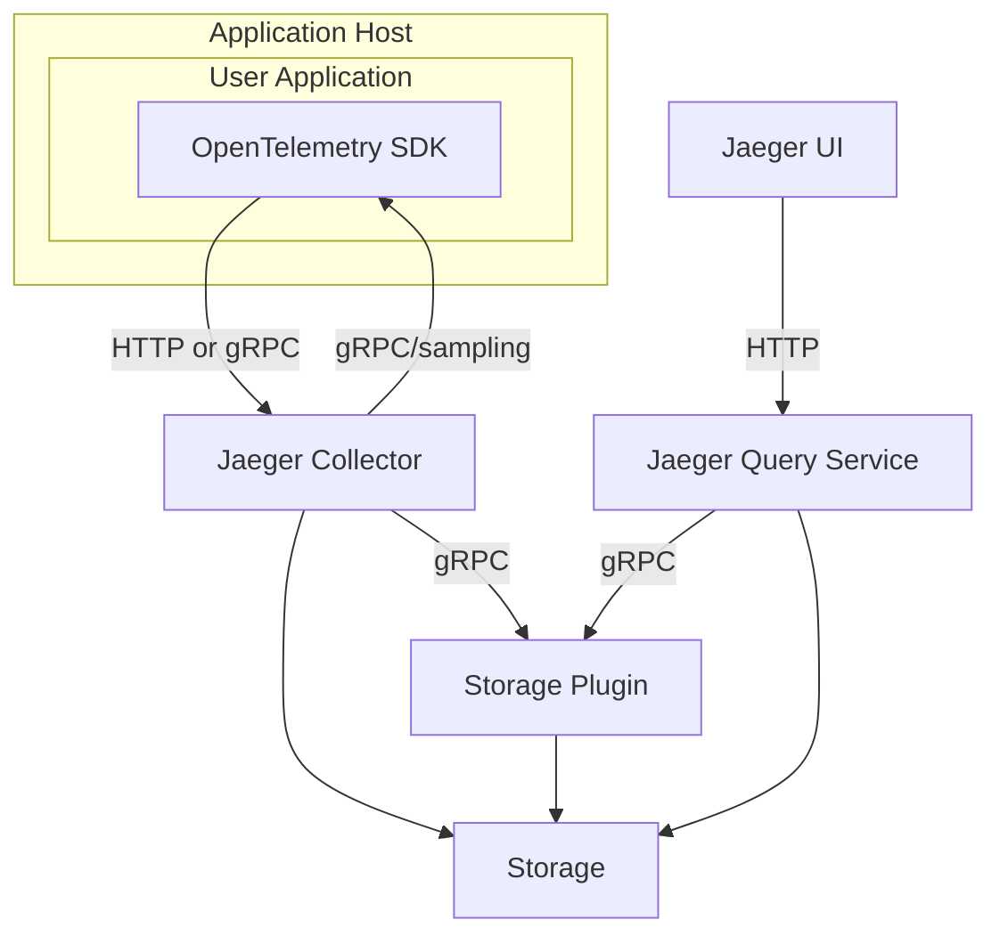

[](https://stand-with-ukraine.pp.ua)


[![Slack chat][slack-img]](#get-in-touch)
[![Unit Tests][ci-img]][ci]
[![Coverage Status][cov-img]][cov]
[![Project+Community stats][community-badge]][community-stats]
[![FOSSA Status][fossa-img]][fossa]
[![OpenSSF Scorecard][openssf-img]][openssf]
[![OpenSSF Best Practices][openssf-bp-img]][openssf-bp]
[![CLOMonitor][clomonitor-img]][clomonitor]
[![Artifact Hub][artifacthub-img]][artifacthub]


# Jaeger - a Distributed Tracing System

💥💥💥 Jaeger v2 is out! Read the [blog post](https://medium.com/jaegertracing/jaeger-v2-released-09a6033d1b10) and [try it out](https://www.jaegertracing.io/docs/latest/getting-started/).

## Quick Start

Get Jaeger running in seconds with Docker:

```bash
# Run Jaeger all-in-one (includes UI, collector, query, and in-memory storage)
docker run --rm --name jaeger \
  -p 16686:16686 \
  -p 4317:4317 \
  -p 4318:4318 \
  jaegertracing/jaeger:latest

# Access the UI at http://localhost:16686
# Send traces via OTLP: gRPC on port 4317, HTTP on port 4318
```

For production deployments and more options, see the [Getting Started Guide](https://www.jaegertracing.io/docs/latest/getting-started/).

## Architecture


```mermaid
graph TD
    SDK["OpenTelemetry SDK"] --> |HTTP or gRPC| COLLECTOR
    COLLECTOR["Jaeger Collector"] --> STORE[Storage]
    COLLECTOR --> |gRPC| PLUGIN[Storage Plugin]
    COLLECTOR --> |gRPC/sampling| SDK
    PLUGIN --> STORE
    QUERY[Jaeger Query Service] --> STORE
    QUERY --> |gRPC| PLUGIN
    UI[Jaeger UI] --> |HTTP| QUERY
    subgraph Application Host
        subgraph User Application
            SDK
        end
    end
```

Jaeger is a distributed tracing platform created by [Uber Technologies](https://eng.uber.com/distributed-tracing/) and donated to [Cloud Native Computing Foundation](https://cncf.io).

See Jaeger [documentation][doc] for getting started, operational details, and other information.

Jaeger is hosted by the [Cloud Native Computing Foundation](https://cncf.io) (CNCF) as the 7th top-level project, graduated in October 2019. See the CNCF [Jaeger incubation announcement](https://www.cncf.io/blog/2017/09/13/cncf-hosts-jaeger/) and [Jaeger graduation announcement](https://www.cncf.io/announcement/2019/10/31/cloud-native-computing-foundation-announces-jaeger-graduation/).

## Get Involved

Jaeger is an open source project with open governance. We welcome contributions from the community, and we would love your help to improve and extend the project. Here are [some ideas](https://www.jaegertracing.io/get-involved/) for how to get involved. Many of them do not even require any coding.

## Version Compatibility Guarantees

Since Jaeger uses many components from the [OpenTelemetry Collector](https://github.com/open-telemetry/opentelemetry-collector/) we try to maintain configuration compatibility between Jaeger releases. Occasionally, configuration options in Jaeger (or in Jaeger v1 CLI flags) can be deprecated due to usability improvements, new functionality, or changes in our dependencies.
In such situations, developers introducing the deprecation are required to follow [these guidelines](./CONTRIBUTING.md#deprecating-cli-flags).

In short, for a deprecated configuration option, you should expect to see the following message in the documentation or release notes:
```
(deprecated, will be removed after yyyy-mm-dd or in release vX.Y.Z, whichever is later)
```

A grace period of at least **3 months** or **two minor version bumps** (whichever is later) from the first release
containing the deprecation notice will be provided before the deprecated configuration option _can_ be deleted.

For example, consider a scenario where v2.0.0 is released on 01-Sep-2024 containing a deprecation notice for a configuration option.
This configuration option will remain in a deprecated state until the later of 01-Dec-2024 or v2.2.0 where it _can_ be removed on or after either of those events.
It may remain deprecated for longer than the aforementioned grace period.

## Go Version Compatibility Guarantees

The Jaeger project attempts to track the currently supported versions of Go, as [defined by the Go team](https://go.dev/doc/devel/release#policy).
Removing support for an unsupported Go version is not considered a breaking change.

Starting with the release of Go 1.21, support for Go versions will be updated as follows:

1. Soon after the release of a new Go minor version `N`, updates will be made to the build and tests steps to accommodate the latest Go minor version.
2. Soon after the release of a new Go minor version `N`, support for Go version `N-1` will be removed and version `N` will become the minimum required version.

Note: All importable code has been moved to internal packages, so there is no need to maintain backward compatibility with older compilers (previously version `N-1` was used).

## Storage Backend Version Compatibility Guarantees

Jaeger supports storage backend versions only while they are reasonable for the project to test, maintain, and recommend for production use.

For backends with a published upstream lifecycle, Jaeger follows the backend project's or vendor's supported-version or end-of-life policy. Once upstream support ends, Jaeger may remove CI coverage, stop proactively fixing backend-specific issues for that version, and require users to upgrade before troubleshooting.

For backends without a clear upstream lifecycle, Jaeger supports the current stable major version and the immediately preceding major version. Older versions are best-effort only and may be removed when they block development, security fixes, dependency updates, or CI reliability.

Backend-specific policy:

* Elasticsearch: follow Elastic's [Product and Version End of Life Policy](https://www.elastic.co/support/eol).
* OpenSearch: follow the OpenSearch [Release Schedule and Maintenance Policy](https://opensearch.org/releases/). In practice, this means the current major version and the previous major version while they remain maintained.
* Cassandra: follow Apache Cassandra's maintained release lines, as published on the [Cassandra download page](https://cassandra.apache.org/_/download.html), with the Jaeger support target being the current major version and the previous major version.
* ClickHouse: follow ClickHouse's [release and backport policy](https://clickhouse.com/docs/development/backports) and production guidance for [stable and LTS releases](https://clickhouse.com/docs/faq/operations/production). ClickHouse uses calendar-versioned monthly releases rather than traditional major-version support, so Jaeger does not apply the generic current-major-minus-one rule here.

Support means Jaeger maintains compatibility in code and CI for the supported version range. It does not mean Jaeger provides support for the backend product itself, vendor-specific distributions, or versions outside the upstream maintenance window.

As of July 6, 2026, this policy means:

| Backend | Jaeger policy basis | Versions covered by policy | Versions not covered |
| --- | --- | --- | --- |
| Elasticsearch | Elastic EOL policy | `9.x`; `8.x` until Elastic's published 8.x support window ends | `7.17.x` and earlier |
| OpenSearch | OpenSearch maintenance policy | `3.x`; `2.19.x` previous-major maintenance line | `1.x` and earlier |
| Cassandra | Current major plus previous major, using maintained Apache release lines | `5.0.x`; maintained `4.x` lines, currently `4.1.x` and `4.0.x` | `3.x` and earlier |
| ClickHouse | ClickHouse stable and LTS policy | Latest three stable branches, currently `26.6`, `26.5`, and `26.4`; active LTS branches, currently `26.3 LTS` and `25.8 LTS` | Older stable branches and expired LTS branches |

This table is informational and should be refreshed when upstream policies or release lines change.

## Related Repositories

### Components

 * [UI](https://github.com/jaegertracing/jaeger-ui)
 * [Data model](https://github.com/jaegertracing/jaeger-idl)

### Documentation

  * Published: https://www.jaegertracing.io/docs/
  * Source: https://github.com/jaegertracing/documentation

## Building From Source

See [CONTRIBUTING](./CONTRIBUTING.md).

## Contributing

See [CONTRIBUTING](./CONTRIBUTING.md).

Thanks to all the people who already contributed!

<a href="https://github.com/jaegertracing/jaeger/graphs/contributors">
  
</a>

### Maintainers

Rules for becoming a maintainer are defined in the [GOVERNANCE](./GOVERNANCE.md) document.
The official maintainers of the Jaeger project are listed in the [MAINTAINERS](./MAINTAINERS.md) file.
Please use `@jaegertracing/jaeger-maintainers` to tag them on issues / PRs.

Some repositories under [jaegertracing](https://github.com/jaegertracing) org have additional maintainers.

## Project Status Meetings

The Jaeger maintainers and contributors meet regularly on a video call. Everyone is welcome to join, including end users. For meeting details, see https://www.jaegertracing.io/get-in-touch/.

## Roadmap

See https://www.jaegertracing.io/docs/roadmap/

## Get in Touch

Have questions, suggestions, bug reports? Reach the project community via these channels:

 * [Slack chat room `#jaeger`][slack] (need to join [CNCF Slack][slack-join] for the first time)
 * [`jaeger-tracing` mail group](https://groups.google.com/forum/#!forum/jaeger-tracing)
 * GitHub [issues](https://github.com/jaegertracing/jaeger/issues) and [discussions](https://github.com/jaegertracing/jaeger/discussions)

## Security

Third-party security audits of Jaeger are available in https://github.com/jaegertracing/security-audits. Please see [Issue #1718](https://github.com/jaegertracing/jaeger/issues/1718) for the summary of available security mechanisms in Jaeger.

## Adopters

Jaeger as a product consists of multiple components. We want to support different types of users,
whether they are only using our instrumentation libraries or full end to end Jaeger installation,
whether it runs in production or you use it to troubleshoot issues in development.

Please see [ADOPTERS.md](./ADOPTERS.md) for some of the organizations using Jaeger today.
If you would like to add your organization to the list, please comment on our
[survey issue](https://github.com/jaegertracing/jaeger/issues/207).

## Sponsors

The Jaeger project owes its success in open source largely to the Cloud Native Computing Foundation (CNCF), our primary supporter. We deeply appreciate their vital support.  Furthermore, we are grateful to Uber for their initial, project-launching donation, and for the continuous contributions of software and infrastructure from 1Password, Codecov.io, Dosu, GitHub, Google Analytics, Netlify, and Oracle Cloud Infrastructure. Thank you for your generous support.

## License

Copyright (c) The Jaeger Authors. [Apache 2.0 License](./LICENSE).

[doc]: https://jaegertracing.io/docs/
[ci-img]: https://github.com/jaegertracing/jaeger/actions/workflows/ci-unit-tests.yml/badge.svg?branch=main
[ci]: https://github.com/jaegertracing/jaeger/actions/workflows/ci-unit-tests.yml?query=branch%3Amain
[cov-img]: https://codecov.io/gh/jaegertracing/jaeger/branch/main/graph/badge.svg
[cov]: https://codecov.io/gh/jaegertracing/jaeger/branch/main/
[fossa-img]: https://app.fossa.com/api/projects/git%2Bgithub.com%2Fjaegertracing%2Fjaeger.svg?type=shield
[fossa]: https://app.fossa.io/projects/git%2Bgithub.com%2Fjaegertracing%2Fjaeger?ref=badge_shield
[openssf-img]: https://api.securityscorecards.dev/projects/github.com/jaegertracing/jaeger/badge
[openssf]: https://securityscorecards.dev/viewer/?uri=github.com/jaegertracing/jaeger
[openssf-bp-img]: https://www.bestpractices.dev/projects/1273/badge
[openssf-bp]: https://www.bestpractices.dev/projects/1273
[clomonitor-img]: https://img.shields.io/endpoint?url=https://clomonitor.io/api/projects/cncf/jaeger/badge
[clomonitor]: https://clomonitor.io/projects/cncf/jaeger
[artifacthub-img]: https://img.shields.io/endpoint?url=https://artifacthub.io/badge/repository/jaegertracing
[artifacthub]: https://artifacthub.io/packages/search?repo=jaegertracing


[community-badge]: https://img.shields.io/badge/Project+Community-stats-blue.svg
[community-stats]: https://all.devstats.cncf.io/d/54/project-health?orgId=1&var-repogroup_name=Jaeger
[hotrod-tutorial]: https://medium.com/jaegertracing/take-jaeger-for-a-hotrod-ride-233cf43e46c2
[slack]: https://cloud-native.slack.com/archives/CGG7NFUJ3
[slack-join]: https://slack.cncf.io
[slack-img]: https://img.shields.io/badge/slack-join%20chat%20%E2%86%92-brightgreen?logo=slack
