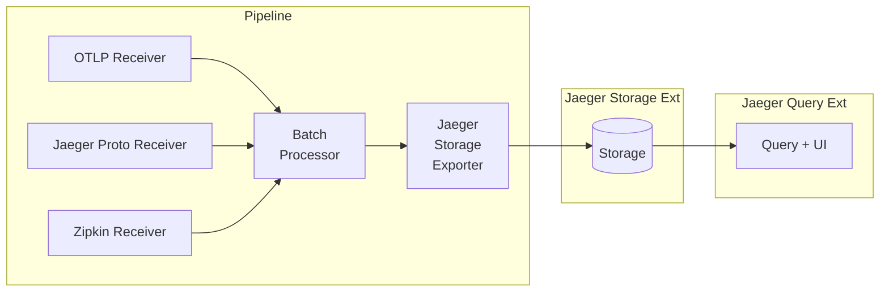

# jaeger

Jaeger V2 based on OpenTelemetry collector.
Read the [blog post](https://medium.com/jaegertracing/towards-jaeger-v2-moar-opentelemetry-2f8239bee48e).

## Try it out

* Download `docker-compose.yml` from https://github.com/jaegertracing/jaeger/blob/main/examples/hotrod/docker-compose.yml, e.g.:
  * `curl -O https://raw.githubusercontent.com/jaegertracing/jaeger/refs/heads/main/examples/hotrod/docker-compose.yml`
* Optional: find the latest images versions (see https://www.jaegertracing.io/download/) and pass them via environment variables `JAEGER_VERSION` and `HOTROD_VERSION`. Otherwise `docker compose` will use the `latest` tag, which is fine for the first time you download the images, but once they are in your local registry the `latest` tag is never updated and you may be running stale (and possibly incompatible) verions of Jaeger and the HotROD app.
* Run Jaeger backend and HotROD demo, e.g.:
  * `JAEGER_VERSION=2.0.0 HOTROD_VERSION=1.63.0 docker compose -f docker-compose.yml up`
* Access Jaeger UI at http://localhost:16686 and HotROD app at http://localhost:8080
* Shutdown / cleanup with `docker compose -f docker-compose.yml down`
