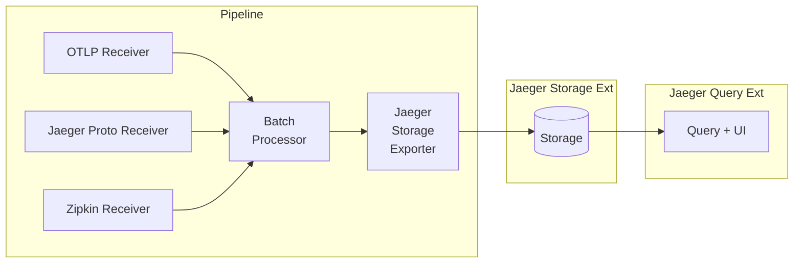

# jaeger

This is experimental Jaeger V2 based on OpenTelemetry collector.
Read the [blog post](https://medium.com/jaegertracing/towards-jaeger-v2-moar-opentelemetry-2f8239bee48e).

Tracking issue: https://github.com/jaegertracing/jaeger/issues/4843.

## Try it out

* Download `docker-compose-v2.yml` from https://github.com/jaegertracing/jaeger/blob/main/examples/hotrod/docker-compose-v2.yml
* Optional: find the latest Jaeger version (see https://www.jaegertracing.io/download/) and pass it via environment variable `JAEGER_VERSION`. Otherwise `docker compose` will use the `latest` tag, which is fine for the first time you download the images, but once they are in your local registry the `latest` tag is never updated and you may be running stale (and possibly incompatible) verions of Jaeger and the HotROD app.
* Run Jaeger backend and HotROD demo, e.g.:
  * `JAEGER_VERSION=1.59 docker compose -f path-to-yml-file-v2 up`
* Access Jaeger UI at http://localhost:16686 and HotROD app at http://localhost:8080
* Shutdown / cleanup with `docker compose -f path-to-yml-file down`
