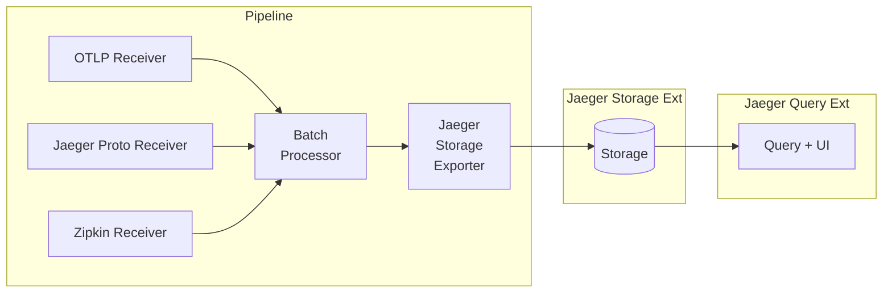

# jaeger

This is experimental Jaeger V2 based on OpenTelemetry collector.
See https://github.com/jaegertracing/jaeger/issues/4843.

```mermaid
flowchart LR
    Receiver1 --> Processor
    Receiver2 --> Processor
    Receiver3 --> Processor
    Processor --> Exporter

    Exporter --> Database
    Database --> Query[Query + UI]

    subgraph Pipeline
        Receiver1[OTLP Receiver]
        Receiver2[Jaeger Proto Receiver]
        Receiver3[Zipkin Receiver]
        Processor[Batch
            Processor]
        Exporter[Jaeger
            Storage
            Exporter]
    end

    subgraph JaegerStorageExension[Jaeger Storage Ext]
        Database[(Storage)]
    end
    subgraph JaegerQueryExtension[Jaeger Query Ext]
        Query
    end
```
