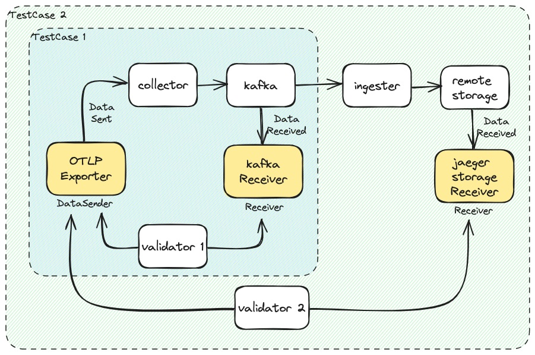

# Integration

Jaeger v2 integration tests are built on top of [OTEL Testbed module](https://github.com/open-telemetry/opentelemetry-collector-contrib/tree/main/testbed). OTEL Testbed provide comprehensive tools for conducting end-to-end tests for the OTEL Collector, such as reproducible short-term benchmarks, correctness tests, long-running stability tests and maximum load stress tests. To learn more about OTEL Testbed, please refer to the their [README](https://github.com/open-telemetry/opentelemetry-collector-contrib/blob/main/testbed/README.md)

## kafka_test

Kafka e2e test checks if the pipelines through `kafka` and finally at `remote-storage` have stored match exactly with the provided data using `GoldenDataProvider` (Provides data from the "Golden" dataset generated using pairwise combinatorial testing a.k.a PICT techniques for use in correctness tests) and validated using `CorrectnessTestValidator`.

The pipelines are checked in 2 steps, which the first test case verifies if the spans sent to Kafka are correct, and the second one checks the spans stored in the remote storage.


To conduct the tests, run the following command:

```
scripts/otel-kafka-integration-test.sh [kafka_version=latest] [remote_storage_version=latest]
```
