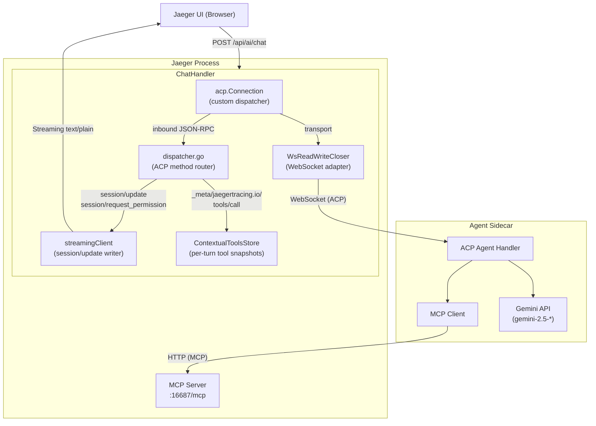
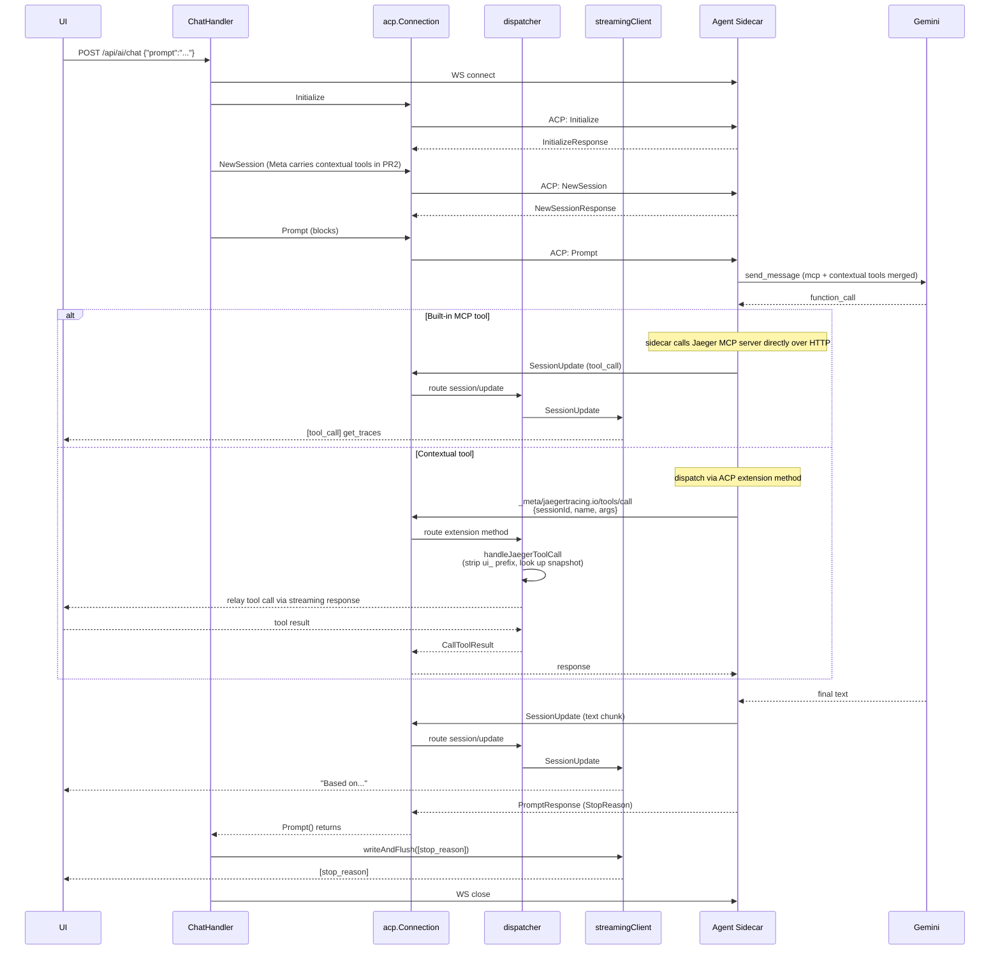

# Jaeger AI Gateway

This package implements the AI gateway component within Jaeger Query that bridges
the Jaeger UI with an external AI Agent Sidecar using the
[Agent Client Protocol (ACP)](https://agentclientprotocol.com/).

It also defines a small ACP **extension method** the sidecar invokes when the
LLM requests a frontend-supplied (AG-UI) tool, plus a per-turn store the
gateway uses to correlate those calls with the snapshot the browser attached
to the chat request.

## Architecture



## Components

### ChatHandler (`handler.go`)

HTTP handler registered at `POST /api/ai/chat`. When a request arrives:

1. Parses the JSON request body containing the user's prompt.
2. Establishes a WebSocket connection to the Agent Sidecar.
3. Creates a `WsReadWriteCloser` to adapt WebSocket to `io.ReadWriteCloser`.
4. Creates a `streamingClient` that writes ACP `session/update` payloads to the HTTP response.
5. Builds the connection via `acp.NewConnection(newDispatcher(...), adapter, adapter)` rather
   than `acp.NewClientSideConnection`. The SDK's stock dispatcher returns `MethodNotFound`
   for any extension method, so we install our own router (see Dispatcher below) that
   handles both standard ACP methods and the `_meta/jaegertracing.io/tools/call`
   extension method.
6. Executes ACP handshake: `Initialize` → `NewSession` → `Prompt`. `NewSessionRequest.Meta`
   carries the contextual tools snapshot (PR2 wiring; PR1 sends an empty meta).
7. Streams responses back to the HTTP client as `text/plain`.

### Dispatcher (`dispatcher.go`)

Custom ACP method router for inbound JSON-RPC from the sidecar. Routes:

- `session/update` → `streamingClient.SessionUpdate` (streamed agent text, tool progress markers).
- `session/request_permission` → `streamingClient.RequestPermission` (always denies; gateway advertises no fs/terminal capabilities).
- `_meta/jaegertracing.io/tools/call` → `handleJaegerToolCall` — logs the call and returns a
  placeholder result. PR2 will replace the placeholder with a real round-trip to the
  AG-UI-connected browser via the open HTTP response stream.
- anything else → `MethodNotFound`.

`UIToolPrefix` (`ui_`) is the namespace the gateway prepends to every contextual tool name
before exposing it to the sidecar (and therefore to Gemini). The dispatcher strips it back
on the way in so the AG-UI client receives the original frontend name. The prefix prevents
a frontend-supplied tool from shadowing a built-in Jaeger MCP tool with the same name
(e.g. `search_traces`).

### ContextualToolsStore (`contextual_tools.go`)

Thread-safe per-turn store of frontend-supplied AG-UI tools. Keyed by a gateway-minted
**contextual MCP id**, *not* the ACP session id — the latter is assigned by the sidecar
after `NewSession` returns and is therefore unavailable when the gateway populates
`NewSessionRequest.Meta`.

- `SetForContextualMCPID` — stores a snapshot, copying raw JSON bytes so later caller
  mutation cannot affect the stored entry. Empty id is a no-op; an empty/all-invalid set
  deletes any existing entry rather than writing an empty slice.
- `DeleteForContextualMCPID` — drops the snapshot at turn end. The chat handler must
  call this once `Prompt` returns so the store does not grow over the gateway's lifetime.
- `GetContextualToolsForID` — returns a freshly unmarshaled tree per call so readers
  cannot corrupt the stored snapshot through map mutation.

### streamingClient (`streaming_client.go`)

Implements the `acp.Client`-shaped subset the dispatcher needs. Key responsibilities:

- **SessionUpdate**: receives streamed content from the agent (text chunks, tool call
  notifications) and writes them to the HTTP response.
- **RequestPermission**: always cancels/denies permission requests (the gateway advertises
  no filesystem or terminal capability in `Initialize`).

### WsReadWriteCloser (`ws_adapter.go`)

Adapts a gorilla WebSocket connection to the `io.ReadWriteCloser` interface required by
the ACP runtime. Reads WebSocket text/binary messages as a continuous byte stream; writes
bytes as WebSocket text messages.

## Request Flow



## Configuration

The AI gateway is configured via the `extensions.jaeger_query.ai` section:

```yaml
extensions:
  jaeger_query:
    ai:
      agent_url: "ws://localhost:16688"     # WebSocket URL of Agent Sidecar
```

The endpoint is only registered when `ai.agent_url` is configured and non-empty.

## ACP Surface

The gateway speaks two distinct ACP method families with the sidecar:

**Standard methods** (defined by the protocol):

- Outbound from gateway: `Initialize`, `NewSession`, `Prompt`.
- Inbound to gateway:
  - `session/update` — informational stream (text chunks, thought chunks, tool call
    notifications, plans), written into the HTTP response.
  - `session/request_permission` — always denied; gateway advertises no fs/terminal
    capability in `Initialize`.

`SessionUpdate(ToolCall)` notifications are purely informational (UI progress display).
The sidecar executes built-in MCP tools by calling Jaeger's MCP server directly over
HTTP — those calls do not flow through the gateway.

**Extension methods** (defined by this package):

- `_meta/jaegertracing.io/tools/call` — sent by the sidecar when the LLM requests a
  contextual tool. Payload: `{sessionId, name, args}`. The gateway replies with a
  `CallToolResult`-shaped object. PR1 returns a logged placeholder; PR2 will round-trip
  the call to the browser via the open HTTP response stream and return the real result.

## Contextual Tools

Frontend-supplied AG-UI tools follow this lifecycle:

1. The browser includes a `tools` array in its POST to `/api/ai/chat` (PR2 wiring).
2. The gateway mints a per-turn **contextual MCP id**, prefixes each tool name with
   `UIToolPrefix` (`ui_`), and writes the prefixed snapshot into `ContextualToolsStore`.
3. The same snapshot is attached to `NewSessionRequest.Meta` under the namespaced key
   `jaegertracing.io/contextual-tools` so the sidecar can register them with the LLM.
4. When the LLM calls a contextual tool, the sidecar dispatches
   `_meta/jaegertracing.io/tools/call` over ACP back to the gateway.
5. The dispatcher strips the `ui_` prefix, looks the call up in the store, and
   (PR2) relays it to the browser via the streaming HTTP response.
6. The browser executes the tool, returns the result, the dispatcher returns it
   to the sidecar, the sidecar feeds it back into the LLM.
7. After `Prompt` returns, the chat handler calls `DeleteForContextualMCPID` so the
   store does not accumulate entries.

## Related Components

- **Agent Sidecar**: See `scripts/ai-sidecar/` for reference implementations
  (e.g. Gemini-based Python sidecar).
- **MCP Server**: Jaeger's MCP server exposes built-in trace query tools at `/mcp`.
- **ACP Protocol**: See https://agentclientprotocol.com/.
