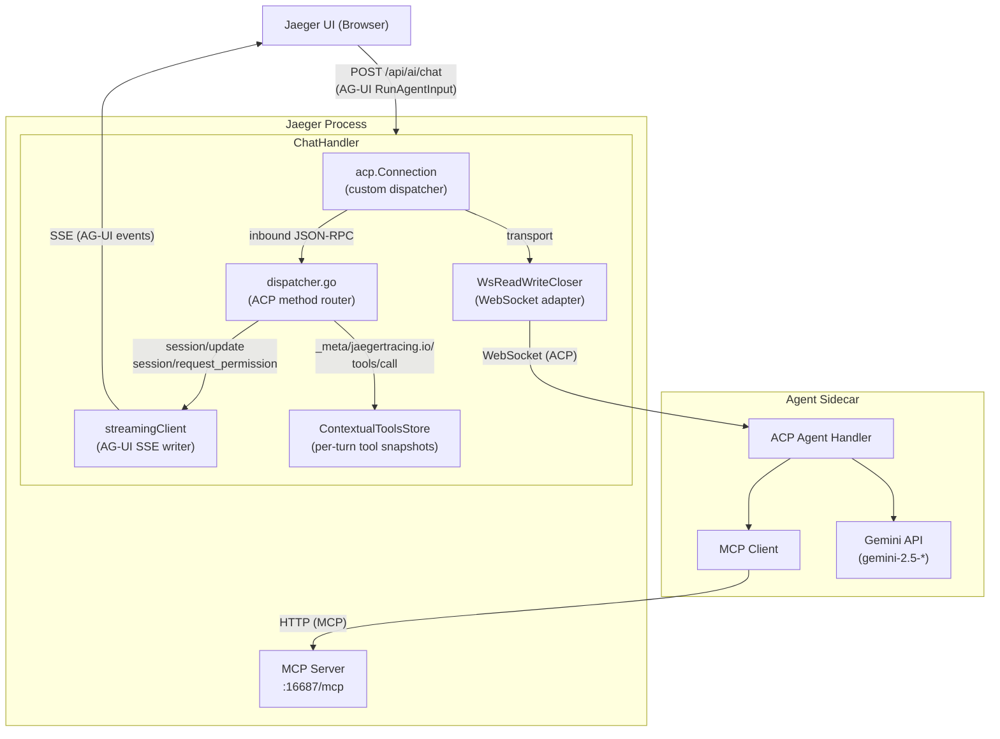
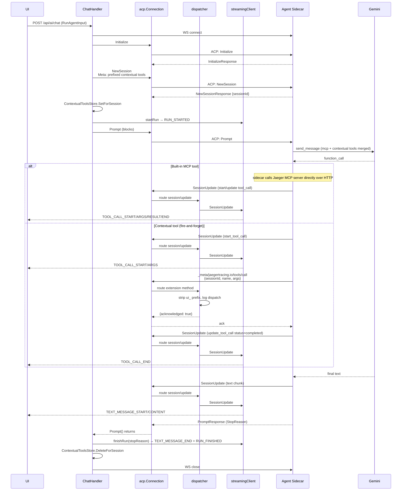

# Jaeger AI Gateway

This package implements the AI gateway component within Jaeger Query that bridges
the Jaeger UI with an external AI Agent Sidecar using the
[Agent Client Protocol (ACP)](https://agentclientprotocol.com/).

The chat endpoint accepts [AG-UI](https://docs.ag-ui.com/) `RunAgentInput`
payloads and streams AG-UI SSE events back to the browser. Inside the gateway,
it speaks ACP to the sidecar and translates between the two protocols. It also
defines a small ACP **extension method** the sidecar invokes when the LLM
requests a frontend-supplied (AG-UI) tool, and a per-turn store the gateway
uses to correlate those calls with the snapshot the browser attached to the
chat request.

## Architecture



## Components

### ChatHandler (`handler.go`)

HTTP handler registered at `POST /api/ai/chat`. Accepts AG-UI
[`RunAgentInput`](https://docs.ag-ui.com/concepts/run-input) payloads
(`messages`, `tools`, `context`, `threadId`, `runId`). When a request arrives:

1. Parses the AG-UI request body and extracts the latest user message text from
   `messages` plus any `context` entries; both become ACP prompt blocks.
2. Establishes a WebSocket connection to the Agent Sidecar.
3. Builds a `streamingClient` that writes AG-UI SSE events into the HTTP
   response. The handler passes the request's `threadId` / `runId` through so
   the events match what the AG-UI client expects.
4. Builds the connection via `acp.NewConnection(newDispatcher(...), adapter, adapter)`
   rather than `acp.NewClientSideConnection`. The SDK's stock dispatcher returns
   `MethodNotFound` for any extension method, so we install our own router (see
   Dispatcher below) that handles both standard ACP methods and the
   `_meta/jaegertracing.io/tools/call` extension method.
5. Executes the ACP handshake: `Initialize` → `NewSession` → `Prompt`. If the
   request carries `tools`, the gateway prefixes each name with `UIToolPrefix`
   (`ui_`) and attaches the prefixed snapshot to `NewSessionRequest.Meta` under
   `jaegertracing.io/contextual-tools` so the sidecar can register them with
   the LLM. The same prefixed snapshot is also written into
   `ContextualToolsStore` keyed by the assigned ACP `SessionId`, with a
   matching `defer DeleteForSession`.
6. Sets `Content-Type: text/event-stream`, emits `RUN_STARTED`, runs `Prompt`,
   and emits `RUN_FINISHED` (or `RUN_ERROR` on failure) once it returns. Any
   streamed agent text or tool-call notifications during `Prompt` are flushed
   as AG-UI events on the SSE stream.

### Dispatcher (`dispatcher.go`)

Custom ACP method router for inbound JSON-RPC from the sidecar. Routes:

- `session/update` → `streamingClient.SessionUpdate` (translated into AG-UI
  text-message and tool-call events on the SSE stream).
- `session/request_permission` → `streamingClient.RequestPermission` (always
  denies; gateway advertises no fs/terminal capabilities).
- `_meta/jaegertracing.io/tools/call` → `handleJaegerToolCall` — acknowledges
  the contextual tool dispatch and returns immediately. See *Contextual Tools*
  below for the fire-and-forget rationale.
- anything else → `MethodNotFound`.

`UIToolPrefix` (`ui_`) is the namespace the gateway prepends to every
contextual tool name before exposing it to the sidecar (and therefore to
Gemini). The dispatcher strips it back on the way in so the AG-UI client
receives the original frontend name. The prefix prevents a frontend-supplied
tool from shadowing a built-in Jaeger MCP tool with the same name (e.g.
`search_traces`).

### ContextualToolsStore (`contextual_tools.go`)

Thread-safe per-turn store of frontend-supplied AG-UI tools, keyed by ACP
**session id**. The chat handler writes the snapshot once `NewSessionResponse`
returns and before `Prompt` is sent. The dispatcher (`handleJaegerToolCall`)
can read the snapshot using the same `sessionId` the sidecar puts on the
ext_method payload, so the lookup is unambiguous without any extra correlation
field.

- `SetForSession` — stores a snapshot, copying raw JSON bytes so later caller
  mutation cannot affect the stored entry. Empty id is a no-op; an empty/all-
  invalid set deletes any existing entry rather than writing an empty slice.
- `DeleteForSession` — drops the snapshot at turn end. The chat handler must
  call this once `Prompt` returns so the store does not grow over the
  gateway's lifetime.
- `GetContextualToolsForSession` — returns a freshly unmarshaled tree per call
  so readers cannot corrupt the stored snapshot through map mutation.

### streamingClient (`streaming_client.go`)

Implements the `acp.Client`-shaped subset the dispatcher needs and translates
ACP `session/update` notifications into AG-UI SSE frames. Key responsibilities:

- **`startRun` / `finishRun` / `failRun`**: lifecycle frames (`RUN_STARTED`,
  `RUN_FINISHED`, `RUN_ERROR`). Lifecycle calls also bracket assistant text via
  `TEXT_MESSAGE_START` / `TEXT_MESSAGE_END`.
- **SessionUpdate**: maps ACP updates to AG-UI events:
  `AgentMessageChunk` → `TEXT_MESSAGE_CONTENT`,
  `ToolCall` → `TOOL_CALL_START` (+ `TOOL_CALL_ARGS` if `RawInput` is set),
  `ToolCallUpdate` → optional `TOOL_CALL_ARGS`/`TOOL_CALL_RESULT`/`TOOL_CALL_END`
  depending on which fields are populated.
- **RequestPermission**: always cancels/denies (the gateway advertises no
  filesystem or terminal capability in `Initialize`).

All mutable fields are guarded by a mutex because the ACP SDK may invoke
`SessionUpdate` from a goroutine other than the one driving `Prompt`, and
lifecycle calls come from the chat handler.

### WsReadWriteCloser (`ws_adapter.go`)

Adapts a gorilla WebSocket connection to the `io.ReadWriteCloser` interface
required by the ACP runtime. Reads WebSocket text/binary messages as a
continuous byte stream; writes bytes as WebSocket text messages.

## Request Flow



## Configuration

The AI gateway is configured via the `extensions.jaeger_query.ai` section:

```yaml
extensions:
  jaeger_query:
    ai:
      agent_url: "ws://localhost:16688"     # WebSocket URL of Agent Sidecar
```

The endpoint is only registered when `ai.agent_url` is configured and non-empty.

## ACP Surface

The gateway speaks two distinct ACP method families with the sidecar:

**Standard methods** (defined by the protocol):

- Outbound from gateway: `Initialize`, `NewSession`, `Prompt`.
- Inbound to gateway:
  - `session/update` — informational stream (text chunks, thought chunks, tool
    call notifications, plans). Translated into AG-UI SSE events on the chat
    response.
  - `session/request_permission` — always denied; gateway advertises no
    fs/terminal capability in `Initialize`.

`SessionUpdate(ToolCall)` notifications are purely informational (UI progress
display). The sidecar executes built-in MCP tools by calling Jaeger's MCP
server directly over HTTP — those calls do not flow through the gateway.

**Extension methods** (defined by this package):

- `_meta/jaegertracing.io/tools/call` — sent by the sidecar when the LLM
  requests a contextual tool. Payload: `{sessionId, name, args}`. The gateway
  validates the payload, strips `UIToolPrefix` from the tool name, logs the
  dispatch, and immediately returns `{result: {acknowledged: true},
  isError: false}`.

## Contextual Tools

Contextual (frontend-supplied) tools are treated as **fire-and-forget side
effects**. UI tools like `show_flamegraph(trace_id)` or `set_filter(...)` are
commands rather than queries — there is no meaningful return value to thread
back to the LLM. The browser sees the tool call on its SSE stream and reacts
in parallel; the gateway acknowledges the dispatch immediately so the LLM's
agentic loop continues with a real function response and produces a final
answer in the same turn.

Lifecycle:

1. The browser includes a `tools` array in its `RunAgentInput` POST to
   `/api/ai/chat`.
2. The gateway prefixes each tool name with `UIToolPrefix` (`ui_`) and
   attaches the prefixed snapshot to `NewSessionRequest.Meta` under
   `jaegertracing.io/contextual-tools` so the sidecar can register the tools
   with the LLM.
3. Once `NewSessionResponse` returns with the assigned `SessionId`, the
   gateway writes the same prefixed snapshot into `ContextualToolsStore`
   keyed by that session id, then sends `Prompt`.
4. When the LLM calls a contextual tool, the sidecar emits ACP
   `start_tool_call` / `update_tool_call` notifications around the dispatch
   (which the streaming client renders as AG-UI `TOOL_CALL_*` SSE events) and
   sends `_meta/jaegertracing.io/tools/call` with `{sessionId, name, args}`.
5. The gateway dispatcher strips `ui_`, logs, and returns
   `{acknowledged: true}` immediately.
6. The sidecar feeds the acknowledgement to Gemini as the function response;
   Gemini continues and produces a final assistant message.
7. The browser, having seen the `TOOL_CALL_*` events earlier, performs the
   side effect locally (navigate, render, etc.) without needing to send a
   tool-result back.
8. After `Prompt` returns, the chat handler calls `DeleteForSession` so the
   store does not accumulate entries.

## Related Components

- **Agent Sidecar**: See `scripts/ai-sidecar/` for reference implementations
  (e.g. Gemini-based Python sidecar).
- **MCP Server**: Jaeger's MCP server exposes built-in trace query tools at `/mcp`.
- **ACP Protocol**: See https://agentclientprotocol.com/.
- **AG-UI Protocol**: See https://docs.ag-ui.com/.
