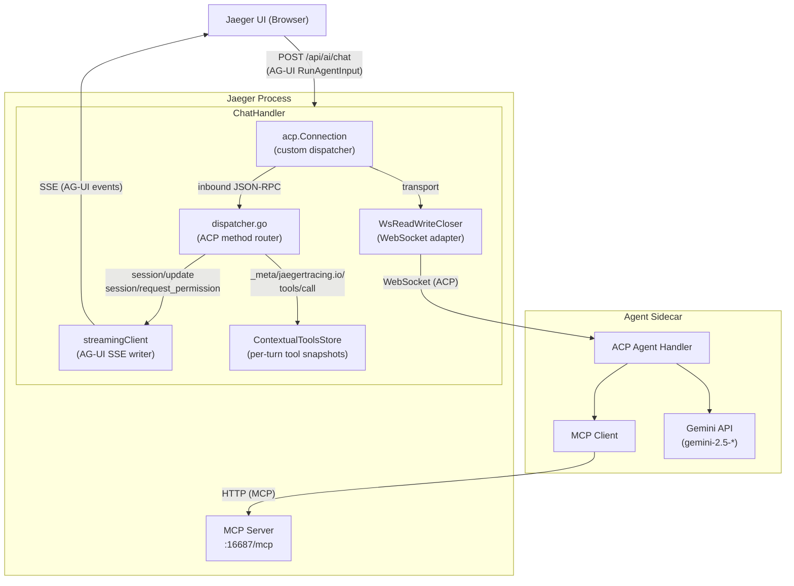
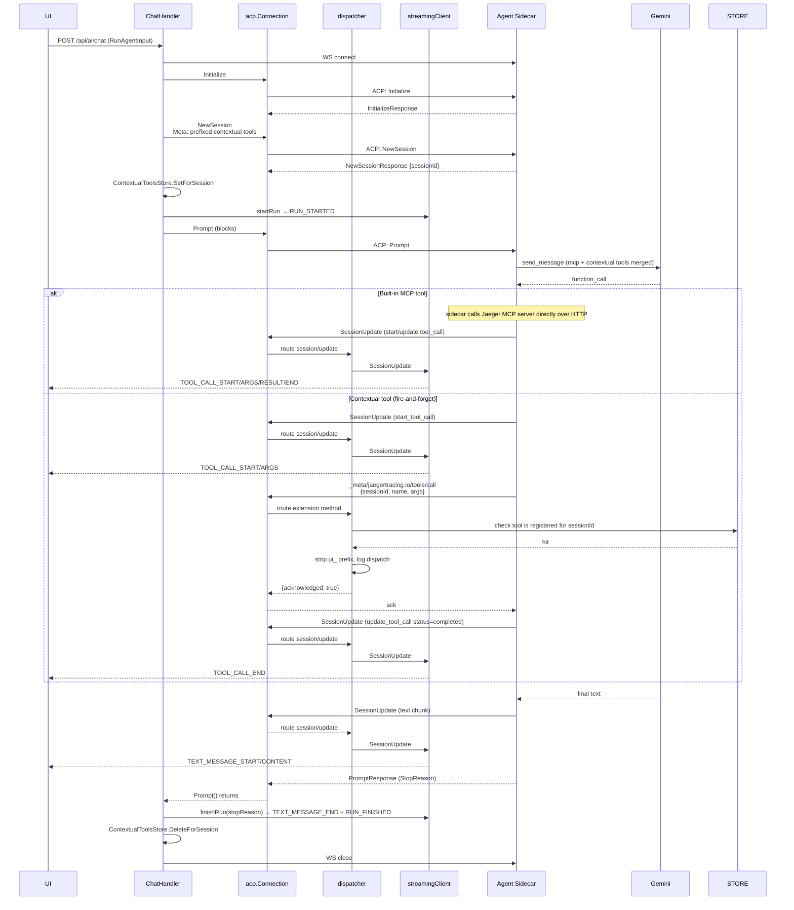

# Jaeger AI Gateway

This package implements the AI gateway component within Jaeger Query that bridges
the Jaeger UI with an external AI Agent Sidecar using the
[Agent Client Protocol (ACP)](https://agentclientprotocol.com/).

The chat endpoint accepts [AG-UI](https://docs.ag-ui.com/) `RunAgentInput`
payloads and streams AG-UI SSE events back to the browser. Inside the gateway,
it speaks ACP to the sidecar and translates between the two protocols. It also
defines a small ACP **extension method** the sidecar invokes when the LLM
requests a frontend-supplied (AG-UI) tool, and a per-turn store the gateway
uses to correlate those calls with the snapshot the browser attached to the
chat request.

## Architecture



## Components

### ChatHandler (`handler.go`)

HTTP handler registered at `POST /api/ai/chat`. Accepts AG-UI
[`RunAgentInput`](https://docs.ag-ui.com/concepts/run-input) payloads
(`messages`, `tools`, `context`, `threadId`, `runId`). When a request arrives:

1. Parses the AG-UI request body and extracts the latest user message text from
   `messages` plus any `context` entries; both become ACP prompt blocks.
2. Establishes a WebSocket connection to the Agent Sidecar.
3. Builds a `streamingClient` that writes AG-UI SSE events into the HTTP
   response. The handler passes the request's `threadId` / `runId` through so
   the events match what the AG-UI client expects.
4. Builds the connection via `acp.NewConnection(newDispatcher(...), adapter, adapter)`
   rather than `acp.NewClientSideConnection`. The SDK's stock dispatcher returns
   `MethodNotFound` for any extension method, so we install our own router (see
   Dispatcher below) that handles both standard ACP methods and the
   `_meta/jaegertracing.io/tools/call` extension method.
5. Executes the ACP handshake: `Initialize` → `NewSession` → `Prompt`. If the
   request carries `tools`, the gateway builds two parallel snapshots from the
   same input: a **prefixed** snapshot (each name is namespaced with
   `UIToolPrefix` / `ui_`) attached to `NewSessionRequest.Meta` under
   `jaegertracing.io/contextual-tools` so the sidecar registers the tools
   with the LLM, and an **unprefixed** snapshot (the original frontend names)
   stored in `ContextualToolsStore` keyed by the assigned ACP `SessionId`.
   The unprefixed snapshot lets `handleJaegerToolCall` validate dispatches
   against the post-strip name without leaking the transport-level prefix
   to consumers. A matching `defer DeleteForSession` clears the snapshot
   regardless of how the turn ends.
6. Sets `Content-Type: text/event-stream`, emits `RUN_STARTED`, runs `Prompt`,
   and emits `RUN_FINISHED` (or `RUN_ERROR` on failure) once it returns. Any
   streamed agent text or tool-call notifications during `Prompt` are flushed
   as AG-UI events on the SSE stream.

### Dispatcher (`dispatcher.go`)

Custom ACP method router for inbound JSON-RPC from the sidecar. Routes:

- `session/update` → `streamingClient.SessionUpdate` (translated into AG-UI
  text-message and tool-call events on the SSE stream).
- `session/request_permission` → `streamingClient.RequestPermission` (always
  denies; gateway advertises no fs/terminal capabilities).
- `_meta/jaegertracing.io/tools/call` → `handleJaegerToolCall` — strips
  `UIToolPrefix`, validates the post-strip name against the per-session
  `ContextualToolsStore` snapshot (rejects with `InvalidParams` if the
  frontend never registered the tool), logs the dispatch, and returns
  `{acknowledged: true}` immediately. See *Contextual Tools* below for the
  fire-and-forget rationale.
- anything else → `MethodNotFound`.

`UIToolPrefix` (`ui_`) is the namespace the gateway prepends to every
contextual tool name before exposing it to the sidecar (and therefore to
Gemini). The dispatcher strips it back on the way in so the AG-UI client
receives the original frontend name. The prefix prevents a frontend-supplied
tool from shadowing a built-in Jaeger MCP tool with the same name (e.g.
`search_traces`).

### ContextualToolsStore (`contextual_tools.go`)

Thread-safe per-turn store of frontend-supplied AG-UI tools, keyed by ACP
**session id**. The chat handler writes the snapshot once `NewSessionResponse`
returns and before `Prompt` is sent. The dispatcher (`handleJaegerToolCall`)
can read the snapshot using the same `sessionId` the sidecar puts on the
ext_method payload, so the lookup is unambiguous without any extra correlation
field.

- `SetForSession` — stores a snapshot, copying raw JSON bytes so later caller
  mutation cannot affect the stored entry. Empty id is a no-op; an empty/all-
  invalid set deletes any existing entry rather than writing an empty slice.
- `DeleteForSession` — drops the snapshot at turn end. The chat handler must
  call this once `Prompt` returns so the store does not grow over the
  gateway's lifetime.
- `GetContextualToolsForSession` — returns a freshly unmarshaled tree per call
  so readers cannot corrupt the stored snapshot through map mutation.

### streamingClient (`streaming_client.go`)

Implements the `acp.Client`-shaped subset the dispatcher needs and translates
ACP `session/update` notifications into AG-UI SSE frames. Key responsibilities:

- **`startRun` / `finishRun` / `failRun`**: lifecycle frames (`RUN_STARTED`,
  `RUN_FINISHED`, `RUN_ERROR`). Lifecycle calls also bracket assistant text via
  `TEXT_MESSAGE_START` / `TEXT_MESSAGE_END`.
- **SessionUpdate**: maps ACP updates to AG-UI events:
  `AgentMessageChunk` → `TEXT_MESSAGE_CONTENT`,
  `ToolCall` → `TOOL_CALL_START` (+ `TOOL_CALL_ARGS` if `RawInput` is set),
  `ToolCallUpdate` → optional `TOOL_CALL_ARGS`/`TOOL_CALL_RESULT`/`TOOL_CALL_END`
  depending on which fields are populated.
- **RequestPermission**: always cancels/denies (the gateway advertises no
  filesystem or terminal capability in `Initialize`).

All mutable fields are guarded by a mutex because the ACP SDK may invoke
`SessionUpdate` from a goroutine other than the one driving `Prompt`, and
lifecycle calls come from the chat handler.

### WsReadWriteCloser (`ws_adapter.go`)

Adapts a gorilla WebSocket connection to the `io.ReadWriteCloser` interface
required by the ACP runtime. Reads WebSocket text/binary messages as a
continuous byte stream; writes bytes as WebSocket text messages.

### MCPProxy (`mcp_proxy.go`)

The gateway-side **MCP server** every ACP agent dials as its single MCP egress.
Mounted at `/api/ai/mcp/<sessionId>/` so each chat session gets a dedicated
URL the agent receives at session start.

Per-session, the proxy advertises two kinds of tools on the same MCP server:

- **UI tools** the frontend declared on the AG-UI chat request, registered
  with handlers that dispatch back through `streamingClient` as `TOOL_CALL_*`
  AG-UI SSE events. The browser is the actual executor; the proxy returns a
  synthetic ack to the agent so its LLM loop continues. No `TOOL_CALL_RESULT`
  is emitted to the browser, matching the existing ACP ext_method dispatch.
- **Telemetry tools** from the `jaegermcp` extension, fetched once at
  startup over an in-process HTTP MCP client and re-registered on each
  per-session server with handlers that forward `tools/call` to the
  upstream session. The agent sees one combined catalogue.

Name collisions: a UI tool with the same name as an upstream tool wins —
the frontend's per-turn declaration is the more explicit signal.

The upstream MCP URL is **hardcoded** to `http://127.0.0.1:16687/mcp`
today. Replacing with autodiscovery via the OTel collector host
(`jaegermcp.GetExtension(host).Endpoint()`) plus an optional
`ai.mcp_upstream_url` config override is a planned follow-up; see the
`upstreamMCPURL` constant in `mcp_proxy.go`.

If the upstream MCP server is unreachable at gateway startup, the proxy
logs a warning and serves UI tools only. The chat surface keeps working;
the agent just has no telemetry tools available until the next gateway
restart catches the upstream alive.

Two transports reach the same per-session dispatcher (UI tool → SSE, upstream
tool → forward to `jaegermcp`):

- **HTTP transport** (`mcp_proxy.go`): the streamable HTTP handler at
  `/api/ai/mcp/<sessionId>/`. Every off-the-shelf ACP agent that ships today
  (`claude-agent-acp`, `harukitosa/claude-code-acp`) can dial this without
  protocol-specific glue.
- **MCP-over-ACP transport** (`mcp_acp_dispatch.go`): inner MCP requests
  arrive through the ACP WebSocket as `mcp/connect`, `mcp/message`,
  `mcp/disconnect`. No second HTTP endpoint, no URL plumbing — the agent
  reuses the chat connection. Available for agents that advertise
  `mcp_capabilities.acp = true` in their `InitializeResponse`. The gateway
  capability-gates announcement: when the agent doesn't advertise support,
  `NewSessionRequest.mcpServers` is empty and the dispatcher's `mcp/*`
  methods return `MethodNotFound`, so the agent falls back to the HTTP
  endpoint instead.

The two transports share `listToolsForSession` (combined UI + upstream
catalogue) and `callToolForSession` (routes by tool name into the same
`dispatchUITool` / `forwardToUpstream` helpers the HTTP `*mcp.Server`'s
typed handlers wrap). Adding a third transport later is purely a new front
door on the same dispatch core.

### MCP-over-ACP (`mcp_acp_dispatch.go`)

The wire flow when the agent supports it:

1. Gateway sends `NewSessionRequest` with one `McpServer{Acp:
   &McpServerAcpInline{Id, Name: "jaeger"}}`. `Id` is a fresh
   per-chat-turn nonce, not the session id (session id isn't known
   until session/new returns).
2. Agent receives the announcement, calls back via the ACP
   `mcp/connect` request with the announced `acpId`. `HandleConnect`
   allocates a unique `connectionId` and records `connectionId →
   sessionId` (read from the dispatcher's atomic, which the chat
   handler updates after session/new returns).
3. Agent's MCP client sends inner MCP requests through `mcp/message`,
   each tagged with the `connectionId`. `HandleMessage` looks up the
   connection's session id and routes the inner method to
   `listToolsForSession` (for `tools/list`), `callToolForSession` (for
   `tools/call`), or a synthetic `InitializeResult` (for `initialize`).
4. Agent calls `mcp/disconnect` on teardown; `HandleDisconnect` drops
   the connection. Idempotent — a stale id is silently ignored.

Why MCP-over-ACP is "scaffolded but not yet adopted": at the time of
writing, no off-the-shelf ACP agent consumes the `type: "acp"` McpServer
variant (verified against `claude-agent-acp` HEAD and
`harukitosa/claude-code-acp`). The capability handshake means this is
safe to ship — agents that can't speak it never see the announcement and
keep using the HTTP path. The day an agent adds support, the gateway's
already ready.

### SessionStreams (`session_streams.go`)

Thread-safe registry mapping ACP session id → live `streamingClient`. The
chat handler writes the streaming client here as soon as the ACP session is
allocated, and the deferred cleanup removes it on turn end. The MCP proxy
reads it inside `tools/call` to find the SSE stream for the UI-tool dispatch.

The registry is in-memory and not persisted: ACP sessions are scoped to a
single HTTP chat request and the streaming client wraps a live
`http.ResponseWriter`, so persisting across processes would be nonsensical.

## Request Flow



## Configuration

The AI gateway is configured via the `extensions.jaeger_query.ai` section:

```yaml
extensions:
  jaeger_query:
    ai:
      agent_url: "ws://localhost:16688"     # WebSocket URL of Agent Sidecar
```

The endpoint is only registered when `ai.agent_url` is configured and non-empty.

## ACP Surface

The gateway speaks two distinct ACP method families with the sidecar:

**Standard methods** (defined by the protocol):

- Outbound from gateway: `Initialize`, `NewSession`, `Prompt`.
- Inbound to gateway:
  - `session/update` — informational stream (text chunks, thought chunks, tool
    call notifications, plans). Translated into AG-UI SSE events on the chat
    response.
  - `session/request_permission` — always denied; gateway advertises no
    fs/terminal capability in `Initialize`.

`SessionUpdate(ToolCall)` notifications are purely informational (UI progress
display). The sidecar executes built-in MCP tools by calling Jaeger's MCP
server directly over HTTP — those calls do not flow through the gateway.

**Extension methods** (defined by this package):

- `_meta/jaegertracing.io/tools/call` — sent by the sidecar when the LLM
  requests a contextual tool. Payload: `{sessionId, name, args}`. The gateway
  strips `UIToolPrefix` from the tool name, confirms the post-strip name is
  present in the per-session `ContextualToolsStore` snapshot (rejecting with
  `InvalidParams` otherwise), logs the dispatch, and immediately returns
  `{result: {acknowledged: true}, isError: false}`. A `nil` store rejects
  every dispatch as "not registered".

## Contextual Tools

Contextual (frontend-supplied) tools are treated as **fire-and-forget side
effects**. UI tools like `show_flamegraph(trace_id)` or `set_filter(...)` are
commands rather than queries — there is no meaningful return value to thread
back to the LLM. The browser sees the tool call on its SSE stream and reacts
in parallel; the gateway acknowledges the dispatch immediately so the LLM's
agentic loop continues with a real function response and produces a final
answer in the same turn.

Lifecycle:

1. The browser includes a `tools` array in its `RunAgentInput` POST to
   `/api/ai/chat`.
2. The gateway prefixes each tool name with `UIToolPrefix` (`ui_`) and
   attaches the prefixed snapshot to `NewSessionRequest.Meta` under
   `jaegertracing.io/contextual-tools` so the sidecar can register the tools
   with the LLM.
3. Once `NewSessionResponse` returns with the assigned `SessionId`, the
   gateway writes the **unprefixed** snapshot (the original frontend names)
   into `ContextualToolsStore` keyed by that session id, then sends
   `Prompt`. Storing the unprefixed names lets `handleJaegerToolCall`
   validate dispatches against the post-strip name without leaking the
   transport-level prefix to consumers.
4. When the LLM calls a contextual tool, the sidecar emits ACP
   `start_tool_call` / `update_tool_call` notifications around the dispatch
   (which the streaming client renders as AG-UI `TOOL_CALL_*` SSE events) and
   sends `_meta/jaegertracing.io/tools/call` with `{sessionId, name, args}`.
5. The gateway dispatcher strips `ui_`, validates the post-strip name
   against the per-session store snapshot (a miss yields `InvalidParams` so
   a misbehaving sidecar or LLM cannot dispatch a tool the frontend never
   declared), logs, and returns `{acknowledged: true}` immediately.
6. The sidecar feeds the acknowledgement to Gemini as the function response;
   Gemini continues and produces a final assistant message.
7. The browser, having seen the `TOOL_CALL_*` events earlier, performs the
   side effect locally (navigate, render, etc.) without needing to send a
   tool-result back.
8. After `Prompt` returns, the chat handler calls `DeleteForSession` so the
   store does not accumulate entries.

## Related Components

- **Agent Sidecar**: See `scripts/ai-sidecar/` for reference implementations
  (e.g. Gemini-based Python sidecar).
- **MCP Server**: Jaeger's MCP server exposes built-in trace query tools at `/mcp`.
- **ACP Protocol**: See https://agentclientprotocol.com/.
- **AG-UI Protocol**: See https://docs.ag-ui.com/.
