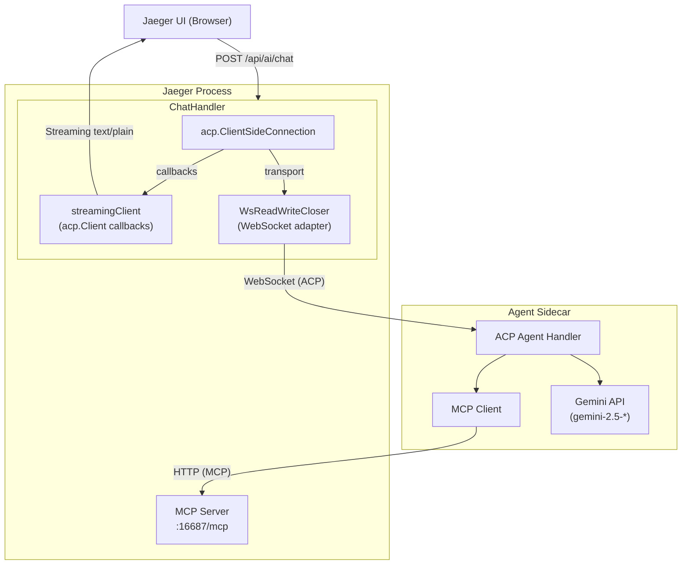
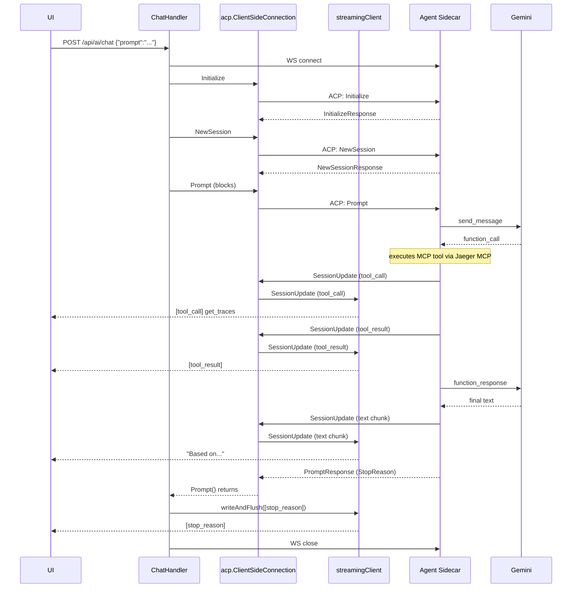

# Jaeger AI Gateway

This package implements the AI gateway component within Jaeger Query that bridges
the Jaeger UI with an external AI Agent Sidecar using the
[Agent Client Protocol (ACP)](https://agentclientprotocol.com/).

## Architecture



## Components

### ChatHandler (`handler.go`)

HTTP handler registered at `POST /api/ai/chat`. When a request arrives:

1. Parses the JSON request body containing the user's prompt
2. Establishes a WebSocket connection to the Agent Sidecar
3. Creates a `WsReadWriteCloser` to adapt WebSocket to `io.ReadWriteCloser`
4. Creates a `streamingClient` that implements `acp.Client` interface
5. Uses `acp.ClientSideConnection` to speak ACP protocol with the sidecar
6. Executes ACP handshake: `Initialize` → `NewSession` → `Prompt`
7. Streams responses back to the HTTP client as `text/plain`

### streamingClient (`streaming_client.go`)

Implements the `acp.Client` interface from `acp-go-sdk`. Key responsibilities:

- **SessionUpdate**: Receives streamed content from the agent (text chunks, tool
  call notifications) and writes them to the HTTP response
- **RequestPermission**: Always cancels/denies permission requests (gateway
  advertises no filesystem or terminal capabilities)

### WsReadWriteCloser (`ws_adapter.go`)

Adapts a gorilla WebSocket connection to the `io.ReadWriteCloser` interface
required by `acp.ClientSideConnection`. Handles:

- Reading WebSocket text/binary messages as a continuous byte stream
- Writing bytes as WebSocket text messages
- Proper connection lifecycle management

## Request Flow



## Configuration

The AI gateway is configured via the `extensions.jaeger_query.ai` section:

```yaml
extensions:
  jaeger_query:
    ai:
      agent_url: "ws://localhost:16688"     # WebSocket URL of Agent Sidecar
```

The endpoint is only registered when `ai.agent_url` is configured and non-empty.

## ACP Client Interface

The `acp.Client` interface has two types of methods:

**Request/Response methods** (agent calls client, blocks waiting for response):
- `ReadTextFile`, `WriteTextFile` - file operations (unsupported, returns error)
- `RequestPermission` - permission dialogs (always cancelled; gateway advertises no fs/terminal capabilities)
- `CreateTerminal`, `TerminalOutput`, etc. - terminal operations (unsupported, returns error)

**Notification method** (one-way, fire-and-forget):
- `SessionUpdate` - streams real-time progress and results during prompt processing

`SessionUpdate` carries only **informational** content for UI streaming:
- `AgentMessageChunk` - streamed text from the agent
- `AgentThoughtChunk` - agent's internal reasoning
- `ToolCall` / `ToolCallUpdate` - notifications that the agent has initiated/completed
  a tool call (for UI progress display, not execution requests)
- `Plan` - execution plan for complex tasks

In Jaeger's architecture, the sidecar executes MCP tools by calling Jaeger's MCP
server directly over HTTP. The `SessionUpdate(ToolCall)` notifications merely
inform the UI that a tool is running - they do not ask the client to execute
anything.

### End-of-Turn Handling

`Prompt()` blocks until the sidecar completes the ACP turn, including all tool
executions. When it returns, the handler writes a `[stop_reason]` line to the
HTTP response with the value from `PromptResponse.StopReason`, then the HTTP
response is closed.

## Related Components

- **Agent Sidecar**: See `scripts/ai-sidecar/` for reference implementations
  (e.g., Gemini-based Python sidecar)
- **MCP Server**: Jaeger's MCP server exposes trace query tools at `/mcp`
- **ACP Protocol**: See https://agentclientprotocol.com/
