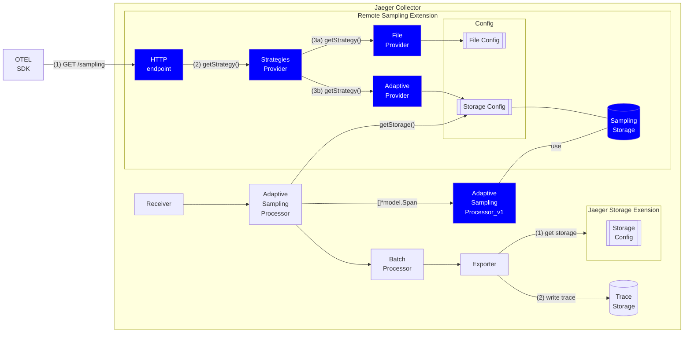

# Remote Sampling

Placeholder

```mermaid
flowchart LR
    Receiver --> AdaptiveSamplingProcessor --> BatchProcessor --> Exporter
    Exporter -->|"(1) get storage"| JaegerStorageExension
    Exporter -->|"(2) write trace"| TraceStorage
    AdaptiveSamplingProcessor -->|"getStorage()"| StorageConfig

    OTEL_SDK[OTEL
             SDK]
    OTEL_SDK -->|"(1) GET /sampling"| HTTP_endpoint
    HTTP_endpoint -->|"(2) getStrategy()"| StrategiesProvider
    style HTTP_endpoint fill:blue,color:white

    subgraph Jaeger Collector
        Receiver
        BatchProcessor[Batch
                       Processor]
        Exporter
        TraceStorage[(Trace
                      Storage)]
        AdaptiveSamplingProcessor[Adaptive
                                  Sampling
                                  Processor]
        AdaptiveSamplingProcessorV1[Adaptive
                                    Sampling
                                    Processor_v1]
        style AdaptiveSamplingProcessorV1 fill:blue,color:white
        AdaptiveSamplingProcessor -->|"[]*model.Span"| AdaptiveSamplingProcessorV1
        AdaptiveSamplingProcessorV1 ---|use| SamplingStorage

        subgraph JaegerStorageExension[Jaeger Storage Exension]
            Storage[[Storage
                     Config]]
        end
        subgraph RemoteSamplingExtension[Remote Sampling Extension]
            StrategiesProvider -->|"(3b) getStrategy()"| AdaptiveProvider
            StrategiesProvider -->|"(3a) getStrategy()"| FileProvider
            FileProvider --> FileConfig
            AdaptiveProvider --> StorageConfig

            HTTP_endpoint[HTTP
                          endpoint]
            StrategiesProvider[Strategies
                               Provider]
            FileProvider[File
                         Provider]
            AdaptiveProvider[Adaptive
                             Provider]
            style StrategiesProvider fill:blue,color:white
            style FileProvider fill:blue,color:white
            style AdaptiveProvider fill:blue,color:white
            subgraph Config
                FileConfig[[File Config]]
                StorageConfig[[Storage Config]]
            end
            StorageConfig --- SamplingStorage
            SamplingStorage[(Sampling
                             Storage)]
            style SamplingStorage fill:blue,color:white
        end
    end
```
