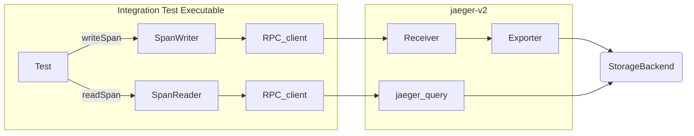
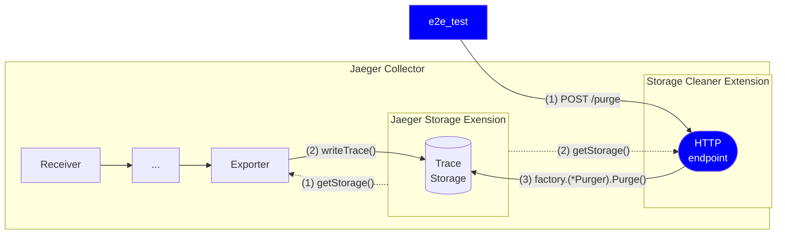
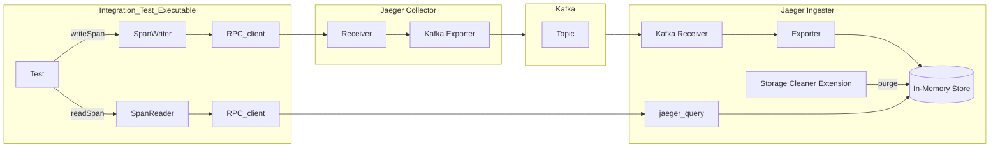
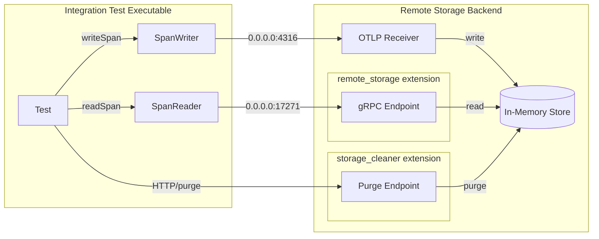

# Integration

The Jaeger v2 integration test is an extension of the existing `integration.StorageIntegration` designed to test the Jaeger-v2 OtelCol binary; currently, it only tests the span store. The existing tests at `internal/storage/integration` (also called "unit mode") test by writing and reading span data directly to the storage API. In contrast, these tests (or "e2e mode") read and write span data through the RPC client to the Jaeger-v2 OtelCol binary. E2E mode tests read from the jaeger_query extension and write to the receiver in OTLP formats. For details, see the [Architecture](#architecture) section below.

## Architecture



Integration tests require cleaning up the data in the storage between tests to produce independent results. This is achieved with a `storagecleaner` extension. The configuration for this extension is auto-injected into standard collector configs located in `/cmd/jaeger/`. The extension opens an HTTP endpoint (`POST /purge`) in the collector which retrieves the storage factory from the `jaegerstorage` extension and if the factory implements the `Purger` interface it calls the `purge()` function.



## Kafka Integration

The primary difference between the Kafka integration tests and other integration tests lies in the flow of data. In the standard tests, spans are written by the SpanWriter, sent through an RPC_client directly to a receiver, then to an exporter, and written to a storage backend. Spans are read by the SpanReader, which queries the jaeger_query process accessing the storage backend. In contrast, the Kafka tests introduce Kafka as an intermediary. Spans go from the SpanWriter through an RPC_client to an OTLP receiver in the Jaeger Collector, exported to Kafka, received by the Jaeger Ingester, and then stored. For details, see the [Architecture](#KafkaArchitecture) section below.



## gRPC Integration Test


## Running tests locally

You can run integration tests locally with the following command:

```sh
STORAGE={STORAGE_NAME} make jaeger-v2-storage-integration-test
```

where the storage name can be one of the following:

* badger
* cassandra
* grpc
* kafka
* memory_v2
* query
