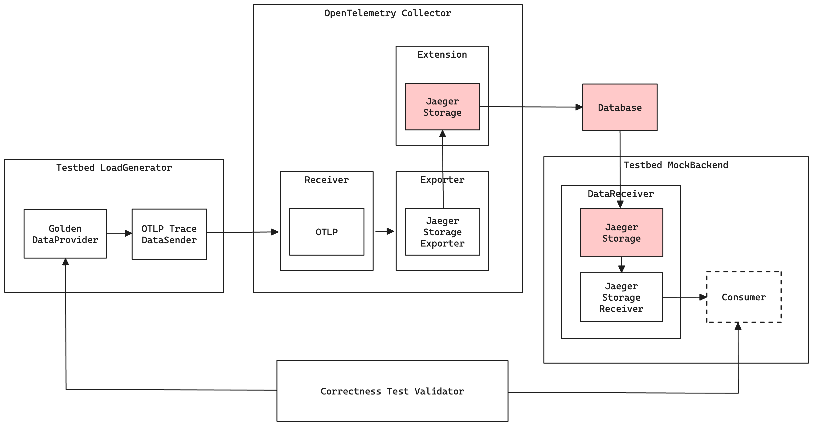

# Integration

Jaeger v2 integration tests are built on top of [OTEL Testbed module](https://github.com/open-telemetry/opentelemetry-collector-contrib/tree/main/testbed). OTEL Testbed provide comprehensive tools for conducting end-to-end tests for the OTEL Collector, such as reproducible short-term benchmarks, correctness tests, long-running stability tests and maximum load stress tests. However, we only utilize the correctness tests from testbed, it generates and sends every combinatorial trace attributes and matches every single of them with the received traces from another end. To learn more about OTEL Testbed, please refer to the their [README](https://github.com/open-telemetry/opentelemetry-collector-contrib/blob/main/testbed/README.md).

## Architecture

Here's the architecture to test the OpenTelemetry Collector pipeline from end-to-end with the designated storage backends.


Testbed components:
| Component | Description |
|-----------|-------------|
| **LoadGenerator** | Encapsulates DataProvider and DataSender in order to generate and send data. |
| Golden DataProvider | Generates traces from the "Golden" dataset generated using pairwise combinatorial testing techniques. Testbed example uses [PICT](https://github.com/microsoft/pict/) to generate the test data, e.g. [testdata](https://github.com/open-telemetry/opentelemetry-collector-contrib/tree/main/internal/coreinternal/goldendataset/testdata). |
| OTLP Trace DataSender | With the generated traces from DataProvider, the DataSender sends traces to OTLP receiver in the collector instance. |
| **Mockbackend** | Encapsulates DataReceiver and provides consume functionality. |
| DataReceiver | A custom DataReceiver that will host a Jaeger storage extension to retrieve traces from the database by pulling them using our artificial Jaeger storage receiver. |
| Consumer | Consumer does not actually a thing in MockBackend but only to make the diagram intuitive, the traces received from our artificial receiver will be stored inside MockBackend. |
| **Correctness Test Validator** | Checks if the traces received from MockBackend are all matches with the generated traces from DataProvider. |

## gRPC Integration Test

To conduct the tests, run the following command:

```
scripts/grpc-integration-test.sh <remote_storage_image_version>
```
