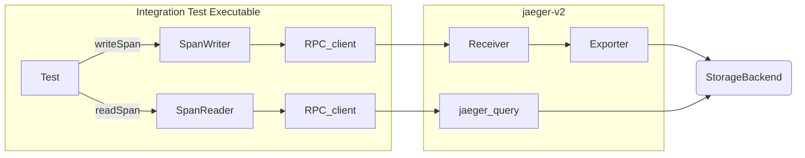

# Integration

The Jaeger v2 integration test is an extension of the existing `integration.StorageIntegration` designed to test the Jaeger-v2 OtelCol binary; currently, it only tests the span store. The existing tests at `plugin/storage/integration` (also called "unit mode") test by writing and reading span data directly to the storage API. In contrast, these tests (or "e2e mode") read and write span data through the RPC client to the Jaeger-v2 OtelCol binary. E2E mode tests read from the jaeger_query extension and write to the receiver in OTLP formats. For details, see the [Architecture](#architecture) section below.

## Architecture



## gRPC Integration Test

To conduct the tests, run the following command:

```
STORAGE=grpc \
  SPAN_STORAGE_TYPE=memory \
  make jaeger-v2-storage-integration-test
```
