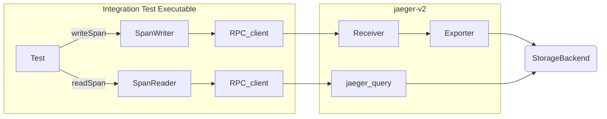

# Integration

The Jaeger v2 integration test is an extension of the existing `integration.StorageIntegration` designed to test the Jaeger-v2 OtelCol binary; currently, it only tests the span store. The existing tests at `plugin/storage/integration` (also called "unit mode") test by writing and reading span data directly to the storage API. In contrast, these tests (or "e2e mode") read and write span data through the RPC client to the Jaeger-v2 OtelCol binary. E2E mode tests read from the jaeger_query extension and write to the receiver in OTLP formats. For details, see the [Architecture](#architecture) section below.

## Architecture



Integration tests require cleaning up the data in the storage between tests to produce independent results. This is achieved with a `storagecleaner` extension. The configuration for this extension is auto-injected into standard collector configs located in `/cmd/jaeger/`. The extension opens an HTTP endpoint (`POST /purge`) in the collector which retrieves the storage factory from the `jaegerstorage` extension and if the factory implements the `Purger` interface it calls the `purge()` function.


## Running tests locally

All integration tests can be run locally.

### gRPC Integration Test

```shell
STORAGE=grpc SPAN_STORAGE_TYPE=memory make jaeger-v2-storage-integration-test
```
