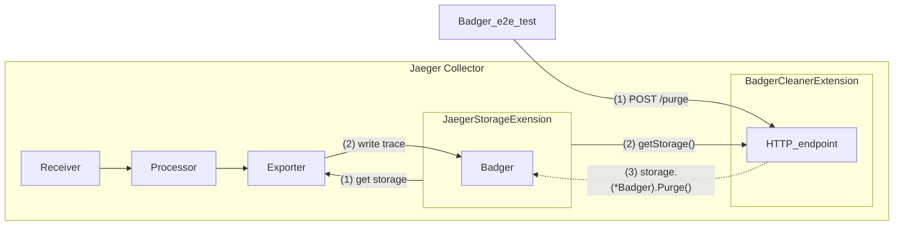

# storage_cleaner

This module implements an extension that allows purging the backend storage by making an HTTP POST request to it. 

The storage_cleaner extension is intended to be used only in tests, providing a way to clear the storage between test runs. Making a POST request to the exposed endpoint will delete all data in storage.




# Getting Started

The following settings are required:

- `trace_storage` : name of a storage backend defined in `jaegerstorage` extension

```yaml
extensions:
  storage_cleaner:
    trace_storage: storage_name
```

