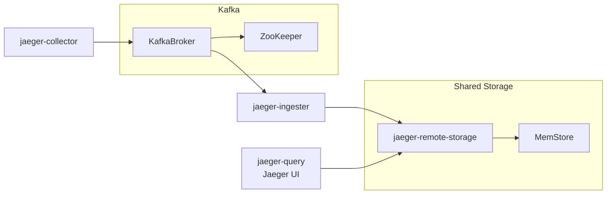

# Sample configuration with Kafka

This `docker-compose` environment provides a sample configuration of Jaeger depoyment utilizing collector-Kafka-injester pipeline. Storage is provided by the `jageer-remote-storage` service running memstore.

Jaeger UI can be accessed at http://localhost:16686/, as usual, and refreshing the screen should produce internal traces.

