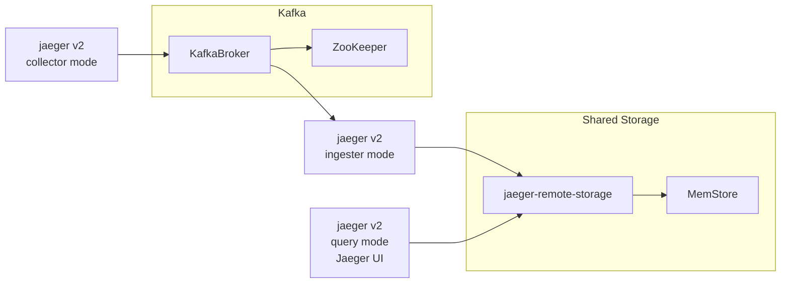

# Sample configuration with Kafka

This `docker compose` environment provides a sample configuration of Jaeger deployment utilizing collector-Kafka-ingester pipeline with jaeger-v2 unified binary. Storage is provided by the `jaeger-remote-storage` service running memstore.

Jaeger UI can be accessed at http://localhost:16686/, as usual, and refreshing the screen should produce internal traces.

