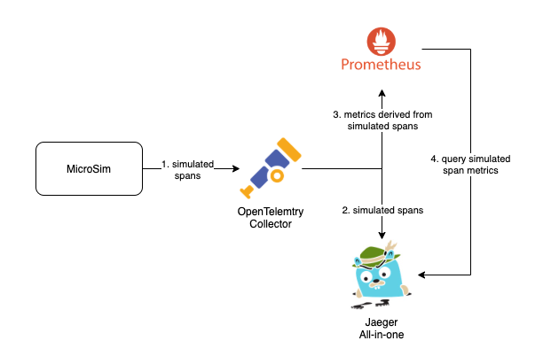

# Service Performance Monitoring (SPM) Development/Demo Environment

Service Performance Monitoring (SPM) is an opt-in feature introduced to Jaeger that provides Request, Error and Duration (RED) metrics grouped by service name and operation that are derived from span data. These metrics are programmatically available through an API exposed by jaeger-query along with a "Monitor" UI tab that visualizes these metrics as graphs. For more details on this feature, please refer to the [tracking Issue](https://github.com/jaegertracing/jaeger/issues/2954) documenting the proposal and status.

The motivation for providing this environment is to allow developers to either test Jaeger UI or their own applications against jaeger-query's metrics query API, as well as a quick and simple way for users to bring up the entire stack required to visualize RED metrics from simulated traces (or their own).

This environment consists the following backend components:

- [MicroSim](https://github.com/yurishkuro/microsim): a program to simulate traces.
- [Jaeger All-in-one](https://www.jaegertracing.io/docs/1.24/getting-started/#all-in-one): the full Jaeger stack in a single container image.
- [OpenTelemetry Collector](https://opentelemetry.io/docs/collector/): vendor agnostic integration layer for traces and metrics. Its main role in this particular development environment is to receive Jaeger spans, forward these spans untouched to Jaeger All-in-one while simultaneously aggregating metrics out of this span data. To learn more about span metrics aggregation, please refer to the [spanmetrics processor documentation](https://github.com/open-telemetry/opentelemetry-collector-contrib/tree/main/processor/spanmetricsprocessor).
- [Prometheus](https://prometheus.io/): a metrics collection and query engine, used to scrape metrics computed by OpenTelemetry Collector, and presents an API for Jaeger All-in-one to query these metrics.
- [Grafana](https://grafana.com/): a metrics visualization, analytics & monitoring solution supporting multiple metrics databases.


The following diagram illustrates the relationship between these components:



# Getting Started

## Bring up/down the dev environment

```bash
docker-compose up
docker-compose down
```

**Tips:**
- Let the application run for a couple of minutes to ensure there is enough time series data to plot in the dashboard.
- Navigate to Jaeger UI at http://localhost:16686/ and inspect the Monitor tab. Select `redis` service from the dropdown to see more than one endpoint.
- To visualize the raw metrics stored on the Prometheus server (for debugging and local development use cases), a Grafana server is included in the docker-compose config, which is preconfigured to read metrics from the Prometheus server.
  To access Grafana, navigate to http://localhost:3000/, click on the "Explore" and click the "Select metric" dropdown then select `calls_total`, for example.

**Warning:** The included [docker-compose.yml](./docker-compose.yml) file uses the `latest` version of Jaeger and other components. If your local Docker registry already contains older versions, which may still be tagged as `latest`, you may want to delete those images before running the full set, to ensure consistent behavior:

```bash
docker rmi -f jaegertracing/all-in-one:latest
docker rmi -f otel/opentelemetry-collector-contrib:latest
docker rmi -f prom/prometheus:latest
docker rmi -f grafana/grafana:latest
```

## Example 1
Fetch call rates for both the driver and frontend services, grouped by operation, from now,
looking back 1 second with a sliding rate-calculation window of 1m and step size of 1 millisecond

```bash
curl "http://localhost:16686/api/metrics/calls?service=driver&service=frontend&groupByOperation=true&endTs=$(date +%s)000&lookback=1000&step=100&ratePer=60000" | jq .
```


## Example 2
Fetch P95 latencies for both the driver and frontend services from now,
looking back 1 second with a sliding rate-calculation window of 1m and step size of 1 millisecond, where the span kind is either "server" or "client".

```bash
curl "http://localhost:16686/api/metrics/latencies?service=driver&service=frontend&quantile=0.95&endTs=$(date +%s)000&lookback=1000&step=100&ratePer=60000&spanKind=server&spanKind=client" | jq .
```

## Example 3
Fetch error rates for both driver and frontend services using default parameters.
```bash
curl "http://localhost:16686/api/metrics/errors?service=driver&service=frontend" | jq .
```

## Example 4
Fetch the minimum step size supported by the underlying metrics store.
```bash
curl "http://localhost:16686/api/metrics/minstep" | jq .
```

# HTTP API

## Query Metrics

`/api/metrics/{metric_type}?{query}`

Where (Backus-Naur form):
```
metric_type = 'latencies' | 'calls' | 'errors'

query = services , [ '&' optionalParams ]

optionalParams = param | param '&' optionalParams

param =  groupByOperation | quantile | endTs | lookback | step | ratePer | spanKinds

services = service | service '&' services
service = 'service=' strValue
  - The list of services to include in the metrics selection filter, which are logically 'OR'ed.
  - Mandatory.

quantile = 'quantile=' floatValue
  - The quantile to compute the latency 'P' value. Valid range (0,1].
  - Mandatory for 'latencies' type.

groupByOperation = 'groupByOperation=' boolValue 
boolValue = '1' | 't' | 'T' | 'true' | 'TRUE' | 'True' | 0 | 'f' | 'F' | 'false' | 'FALSE' | 'False'
  - A boolean value which will determine if the metrics query will also group by operation.
  - Optional with default: false

endTs = 'endTs=' intValue
  - The posix milliseconds timestamp of the end time range of the metrics query.
  - Optional with default: now

lookback = 'lookback=' intValue
  - The duration, in milliseconds, from endTs to look back on for metrics data points.
  - For example, if set to `3600000` (1 hour), the query would span from `endTs - 1 hour` to `endTs`.
  - Optional with default: 3600000 (1 hour).

step = 'step=' intValue
  - The duration, in milliseconds, between data points of the query results.
  - For example, if set to 5s, the results would produce a data point every 5 seconds from the `endTs - lookback` to `endTs`.
  - Optional with default: 5000 (5 seconds).

ratePer = 'ratePer=' intValue
  - The duration, in milliseconds, in which the per-second rate of change is calculated for a cumulative counter metric.
  - Optional with default: 600000 (10 minutes).

spanKinds = spanKind | spanKind '&' spanKinds
spanKind = 'spanKind=' spanKindType
spanKindType = 'unspecified' | 'internal' | 'server' | 'client' | 'producer' | 'consumer'
  - The list of spanKinds to include in the metrics selection filter, which are logically 'OR'ed.
  - Optional with default: 'server'
```


## Min Step

`/api/metrics/minstep`

Gets the min time resolution supported by the backing metrics store, in milliseconds, that can be used in the `step` parameter.
e.g. a min step of 1 means the backend can only return data points that are at least 1ms apart, not closer.

## Responses

The response data model is based on [`MetricsFamily`](https://github.com/jaegertracing/jaeger/blob/main/model/proto/metrics/openmetrics.proto#L53).

For example:
```
{
  "name": "service_call_rate",
  "type": "GAUGE",
  "help": "calls/sec, grouped by service",
  "metrics": [
    {
      "labels": [
        {
          "name": "service_name",
          "value": "driver"
        }
      ],
      "metricPoints": [
        {
          "gaugeValue": {
            "doubleValue": 0.005846808321083344
          },
          "timestamp": "2021-06-03T09:12:06Z"
        },
        {
          "gaugeValue": {
            "doubleValue": 0.006960443672323934
          },
          "timestamp": "2021-06-03T09:12:11Z"
        },
...
  ```

If the `groupByOperation=true` parameter is set, the response will include the operation name in the labels like so:
```
      "labels": [
        {
          "name": "operation",
          "value": "/FindNearest"
        },
        {
          "name": "service_name",
          "value": "driver"
        }
      ],
```

# Disabling Metrics Querying

As this is feature is opt-in only, disabling metrics querying simply involves omitting the `METRICS_STORAGE_TYPE` environment variable when starting-up jaeger-query or jaeger all-in-one.

For example, try removing the `METRICS_STORAGE_TYPE=prometheus` environment variable from the [docker-compose.yml](./docker-compose.yml) file.

Then querying any metrics endpoints results in an error message:
```
$ curl http://localhost:16686/api/metrics/minstep | jq .
{
  "data": null,
  "total": 0,
  "limit": 0,
  "offset": 0,
  "errors": [
    {
      "code": 405,
      "msg": "metrics querying is currently disabled"
    }
  ]
}
```
