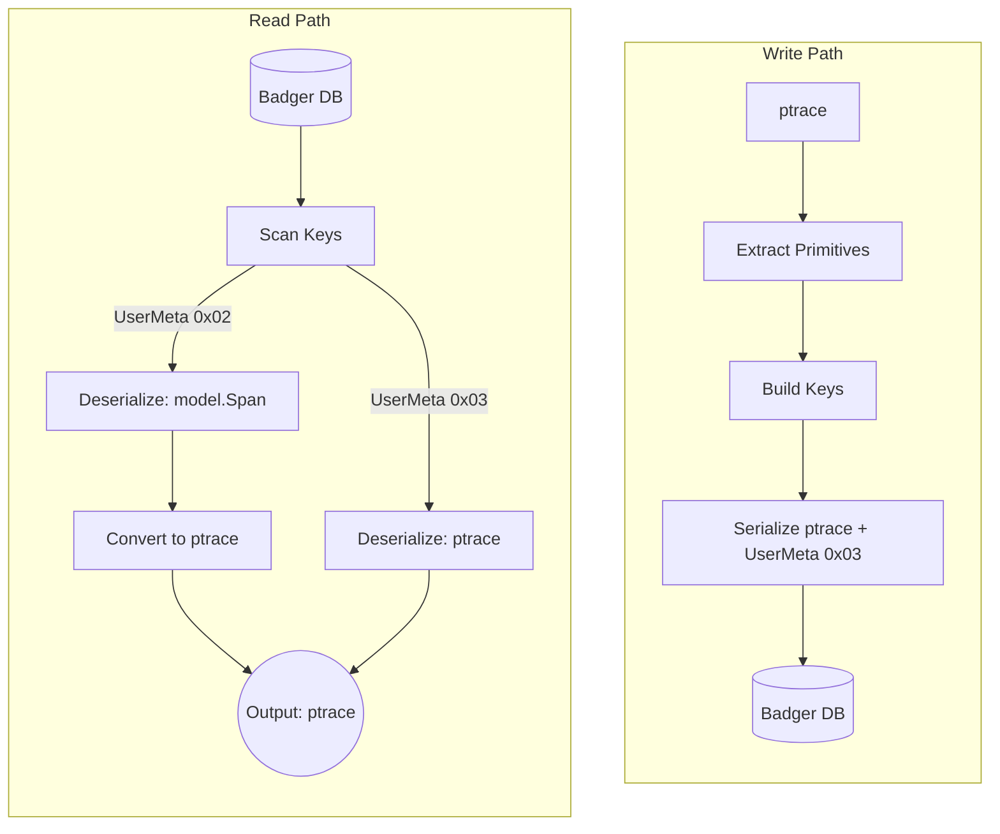

# Badger Storage: OTLP Native On-Disk Format

* **Date**: 2026-04-10

## Context

Badger has no intermediate type like ES's `dbmodel`. The v1adapter provides a v2 factory interface but `model.Span` remains on disk with the same read/write paths ([ADR-005](005-badger-storage-record-layouts.md)).

Any interface-level migration is functionally equivalent to v1adapter.

Badger's v2 factory uses v1adapter to bridge the v2 storage API. v1adapter converts `ptrace.Traces` to `model.Span` before writing. This conversion is lossy:

| ptrace source                 | v1 representation                      | Notes                                          |
| ----------------------------- | -------------------------------------- | ---------------------------------------------- |
| `span.Attributes()`           | `span.Tags`                            | Direct mapping                                 |
| `resource.Attributes()`       | `span.Process.Tags`                    | Grouping lost in v1 (flattened into Process)   |
| `span.Events[].Attributes()`  | `span.Logs[].Fields`                   | Direct mapping                                 |
| `ResourceSpans.Resource`      | `span.Process`                         | Duplicated per span in both models             |
| `span.Status().Code()`        | `span.Tags["otel.status_code"]`        | Lossy: typed enum becomes string tag           |
| `span.Status().Message()`     | `span.Tags["otel.status_description"]` | Lossy: first-class field becomes string tag    |
| `scope.Name()`                | `span.Tags["otel.scope.name"]`         | Degraded: stored as tag, reconstructed on read |
| `scope.Version()`             | `span.Tags["otel.scope.version"]`      | Degraded: stored as tag, reconstructed on read |
| `span.Links[].Attributes()`   | `span.References` (ref_type only)      | Lossy: link attributes beyond ref_type dropped |
| `span.Kind()`                 | not indexed                            | Blocks #1922                                   |

> Scope name and version survive the round-trip but are reconstructed on every read by scanning and deleting tags from `model.Span`. Native OTLP storage eliminates this per-read cost.

For Badger, native OTLP support without the `model.Span` dependency involves changing what is stored on disk. `model.Span` and `ptrace.Traces` are different proto schemas, not incremental evolutions of the same one, so protobuf forward compatibility does not apply. The key schema is built from primitives common to both (traceID, spanID, startTime, serviceName, operationName, duration), so keys are unaffected. The values and indexes are where the models diverge.

A Badger entry is a four-field struct (`Key`, `Value`, `UserMeta`, `ExpiresAt`), not just a key-value pair. `UserMeta` is a single byte stored alongside the key and value in each entry. Writers set it via the entry struct before committing to a transaction. During iteration, the byte is readable from the item metadata without loading the value bytes, allowing the reader to determine the encoding type before deserializing. Jaeger uses the lower 4 bits of this byte to indicate encoding type (`0x01`=JSON, `0x02`=protobuf). All span-related entries expire via TTL (default 72h).

When other Jaeger storage backends require schema changes, the established approach is to maintain a dual read path where old data remains readable until it naturally expires, then drop the legacy read path, as done in other v2 storage migrations.

## Proposed Change

Change the on-disk format to store OTLP natively with a dual read path for backward compatibility.

### What stays the same

Key construction, prefix scans, range scans, cache, and TTL management remain unchanged. The cache already operates on primitives (service name and operation name strings with expiry timestamps).

### What changes

New writes store OTLP protobuf as the value. Index coverage can be extended with OTLP first-class fields: for example, spanKind is a typed enum on `ptrace.Span` (`span.Kind()`), directly available at write time for index key construction, unlike `model.Span` where it is buried in tags. This unblocks [#1922](https://github.com/jaegertracing/jaeger/issues/1922). The v2 Storage API supports batched writes; `ptrace.Traces` is naturally batched, so the writer handles multiple spans per call.

### Versioning mechanism

This ADR extends UserMeta with `0x03` for ptrace proto. The existing dispatch on `UserMeta & 0x0F` handles it without a new mechanism.

An alternative is prepending a version byte to the value. This is portable across KV stores and extensible to a multi-byte envelope for future schema evolution (layout flags, compression, etc.). The cost is 1 byte overhead per entry and requiring value loading before format detection. Since Badger is Jaeger's only embedded store and no immediate need for an extensible header exists, UserMeta is sufficient. If schema evolution demands a richer header, it can be introduced under a new UserMeta value without redesigning the detection mechanism.

The key schema is unchanged. Versioning is value-side only, no effect on sorting or scans.

### Pipeline

> The write path stores only the new OTLP format (`0x03`). The read path handles both `0x02` and `0x03` entries for backward compatibility until old data expires via TTL.

### Value layout for ptrace entries

`ptrace.Traces` is a nested structure: `ResourceSpans` → `ScopeSpans` → `Spans`. Badger stores one span per key. Flattening is required.

This ADR stores each entry as a `ResourceSpans` with one `ScopeSpans` and one `Span`, following existing OTLP proto. This keeps the current pattern where one key gives you everything you need for a full span, including its resource and scope, in a single read. Resource and scope are duplicated per entry, same as how `model.Span` already duplicates `Process` today.

### Migration

No data conversion is needed. Trace data in Badger is short-lived by design: all span entries expire via TTL (default 72h).

After upgrade, only one writer exists and it writes 0x03. Existing 0x02 entries are not touched. They remain readable through the dual read path and expire on their own. Once the oldest 0x02 entry has expired, the legacy read path can be removed through the feature gate deprecation lifecycle.

For deployments with longer TTLs, an optional read-triggered rewrite can convert 0x02 entries to 0x03 on access, shortening the transition window at the cost of additional disk I/O.

### Backward Compatibility

In the dual read path, `0x02` and `0x03` entries use the same key schema, so both show up in the same scan. No separate query is needed for each format.

The reader dispatches on `UserMeta & 0x0F` to select the deserializer:

* `0x02`: deserialize as `model.Span`, convert to ptrace via existing translator
* `0x03`: deserialize as ptrace directly

No feature gate is needed because format detection is per-entry, not per-database. Old and new entries coexist in the same scan, same transaction, same trace.

## Success Criteria

1. New writes store OTLP protobuf directly, not `model.Span`.
2. Existing `0x02` data remains readable during the transition period.
3. Old and new data coexist in the same keyspace.
4. Existing integration tests should continue to pass. Tests that assert `model.Span` output may require updates.

## Testing

Existing v1 tests already cover encoding dispatch, round-trip, index queries, cache prefill, and persistence. The on-disk change extends these rather than replacing them:

* `TestEncodingTypes`: add `0x03` write/read case alongside existing `0x01`, `0x02`, and unknown `0x04` cases.
* `TestWriteReadBack`: extend with `0x03` data and verify OTLP fields (span status, scope attributes, links) survive round-trip.
* `TestWriteReadBack` or `TestIndexSeeks`: extend with mixed `0x02` and `0x03` entries in the same DB, verify one scan returns both.
* `TestOldReads`: extend with mixed encoding entries, verify cache prefill handles both.
* Persistence test: extend to write both `0x02` and `0x03`, close, reopen, verify both readable.
* Key consistency: within an existing test, write the same span via `model.Span` and `ptrace` paths, verify byte-identical keys.

## Consequences

### Positive

* Removes `model.Span` conversion layer. Simpler read/write paths.
* Lossless OTLP round-trip.
* OTLP first-class fields available for indexing (spanKind, span status, scope attributes).
* Aligns with v2 OTLP-native storage goal.
* TTL-based migration. No migration script.

### Negative / Limitations

* Not forward compatible. Older binaries cannot read `0x03` values. Default 72h TTL limits exposure.
* Dual read path maintained until old data expires.
* Single-span `ResourceSpans` duplicates resource/scope per entry, comparable to existing `Process` duplication.

## Subsequent Work

1. **Index extensions.** Add spanKind to operation index (`0x82`), resolving [#1922](https://github.com/jaegertracing/jaeger/issues/1922).
2. **Dependency store.** The v2 depstore depends on the v2 tracestore reader (`CreateDependencyReader` chains through `CreateSpanReader`).
3. **Sampling store.** Independent of tracestore, can be migrated separately.
4. **Legacy read path removal.** Once old data has expired, remove `0x02` deserialisation and `model.Span` conversion code.
5. **Value envelope.** If future schema evolution requires richer per-entry metadata (layout flags, compression), a structured value header can be introduced under a new UserMeta value.

## References

* [ADR-005: Badger Storage Record Layouts](005-badger-storage-record-layouts.md) — on-disk key schema
* [#6458: Upgrade Storage Backends to V2 Storage API](https://github.com/jaegertracing/jaeger/issues/6458) — parent issue
* [#7937: Upgrade Badger Storage to v2 API](https://github.com/jaegertracing/jaeger/issues/7937) — this issue
* [#5079: v2 Storage API](https://github.com/jaegertracing/jaeger/issues/5079) — v2 API introduction
* [#1922: spanKind in GetOperations](https://github.com/jaegertracing/jaeger/issues/1922) — missing feature
* [dgraph-io/badger#142](https://github.com/dgraph-io/badger/issues/142) — UserMeta usage by Dgraph
* [`internal/storage/v1/badger/spanstore/`](../../internal/storage/v1/badger/spanstore/) — current v1 implementation
