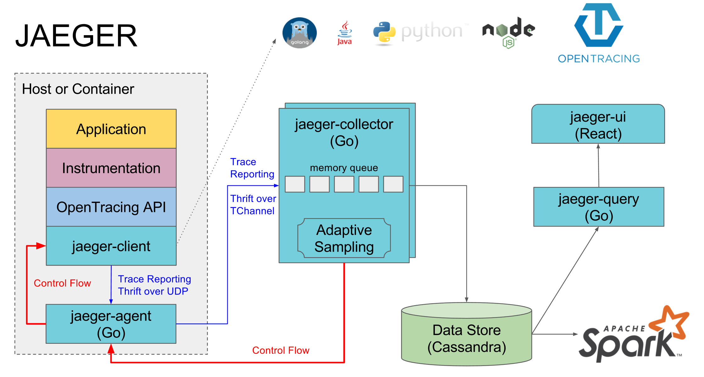
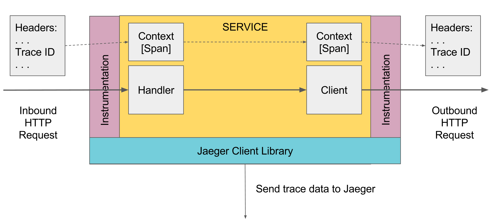

# Architecture
## Overview
Jaeger's clients adhere to the data model described in the OpenTracing standard. Reading the [specification](https://github.com/opentracing/specification/blob/master/specification.md) will help you understand this section better.

## Terminology
### Span
A **Span** represents a logical unit of work in the system that has an operation name, the start time of the operation, and the duration. Spans may be nested and ordered to model causal relationships. An RPC call is an example of a span.

### Trace
A **Trace** is a data/execution path through the system, and can be thought of as a directed acyclic graph of spans

## Components

This section details the constituents of Jaeger and how they relate to each other. It is arranged by the order in which spans from your application interact with them.

### Jaeger client libraries
Jaeger clients are language specific implementations of the [OpenTracing API](http://opentracing.io). They can be used to instrument applications for distributed tracing either manually or with a variety of existing open source frameworks, such as Flask, Dropwizard, gRPC, and many more, that are already integrated with OpenTracing.

An instrumented service creates spans when receiving new requests and attaches context information (trace id, span id, and baggage) to outgoing requests. Only ids and baggage are propagated with requests; all other information that compose a span like operation name, logs, etc. is not propagated. Instead sampled spans are transmitted out of process asynchronously, in the background, to Jaeger Agents.

The instrumentation has very little overhead, and is designed to be always enabled in production.

Note that while all traces are generated, only few are sampled. Sampling a trace marks the trace for further processing and storage.
By default, Jaeger client samples 0.1% of traces (1 in 1000), and has the ability to retrieve sampling strategies from the agent.

*Illustration of context propagation*

### Agent
A network daemon that listens for spans sent over UDP, which it batches and sends to the collector. It is designed to be deployed to all hosts as an infrastructure component.  The agent abstracts the routing and discovery of the collectors away from the client.

### Collector
The collector receives traces from Jaeger agents and runs them through a processing pipeline. Currently our pipeline validates traces, indexes them, performs any transformations, and finally stores them.
Our storage is a pluggable component which currently supports Cassandra and ElasticSearch.

### Query
Query is a service that retrieves traces from storage and hosts a UI to display them.
