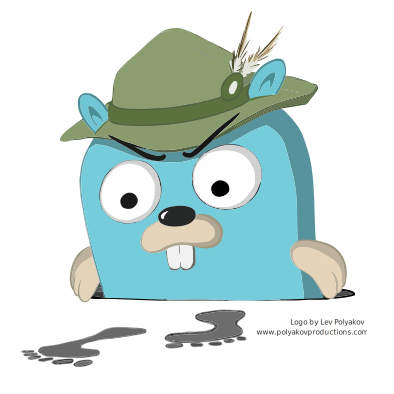
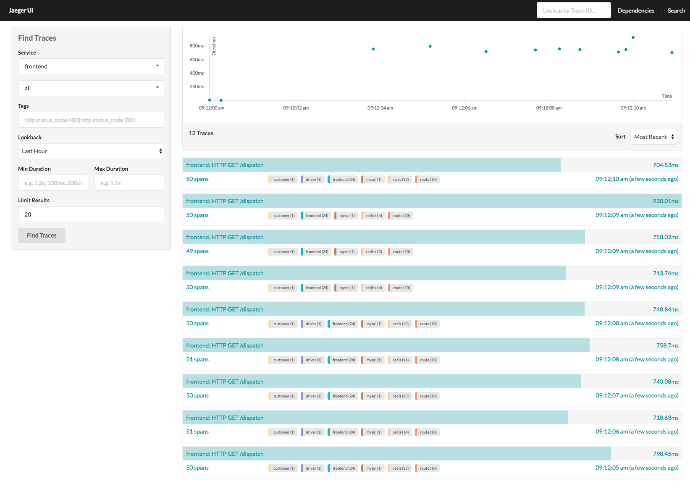
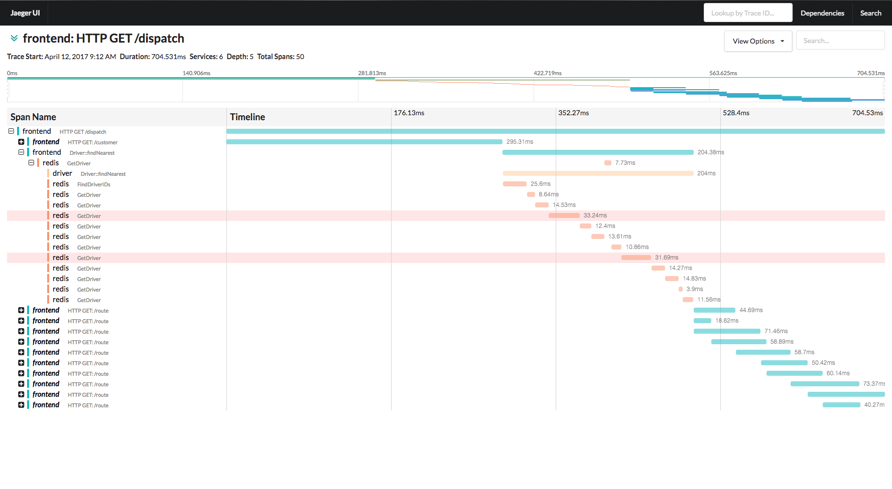

# Jaeger, a distributed tracing system

Welcome to Jaeger's documentation portal! Below, you'll find information for beginners and experienced Jaeger users.

If you can't find what you are looking for, or have an issue not covered here, we'd love to hear from you either on [Github](https://github.com/jaegertracing/jaeger/issues), [Gitter chat](https://gitter.im/jaegertracing/Lobby), or on our [mailing list](https://groups.google.com/forum/#!forum/jaeger-tracing).

## About
Jaeger, inspired by [Dapper][dapper] and [OpenZipkin](http://zipkin.io),
is a distributed tracing system released as open source by [Uber Technologies][ubeross].
It can be used for monitoring microservice-based architectures:

* Distributed context propagation
* Distributed transaction monitoring
* Root cause analysis
* Service dependency analysis
* Performance / latency optimization

We published a blog post, [Evolving Distributed Tracing at Uber](https://eng.uber.com/distributed-tracing/), where we explain the history and reasons
for the architectural choices made in Jaeger.

## Features

  * [OpenTracing](http://opentracing.io/) compatible data model and instrumentation libraries
    * in [Go](https://github.com/jaegertracing/jaeger-client-go), [Java](https://github.com/jaegertracing/jaeger-client-java), [Node](https://github.com/jaegertracing/jaeger-client-node), [Python](https://github.com/jaegertracing/jaeger-client-python)
    and [C++](https://github.com/jaegertracing/cpp-client)
  * Uses consistent upfront sampling with individual per service/endpoint probabilities
  * Multiple storage backends: Cassandra, Elasticsearch, memory.
  * Adaptive sampling (coming soon)
  * Post-collection data processing pipeline (coming soon)

## Technical Specs

  * Backend components implemented in Go 1.9
  * React/Javascript UI
  * Supported storage backends
    * [Cassandra 3.4+](./deployment/#cassandra)
    * [ElasticSearch 5.x, 6.x](./deployment/#elasticsearch)
    * memory storage

## Quick Start
See [running a docker all in one image](getting_started.md#all-in-one-docker-image).

## Screenshots

### Traces View

### Trace Detail View

## Related links
- [Evolving Distributed tracing At Uber Engineering](https://eng.uber.com/distributed-tracing/)
- [Tracing HTTP request latency in Go with OpenTracing](https://medium.com/opentracing/tracing-http-request-latency-in-go-with-opentracing-7cc1282a100a)
- [Distributed Tracing with Jaeger & Prometheus on Kubernetes](https://blog.openshift.com/openshift-commons-briefing-82-distributed-tracing-with-jaeger-prometheus-on-kubernetes/)
- [Using Jaeger with Istio](https://istio.io/docs/tasks/telemetry/distributed-tracing.html)
- [Using Jaeger with Envoy](https://www.envoyproxy.io/docs/envoy/latest/install/sandboxes/jaeger_tracing)

[dapper]: https://research.google.com/pubs/pub36356.html
[ubeross]: http://uber.github.io
