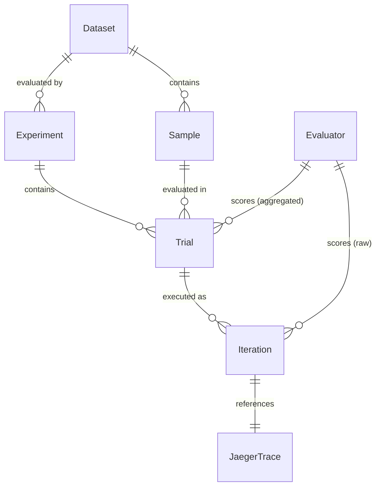

# RFC 0001: GenAI Observability Data Layer

- **Status:** Draft
- **Author:** Yuri Shkuro
- **Created:** 2026-04-21
- **Last Updated:** 2026-04-21

---

## Abstract

This RFC proposes an extensible data layer and schema within the existing Jaeger backend infrastructure to support GenAI observability. The goal is to store and query evaluation results, benchmark datasets, and their correlations with distributed traces — without introducing external SQL-based databases or breaking Jaeger's single-backend architecture.

---

## 1. Motivation

Modern GenAI applications are evaluated on dimensions that go beyond latency and error rates: faithfulness, relevance, hallucination rate, and other quality metrics. These evaluations are typically:

1. **Benchmark-driven** — run against curated input/output corpora.
2. **Trace-correlated** — each evaluation run produces one or more distributed traces.
3. **Multi-metric** — scored by multiple independent "judges" (LLM-based or heuristic).
4. **Introspective** — modern evaluators do not treat the model as a black box. Tools like Braintrust, DeepEval, Langfuse, and TruLens increasingly score not just the final output but intermediate steps visible in the trace: tool calls, retrieval results, reasoning chains. This requires evaluators to *read* traces, not just write scores into them.

Today, teams using Jaeger for distributed tracing of GenAI workloads have no first-class place to store this evaluation context alongside traces. They either maintain separate databases (adding operational burden) or embed scores as flat span attributes with no query structure. When evaluators need to introspect traces, they must export traces out of Jaeger into a separate system — an impedance mismatch that introduces latency, data duplication, and synchronization problems.

This RFC proposes extending Jaeger's storage layer with a small set of new entity types that live inside the same storage backend as traces, enabling unified querying, correlation, and — critically — positioning Jaeger as the **source of truth for trace introspection** rather than just a passive trace sink.

---

## 2. Scope and Non-Goals

**In scope:**
- Data model for Datasets, Samples, Experiments, Evaluators, and Scores.
- Schema design for ClickHouse (primary target).
- Guidance for mapping to other backends (OpenSearch).
- API surface for storing and querying these entities.
- Strategy for schema evolution without DDL migrations.
- Integration with external eval orchestrators (Langfuse, DeepEval, etc.).
- Trace Correlation ID convention: tagging traces with `jaeger.eval.trial_id` / `jaeger.eval.iteration_index` so introspective evaluators can locate them.
- API support for introspective evaluators to retrieve traces by trial/iteration context.

**Out of scope:**
- Full eval execution engine (triggering model calls, running evaluators programmatically).
- LLM prompt management or versioning beyond what is needed for experiment tracking.
- Authentication and multi-tenancy (deferred to Jaeger's existing mechanisms).

**Under consideration:**
- A lightweight UI-driven workflow (configure dataset + evaluators in the UI, run via Jaeger's built-in playground) that would allow less technical users to run evaluations without writing code. This is not part of the initial data layer design but the schema should not preclude it.

---

## 3. Data Model

### 3.1 Terminology Alignment

Eval tooling has converged on similar concepts under different names. The table below maps Jaeger's proposed terms to the dominant frameworks so that users of those tools can orient quickly, and so that integration adapters can map fields unambiguously.

Two key insights from surveying these tools:

1. **An Experiment is the run artifact** — it captures the full configuration *and* the results of one execution. It is not a reusable config template. If you change the model or prompt and re-run, you create a new Experiment. This mirrors the Braintrust and Langfuse model and is how practitioners think about experiments.

2. **Evaluators are evolving from black-box to introspective** — all four frameworks have added or are adding the ability to score intermediate trace steps, not just the final output. The table below captures this with a row for the introspection style each framework uses.

| Concept | Braintrust | Langfuse | DeepEval | TruLens | **Jaeger Proposal** |
|---------|-----------|---------|---------|--------|---------------------|
| Collection | Dataset | Dataset | EvaluationDataset | Dataset | **Dataset** |
| Atomic Item | Test Case | DatasetItem | Golden | Record / Input | **Sample** |
| The Result | Experiment | Experiment | Test Run | Run | **Experiment** |
| The Logic | Scorer | Evaluator | Metric | Feedback Func | **Evaluator** |
| The Grade | Score | Score | Score | Feedback | **Score** |
| Introspection Style | `trace.getSpans()` / `trace.getThread()` | Observation-level traversal | `LLMTrace` as metric input | Record introspection (RAG Triad) | Trace-correlated Trial + `GetTraceForIteration` API |

### 3.2 Entity Glossary

| Term | Role | Definition |
|------|------|------------|
| **Dataset** | Inventory | A named, versioned collection of Samples representing a benchmark or regression corpus. |
| **Sample** | Input Record | A single ground-truth entry in a Dataset: an input prompt, optional context, and expected output. |
| **Experiment** | Run Artifact | One complete evaluation run: records the model/prompt configuration used, the dataset evaluated, timing, status, and contains all Trials. Creating a new Experiment is how you "run" an evaluation. |
| **Trial** | Per-Sample Result | One row within an Experiment for a specific Sample. Aggregates scores across all Iterations (e.g. average faithfulness over N runs). Contains no trace reference directly — Iterations do. |
| **Iteration** | Single Execution | One concrete execution of a Sample within a Trial. Has exactly one trace. A Trial with a single run has one Iteration; a Trial configured for N runs has N Iterations. |
| **Evaluator** | Measuring Logic | A named, versioned rubric or judge that produces a Score. Two subtypes: *Black-Box* (scores only the final output) and *Introspective* (downloads and traverses the execution trace to score intermediate steps such as tool calls or retrieval quality). |
| **Score** | Grade | A named numeric or categorical value produced by an Evaluator. Scores exist at two levels: per-Iteration (raw) and per-Trial (aggregated). |

### 3.3 Entity Relationships



Key invariants:
- A **Dataset** is a mutable container; its Samples are versioned. Editing a Sample inserts a new version row (same `sample_id`, incremented `version`) rather than updating in place, preserving the history that existing Trials refer to.
- An **Experiment** references exactly one Dataset version and one model/prompt configuration snapshot.
- Each **Trial** corresponds to one Sample from the Experiment's Dataset. Re-running produces a new Experiment with new Trials — old results are preserved for comparison.
- Each **Iteration** maps 1-to-1 with a trace. A Trial with `n_iterations = 1` has a single Iteration (the common case); higher values support repeated sampling for stochastic models.
- **Scores** exist at two levels: raw per-Iteration scores (written by the evaluator after each run) and aggregated per-Trial scores (e.g. mean, min, max across iterations). Both are stored as `Map(String, Float64)` for schema flexibility. The Evaluator table is an optional registry; it is not required to write scores.

### 3.4 Entity Schemas

#### Dataset

```
dataset_id       UUID
name             String         Human-readable name
description      String         Optional free-text
created_at       DateTime
updated_at       DateTime
tags             Map(String, String)   Arbitrary labels (e.g. "domain": "rag", "language": "en")
```

#### Sample

```
sample_id        UUID
dataset_id       UUID           → Dataset
version          UInt32         Monotonically increasing version number (starts at 1)
input            String (JSON)  Prompt text and/or structured input (e.g. {"question": "...", "context": "..."})
expected_output  String (JSON)  Ground truth or reference answer
created_at       DateTime
attributes       Map(String, String)  Per-sample labels (e.g. "difficulty": "hard", "topic": "finance")
```

Samples are versioned rather than immutable. When a user edits a sample (correcting the expected output, refining the prompt), a new version record is inserted with the same `sample_id` and an incremented `version`. The previous version is retained and remains referenceable. The current version is the one with the highest `version` number.

#### Experiment

```
experiment_id    UUID
dataset_id       UUID           → Dataset
name             String
description      String
model_id         String         Model identifier (e.g. "gpt-4o", "llama-3-8b")
prompt_version   String         Opaque reference to prompt template version
config           String (JSON)  Full config snapshot (temperature, system prompt, evaluator list, etc.)
status           Enum           pending | running | completed | failed
started_at       DateTime
finished_at      DateTime
tags             Map(String, String)
```

`config` is a snapshot taken at run time — it does not reference a live config object. This ensures that looking at an old Experiment always shows what was actually used.

#### Trial

```
trial_id         UUID
experiment_id    UUID           → Experiment
sample_id        UUID           → Sample
sample_version   UInt32         Version of the Sample used in this Trial
n_iterations     UInt16         Number of Iterations executed (default 1)
scores           Map(String, Float64)  Aggregated scores across iterations (e.g. mean faithfulness)
score_metadata   Map(String, String)   Per-score metadata (e.g. "aggregation": "mean", "n": "5")
created_at       DateTime
```

Trial records which version of the Sample it was evaluated against via `sample_version`. This allows input and expected output to live exclusively on the Sample record (no duplication), while still giving a precise, stable reference even if the Sample is later edited. Multiple Trials across different Experiments that ran against the same Sample version share that one copy of the data.

The `scores` map holds **aggregated** values across all Iterations (mean by default). Per-iteration raw scores are stored on each Iteration record. The aggregation function used is recorded in `score_metadata` (e.g. `"faithfulness_aggregation": "mean"`).

#### Iteration

```
iteration_id     UUID
trial_id         UUID           → Trial
iteration_index  UInt16         0-based index within the Trial
trace_id         String         1-to-1 with a Jaeger trace
output           String (JSON)  Actual model output for this execution
scores           Map(String, Float64)  Raw scores for this iteration
score_metadata   Map(String, String)   Per-score auxiliary metadata (e.g. "reason", "judge_model")
error            String         Non-empty if this execution failed
created_at       DateTime
```

The `trace_id` lives on Iteration, not Trial, because each execution produces a distinct trace. For the common case of a single run, a Trial has exactly one Iteration with `iteration_index = 0`.

The `scores` map on Iteration uses evaluator **names** as keys (e.g. `"faithfulness"`, `"relevance"`) rather than IDs, allowing ingestion without prior Evaluator registration.

#### Evaluator

```
evaluator_id     UUID
name             String         Short name used as key in Trial.scores
version          String
description      String
kind             Enum           llm_judge | heuristic | human
scope            Enum           black_box | introspective
                                  black_box:     scores only Iteration.output
                                  introspective: fetches and traverses the execution trace
config           String (JSON)  Evaluator definition (prompt, model, thresholds, etc.)
created_at       DateTime
```

The Evaluator table is an optional registry. Scores can be written without a corresponding Evaluator record; the Evaluator table exists for teams that want to version and describe their judges formally.

The `scope` field is the key distinction introduced by the trend toward trace-aware evaluation:

- **Black-box evaluators** receive only the input (from Sample) and output (from Iteration). They are the traditional form: did the answer match the expected output? is the response relevant?
- **Introspective evaluators** require access to the execution trace. Examples: verifying that a RAG pipeline retrieved the correct documents (TruLens RAG Triad), checking that an agent called the right tools in the right order (DeepEval `ToolCorrectnessMetric`), or auditing that no sensitive data leaked through intermediate spans. These evaluators call back into Jaeger's trace reader API, using `Iteration.trace_id` as the lookup key.

### 3.5 Trace Correlation and Introspection Flow

#### Trace Correlation ID Convention

For introspective evaluators to work, every trace generated during an experiment run must be discoverable by `(trial_id, iteration_index)`. This is achieved via a **Trace Correlation ID**: a set of well-known span attributes that the application (or SDK instrumentation) must populate when executing an iteration:

```
jaeger.eval.trial_id         = "<trial_id>"
jaeger.eval.iteration_index  = "<iteration_index>"
```

These attributes on the root span allow Jaeger to answer "give me the trace for iteration 2 of Trial X" without requiring the caller to know the `trace_id` in advance. The `GetTraceForIteration` API (see §5.1) accepts a `(trial_id, iteration_index)` pair and returns the matching trace.

The `trace_id` in `Iteration` is populated by the orchestrator after the run completes, by querying back through these correlation attributes — or by the application explicitly reporting it via `WriteIterations`.

#### Introspective Evaluator Flow

```
1. Orchestrator creates Trial (experiment_id + sample_id), determines n_iterations
2. For each iteration i in 0..n_iterations-1:
   a. Run Sample → generates Trace tagged with trial_id + iteration_index
   b. Write Iteration (trace_id, output, iteration_index)
   c. Introspective Evaluator calls GetTraceForIteration(trial_id, iteration_index)
      └── Jaeger returns the full trace (spans, attributes, events)
   d. Evaluator traverses trace, writes per-iteration scores to Iteration
3. After all iterations: compute aggregate scores, write to Trial.scores
```

Step 3 is the key capability Jaeger must provide. Rather than the evaluator pulling raw trace JSON from an external store, Jaeger serves as the **source of truth for introspection** — the trace data never needs to leave the system.

#### Server-Side (In-Situ) Evaluation — Future Direction

An optional future extension is **server-side evaluators**: instead of the evaluator downloading the trace, the evaluation logic is pushed to Jaeger as a plugin (Go or Wasm) and executed in-process against the trace data. This avoids the latency and bandwidth cost of exporting large trace JSONs — particularly relevant for agentic traces that can be megabytes in size. This is not part of the initial design but the architecture should not preclude it.

---

## 4. Storage Design

### 4.1 ClickHouse

ClickHouse is the primary target for this feature for several reasons:

1. **Columnar, analytical engine.** GenAI observability queries are overwhelmingly aggregation-heavy: average faithfulness across a dataset, score distributions by model version, percentile comparisons between experiments. ClickHouse is purpose-built for this access pattern — it scans only the columns needed, applies vectorized execution, and returns aggregations over millions of rows in milliseconds. Document stores like OpenSearch or Cassandra require either expensive fan-out searches or materialized aggregation pipelines to achieve the same result.

2. **`Map` type for schema-free scoring.** The set of evaluators ("judges") changes frequently as teams experiment with new quality metrics. ClickHouse's native `Map(String, Float64)` type lets a new score like `toxicity` or `coherence` be written as a new map key without any DDL migration, while still being queryable with `scores['toxicity']` in standard SQL. OpenSearch supports dynamic mapping, but its nested-object model for arrays of scores is significantly more complex to query.

3. **JOIN capability within the same engine.** Correlating trials with trace metadata (e.g. latency, error rate) requires joining the `genai_trials` table with Jaeger's `jaeger_spans` or `jaeger_index` tables. ClickHouse can execute this join locally within a single cluster. With a document store there is no native cross-index join — the join must be done in application code, making complex analytical queries impractical.

4. **Already the recommended Jaeger backend for production at scale.** ClickHouse was introduced as Jaeger's preferred analytics-grade backend precisely because of the query patterns listed above. Adding GenAI tables to the same ClickHouse instance incurs no new infrastructure cost for operators who have already adopted it.

#### Table DDL (simplified)

```sql
CREATE TABLE genai_datasets (
    dataset_id   UUID,
    name         String,
    description  String,
    created_at   DateTime,
    updated_at   DateTime,
    tags         Map(String, String)
) ENGINE = MergeTree()
ORDER BY (dataset_id, created_at);

CREATE TABLE genai_samples (
    sample_id        UUID,
    dataset_id       UUID,
    version          UInt32,
    input            String,
    expected_output  String,
    created_at       DateTime,
    attributes       Map(String, String)
) ENGINE = MergeTree()
ORDER BY (dataset_id, sample_id, version);

CREATE TABLE genai_experiments (
    experiment_id  UUID,
    dataset_id     UUID,
    name           String,
    description    String,
    model_id       LowCardinality(String),
    prompt_version String,
    config         String,
    status         LowCardinality(String),
    started_at     DateTime,
    finished_at    DateTime,
    tags           Map(String, String)
) ENGINE = MergeTree()
ORDER BY (dataset_id, experiment_id, started_at);

CREATE TABLE genai_trials (
    trial_id         UUID,
    experiment_id    UUID,
    sample_id        UUID,
    sample_version   UInt32,
    n_iterations     UInt16,
    scores           Map(String, Float64),
    score_metadata   Map(String, String),
    created_at       DateTime
) ENGINE = MergeTree()
ORDER BY (experiment_id, sample_id, created_at);

CREATE TABLE genai_iterations (
    iteration_id     UUID,
    trial_id         UUID,
    iteration_index  UInt16,
    trace_id         String,
    output           String,
    scores           Map(String, Float64),
    score_metadata   Map(String, String),
    error            String,
    created_at       DateTime
) ENGINE = MergeTree()
ORDER BY (trial_id, iteration_index, created_at);

CREATE TABLE genai_evaluators (
    evaluator_id  UUID,
    name          LowCardinality(String),
    version       String,
    description   String,
    kind          LowCardinality(String),
    scope         LowCardinality(String),
    config        String,
    created_at    DateTime
) ENGINE = MergeTree()
ORDER BY (name, evaluator_id);
```

#### Indexing Strategy

High-frequency filter fields get ClickHouse skipping indexes:

```sql
-- Fast lookup of iterations by trace_id (for "which trial produced this trace?")
ALTER TABLE genai_iterations
    ADD INDEX idx_trace_id (trace_id) TYPE bloom_filter GRANULARITY 4;

-- Fast lookup by trial is already covered by ORDER BY (trial_id, ...).

-- Fast filtering on aggregated score values (e.g. mean faithfulness < 0.5):
-- ClickHouse Map columns support mapKeys()/mapValues() in WHERE clauses;
-- no extra index needed for moderate dataset sizes. For large deployments,
-- consider materializing commonly queried score columns as real columns.
```

#### Schema Evolution: Adding New Evaluators

Because scores are stored as `Map(String, Float64)`, adding a new virtual judge requires only starting to populate a new key in the map (e.g. `"toxicity"`). No DDL changes to any table are needed.

If a new evaluator needs structured metadata beyond key-value strings, `score_metadata` holds JSON-serialized values under the same key name.

#### Trace Correlation

The `trace_id` column in `genai_iterations` is a plain string matching the Jaeger trace ID format. No foreign key constraint is enforced — the link is soft, because traces and iterations have independent lifecycles and may reside in different retention windows.

Cross-entity queries join `genai_iterations` with Jaeger's `jaeger_spans` or `jaeger_index` tables on `trace_id`.

### 4.2 OpenSearch

For OpenSearch-backed deployments, each entity maps to a dedicated index:

| Entity | Index name |
|--------|-----------|
| Dataset | `jaeger-genai-datasets` |
| Sample | `jaeger-genai-samples` |
| Experiment | `jaeger-genai-experiments` |
| Trial | `jaeger-genai-trials-YYYY-MM-DD` (daily rotation) |
| Iteration | `jaeger-genai-iterations-YYYY-MM-DD` (daily rotation) |
| Evaluator | `jaeger-genai-evaluators` |

`scores` is stored as a flat object (`{"faithfulness": 0.9, "relevance": 0.7}`) using dynamic mapping. ClickHouse's `Map` queries translate to OpenSearch range queries against dynamically mapped float fields. Schema evolution is handled automatically — new score names are auto-indexed on first write.

---

## 5. API / Query Interface

### 5.1 gRPC Service

A new `GenAIStore` gRPC service is added alongside the existing `SpanReader`/`SpanWriter` interfaces:

```protobuf
service GenAIStore {
    // Datasets
    rpc WriteDataset(WriteDatasetRequest) returns (WriteDatasetResponse);
    rpc GetDataset(GetDatasetRequest) returns (GetDatasetResponse);
    rpc ListDatasets(ListDatasetsRequest) returns (ListDatasetsResponse);

    // Samples
    rpc WriteSample(WriteSampleRequest) returns (WriteSampleResponse);
    rpc GetSample(GetSampleRequest) returns (GetSampleResponse);
    rpc ListSamples(ListSamplesRequest) returns (ListSamplesResponse);

    // Experiments
    rpc WriteExperiment(WriteExperimentRequest) returns (WriteExperimentResponse);
    rpc GetExperiment(GetExperimentRequest) returns (GetExperimentResponse);
    rpc ListExperiments(ListExperimentsRequest) returns (ListExperimentsResponse);

    // Trials and Iterations (bulk ingestion is the common case)
    rpc WriteTrials(WriteTrialsRequest) returns (WriteTrialsResponse);
    rpc QueryTrials(QueryTrialsRequest) returns (QueryTrialsResponse);
    rpc WriteIterations(WriteIterationsRequest) returns (WriteIterationsResponse);
    rpc QueryIterations(QueryIterationsRequest) returns (QueryIterationsResponse);

    // Introspection: retrieve the trace for a specific iteration.
    // Looks up spans tagged with jaeger.eval.trial_id + jaeger.eval.iteration_index.
    // Primary entry point for introspective evaluators.
    rpc GetTraceForIteration(GetTraceForIterationRequest) returns (GetTraceForIterationResponse);

    // Evaluators (optional registry)
    rpc WriteEvaluator(WriteEvaluatorRequest) returns (WriteEvaluatorResponse);
    rpc GetEvaluator(GetEvaluatorRequest) returns (GetEvaluatorResponse);
    rpc ListEvaluators(ListEvaluatorsRequest) returns (ListEvaluatorsResponse);
}
```

### 5.2 Query Patterns

**Comparison: Experiment A vs. Experiment B on the same Dataset (aggregated scores)**

Trials hold aggregated scores across iterations, making cross-experiment comparison straightforward:

```sql
SELECT
    t.sample_id,
    t.experiment_id,
    t.scores['faithfulness'] AS faithfulness,
    t.scores['relevance']    AS relevance
FROM genai_trials t
WHERE t.experiment_id IN ('exp-A-uuid', 'exp-B-uuid')
ORDER BY t.sample_id, t.experiment_id;
```

**Variance across iterations: How stable is faithfulness for a given Trial?**

Raw per-iteration scores live in `genai_iterations`, enabling variance analysis:

```sql
SELECT
    i.trial_id,
    avg(i.scores['faithfulness'])    AS mean_faithfulness,
    stddevPop(i.scores['faithfulness']) AS stddev_faithfulness,
    count()                          AS n_iterations
FROM genai_iterations i
JOIN genai_trials t ON i.trial_id = t.trial_id
WHERE t.experiment_id = 'exp-uuid'
GROUP BY i.trial_id
ORDER BY stddev_faithfulness DESC;
```

**Drift Detection: Faithfulness distribution by prompt version**

```sql
SELECT
    e.prompt_version,
    avg(t.scores['faithfulness'])            AS avg_faithfulness,
    quantile(0.05)(t.scores['faithfulness']) AS p5_faithfulness
FROM genai_trials t
JOIN genai_experiments e ON t.experiment_id = e.experiment_id
WHERE e.dataset_id = 'dataset-uuid'
GROUP BY e.prompt_version
ORDER BY e.prompt_version;
```

**Trace Correlation: Retrieve iteration traces where faithfulness is below threshold**

```sql
SELECT i.trace_id, i.scores['faithfulness'] AS faithfulness
FROM genai_iterations i
JOIN genai_trials t ON i.trial_id = t.trial_id
WHERE t.experiment_id = 'exp-uuid'
  AND i.scores['faithfulness'] < 0.5
ORDER BY faithfulness ASC;
```

The returned `trace_id` values are passed to the standard Jaeger trace reader to retrieve full span data.

**Introspection: Find iterations where retrieval relevance was low**

This query surfaces individual iteration traces for manual inspection after an introspective evaluator has populated `scores['retrieval_relevance']` on each Iteration:

```sql
SELECT
    i.trial_id,
    i.iteration_index,
    i.trace_id,
    i.scores['retrieval_relevance']        AS retrieval_relevance,
    i.score_metadata['retrieval_relevance'] AS reason
FROM genai_iterations i
JOIN genai_trials t ON i.trial_id = t.trial_id
WHERE t.experiment_id = 'exp-uuid'
  AND mapContains(i.scores, 'retrieval_relevance')
  AND i.scores['retrieval_relevance'] < 0.4
ORDER BY retrieval_relevance ASC;
```

The `trace_id` in each row can be passed to `GetTrace` to open the full span tree in the Jaeger UI.

---

## 6. Trade-offs and Risks

### 6.1 Pros

- **No new infrastructure:** Runs entirely on existing ClickHouse or OpenSearch clusters.
- **Unified retention:** GenAI data lives in the same system as traces, simplifying backup and TTL management.
- **Flexible scoring:** `Map` types accommodate arbitrary evaluator additions without schema migrations.
- **Trace linkage:** Direct `trace_id` reference enables drill-down from quality metrics into raw spans.
- **Orchestrator-agnostic:** Terminology aligns with Langfuse, DeepEval, Braintrust, and TruLens, enabling straightforward adapter implementations.
- **Source of truth for introspection:** Introspective evaluators query traces directly from Jaeger via `GetTraceForIteration` — no need to export traces to an external system.
- **Correlation ID convention:** Tagging traces with `jaeger.eval.trial_id` / `jaeger.eval.iteration_index` makes trace discovery deterministic from any evaluator without out-of-band coordination.

### 6.2 Cons and Mitigations

| Risk | Mitigation |
|------|-----------|
| ClickHouse `Map` types have limited query optimization (full column scan for value filters) | Materialize frequently queried score columns as real columns for large deployments; document the threshold. |
| Soft trace reference may become stale (trace TTL shorter than eval result TTL) | Document that trace TTL should be ≥ eval result TTL; return a clear error if a referenced trace is not found. |
| OpenSearch schema for score fields is less type-safe than ClickHouse Map | Provide a dedicated OpenSearch index template with explicit float mappings for known evaluator names; new names fall back to dynamic mapping. |
| Adding a new gRPC service increases Jaeger API surface area | Keep the service optional and behind a feature flag until stabilized. |
| Retaining old Sample versions requires a retention policy | Sample versions referenced by existing Trials must not be deleted. Apply a version retention rule so that referenced Sample versions always outlive the Trial records that point to them. |

---

## 7. Alternatives Considered

### 7.1 External SQL Database (PostgreSQL / SQLite)

Adding a relational database for eval storage would provide strong FK constraints and rich join semantics. Rejected because it violates the architectural constraint of a single backend and adds operational burden (schema migrations, connection pooling, backups).

### 7.2 Embedding Scores Entirely in Span Attributes

The OpenTelemetry GenAI semantic conventions already define span attributes like `gen_ai.eval.faithfulness`. Using only span attributes avoids any new storage but makes cross-sample aggregation and experiment comparison impractical — each query would require a full span scan. Also, span attributes cannot represent the Dataset/Sample/Experiment hierarchy.

### 7.3 Separate Experiment Config vs. Run Entities

An earlier version of this design split Experiment into a reusable config record (Experiment) and a per-execution record (ExperimentRun). This was rejected after reviewing how Langfuse, Braintrust, and DeepEval model experiments: the run IS the artifact. Splitting them adds indirection without benefit, since config is snapshotted in `Experiment.config` anyway.

### 7.4 Separate Jaeger Plugin / Sidecar

A standalone service could handle eval storage independently. Rejected in favor of in-process integration to avoid network hops and deployment complexity for Jaeger operators.

---

## 8. Decisions Made

The following questions were raised during drafting and resolved:

| Question | Decision |
|----------|----------|
| Retention policy | GenAI tables use **independent TTLs**, configured separately from trace TTL. Eval data represents long-term quality metrics; traces are short-lived debugging artifacts. |
| Cassandra / Badger support | **Not supported.** These backends lack the analytical query capabilities required. ClickHouse and OpenSearch only. |
| Score normalization | **Not Jaeger's concern.** Score semantics are defined by the evaluator. Jaeger stores and queries scores as opaque floats. |
| OTLP ingestion path | **Dedicated gRPC API only.** Eval data is not an OTel signal type; forcing it through OTLP would be a misuse of the protocol. |
| Input/expected_output on Trial | **Not snapshotted on Trial.** Trial references a specific Sample version via `sample_id` + `sample_version`. Input and expected output live exclusively on the versioned Sample record — no duplication. Editing a Sample creates a new version; old Trials continue to reference the version they were evaluated against. |
| UI-driven workflow | **In scope** as a follow-on feature (see §9). The data layer must not preclude it. |

---

## 9. Unresolved Questions

1. **Write API Batching:** What is the appropriate batch size limit for `WriteTrials` / `WriteIterations`? Large eval runs may produce thousands of rows at once.

2. **Trace Correlation Attribute Convention:** The `jaeger.eval.trial_id` / `jaeger.eval.iteration_index` attributes in §3.5 are placeholders. Two questions must be answered before finalizing:
   - **OTel GenAI SIG:** Do official `gen_ai.*` semantic conventions for eval trace linkage exist or are in draft? If so, adopt them. If not, propose `gen_ai.eval.*` upstream rather than shipping a `jaeger.*`-namespaced convention.
   - **De facto conventions:** Langfuse and DeepEval both link traces to eval records via OTel instrumentation in production. What span attributes do they actually emit? If they have converged on a common scheme, that is the de facto standard to align with. **Action required before finalizing this RFC:** inspect Langfuse's OTel exporter and DeepEval's `@observe` decorator source code.

---

## 10. Future Work

The following ideas are out of scope for the initial data layer but are explicitly noted so the design does not inadvertently foreclose them.

### UI-Driven Eval Workflow

Jaeger could offer a built-in UI for running evaluations without writing code: a user selects a Dataset, configures evaluators, and triggers a run from the Jaeger UI. This requires:

- A `TriggerExperiment` RPC that accepts a dataset, evaluator config, and model parameters, then orchestrates the run server-side.
- An **LLM integration mechanism** allowing Jaeger to invoke arbitrary LLMs (OpenAI, Anthropic, local Ollama, etc.) on behalf of the user. This is non-trivial: it requires credential management, model abstraction, and likely a plugin or adapter model so Jaeger doesn't hard-code specific providers.
- An **application execution mechanism** for evaluating third-party GenAI applications: rather than calling an LLM directly, Jaeger would invoke a user-provided endpoint or container with the sample input and capture the resulting trace. This is closer to a test harness than a pure storage feature.

### Server-Side (In-Situ) Evaluators

Instead of downloading trace data to score it, push the evaluator logic to Jaeger as a plugin (Go or Wasm) and execute it in-process. Avoids bandwidth cost for large agentic traces. Requires a plugin sandbox and complicates the operational model; should be designed as a separate extension point.

### Aggregate Score Computation

Currently the aggregation of per-Iteration scores into per-Trial scores is the responsibility of the orchestrator. Jaeger could optionally compute configured aggregations (mean, min, max, percentiles) server-side when all Iterations of a Trial are complete, reducing client-side logic and ensuring consistency.

---

## 11. References

- [OpenTelemetry GenAI Semantic Conventions](https://opentelemetry.io/docs/specs/semconv/gen-ai/)
- [Langfuse Datasets documentation](https://langfuse.com/docs/datasets/overview)
- [Braintrust Experiments documentation](https://www.braintrust.dev/docs/guides/evals)
- [DeepEval documentation](https://docs.confident-ai.com/)
- [TruLens documentation](https://www.trulens.org/docs/)
- [Jaeger Storage Architecture](../../architecture/)
- [ClickHouse Map Data Type](https://clickhouse.com/docs/en/sql-reference/data-types/map)
- [OpenSearch Dynamic Mapping](https://opensearch.org/docs/latest/field-types/index/)
