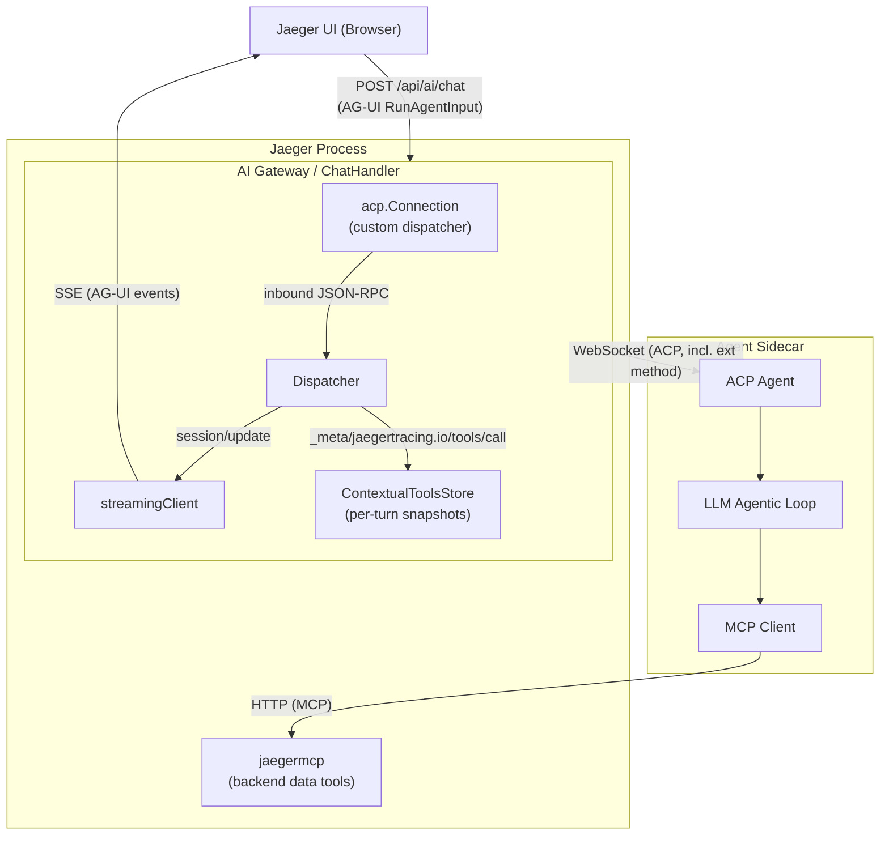
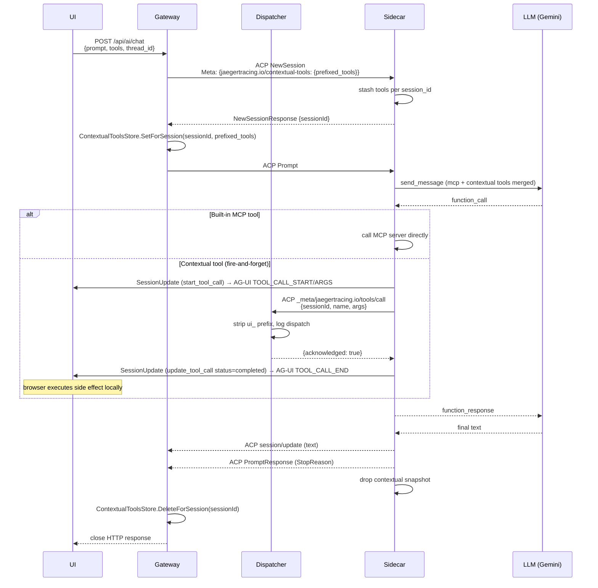

# RFC 0002: AI Gateway — Frontend-Driven Contextual Tools

- **Status:** Draft
- **Author:** Nabil Salah
- **Created:** 2026-04-23
- **Last Updated:** 2026-04-23

---

## Abstract

This RFC proposes a layered design for letting the Jaeger UI attach a set of **contextual (UI-driven) tools** to a chat turn against the AI gateway, have the LLM invoke them through the existing Agent Client Protocol (ACP) sidecar, and receive the results back. It avoids new server processes and avoids polluting the shared Jaeger MCP server with conversation-scoped state by riding a single ACP **extension method** between the sidecar and the gateway, with a per-turn store inside the gateway as the correlation point.

---

## 1. Motivation

The Jaeger AI gateway already lets a user chat with an LLM-backed sidecar (Gemini reference implementation) about traces. The sidecar uses Jaeger's MCP server to query backend data: `search_traces`, `get_critical_path`, `get_service_dependencies`, etc. These tools are **process-scoped** — they make sense to any MCP client that points at Jaeger.

Beyond these, an interactive Jaeger UI wants to expose **UI-driven tools** to the same LLM:

- `show_flamegraph(trace_id)` — navigate the browser to the flamegraph view.
- `highlight_span(span_id)` — focus a span on the timeline.
- `set_filter(...)` — apply a filter the user is composing.
- and more, depending on which page the user is on.

These tools are fundamentally different from the backend ones:

- They are **conversation-scoped**: only meaningful for the chat turn that originated from this browser tab on this page.
- They are **dynamic per turn**: navigation between Search ↔ Trace Detail ↔ Flamegraph changes the available actions.
- They are **executed in the browser**: only the JS side knows how to fulfil them.

We need a clean way to plumb these tools into the LLM's tool universe for a single turn, route the LLM's tool calls back to the originating browser, and tear everything down at turn end — without leaking conversation state into the shared MCP server, and without forking ACP or MCP.

---

## 2. Scope and Non-Goals

**In scope:**

- Per-turn registration of frontend-supplied tools with the LLM.
- Round-trip dispatch of LLM tool calls to the originating browser for execution.
- Cleanup of per-turn state at turn end.
- Naming convention to prevent UI tools from shadowing built-in Jaeger MCP tools.
- Reference implementation in the Python (Gemini) sidecar.

**Out of scope:**

- Persisting UI tools across requests; each turn is a fresh snapshot.
- Letting the LLM dynamically discover *new* tools mid-turn (the snapshot is fixed for the duration of the turn).
- Forking or extending the ACP or MCP specs.
- The browser-side AG-UI client implementation (assumed to already follow the AG-UI protocol on its own).
- Multi-user/multi-tenant scope (deferred to existing Jaeger tenancy mechanisms).

**Under consideration:**

- Tool-name validation (reject reserved prefixes, oversized payloads).
- Concurrent turns from the same browser tab (assumed serialized today; revisit if browsers issue overlapping chat requests).

---

## 3. Background

### 3.1 Current AI gateway architecture

The Jaeger AI gateway is an HTTP handler inside the `jaegerquery` extension at `POST /api/ai/chat`. It:

1. Reads `{prompt}` from the request body.
2. Dials a WebSocket to a configured ACP sidecar (`agent_url`, e.g. `ws://localhost:16688`).
3. Speaks ACP over the WS: `Initialize` → `NewSession` → `Prompt`.
4. Streams the agent's `session/update` events back to the HTTP response as `text/plain`.

The sidecar (Gemini reference) connects to Jaeger's MCP server over HTTP, discovers the built-in tools, registers them with Gemini, runs an agentic loop, and streams text + tool-call notifications back over ACP.

### 3.2 Why ACP and MCP both?

- **ACP** is the chat-protocol layer between the gateway (client) and the sidecar (agent): session lifecycle, prompts, streamed responses.
- **MCP** is the tool-protocol layer between the sidecar (agent) and any tool source: `tools/list`, `tools/call`.

The sidecar ties them together by translating MCP tool definitions into Gemini `FunctionDeclaration`s, dispatching Gemini-emitted `function_call`s over MCP, and reflecting the agentic loop's output back via ACP `session/update`s.

### 3.3 What ACP gives us, what it doesn't

ACP defines:

- A fixed set of **client capabilities**: `Fs.ReadTextFile`, `Fs.WriteTextFile`, `Terminal`. Each maps to a specific protocol method (e.g. `fs/read_text_file`). The client declares which ones it supports in `InitializeRequest.ClientCapabilities`, and the agent calls those exact methods.
- A way to attach arbitrary **MCP server connection specs** to a session via `NewSessionRequest.McpServers`. The agent then dials those servers and discovers tools through MCP.

ACP **does not** define:

- A way for the client to register arbitrary, custom-named tools with the agent. There is no `ClientCapabilities.CustomTools` slot.
- A way to pass tool *definitions* (rather than server connection specs) on `Initialize` or `NewSession`.

So if we want the gateway to advertise UI tools to the agent, the only protocol-native mechanisms are:

- An MCP server (since `NewSessionRequest.McpServers` is the supported tool-injection slot), or
- An ACP **extension method**: ACP allows arbitrary `_meta/...` JSON-RPC methods between client and agent. The Coder ACP SDK's `acp.NewConnection(dispatcher, ...)` lets us register a custom dispatcher that handles such methods. This is how `acp.SendRequest[T]` already supports arbitrary method dispatch.

---

## 4. Problem Statement

We need to answer four questions:

1. **Where do UI tool definitions live for the duration of a turn?** Conversation-scoped state has to be owned by a conversation-aware component, not by the shared MCP server.
2. **How does the LLM see them as callable tools?** Gemini accepts a list of `FunctionDeclaration`s in its chat config. Built-in MCP tools and UI tools both need to land in that list.
3. **When the LLM calls a UI tool, how does the call get back to the right browser?** The tool must execute in the originating tab; the gateway has the open HTTP response stream to that tab; the sidecar holds the LLM context.
4. **How do we keep the design layered?** `jaegermcp` should remain a pure backend-data MCP server usable by any MCP client (Claude Code, Cline, etc.) without seeing UI concerns.

---

## 5. Design Alternatives Considered

### 5.1 Alternative A — `list_contextual_tools` MCP tool inside `jaegermcp`

Initial design (now superseded). The `jaegermcp` extension exposes a new MCP tool `list_contextual_tools(session_id)` that returns the UI tools snapshot for the requested ACP session. The gateway pre-populates a `ContextualToolsStore` keyed by session id; the sidecar calls the MCP tool to discover UI tools.

**Rejected because:**

- `jaegermcp` is meant as a backend-data MCP server usable by any MCP client (e.g. Claude Code with no browser at all). Surfacing a UI-only tool there is dead weight and confusing to non-Jaeger-UI consumers.
- It mixes conversation-scoped state into a shared, long-lived component.
- The session-id parameter on the MCP tool is a meta-tool indirection — the agent calls a tool to get a list of tools, rather than just calling `tools/list`.
- Reviewer feedback (Yuri): UI tools' knowledge belongs strictly between the UI and the gateway, not in the shared MCP server.

### 5.2 Alternative B — Per-turn gateway-hosted MCP server

Spin up a small MCP server inside the `jaegerquery` extension that exposes only the contextual UI tools for a given turn. Mint a per-turn URL like `/api/ai/mcp/{contextual_id}`. The gateway adds this URL to `NewSessionRequest.McpServers` so the sidecar discovers UI tools the standard way.

**Rejected because:**

- Requires per-session URL minting and threading.
- Each chat turn opens a new MCP transport (HTTP+SSE for streamable HTTP MCP), even though the protocol layer between the gateway and the sidecar already exists (ACP/WS).
- `tools/call` would still need a side channel back to the browser; we end up plumbing the result over the open HTTP chat-response stream anyway, so introducing an MCP server in between doesn't reduce moving parts — it adds them.
- Net result: extra protocol layer for no architectural win.

### 5.3 Alternative C — Repurpose ACP `Fs` or `Terminal` capabilities

Encode UI actions as fake filenames or terminal commands, declare those capabilities in `InitializeRequest`, and intercept the ACP method calls server-side.

**Rejected because:**

- Confusing and fragile; the agent's behavior around fs/terminal is not a contract we want to abuse.
- Can't carry tool *definitions* through these capabilities; only tool *invocations*. The LLM still needs to learn about the tools via some other channel.

### 5.4 Alternative D — ACP extension method (chosen)

The gateway defines a custom ACP method `_meta/jaegertracing.io/tools/call`. Tool *definitions* travel one-way on `NewSessionRequest.Meta` (the spec-defined free-form metadata slot). Tool *invocations* travel as JSON-RPC requests over the existing ACP WebSocket from the sidecar back to the gateway via this extension method.

**Selected because:**

- Reuses the single ACP WebSocket already open between gateway and sidecar — no new server, no new transport, no new URL minting.
- Tool definitions and their results never touch `jaegermcp`; that server stays purely backend-data.
- Per-turn state lives in the gateway (the conversation owner) and in the sidecar (the LLM-context owner). The MCP server is uninvolved.
- Standard ACP SDK extensibility supports this: `acp.NewConnection(dispatcher, ...)` accepts a custom method dispatcher, so we don't fork the SDK.
- The sidecar is part of our reference implementation, so teaching it about one extension method is acceptable and confined.

**Trade-off accepted:**

- The extension method is a Jaeger-defined contract, not part of stock ACP. Other ACP agents wired to the gateway in the future would need to recognize `_meta/jaegertracing.io/tools/call` to support contextual tools. We consider this acceptable: contextual tools are a Jaeger-UI feature, and an agent that doesn't implement it simply ignores the meta and never calls the extension method, leaving the system functional for built-in MCP tools only.

---

## 6. Proposed Design

### 6.1 High-Level Architecture



### 6.2 Components

#### `ContextualToolsStore` (gateway-side)

Thread-safe per-turn map of frontend-supplied tools, keyed by **ACP session id**. The chat handler writes the snapshot once `NewSessionResponse` returns and before `Prompt` is sent; the dispatcher reads the snapshot using the same `sessionId` the sidecar puts on the ext_method payload, so the lookup is unambiguous without any extra correlation field.

API:
- `SetForSession(sessionID, rawTools)` — stores a snapshot, copying raw bytes; empty id is no-op; empty/all-invalid set deletes.
- `DeleteForSession(sessionID)` — turn-end cleanup.
- `GetContextualToolsForSession(sessionID)` — returns a fresh decoded copy per call so readers cannot corrupt the snapshot.

#### Custom ACP dispatcher (gateway-side)

Routes inbound JSON-RPC from the sidecar:
- `session/update` → `streamingClient.SessionUpdate`
- `session/request_permission` → always denied (no fs/terminal capability)
- `_meta/jaegertracing.io/tools/call` → `handleJaegerToolCall`
- anything else → `MethodNotFound`

`handleJaegerToolCall`:
- Strips the `ui_` prefix from the inbound tool name (see §6.5).
- Logs the dispatch (session id, stripped name, prefixed name, raw args) for observability.
- Returns a fire-and-forget acknowledgement (`{result: {acknowledged: true}, isError: false}`) immediately.

The browser does **not** round-trip a tool result back. UI tools are
side effects (navigate, render, set filters); the browser executes them
locally based on the AG-UI `TOOL_CALL_*` SSE events that the streaming
client emits in parallel with the ext_method dispatch. See §6.6 for the
rationale.

#### Sidecar (Gemini reference impl)

- On `NewSession`: parses `field_meta` for the namespaced key `jaegertracing.io/contextual-tools`, stashes the snapshot per `session_id`.
- On `Prompt`: builds a Gemini `Tool` from the snapshot and merges it with the discovered MCP tools before passing them to `chats.create()`.
- On Gemini `function_call`: dispatches via MCP for built-in tools; dispatches via the ACP extension method for contextual tools. Streams `start_tool_call` + `update_tool_call` `session_update`s as in the MCP path.
- On `Prompt` end (success or error): pops the snapshot for the session.

### 6.3 Per-Turn Lifecycle



### 6.4 Per-Request Tool Set Is Already AG-UI's Model

The AG-UI protocol is per-run, not per-session: the frontend re-sends `{thread_id, messages, tools}` on every chat call. `thread_id` makes it feel like one chat; `tools` and `messages` are evaluated fresh every turn.

So the natural shape of "tools change when the user navigates" is already the protocol's shape. Turn 1 carries the Search-page tools; if a UI tool call navigates to Flamegraph, the *next* user message turn carries the Flamegraph-page tools. No mid-turn tool swap is needed.

### 6.5 Naming and Namespace Conventions

- **Tool name prefix `ui_`**: the gateway prepends `UIToolPrefix` to every contextual tool name before exposing it on the meta payload. This guarantees that a frontend-supplied tool can never collide with a built-in Jaeger MCP tool of the same name (e.g. `search_traces`). The dispatcher strips the prefix on the inbound call so the AG-UI client receives the original frontend name.
- **Meta key `jaegertracing.io/contextual-tools`**: namespaced under our domain to avoid collision with other meta consumers.
- **ACP method `_meta/jaegertracing.io/tools/call`**: same namespacing.

### 6.6 Why Fire-and-Forget

UI tools are commands, not queries. `show_flamegraph(trace_id)`,
`highlight_span(span_id)`, `set_filter(...)` — none of these have a
meaningful return value to feed back into the LLM. The model's job is to
decide *when* to invoke them; the browser's job is to perform the side
effect once it sees the call.

This rules out the more obvious synchronous-round-trip design (where the
gateway blocks on the ext_method waiting for the browser to POST a tool
result) for several reasons:

- **No genuine result data.** The browser would have nothing useful to
  return except `{ok: true}`, which is what the gateway can emit on its own.
- **Avoids a bidirectional back-channel.** Synchronous round-trip needs a
  separate `POST /api/ai/tool-result` endpoint plus per-call rendezvous
  state inside the gateway, with timeout handling and orphan cleanup.
  Fire-and-forget needs none of that.
- **Single-turn UX.** With acknowledgement, Gemini's agentic loop
  continues in the same `Prompt` call and produces a final answer in one
  SSE stream — the user sees one coherent response rather than a turn
  ending mid-stream while waiting for browser execution.
- **Matches AG-UI semantics in practice.** The browser receives
  `TOOL_CALL_START/ARGS/END` SSE events and acts on them; whether or not a
  matching result message goes back is up to the agent. We choose not to.

### 6.7 Error and Edge-Case Handling

- **Frontend ships invalid tool JSON**: `ContextualToolsStore.Set` skips entries that do not parse; an all-invalid set deletes any prior entry rather than persisting an empty slice.
- **Sidecar dispatches with empty `sessionId`/`name`**: dispatcher rejects with `InvalidParams`; the sidecar surfaces this as a tool error to the LLM.
- **Sidecar dispatches a name that strips to empty after `ui_`**: same `InvalidParams` rejection — guards against a malformed prefix that would otherwise produce an empty tool name.
- **Sidecar dispatches without the `ui_` prefix**: dispatcher logs a warning and passes the name through unchanged so older sidecars keep working during a phased prefix rollout.
- **Browser disconnects mid-turn**: SSE writes start failing, the streaming client marks itself closed, but the ext_method ack is independent of the SSE stream so Gemini still completes the turn server-side. The gateway's `defer DeleteForSession` cleans up.
- **Concurrent turns from the same tab**: each turn opens its own ACP session and gets its own session id, so store entries do not collide. The browser is responsible for not sending overlapping requests on the same chat thread.

---

## 7. Implementation Plan

The work landed in two PRs against `jaegertracing/jaeger`:

### PR1 — Contextual tools machinery (#8423, merged 2026-05-07)

- New `ContextualToolsStore` keyed by ACP session id, with defensive
  JSON validation and clone-on-set semantics.
- New custom ACP dispatcher (`acp.NewConnection(newDispatcher(...))`) that
  routes the standard `session/update` and `session/request_permission`
  methods plus the new `_meta/jaegertracing.io/tools/call` extension method.
- The ext_method handler validates the payload, strips the `ui_` prefix,
  and returns a placeholder result. Real wiring (Meta population, store
  writes, SSE emission) follows in PR2.
- Sidecar (Python reference impl) reads `field_meta`, registers contextual
  tools with Gemini, and dispatches `_meta/jaegertracing.io/tools/call`
  back via `conn.ext_method` when the LLM picks one.

### PR2 — AG-UI gateway + end-to-end wiring

- Chat endpoint accepts AG-UI `RunAgentInput` (`messages`, `tools`,
  `context`, `threadId`, `runId`) and emits AG-UI SSE events
  (`RUN_STARTED`, `TEXT_MESSAGE_START/CONTENT/END`,
  `TOOL_CALL_START/ARGS/RESULT/END`, `RUN_FINISHED`, `RUN_ERROR`).
- New `translation.go` with helpers for extracting prompt text, context
  entries, and encoding tools.
- `streamingClient` rewritten to translate ACP `session/update` events to
  AG-UI SSE frames; lifecycle (`startRun` / `finishRun` / `failRun`) is
  driven by the chat handler.
- Chat handler populates `NewSessionRequest.Meta` with the prefixed
  contextual-tools snapshot, calls `SetForSession` after
  `NewSessionResponse`, and `defer`s `DeleteForSession`.
- Dispatcher's ext_method handler switches from "placeholder" to
  fire-and-forget acknowledgement (`{result: {acknowledged: true}}`).

---

## 8. Open Questions

- **Authentication / authorization on the chat endpoint.** PR2 reuses
  whatever middleware the surrounding `jaeger-query` HTTP server applies.
  A future PR may want to gate AI features behind a separate flag.
- **Tool call observability.** The gateway currently logs each
  ext_method dispatch. Promoting this to a structured OTel span
  alongside the existing tracing middleware would make UI tool latency
  visible end-to-end.
- **Tool name validation policy.** Beyond `ui_` prefix and non-empty
  name, the gateway does not validate user-supplied tool definitions.
  A future PR may want to bound tool count, parameter-schema size, or
  reject reserved characters.
- **AG-UI client implementation.** The browser-side AG-UI client lives
  in the `jaeger-ui` repo and is tracked separately.

---

## 9. Appendix — Protocol Shapes

### 9.1 `NewSessionRequest.Meta`

```jsonc
{
  "_meta": {
    "jaegertracing.io/contextual-tools": {
      "tools": [
        {
          "name": "ui_show_flamegraph",
          "description": "Open the flamegraph view for a given trace_id.",
          "parameters": {
            "type": "object",
            "properties": {
              "trace_id": { "type": "string" }
            },
            "required": ["trace_id"]
          }
        }
      ]
    }
  }
}
```

### 9.2 ACP Extension Method

**Method:** `_meta/jaegertracing.io/tools/call`

**Request payload:**
```jsonc
{
  "sessionId": "sess-42",
  "name": "ui_show_flamegraph",
  "args": { "trace_id": "abc123" }
}
```

**Response payload:**
```jsonc
{
  "result": { "acknowledged": true },
  "isError": false
}
```

The gateway always returns this fire-and-forget acknowledgement once the
payload validates and the prefix strip succeeds. Errors during validation
yield JSON-RPC `InvalidParams`; everything else short-circuits to the ack.

### 9.3 Constants

| Constant | Value | Owner |
|---|---|---|
| `CONTEXTUAL_TOOLS_META_KEY` | `jaegertracing.io/contextual-tools` | Gateway + Sidecar |
| `ExtMethodJaegerToolCall` | `_meta/jaegertracing.io/tools/call` | Gateway (Go) |
| `EXT_METHOD_JAEGER_TOOL_CALL` | `meta/jaegertracing.io/tools/call` | Sidecar (Python — runtime adds the leading `_`) |
| `UIToolPrefix` | `ui_` | Gateway |
