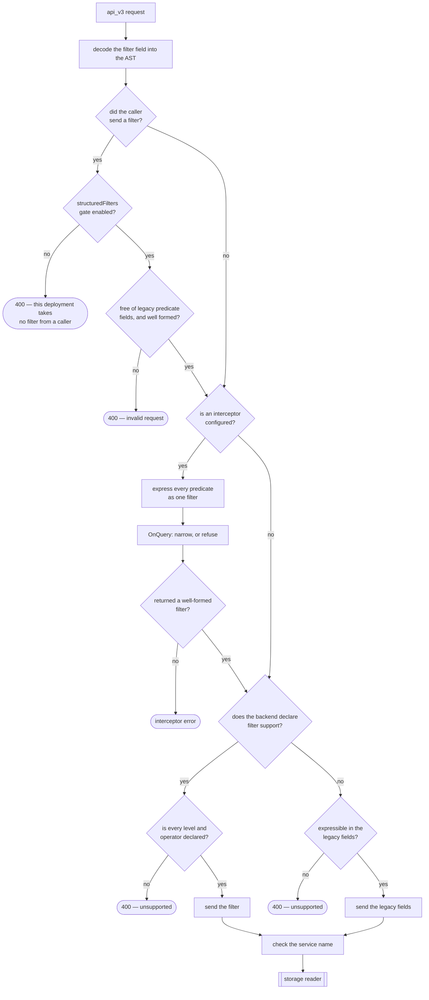

# RFC 0005: Structured Query Filters for Trace Search

- **Status:** Draft
- **Author:** Yuri Shkuro
- **Created:** 2026-06-19
- **Last Updated:** 2026-08-10

---

## Abstract

Jaeger's trace-search API filters spans by unqualified key-value tag pairs, implicitly ANDed. Each pair matches any attribute location the backend indexes, and which locations those are differs per backend. This RFC defines a **structured query-filter model** for trace search that (1) lets a predicate reference a specific attribute *level* (span / resource / scope / event / link) or a built-in *field* (duration, name, status, …), (2) composes predicates with **boolean operators** (`AND`/`OR`/`NOT`), and (3) keeps the existing unqualified tag filter working unchanged.

The model is a **fully structured AST** (proto/JSON), *not* a free-text query language, and its reach is deliberately bounded by what Jaeger's storage backends (Elasticsearch/OpenSearch, ClickHouse, Cassandra, Badger) can implement — it covers filtering and stops short of result shaping, aggregation, and trace-tree/structural queries.

---

## 1. Motivation

### 1.1 Historical context

In the OpenTracing era a span had three tag locations — `span.tags`, `span.process.tags`, and `span.logs[].fields` — and Cassandra maintained a single inverted index over all of them. Querying was cheap because the index was pre-built and undifferentiated: a tag match was a tag match, regardless of where the tag came from.

### 1.2 The OpenTelemetry data model

OTLP spans carry attributes at five distinct levels:

| Level | OTLP location | Semantic meaning |
|-------|---------------|------------------|
| Resource | `ResourceSpans.resource.attributes` | Service / host-level metadata |
| Scope | `ScopeSpans.scope.attributes` | Instrumentation library (`InstrumentationScope`) metadata |
| Span | `Span.attributes` | Per-operation metadata |
| Event | `Span.events[].attributes` | Timestamped annotations |
| Link | `Span.links[].attributes` | Cross-trace references |

(This level is OTLP's `InstrumentationScope`, carried inside `ScopeSpans`, and this RFC calls it **scope** — which is what OTLP itself calls it everywhere a user meets it: `ScopeSpans`, `Scope()`, and the `otel.scope.name` and `otel.scope.version` attributes. An earlier draft called it `instrumentation` to keep the word "scope" from doing double duty with **level**, the qualifier; that is not a real ambiguity, because the field is named `level` and carries the value — `"level": "scope"` — see §5.1.)

### 1.3 The performance problem

When a user queries `http.status_code=500`, an unqualified backend must fan the query out across every attribute level it indexes with OR logic. In ClickHouse a key with no recorded metadata expands to five separate `arrayExists()` calls (three top-level columns, two nested within event/link arrays), each scanning a typed Map column; when the `attribute_metadata` view already knows the key, ClickHouse restricts the fan-out to the levels and types it was actually seen at (§8, Option D). In Elasticsearch each unqualified tag expands to a `bool.should` across the field locations, increasing sub-query count and reducing cache effectiveness. The cost is paid on every attribute of every search, even though the user almost always knows which level they mean.

### 1.4 The semantic problem

The unqualified API cannot express intent. "Find spans where the *span* has `deployment.environment=staging`" and "find spans whose *resource* has `deployment.environment=staging`" are different questions — the first finds spans explicitly tagged, the second finds spans emitted by services in staging — but today they are the same query. Nor can the API express `duration > 2s`, `http.status_code >= 400`, or `A OR B`: it supports only string equality, ANDed.

### 1.5 Two axes, not one

Level qualification alone is too narrow: attaching a level to each attribute leaves an API that still cannot express `OR` or `duration > 2s`. A complete answer must settle two independent axes:

- **What a predicate can reference** (the *leaf*): a level-qualified attribute, but also built-in span/trace *fields* (`duration`, `name`, `status`, …) that are not attributes at all, and an *operator* richer than equality.
- **How predicates combine** (the *composition*): equality-only conjunction is the floor; a boolean expression is the natural ceiling; aggregation and trace-tree navigation lie beyond.

This RFC designs both axes together (§3–§5) rather than adding the level qualifier alone.

### 1.6 The storage-backend landscape

Feasibility is dominated by how each backend physically stores and indexes attributes.

| Backend | Attribute storage | Level differentiation | Consequence |
|---------|-------------------|-----------------------|-------------|
| **ClickHouse** | Typed Map columns per level (`str_attributes`, `resource_str_attributes`, …) + nested arrays for events/links | Full — each level is a distinct column family | Native level filtering; a level-qualified query skips irrelevant columns |
| **Elasticsearch / OpenSearch** | Denormalized object fields (`tag.*`, `process.tag.*`) + nested arrays (`tags`, `process.tags`, `logs.fields`) | Partial — span / resource / log are distinct; no scope/event/link distinction in the v1 schema | Span/resource/event levels work; scope and link need schema evolution |
| **Cassandra** | One flat inverted index (`tag_index`) keyed by `service + key + value` | None | Cannot restrict level at query time; only the indexed levels exist at all |
| **Badger** | Flat KV tag index (span tags + process tags + log fields) | None | Same as Cassandra |

**The flat backends flatten on write, and that constrains what any query can honor.** Cassandra and Badger both index exactly three of the five levels — span attributes, resource (process) attributes, and event (log-field) attributes — merged into one undifferentiated index. Instrumentation-scope attributes are collapsed into span tags (indistinguishable), and **link attributes are dropped entirely** (the v1 model has no field for them). So a "just ignore the level and return everything" fallback is a genuine superset *only for the levels that were actually indexed* (span/resource/event). For a level the backend never indexed (link, and arguably instrumentation), widening returns the wrong set, not a superset. The best-effort contract in §7 is written to this reality: honor indexed levels, and reject (rather than silently widen) the levels that are not indexed.

---

## 2. Goals and non-goals

### Goals

- **G1 — Level-qualified attributes.** A predicate may target a single OTLP attribute level (span/resource/scope/event/link) or leave it unqualified (search the default level set — span-or-resource; §5.1).
- **G2 — Built-in fields.** A predicate may target a built-in field (`duration`, `name`, `status`, `kind`, `service`) uniformly with attributes (§5).
- **G3 — Richer operators.** Beyond equality: `ne`, `gt`, `lt`, `gte`, `lte`, `regex`, `exists`, and set membership `in`/`not_in` — extensible without a second API redesign.
- **G4 — Boolean composition.** Predicates combine with `AND`/`OR`/`NOT` and nesting, including an existential quantifier (`some`) over the multi-valued event/link collections (§4 tier L2, §5.5).
- **G5 — Backward compatibility.** The existing unqualified `attributes` filter keeps working byte-for-byte; the new model is additive at every layer (public API, internal storage API, remote-storage gRPC). The new rejections it adds (mixing `filter` with a legacy field, and unsupported levels/operators/structure; §7) apply only to request shapes that did not exist before, so no previously valid request changes meaning.
- **G6 — Structured AST.** The query is a typed proto/JSON structure, machine-first, self-documenting via schema.
- **G7 — Cross-backend implementability with graceful degradation.** Fully supported on ClickHouse and Elasticsearch/OpenSearch; backends that cannot honor a level or operator reject that predicate rather than returning wrong results.

### Non-goals

- **A free-text query language.** No lexer/grammar for a TraceQL/SQL-like string surface. If such a surface is ever wanted it can compile *to* this AST; the AST is the contract.
- **Result shaping** — projection / `SELECT` / column selection, ordering, paging (§4 tier L3). *Deferred* rather than excluded: it extends this filter model without conflict (§4).
- **Aggregation and metrics** — `count`/`GROUP BY`/`rate()` over spans (§4 tier L4). This overlaps Jaeger's existing metrics/SPM query service and belongs there.
- **Structural / trace-tree queries** — ancestor/descendant/sibling navigation (§4 tier L5). Post-fetch only, a distinct and larger execution model deferred to a future effort (§4).
- **Storage-schema changes.** The model is designed to fit existing schemas; where a backend's schema cannot express a level (ES event/link, flat-index link), that is a documented limitation, not a schema migration mandated by this RFC.

---

## 3. The two design axes

The model factors cleanly into two orthogonal axes, addressed in the next two sections:

- **Composition (§4)** — *how predicates combine.* This is the "how expressive?" question, mapped as a continuum from today's flat conjunction up to a full trace query language, with an explicit decision on where Jaeger stops.
- **Predicate anatomy (§5)** — *a single predicate's operands (level-qualified attributes, built-in fields, or constants), operator, and value typing.*

They are independent: the composition tier could be chosen with or without built-in fields, and vice versa. §6 combines the two into one proto/AST.

---

## 4. Composition — the query-complexity continuum

The central design question is *how expressive should the structured filter be?* Below is the continuum from today's API to a full trace query language, calibrated against three well-known structured query systems as prior art. Jaeger targets a structured AST, so these matter only for the *expressiveness tier* each represents — not their surface syntax.

**Prior art:**

- **SQL over a flat span table** — boolean `WHERE`, projection, `ORDER BY`/`LIMIT`, `GROUP BY` aggregation. No notion of the trace tree.
- **Braintrust BTQL** — a structured, SQL-like query language (also expressible as a JSON AST): boolean filters over dotted field paths, `IN`/`LIKE`/`MATCH`, functions, `sort`/`limit`, and `dimensions`/`measures` aggregation. Document/row-oriented; no trace-tree operators.
- **Grafana TraceQL** — trace-native: scope-qualified attributes (`span.`, `resource.`, `event.`, `link.`, `parent.`, unscoped `.`), built-in span/trace fields (`duration`, `name`, `status`, `kind`, `rootName`, `traceDuration`, …), boolean field expressions, **structural operators** over the trace tree (`>>` descendant, `<<` ancestor, `~` sibling), spanset aggregation/grouping, and a metrics extension (`rate()`, `quantile_over_time()`). It occupies the top of the continuum; its structural and metrics tiers are the frontier this RFC declines.

**The expressiveness ladder** (each tier cumulative; the *Prior art* column names the system that characterizes a tier, blank where the tier is more basic than the surveyed languages):

| Tier | Capability | Prior art |
|------|-----------|----------|
| **L0** | Unqualified conjunction of `key=value` equalities, search-all-levels — **today** | — |
| **L1** | Level- or field-qualified predicates (a reference, operator, and value), still all-ANDed | — |
| **L2** | Boolean expression tree: `AND`/`OR`/`NOT` + nesting over L1 leaves, plus existential quantification (`some`) over the event/link collections | SQL `WHERE`, BTQL filter |
| **L3** | Result shaping: projection, ordering, limit/paging | SQL `SELECT/ORDER BY/LIMIT`, TraceQL `select()` |
| **L4** | Aggregation & grouping: `count/sum/avg/quantile` by field, optionally over-time | SQL `GROUP BY`, BTQL measures, TraceQL `by()`+`rate()` |
| **L5** | Structural / trace-tree operators: ancestor/descendant/sibling/child, `parent.` | TraceQL `>>`/`<<`/`~` |

**Assessment by tier** (each cell scores that tier's own added capability, not cumulative; 🟢 good · 🟡 partial · 🔴 poor):

| Criterion | L0 | L1 | L2 | L3 | L4 | L5 |
|-----------|:-:|:-:|:-:|:-:|:-:|:-:|
| User expressiveness | 🔴 | 🟡 | 🟢 | 🟢 | 🟢 | 🟢 |
| Elasticsearch/OpenSearch | 🟢 | 🟢 | 🟢¹ | 🟢 | 🟢² | 🟡³ |
| ClickHouse | 🟢 | 🟢 | 🟢 | 🟢 | 🟢 | 🟡⁴ |
| Cassandra / Badger | 🟢 | 🟡⁵ | 🔴⁶ | 🟡 | 🔴 | 🟡³ |
| AST/API surface cost | 🟢 | 🟢 | 🟢⁷ | 🟡 | 🔴 | 🔴 |
| UI builder cost | 🟢 | 🟢 | 🟡⁸ | 🟡 | 🔴 | 🔴 |
| Cross-backend uniformity | 🟢 | 🟡 | 🟡⁹ | 🟡 | 🔴 | 🟡 |

¹ ES `bool` query (`must`/`should`/`must_not`) nests arbitrarily, and its `nested` query evaluates the `some` existential (§5.5). ² ES aggregations exist but overlap Jaeger's metrics/SPM path. ³ structural operators are evaluated *post-fetch* — the query service assembles each candidate trace and checks ancestor/descendant/sibling in memory — so they work on any backend; but no Jaeger schema encodes the trace tree, so they cannot be pushed into storage to prune candidates, which makes them **inefficient at scale, not infeasible**. ⁴ ClickHouse could additionally push some structural checks into a self-join within a trace partition, though not with today's schema/query builder; otherwise it is post-fetch as in ³. ⁵ superset-safe only for the levels the flat index actually contains — span/resource/event; link is unrepresentable and instrumentation indistinguishable (§1.6). ⁶ a flat inverted index has no `OR`/`NOT` and cannot evaluate the `some` existential. ⁷ L2 is not a delta in message types at all — boolean `and`/`or`/`not` are just more `op` values on the same `Call` node the conjunctive subset already uses; see §6. ⁸ the API need not wait for the UI: a builder can render the conjunctive subset first and add nesting later. ⁹ capable backends evaluate the full tree; flat backends evaluate the conjunctive subset and reject `OR`/`NOT` and `some` — the same posture they already take for unsupported operators.

**Decision — target L2 (the full boolean tree); conjunction is the subset every backend supports.**

- **L1 is not a coherent stopping point.** In SELECT/FILTER/GROUP-BY terms, L3 adds SELECT and L4 adds GROUP BY — separate clauses, principled to defer. But L1 stops *inside* the FILTER clause: it has conjunction and lacks disjunction/negation, which is no natural boundary. The complete FILTER is the boolean expression — L2.
- **The backend-uniformity concern does not favor L1.** A flat-index backend handles the conjunctive *subset* of an L2 tree exactly as it would handle L1 — walk the ANDs, reject anything containing `OR`/`NOT`. So L1 buys the weak backends no simplicity; it only removes power from ClickHouse and ES/OS, the backends that motivate this RFC. L1 is L2 with the boolean `op` values removed from the vocabulary — the same message types, a shorter operator set.
- **API expressiveness is decoupled from UI expressiveness.** The API can be L2 while the UI ships only a conjunctive-subset builder and adds nested groups later.
- **Stopping at L1 would cost two API changes** to the same surface and leave a flat predicate-list field as legacy baggage beside the legacy `attributes` map.

So the proposed filter API is the **L2 boolean expression tree** (§6). "L1" is retained only as a *capability tier* — the conjunctive subset that every backend, including the flat ones, supports. **L3 is deferred**: it is awkward against Jaeger's whole-trace result model, and its projection piece is inert until L4 exists (its ordering and paging are not). **L4 is excluded**: it belongs to the metrics/SPM subsystem and its own RFC. **L5 is excluded too, though not for infeasibility**: structural predicates can be evaluated post-fetch on any backend by assembling each candidate trace, but that is a distinct fetch-then-filter execution model that cannot prune in storage, is inefficient at scale, and is a large surface, so it is deferred as a separate effort. One nuance sits inside the backends, not the API: a pure conjunction admits a fast all-predicates-pushdown path, while a tree with `OR` needs fuller evaluation.

**Why the excluded tiers are bounded, not dead ends.** The deferred tiers extend this RFC's `Expression` rather than replace it: L3 (projection) and L4 (aggregation) add sibling clauses over the same node (a projection is a list of expressions, a group key an expression, an aggregate a `Call`), and L5 (structural) wraps it as an outer query over sets of spans whose per-set filter is an `Expression`. The only capabilities the current shape could not grow into are set membership over a list (already handled by `in`/`not_in` + `List`, §6.1) and a parent-scope modifier (a level flag, belonging with the deferred structural tier); everything else is a pure addition to the open `op`/`type` vocabularies or the `Call` node (further operators like `not_regex` and arithmetic, aggregates, semantic literal types).

---

## 5. Predicate anatomy — operands, operators, and value types

A predicate is a `Call` (§6.1): an **operator** (§5.3) applied to **operand** expressions. Each operand is either a *reference* — a value on the span or trace, identified by its level, name, and whether it is an attribute or a built-in field (§5.1–§5.2) — or a *constant* (a scalar, or a list for `in`/`not_in`). The operands are the same kind of thing, so neither side is privileged: the everyday `reference op constant` shape (`span.http.status_code = 500`) and a `reference op reference` shape (`span.a > span.b`) are equally expressible. A constant carries an optional **type** (§5.3–§5.4) telling the backend how to interpret it.

### 5.1 References: three kinds, each its own term

A **reference** names a value to read off the span or trace, and there are exactly three kinds of them. An **attribute reference** names an entry in an attribute map, by key, at a level or with no level at all. A **field reference** names a built-in field of a level (§5.2). A **nested reference** names a span's events or links collection, and is only meaningful as the first operand of `some` (§5.5). We call the qualifier **level**, not "scope", so it never overloads OTLP's `InstrumentationScope`.

Each kind is a distinct term in the AST rather than one `Reference` message distinguished by a flag and a sentinel. An earlier draft used a single message carrying a `level`, a `name` and an `attr` boolean, which made two spellings mean the same thing — the flag is meaningless without a level, since an unqualified reference is always an attribute — and made "the whole collection" an empty `name` that is significant in exactly one operator position. Both are states a validator has to reject rather than states the type system prevents, and every visitor, converter and interceptor then has to remember which bits are meaningful where. Three terms cost three arms in the oneof and give exhaustive cases instead (§6.1), and let `some` declare that its first operand *is* a collection.

The five explicit `level` values name the OTLP attribute maps of §1.2 — `span`, `resource`, `scope` (OTLP's `InstrumentationScope`), `event`, and `link` — and an empty `level` defaults to span-or-resource.

Separate terms are also what disambiguates a built-in field from an attribute that happens to share its name: a field reference to `span.duration` is the span's duration, while an attribute reference to `span` / `duration` is a span attribute *named* `duration`. An attribute reference with no level is the unqualified span-or-resource search; a field reference has no unqualified form, because a built-in field belongs to a level by definition.

The empty-level default means span-or-resource attributes rather than "all five", a deliberate choice for the new `filter` model: span and resource (process) attributes are the tags reliably indexed across every backend, so this default covers the high-value common case without paying to scan levels that are unindexed or costly.

The default matches api_v3's *documented* contract — its `attributes` field already says a tag is "matched against span and resource attributes." What it does not match is the backends' *implemented* behavior, which generally searches more: ClickHouse ORs across every level a key was seen at (all five when it has no recorded metadata; §1.3), and Elasticsearch across its indexed span/resource/event locations. So the default follows the spec while those backends over-search, and a backend that scans more simply returns a superset (§1.6). The legacy `attributes` map keeps its existing behavior unchanged; the span-or-resource default applies only to an empty `level` in the new `filter` field.

Further levels are future enhancements — a `trace` level for whole-trace fields (`traceDuration`, `rootName`), or `parent.` for the parent span's attributes. Neither is answerable today: no Jaeger backend stores a trace-level entity, so a whole-trace predicate needs the trace assembled first (§9). The level is carried as a string rather than a proto enum (§6.2), so adding one is additive on the wire — but the accepted values are closed and a new one arrives by a versioned IDL change (§7), not by a backend announcing it.

### 5.2 Built-in fields

Much of what users filter on is not an attribute at all but a **built-in field** — a value the data model defines directly, not an attribute-map entry. A reference names one by giving its level and leaving `attr` unset; a built-in field is the default at an explicit level (§5.1). Built-in fields exist at every level, not just the span; the lists below are **representative, not exhaustive**:

| `level` | Built-in fields (representative) | Today in Jaeger's API |
|---------|-----------------|-----------------------|
| `span` | `duration`, `name`, `kind`, `status`, `startTime`, `spanID`, … | `duration_min`/`max`, `operation_name`, `span.kind` tag, `error=true` tag |
| `resource` | `service`, … | `service_name` field |
| `scope` | `name`, `version` | not expressible |
| `event` | `name`, `timeSinceStart`, … | not expressible |
| `link` | `traceID`, `spanID` (the linked trace/span) | not expressible |

The value of folding these into references is *uniformity*: `span.duration > 2s`, `span.status = error`, and `span.http.method = GET` are all the same shape (a predicate over a reference), instead of three unrelated mechanisms (a dedicated duration field, a magic `error` tag, and a tag map). It also makes queries expressible that are impossible today (`event.name`, `link.traceID`, `span.startTime`). The dedicated top-level query fields (`service_name`, `operation_name`, the paired `duration_min`/`duration_max`) and the legacy `attributes` map remain supported for backward compatibility but are **mutually exclusive with `filter`** (§7): a legacy request uses them, and the query service normalizes them into built-in-field predicates internally, while a `filter` request expresses `service`, `name`, and `duration` as references directly. Either way a backend sees one filtering model rather than a growing mix of scalar fields *plus* `attributes` *plus* `filter`.

Each built-in field also declares its **type**, which is what lets a constant compared against it be parsed and refused when it is malformed: `span.duration > "not-a-duration"` is rejected at the query boundary rather than passed to a backend to interpret. The declared types are the ones the fields actually hold — a duration, a timestamp, an ID, a status, a span kind, a string, an integer — and they are what §5.4's spellings are checked against. An arbitrary attribute declares nothing, because only storage knows how it was written, so a constant compared against one is left as it was given.

The built-in-field names are a **closed vocabulary, enumerated per level** and checked when a filter is validated. Which fields a query may name is part of the query API, not of each backend: a caller writes one query against Jaeger rather than a different one per storage backend, so a name outside the enumeration is refused up front instead of being passed down for a backend to interpret or ignore. Which of the valid fields a given backend can *serve* is a separate question, answered partly by the capabilities it declares and partly by the reader itself (§7). The enumeration is additive — a level gains fields as they are defined — and it names the derived values people filter on alongside the ones OTLP stores: `span.duration` from the two timestamps, `event.timeSinceStart` from the event's offset into its span, and `resource.service` from the `service.name` attribute Jaeger reads as identity rather than metadata. The names are camelCase (`startTime`, `timeSinceStart`, `traceID`) because that is how proto3 JSON renders a message field, and api_v3's own query parameters are already spelled that way — the [HTTP query parser](../../cmd/jaeger/internal/extension/jaegerquery/internal/apiv3/query_parser.go) calls `query.serviceName`, `query.startTimeMin`, and `query.startTimeMax` its "Canonical camelCase query params matching proto3 JSON encoding". So a built-in field name reads like the rest of the JSON surface a caller already writes, and since OTLP's own JSON encoding follows the same proto3 JSON mapping, camelCase is also what an OTLP JSON payload looks like. An initialism keeps its capitals — `traceID`, where proto3 JSON would render `traceId` — which is the one point at which the vocabulary reads as Go rather than as JSON. The snake_case operator vocabulary (`not_in`) does not contradict this, because an operator is a *value*, not a field name. A constant compared against a field is written the way that field's values are written: a duration in Go duration syntax (`2s`, `50us`; §5.3), and a timestamp in RFC 3339 with nanosecond precision, which is what api_v3 already accepts for the query's own time range. Whole-trace fields (`traceDuration`, `rootName`) wait on a future `trace` level (§5.1). The event- and link-level fields interact with correlated matching (§5.5), since a span has many of each.

### 5.3 Operators and value typing

The operator set is `eq`, `ne`, `gt`, `lt`, `gte`, `lte`, `regex`, `exists`, and set membership `in`/`not_in` (whose right operand is a `List`, §6.1).

**What each operator requires of its operands.** These are properties of the query's meaning, not of any backend's ability to serve it. A backend that cannot answer one faithfully declares the operator unsupported (§7); it does not get to answer a different question instead.

| Operator | Operands | Means |
| --- | --- | --- |
| `and`, `or` | two or more predicates | the predicates hold together, or at least one holds |
| `not` | one predicate | the predicate does not hold |
| `eq`, `ne` | a reference and a constant, or two references | the two values are equal, compared as the constant's type |
| `gt`, `lt`, `gte`, `lte` | a reference and an ordered constant, or two references | ordered comparison; the values are read as numbers or instants, never as text |
| `regex` | a reference that holds text, and a string | the value matches the expression |
| `exists` | a reference | the value is present at all |
| `in`, `not_in` | a reference and a list | the value is, or is not, one of the list's elements |
| `some` | a collection and a predicate | one element of the collection satisfies the predicate (§5.5) |

The ordering row is the one worth stating explicitly, because it is where a backend can quietly answer something else. An ordered comparison runs within a single domain: numbers against numbers, durations against durations, instants against instants, and text against text, lexicographically — `span.name > "m"` asks for the names that sort after it. So `span.duration > "2s"` and `attr("size") > 500` are numeric comparisons, and a backend that compares them as text — so that `"9"` exceeds `"500"` — is answering wrongly rather than differently. Whether an untyped attribute is stored as an integer or a double is still storage's to resolve; that the comparison is ordered is not. Two things have no ordering at all and are refused rather than lowered: a boolean, and the two fields that hold one of a closed set of words, because the kinds that sort after `server` is not a question about span kinds. A constant that declares no type, and an attribute, are unconstrained — nothing has said yet what either holds — so each takes its domain from the operand opposite it, and a duration compared against a bare number is refused because those two domains do not meet. A pattern matches text, so its subject is a string field, one of the word-valued fields, or an attribute, whose spelling only storage knows; a duration or a timestamp field is refused, because nothing here says which of its spellings the pattern would be shown. The negated leaf comparisons `ne` and `not_in` are kept distinct from a boolean `not` for two reasons: they map to a backend's native negated operators (`!=`, `NOT IN`) so they push down as leaf predicates, and they stay available on backends that reject boolean nesting (§7). The general rule for a missing value: a leaf comparison (`eq`, `ne`, `gt`, `regex`, `some`, …) on an absent reference evaluates to false, and only a boolean `not` flips that. This is why `x not_in list` does not match a span lacking the attribute, whereas `not(x in list)` does; it is also what makes the De Morgan derivation of `every` in §5.5 come out right. A constant `value` is a string on the wire and is **optionally typed** (`string`/`int`/`double`/`bool` on the `Scalar`/`List` term; §5.4). An ordered operator over operands that declare no type asks for the ordering of the values as storage holds them. A backend that does not implement an operator rejects the predicate (§7) rather than guessing.

**Units of numeric values.** For a value with an implied unit — chiefly `duration` — the wire value should carry the unit *explicitly*, in Go duration syntax (`2s`, `1h30m`), matching today's `duration_min`/`duration_max` fields, rather than a bare number in an assumed unit (which is ambiguous — nanoseconds? milliseconds?). A bare-number value (e.g. a numeric attribute like `http.response.size`) is compared numerically and carries no RFC-defined unit: the caller and the stored data share whatever unit the attribute was recorded in, exactly as today.

### 5.4 Typed values

`type` is optional on the wire. Omitted, it means *any type*: the backend resolves the value wherever the key lives, across every observed type, exactly as today.

**In the Go AST a constant is a typed node, not a string plus a hint.** The wire carries `{value, type}` because a protobuf field has to, but a consumer wants the value, not its spelling — a `time.Duration`, not `"2s"` to be re-parsed at every layer that touches it. So the AST has one node type per constant kind: `AnyValue`, `StringValue`, `IntValue`, `DoubleValue`, `BoolValue`, `DurationValue`, `TimestampValue`. A visitor switches on the node and has the parsed value; it never asks "is this string a duration".

This is the same choice as the three reference terms (§5.1), for the same reason: a state that cannot be represented cannot be mishandled. The rejected alternative is one `Scalar` carrying a derived type alongside its wire hint, which two problems make worse than it looks. A derived field goes stale the moment a query interceptor rewrites the predicate it hangs off, so something has to define when annotations are invalidated. And adding derived fields silently changes what struct equality means, so every consumer that compares filters — including this project's own tests — changes behavior without a compile error. Typed nodes have neither problem, because there is nothing derived to invalidate.

**Resolution is a step, not a decode.** Decoding cannot always produce the typed node on its own: `"2s"` is a duration because it sits against `span.duration`, and the wire may carry no hint at all. So decoding produces `AnyValue` for an unhinted constant, and a resolution step rewrites it using the field's declared type (§5.2) — `AnyValue{"2s"}` against `span.duration` becomes `DurationValue`, and a value that will not parse is refused there (§7). It rewrites nodes rather than annotating them, which is what keeps it immune to the staleness above. An explicit wire hint is authoritative and needs no field to resolve against; an unhinted constant compared against an *attribute* stays `AnyValue`, because only storage knows how that attribute was written.

**Status and span kind are checked against their words; IDs are not.** None of the three gets a node type of its own — a distinct type only pays once a consumer wants the parsed form, and `TraceID` in particular would force a representation decision, bytes or hex, into a package that should not depend on a trace-data library to express a query. But status and kind each hold one of a closed set of words, so a constant compared against one is refused unless it is a member, and the error names the set. A misspelled kind can never match any span, so answering that at the query boundary beats a backend returning nothing without saying why.

The words are lower case — `server`, `error` — like the operators and the levels, and unlike OTLP's own `SPAN_KIND_SERVER`, because this API spells a value the way the rest of its vocabulary is spelled (§6.2). What a backend stored is its own business to map.

An ID is left as a string on purpose, and the difference is worth stating: an ID nobody recorded reads exactly like one the caller is looking for, so refusing an unexpected spelling would refuse legitimate searches. A closed word set has no such ambiguity.

**Two constants that are not literal types.** An *any* value is the absence of a constraint on a constant. Whether a given attribute is stored as an integer or a double is a different question, belongs to storage, and is not represented in the AST at all: the query says what it means, and a backend that cannot answer that faithfully declares the operator unsupported rather than answering it differently (§7).

**The duration and timestamp hints have no wire spelling.** The wire `type` vocabulary is `string|int|double|bool` (§6.1), so a `DurationValue` encodes as an unhinted constant and the receiving side resolves it again from the field it sits against. The Go node type is therefore a function of the wire *and* the field registry, not of the wire alone — which is consistent with a remote peer revalidating what it was sent (§7) rather than trusting it. Set, it is *authoritative*: the backend routes to that typed storage and matches only there, so specifying a type narrows the match and skips the metadata lookup. A query that declares `type=int` for a value stored as a string then matches nothing — the caller narrowing to the int-typed value, not a silent bug. Two facts force this "optional, authoritative when set" rule rather than a mandatory type.

**A key is legitimately multi-typed.** The same key appears with different types across services — `http.status_code` as an int from one service, a string from another — and ClickHouse's `attribute_metadata` records exactly that. Today's resolution searches all observed types and matches both. A single mandatory `type` could not express "any type" and would silently drop the others, so the forgiving any-type behavior must stay the default.

**Most backends cannot expose type metadata.** Typed authoring assistance needs a discovery API that returns each key's type(s). Only ClickHouse has one (`attribute_metadata`); ES/OS would need an expensive aggregation that does not even surface types, and the flat backends have no enumeration at all. So a mandatory type is undeliverable as good UX on most backends.

What each backend can do with `type` (🟢 good · 🟡 partial · 🔴 poor):

| Capability | ClickHouse | Elasticsearch/OpenSearch | Cassandra / Badger |
|------------|:---:|:---:|:---:|
| typed predicate evaluation | 🟢 typed columns | 🟡 `eq` is a string term; numeric `gt`/`lt` needs the tag indexed numerically (a schema question) | 🔴 string `eq` only; no numeric range |
| typed discovery API | 🟢 `attribute_metadata` | 🟡 expensive aggregation; type not exposed | 🔴 no enumeration at all |

One consequence is worth stating on top of the table: ClickHouse's `attribute_metadata` view (Option D, §8) is **not eliminated** — it resolves untyped predicates and feeds a future discovery API, so a supplied type makes the lookup *avoidable*, not obsolete. Typed queries therefore roll out immediately where the type is intrinsic — built-in fields (`duration`, `status`, `kind`) and string-`eq` attributes (today's default) — with typed predicates over arbitrary user attributes, and the discovery API, following ClickHouse-first.

### 5.5 Correlated matching over events and links

A span has one resource and one instrumentation scope, but *many* events and *many* links. So a filter that names two event fields — "an event whose `name` is `exception` **and** whose `timeSinceStart` is over 50us" — has two readings: the same event satisfies both (correlated), or one event is named `exception` and some *other* event is late (uncorrelated). The correlated reading is almost always what a user means, and a flat `and(event.name = "exception", event.timeSinceStart > 50us)` gives the uncorrelated one — each predicate matches *some* event independently.

Expressing the correlated reading needs a **quantifier that binds a single element** of the collection and evaluates a predicate against it. This is a standard construct — SQL `EXISTS (… WHERE …)`, MongoDB `$elemMatch`, Elasticsearch's `nested` query, ClickHouse's `arrayExists(e -> …, events)` — and it is the `some` operator:

```
some( <collection>, <predicate> )
```

- The first operand names the collection: a reference at `event` or `link` level with no `name` (the collection-reference case of §5.1).
- The second is a boolean predicate. **Inside it, references at the quantified level bind to the currently-bound element**; references at other levels (`span`, `resource`) bind to the enclosing span as usual. So `some(event, and(event.name = "exception", event.timeSinceStart > 50us))` reads "there is an event on this span whose name is `exception` and which fired more than 50us in" — one event satisfying both.

The binding rules are deliberately narrow for the first version, so that nothing depends on inferred shadowing:

1. `some` introduces a binding for its collection's level.
2. A reference at that level binds to the innermost active binding.
3. A reference at a *different* collection level is uncorrelated unless it sits inside its own `some`.
4. A nested `some` over the same level is **rejected**. Whether the inner one shadows the outer, and whether an inner predicate may reach back to the outer element, are questions this version does not answer — so it refuses the query rather than answering it by accident.
5. Referring to an outer collection element, when someone needs it, will require an explicit binder identifier. It must not be inferred from tree position.

`some` yields a boolean, so it composes like any other predicate — AND it with span predicates, negate it, nest it. Outside a `some`, an event/link reference keeps its uncorrelated "any element" meaning, which is all a bare `exists(event.name)` needs. The universal quantifier (*every* element matches) is not a separate operator: `every` is `not(some(c, not(p)))` by De Morgan — including the correct vacuous truth on an empty collection — so `some` is the primitive and an `every`/`all` sugar can be added later if demand appears.

Correlated matching is a **declared capability** (ADR-013, §7): ClickHouse and Elasticsearch can evaluate `some` (via `arrayExists` and `nested` respectively); a backend that cannot declares it unsupported, and the query service refuses a filter containing `some` up front rather than silently returning the uncorrelated answer.

### 5.6 Nested access into JSON-valued attributes (`json_extract`)

Some attributes hold a JSON document rather than a scalar — an LLM span's `input`/`output`, a serialized request body. A user often wants to filter on a field *inside* that document: `input.guardrails[0].is_passed = true`. The attribute key is `input`; `guardrails[0].is_passed` is a path into its value, evaluated as part of the query.

The reference model (§5.1) cannot express this. `name` is the whole attribute key and cannot also carry the path, because attribute keys legitimately contain dots (`http.status_code`), so `input.guardrails.is_passed` would be ambiguous. And reaching into a value is not *locating* a value on the span; it is *computing* a derived value from one. That is a function, so it is a `Call`:

```
json_extract( <reference>, <path> )
```

`json_extract` takes the attribute reference and a **path** — a JSONPath expression (RFC 9535: `guardrails[0].is_passed`, `[-1]` for the last element, `[*]` for any element), chosen because it is the one standard that spells positional, last, and wildcard uniformly, and each backend translates it to its own engine. Because a call's result is itself an operand (§6 — the property that lets `(a + b) > c` compose), it slots directly under a comparison, and the compared constant carries the type as usual (§5.4):

```json
{ "op": "eq", "args": [
  { "call": { "op": "json_extract", "args": [
      { "attr": { "key": "input" } },
      { "scalar": { "value": "guardrails[0].is_passed" } } ] } },
  { "scalar": { "value": "true", "type": "bool" } } ] }
```

Making it a function rather than a field on `Reference` keeps `Reference` as "a value located on the span" and adds no new node — `json_extract` is one more `op`, exactly the extension path §6 reserves for named functions. It needs no new capability field either: a backend lists `json_extract` in its declared operator set (§7), or the query service refuses it, the same gate every operator rides.

When the path targets an array rather than a leaf, the intent is usually existential — "some guardrail failed". A single-field test needs nothing new: an array-valued `json_extract` fans out over the elements, and the comparison matches if any element matches. Only the *correlated* case — two fields of the **same** element, "some guardrail with `is_passed=false` **and** `severity=high`" — needs the `some` quantifier of §5.5 over the array, `some(json_extract(ref(input), "guardrails"), …)`; there the one piece left to define is how the inner predicate names a field of the *current element* (a `json_extract` rooted at the bound element). Positional access (`[0]`) is just a path that ends at an index.

Storage feasibility is uneven, and it is the crux of the proposal. A columnar store with JSON functions and positional arrays can push most paths down; a search index can serve dotted leaf-equality cheaply but handles positional and typed access only through a query-time scan. That per-backend analysis, and a plan to measure it at scale before committing, is tracked separately. Here `json_extract` is a **proposed extension** — a future `op`, additive — not part of the initial committed operator set.

---

## 6. Proposed API

The two axes combine into one structured AST: a single, uniformly recursive **`Expression`**. An expression is either an *atom* — a reference (a level-qualified attribute or a built-in field, §5) or a constant (a scalar, or a homogeneous list for `in`/`not_in`) — or a *call* applying an operator or function to argument expressions. Boolean combination (`and`/`or`/`not`), comparison (`eq`/`gt`/…), set membership, and future arithmetic/aggregation are all the same `Call` node, so `a AND b`, `span.a > span.b`, and `(a + b) > c` compose uniformly, and the expression is the one reusable term a future projection, grouping, or named function (§4 L3/L4) would operate on. The wire grammar deliberately does **not** encode value types: a constant travels as its spelling with an optional hint, so `duration > "x"` is a type error but a valid graph — refused by validation and constant resolution rather than by the grammar, as expression ASTs conventionally are (§6.1). The Go AST the query service works on does carry types, because resolution rewrites each constant as the node for the kind of value it holds (§5.4). `level`, `op`, and the optional `type` (§5.4) are **typed string enumerations** (documented closed value sets) rather than proto enums — see §6.2 for why; the built-in-field names are a closed vocabulary enumerated per level (§5.2).

### 6.1 Proto

```protobuf
// Expression is a node in the filter AST: either an atom — a reference or a
// constant (scalar or list) — or a Call applying an operator or function to
// argument Expressions. The tree is uniformly recursive: a call's
// args are themselves Expressions, so boolean combination, comparison, set
// membership, and (later) arithmetic and aggregation are all the same shape,
// and `(a + b) > c` composes as naturally as `a AND b`.
//
// This grammar does not encode value types. A well-formed filter is an
// Expression that evaluates to a boolean; `duration > "x"` and `"a" + 3` are
// type errors but valid AST graphs — refused by the validation and resolution
// stages, not by the grammar. This keeps the node set minimal: as in most
// expression languages, type validity is a separate concern from grammatical
// structure. The Go AST those stages produce is typed (§5.4).
message Expression {
  oneof term {
    AttributeReference  attr       = 1;  // an entry in an attribute map, by key
    FieldReference      field      = 2;  // a built-in field of a level (§5.2)
    NestedReference     nested     = 3;  // the nested events or links, for `some` (§5.5)
    Scalar              scalar     = 4;  // constant: single typed value
    List                list       = 5;  // constant: homogeneous list (right arg of in / not_in)
    Call                call       = 6;  // an operator/function applied to argument Expressions
  }
}

message AttributeReference {
  string key   = 1;  // the attribute key; required
  string level = 2;  // span|resource|scope|event|link; optional, and the only reference level that is — empty = span-or-resource (§5.1)
}

message FieldReference {
  string name  = 1;  // one of the built-in fields of `level` (§5.2); required
  string level = 2;  // span|resource|scope|event|link; required — a built-in field has no unqualified form
}

message NestedReference {
  string level = 1;  // event|link; required
}

message Scalar {
  string value = 1;
  string type  = 2;  // optional hint: string|int|double|bool; empty = any type (§5.4)
}

message List {
  repeated string values = 1;
  string type = 2;          // optional hint applied to every element; empty = any type
}

// Call applies operator/function `op` to argument Expressions. (Named Call, not
// Operation, because api_v3 already has an `Operation` message — the span
// operation-name metadata returned by GetOperations.) Arity is implied by `op`:
// `not`/`exists` are unary; `and`/`or` take two or more args; the comparisons
// and `in`/`not_in` are binary ([left, right]). Because args are Expressions,
// `span.a > span.b` and `(a + b) > c` are expressible, not only `ref op scalar`;
// `in`/`not_in` take a List as the right arg. `some` (§5.5) is the existential
// quantifier over the event/link collections — args = [NestedReference,
// predicate], with the predicate's same-level references bound to one element.
// Named scalar functions and aggregates (avg, count, coalesce, …) are future
// `op` values needing no new message — a function is just a call.
message Call {
  string op = 1;              // and|or|not | eq|ne|gt|lt|gte|lte|regex|exists|in|not_in | some | (future: not_regex|every|add|sub|avg|count|json_extract|…)
  repeated Expression args = 2;
}

message TraceQueryParameters {
  // (Existing fields — service_name, operation_name, times, etc. — elided;
  // only the touched fields 3 and 10 are shown. 10 is the next free number.)

  // Legacy: unqualified AND-equality over the tag map. Retained unchanged.
  map<string, string> attributes = 3;

  // Structured filter: a single boolean-valued Call (an operator over argument
  // Expressions), mutually exclusive with the legacy predicate fields
  // (service_name, operation_name, duration_min/max, attributes; §7). A
  // multi-predicate conjunction is an explicit `and` call.
  Call filter = 10;
}
```

The filter is a single `Call`, not the more general `Expression`: a filter always applies a boolean operator, so the top level needs no `Expression` oneof envelope (`{"op":…}` on the wire, not `{"call":{"op":…}}`), and a single node gives one canonical way to spell a conjunction (an `and` call). The `and` wrapper for the common multi-predicate case is emitted by the builder (§6.3) or shorthand (§7), never hand-written. The full rationale and the rejected alternatives (`Expression filter`, a top-level implicit-AND list) are in §8.

**Extending the AST later.** The Go types in `jaeger-idl/query/expression/v1` are public API once released: a query interceptor holds them, and so does any third party that builds a filter. Two rules keep them extensible, because a later release may want to annotate a tree with derived information — resolved field types, an inferred result type — that this version does not carry.

*A node may gain fields.* Construct one with keyed literals, never positional ones. This is enforced rather than merely asked for: every expression node embeds an unexported marker, so an unkeyed literal will not compile outside the package. `Field` (§5.2) carries the same guard for the same reason, since its declared type is the most likely thing to grow.

*Struct equality is not semantic equality.* Two filters that ask the same question may differ in fields a later release adds, so a caller that needs to compare filters compares what `ToProto` produces, not the structs. `ToProto` writes only the fields the wire defines and never a derived annotation — that is what lets a remote peer reconstruct anything derived rather than trust what it was sent, and what stops an annotation leaking into the protocol.

### 6.2 REST/JSON encoding, and why string enumerations

Jaeger's api_v3 HTTP endpoint serializes with gogo/protobuf `jsonpb` at its defaults, so a proto *enum* would cross the wire as its full `CONSTANT_CASE` name (`"level":"ATTRIBUTE_LEVEL_SPAN"`) with no short-alias option, and proto3 enums are *open* (an unknown number is accepted, not rejected). Plain `string` fields avoid the verbosity, and the value set is still declared in the generated OpenAPI schema via the gnostic `enum` annotation, which validates it for generated clients and request validators (stricter there than an open proto enum). The closure is a schema-layer guarantee, not a proto one: the field stays a plain `string`, so at runtime an unknown `level`/`op` is caught by the backend rejecting it as *unsupported* (§7), not by the type system.

```yaml
level: { type: string, enum: [span, resource, scope, event, link] }               # Reference.level
op:    { type: string, enum: [and, or, not, eq, ne, gt, lt, gte, lte, regex, exists, in, not_in, some] }  # Call.op
type:  { type: string, enum: [string, int, double, bool] }                                   # Scalar.type / List.type; optional, empty = any type
```

Legend: 🟢 good · 🟡 partial · 🔴 poor

| Criterion | Proto enums | Typed string constants¹ |
|-----------|:-:|:-:|
| REST/UI payload ergonomics | 🔴 `ATTRIBUTE_LEVEL_SPAN` | 🟢 `"span"` |
| Schema-level validation | 🟡 open enum (unknown ints pass) | 🟢 closed enum (rejects unknowns) |
| Discoverable / self-documenting | 🟢 proto + OpenAPI | 🟢 OpenAPI `enum` + codegen |
| Operator/level extensibility | 🟢 add enum value | 🟢 add a constant |
| Generated enum type for gRPC clients | 🟢 | 🔴 bare string |

¹ `string` proto field + OpenAPI `enum` annotation.

The only thing string constants give up is a generated enum *type* for strongly-typed gRPC clients, which is acceptable for a query surface. A string also makes the refusal legible: a build that does not define `matches` can answer `unknown filter operator "matches"`, quoting what the caller actually sent. A proto3 enum carries an unrecognized value through as a bare number, so the same error could only report `7`.

The recursive `Call` shape makes the raw JSON verbose — each call carries an `args` array whose entries name their kind (`attr`/`field`/`nested`/`scalar`/`list`/`call`). Those keys are kept short: a reference appears in every predicate, so the attribute arm is `attr` rather than `attribute`, and the third is `nested` rather than `collection`. `nested` is not a storage term borrowed for the occasion — OTLP nests a span's events and links as repeated fields, and Elasticsearch's `nested` query is named after that shape rather than the reverse. That verbosity is the deliberate cost of one uniform node that expresses `ref op ref` and keeps future L3/L4 in reach; humans are not expected to author it by hand — the §7 prefix shorthand does that. Spelled out, `http.status_code = 500` and `span.duration > 2s AND http.status_code in [500,503]` are:

```
GET /api/v3/traces?query.filter={"op":"eq","args":[{"attr":{"key":"http.status_code"}},{"scalar":{"value":"500"}}]}
```
```json
{ "query": { "filter": {
  "op": "and", "args": [
    { "call": { "op": "gt", "args": [
        { "field": { "name": "duration", "level": "span" } },
        { "scalar": { "value": "2s" } } ] } },
    { "call": { "op": "in", "args": [
        { "attr": { "key": "http.status_code" } },
        { "list": { "values": ["500", "503"] } } ] } } ] } } }
```

The `filter` itself is a `Call`, written bare (`{"op":…}`); its `args` are `Expression`s, so a nested call carries the `{"call":…}` envelope. A single predicate is the filter directly (the first example); a conjunction is an `and` call over its predicates (the second). Note that nothing here carries a flag: `span.duration` is a built-in field (the default at an explicit level) and `http.status_code` is an unqualified attribute (empty level). The membership test is a single `in` call over a list, and `or`/`not` nest the same way as `and`.

An attribute reference carries its level when you qualify it — "spans whose end-user id differs between the span and its resource":

```json
{ "op": "ne", "args": [
  { "attr": { "key": "enduser.id", "level": "span" } },
  { "attr": { "key": "enduser.id", "level": "resource" } } ] }
```

And the correlated event query of §5.5 — an event named `exception` that fired more than 50us into the span — is a `some` over the `event` collection whose predicate's event-level references bind to one event:

```json
{ "op": "some", "args": [
  { "nested": { "level": "event" } },
  { "call": { "op": "and", "args": [
    { "call": { "op": "eq", "args": [
        { "field": { "name": "name", "level": "event" } },
        { "scalar": { "value": "exception" } } ] } },
    { "call": { "op": "gt", "args": [
        { "field": { "name": "timeSinceStart", "level": "event" } },
        { "scalar": { "value": "50us" } } ] } } ] } } ] }
```

### 6.3 Programmatic construction — a fluent builder

The verbose AST is comfortable for machines to *transport* but unpleasant to *assemble by hand*: a client SDK or automation that composes queries programmatically (as opposed to a human typing into a search box) should not be hand-building nested `call`/`args` dictionaries. The recommended ergonomics is a thin **fluent builder** in each client language that emits the §6.1 AST. It is the programmatic counterpart to the §7 prefix shorthand (the human on-ramp): a convenience layer over the same contract, not a second contract — a Go or TypeScript builder would compile to the identical AST. The builder is not a bespoke DSL: it follows the operator-overloading idiom well established across the Python ecosystem — SQLAlchemy, pandas, Django's `Q`, elasticsearch-dsl — so it reads as familiar to anyone who has composed queries in those libraries. A Python sketch:

```python
from jaeger.query import span, resource, event, link, attr, Query

# References — each level is callable for attributes and exposes its built-in
# fields as members, so one object reaches both an attribute and a field of its level
span("http.status_code")          # attribute reference at the span level
span.duration                     # field reference on the span
resource("deployment.environment")# attribute reference at the resource level
resource.service                  # field reference on the resource
event.name                        # field reference on an event
attr("k8s.pod.name")              # unqualified attribute (span-or-resource)

# Predicates — Python comparison operators build a `call`
span.duration > "2s"                                  # gt
span("http.status_code") == 500                       # eq
span("http.method").matches("GET|POST")               # regex
resource.service.one_of(["cart", "checkout"])         # in   (also .not_one_of / .exists)
span("a") > span("b")                                 # attribute vs attribute

# Composition — &, |, ~  (or and_(...), or_(...), not_(...))
flt = (span.duration > "2s") & span("http.status_code").one_of([500, 503])
flt = flt | ~resource.service.eq("healthcheck")

# Terminal — multiple .where() calls are ANDed into one Expression
q = (Query()
     .where(span.duration > "2s")
     .where(span("http.status_code").one_of([500, 503]))
     .build())          # -> TraceQueryParameters.filter (an `and` of the two)
```

Each fragment lowers directly to the AST — `span.duration > "2s"` produces `{"call":{"op":"gt","args":[{"field":{"name":"duration","level":"span"}},{"scalar":{"value":"2s"}}]}}` (`span.x` emits a built-in-field `ref` — level set, no `attr` flag; `span(...)`/`resource(...)` emit level-qualified attribute `ref`s with `attr:true`; `attr(...)` emits an unqualified attribute). Two builder conveniences carry their weight:

- **Type-hint inference.** The builder sets `type` only where a numeric interpretation is required (`attr("size") > 500` emits an `int` scalar) and leaves equality and membership untyped, matching whatever form is stored (§5.4).
- **Operator mapping.** `== != > < >= <=` map to `eq/ne/gt/lt/gte/lte` and `& | ~` to `and/or/not`; the operators Python cannot overload take method forms (`.matches()`, `.exists()`, `.one_of()`/`.not_one_of()`), with `.eq()`/`.gt()` aliases for callers who prefer them.

This is illustrative, not normative: the wire contract is the AST (§6.1), and each SDK is free to shape its builder idiomatically as long as it emits that AST.

---

## 7. Backward compatibility and degradation

**Coexistence.** The legacy predicate fields keep their exact semantics, and `filter` is a new additive field that defaults to empty, so old clients are byte-for-byte unaffected. The canonical new query is **a time range plus `filter`**. The legacy predicate fields — `service_name`, `operation_name`, `duration_min`/`duration_max`, and the `attributes` map — are **mutually exclusive with `filter`**: a request is either legacy-style or filter-style, and setting a legacy predicate field alongside `filter` is rejected (`InvalidArgument`). (`start_time_min`/`start_time_max`, `search_depth`, and `raw_traces` are the envelope; they are not predicates and are always allowed.) A backend only ever sees a single filtering model, and which one depends on what it declared: the query service converts the request toward the backend it is dispatching to, rather than always toward the filter (*Converting between the two shapes*, below). This holds at all layers: public api_v3, internal storage API, and the remote-storage gRPC protocol. Because the legacy `attributes` map is same-span, a `filter` conjunction carries that same api_v3-documented semantics: a trace matches when one of its spans satisfies the whole filter, and correlation across a span's events or links uses `some` (§5.5). A backend that cannot guarantee single-span matching — a flat inverted index intersecting at trace granularity — *declares* that rather than diverging silently (the `same_span_conjunction` capability below).

**Converting between the two shapes.** Each legacy predicate field has an exact filter equivalent — `service_name` → `resource.service`, `operation_name` → `span.name`, `duration_min`/`duration_max` → a pair of inclusive `span.duration` bounds, and `attributes` → a set of unqualified equalities — so a query converts in either direction, and both conversions sit on the internal query type beside the fields they convert. The direction is not fixed, which is the part this RFC first got wrong by proposing normalization toward the filter alone: a backend that declares filter support receives the `filter`, and one that declares none receives the legacy fields, so the conversion runs toward whichever shape the receiving backend understands. Only what the legacy fields cannot carry is refused — `or`, `not`, an operator they have no form for, an attribute at a level the backend never indexed. The asymmetry is load-bearing: converting *to* the filter cannot fail, because every field has an equivalent, while converting *from* it can, which is why every refusal lives on that side. (The inclusive duration bounds use `gte`/`lte`, part of the operator set — §5.3.)

**What a query is on the way down.** A search may change shape twice: once so that a query interceptor sees every predicate in one place, and once so that storage receives the shape it evaluates. Which shape storage finally sees depends on the shape the caller sent, the feature gate, what the backend declared, and whether an interceptor is configured. No combination silently narrows or widens the search — every path either reaches storage in a shape that backend evaluates, or is refused.

The gate governs one thing: whether a **caller** may put a filter into Jaeger over api_v3. It is consulted only when the request carries one, so the searches a deployment makes while the gate is off pass it untouched, and it never stands between a query and an interceptor.



Two properties of that order are worth naming, because an earlier arrangement had neither. The interceptor runs **before** the shape is chosen, so it is shown the filter the caller actually sent rather than one rebuilt from a lossy rewrite — a rewrite into the legacy fields drops the level from an attribute predicate, and rebuilding gives back an unqualified one. And because the capability decision comes after, it applies to whatever the interceptor left behind, so an interceptor cannot ask a backend for something it never declared.

The service-name check comes last for a reason of its own: a filter may name the service itself, and the rewrite is what moves that into `ServiceName`, so a backend that cannot search every service is satisfied by a filter that names one (§7, RFC 0013).

Read as end-to-end paths:

| Arrives as | Gate | Backend declares | Interceptor | Storage receives |
| --- | --- | --- | --- | --- |
| legacy fields | either | anything | no | the legacy fields, untouched |
| legacy fields | either | anything | yes | the legacy fields, carrying whatever the interceptor added |
| `filter` | off | anything | either | nothing — the request is refused, and an interceptor never sees it |
| `filter` | on | no filter support | either | the legacy fields, or a refusal if the filter cannot be expressed in them |
| `filter` | on | filter support | no | the filter, once every level and operator it names was declared |
| `filter` | on | filter support | yes | the filter the interceptor left behind, checked against the same declaration |

The third row is worth reading twice: refusing a request is not the same as bypassing an interceptor. A caller's filter with the gate off is refused outright, so there is no query for an interceptor to gate — while that same deployment's ordinary searches, which carry no filter, go through the interceptor exactly as they always did.

**Four stages, and which boundary runs each.** A filter arrives over one of two wires — an api_v3 request, or a remote-storage `FindTraces` call — and what happens to it is deliberately four separate steps rather than one:

1. **Decode.** The conversion from the wire message to the AST refuses only what the AST cannot hold at all: an argument with no term set, a call argument carrying no call. Those decode to nothing rather than to a tree. It checks nothing else, so a caller can decode a payload in order to inspect it, and a test can build a tree the validator rejects.
2. **Validate the structure.** Every operator is one this build defines, with the number and kind of arguments it takes; every level, value type and built-in field name is a defined one; the quantifier's binding rules hold (§5.5). Each ingress runs this before dispatching: the query service on behalf of every API layer above it, and the remote-storage server on what a third party sent it.
3. **Resolve the constants.** An unhinted constant compared against a built-in field is rewritten as that field's declared type, and one that will not parse is refused (§5.2, §5.4). A constant that arrives already typed is checked against the field rather than trusted, and so is a list that declares its element type: a caller who says `int` where the field holds a duration has asked something the field cannot answer. This is what stops the same query being rejected on a backend that receives the legacy predicate fields and accepted by one that evaluates the filter natively. It rewrites nodes rather than annotating them, so nothing here can go stale when an interceptor edits a predicate afterwards — an interceptor's own constants are resolved on the same terms.
4. **Check the capabilities.** Whether *this* backend can serve a well-formed filter — the levels and operators it declared (ADR-013) — which is the only stage that depends on which backend the query is going to.

**What each stage leaves behind.** Decoding leaves a tree the Go AST can hold, and nothing more. Validation leaves one whose every operator, level, value type and field name is defined and whose quantifiers bind, which is what resolution then assumes. Resolution leaves one where every constant compared against a built-in field is the typed node for what that field holds, so no backend parses a spelling itself. The capability check leaves the query untouched: it decides only whether this backend is shown it. Encoding writes what the wire can spell, so a duration or an instant goes back as its spelling — and beside an attribute, where no field declared a type, it comes back untyped, which costs nothing an attribute did not already cost.

Keeping decode separate from validation is why each ingress has to run stage 2 explicitly, and a wire that forgets to is a wire that hands a backend a tree it cannot evaluate. The remote peer repeats stages 1–3 after its own decode: it is a separate process, and what reached it is what a client chose to send.

Encoding is total for a validated tree. It writes whatever the AST holds, because a filter reaches it only after the stages above.

This is clean for the **internal `TraceReader`** API, which is versioned with the binary and can simply drop the redundant scalar fields once the query service populates `filter`. It is harder at the **Remote Storage gRPC API**: those scalar fields are part of the published `storage.v2` contract and existing third-party plugins read them.

A plain additive `filter` field on the existing `FindTraces`/`FindTraceIDs` RPCs would be a *silent* gap at the remote boundary: a plugin that predates `filter` ignores the unknown field and answers from the scalar fields alone, under-filtering with no signal. What closes the gap is a **separate capability declaration that gates the field** — the mechanism in [ADR-013](../adr/013-storage-capability-declaration.md). A backend declares what it can search through `SearchCapabilities` on `tracestore.Reader`, carried across the remote boundary by the `jaeger.storage.v2.Capabilities` service ([jaeger-idl#211](https://github.com/jaegertracing/jaeger-idl/pull/211), merged). RFC 0005's filter capabilities — which levels, which operators, whether boolean `or`/`not` is honored — are declared there as sibling fields alongside the `WithoutServiceName` field ADR-013 shipped first.

So the query service asks before it dispatches: it sends the rich `filter` only to a backend that declares support, and **down-converts** to the legacy scalar fields + `attributes` (rejecting what those cannot express, e.g. `or`/`not`) for one that does not. A plugin predating the declaration reads as least capable (its `Capabilities` service is absent; ADR-013), so the query service never sends it `filter` and the under-filtering case cannot arise. No bespoke filter-aware RPC is needed. The internal `TraceReader` cleanup — dropping the redundant scalar fields once the query service populates `filter` — can proceed independently. (Heavier fallbacks — mirroring the scalars alongside `filter`, or a whole-protocol major bump — apply only if the capability-declaration route is rejected.)

**The vocabulary is closed, and additions are versioned.** An unknown level, operator or value type is refused at every boundary that sees one — the OpenAPI schema, the decode-and-validate path, and the domain validator — and a new one arrives by changing the IDL, not by a backend announcing it. An earlier draft of this section said the opposite, that the value sets are open and an operator this build does not recognize is passed through to a backend that declared it. That cannot work, and the implementation never did it: validation runs before capabilities are consulted, so an operator the validator does not know is refused before anything asks which backend the query is for. Declaring an operator by name in a capability list also cannot teach an older validator its arity, its operand kinds or its result type, which is what would be needed to check, authorize and lower it safely.

**Capability-based degradation.** The backend-wide limits are *declared* through `SearchCapabilities` (ADR-013): which levels a backend searches, which operators it evaluates, and whether it honors boolean nesting. That is coarser than the field vocabulary — declaring the `span` level says nothing about `span.duration` in particular — so what the query service runs before it dispatches is an admission check at the granularity of levels and operators, and a reader may still refuse a built-in field it cannot serve. Naming every field in the capability message is rejected because it would turn each addition to §5.2's vocabulary into a storage-protocol change. What the reader owes in exchange is that refusal: it answers a filter it cannot fully evaluate with an error rather than with the results of the part it could, so a backend never silently returns wrong results. (Surfacing these limits to the UI builder, so it can gray out unsupported options, needs the capabilities exposed on the *public* API — a future addition, since ADR-013's mechanism sits at the storage boundary; §9.)

- **Levels** — ClickHouse honors all five; ES/OS honor span/resource/event today (scope and link await schema evolution); the flat backends honor only span/resource/event (§1.6). The honored level set is declared, so a predicate naming an unsupported level is refused, not widened.
- **Operators** — the implemented operator set is declared; a backend that has not implemented `regex`/`gt`/… does not advertise it, and the query service refuses such a predicate rather than letting the backend approximate.
- **Boolean structure** — declared through the same operator list rather than an axis of its own: ClickHouse and ES/OS list `and`, `or` and `not`, while the flat backends list `and` alone, so an `or`/`not` call is refused up front while their conjunctive subset still runs.
- **Remote-storage plugins** — a plugin that declares no filter capability (or predates the `Capabilities` service, and so reads as least capable) receives only the legacy `attributes` and behaves exactly as today; the query service populates `attributes` from a purely-conjunctive, unqualified `filter` for it.

**Declaring filter capabilities.** These limits are declared through ADR-013's `SearchCapabilities`, extended with a `filter` sub-message alongside the existing `without_service_name` flag. Grouping the filter limits in one message keeps the zero value the least capable answer — an absent or empty `filter` means the backend serves only the legacy predicate fields:

```protobuf
message SearchCapabilities {
  bool without_service_name  = 1;   // ADR-013
  bool same_span_conjunction = 2;   // reported: is a conjunction matched within one span?
  FilterCapabilities filter  = 3;   // RFC 0005; absent or empty = legacy predicate fields only
}

message FilterCapabilities {
  repeated string levels    = 1;    // span|resource|scope|event|link; empty = unqualified only
  repeated string operators = 2;    // and|or|not|eq|ne|gt|lt|gte|lte|regex|exists|in|not_in|some
}
```

`levels` and `operators` are **refusal gates**: the query service rejects a predicate that names a level or an operator the backend did not list, mapping to `InvalidArgument` (§7). The boolean combinators are declared as operators like any other rather than through a flag of their own, so a backend confined to the conjunctive subset is one that lists `and` and omits `or` and `not`; nesting is not declared at all, because `and` is associative and a caller flattens a nested conjunction before asking. An absent `filter` message and an empty one mean the same thing — no support — so a backend opts in only by naming what it serves and there is no half-declared state to read differently. `same_span_conjunction` is **reported, not enforced**: a backend whose flat index intersects at trace granularity declares `false`, and the query service surfaces that looser scoping to the caller rather than refusing the conjunction — refusing every multi-predicate query on the flat backends would regress their long-standing tag search. ClickHouse and ES/OS declare the full sets they can index and `same_span_conjunction=true`; the flat backends declare `levels=[span,resource,event]`, `operators=[and,eq]`, and `same_span_conjunction=false`. `same_span_conjunction` sits on `SearchCapabilities` rather than inside `filter` because it also characterizes the legacy `attributes` conjunction, which shares the evaluation path.

**The gate and the query interceptor are separate opt-ins.** A [query interceptor](../../components/extension/jaegerquery/queryinterceptor/interceptor.go) is shown every predicate as a filter whatever shape the caller sent, so an interceptor deployment expresses legacy fields as a filter on every search — including while `jaeger.query.structuredFilters` is off. This is not a hole in the gate. The gate governs whether a *caller* may put a filter into Jaeger over api_v3, which is the unstable public API it exists to withhold, and it is consulted only for a filter the caller sent; the filter an interceptor works in is built by the query service and never leaves the process. So the two compose without either consulting the other: with neither enabled a deployment runs exactly as it did before this RFC, and with an interceptor alone the query service builds a filter, shows it, and converts back to whatever the backend evaluates, while no filter crosses a public boundary. What an interceptor asks for is checked against the backend's declaration on the same terms as a caller's filter, because the interceptor runs before that check rather than after it.

Requiring the gate in order to run an interceptor was considered and rejected. It would make anyone who wants access control at query time also open the api_v3 `filter` field to every client — strictly more exposure than they asked for, and the opposite of what the gate is for. It would also break the interceptor deployments that predate the filter. The interceptor extension is experimental in its own right, and an implementation that reads `Query.Filter` has already opted into the AST by compiling against it, so a second switch would gate something its user cannot avoid.

**Shipping it off by default.** A feature gate admits the field: `jaeger.query.structuredFilters`, registered Alpha and so disabled unless a deployment asks for it, which means a deployment that has not enabled it behaves exactly as it did before the field existed. The query service consults the gate alongside its other refusals, before it asks the reader for its capabilities, so while the gate is off none of what a caller's filter would drive runs — the capability check, the down-conversion, the remote-storage encoding, or a backend's own lowering. The API layers do not consult it, because refusing a query the deployment cannot serve is the query service's job for every other such refusal too. A request that carries a filter is refused rather than served with the filter ignored, because dropping a predicate would answer with every trace in the time range. The gate admits filters into the query path; whether a backend evaluates one is a switch that backend registers for itself, `jaeger.<backend>.structuredFilters`, because the API and each backend's implementation earn confidence on different schedules.

**The query-interceptor contract speaks filters.** jaeger-query lets an extension gate a search before it runs ([`queryinterceptor`](../../components/extension/jaegerquery/queryinterceptor)), and scoping a search means reading and narrowing its predicates. So an interceptor is shown the query in filter shape whatever shape it arrived in: a legacy request is converted for it, and what reaches storage afterwards is converted back to the shape that backend expects. Every predicate therefore reaches an interceptor in one place, instead of a filter beside four fields that can say the same thing twice, and an interceptor that narrows a legacy-shaped query with something those fields cannot carry is refused on the way out with the error the query service would have raised for that filter. One consequence is worth stating plainly: this conversion runs for every search in a deployment that configures an interceptor, including while the feature gate above is off, because filter shape is what the contract is defined in terms of.

**Prefix syntax as the human on-ramp.** The verbose structured form is machine-first. For humans (the UI text box, `curl`), the query parser accepts a prefix shorthand that normalizes into the structured expression — `resource.deployment.environment:staging` → an `eq` call over `ref{name:"deployment.environment",level:"resource",attr:true}` and `scalar{"staging"}`; `duration>2s` → a `gt` call over `ref{name:"duration",level:"span"}` and `scalar{"2s"}`. This is a convenience layer over the same AST, not a second contract, and it means the UI need never emit the verbose operand JSON by hand. A `level.`-prefixed key always lowers to an *attribute* of that level (`attr:true`); a bare unprefixed built-in name (`duration`) reaches the span built-in, but the shorthand has no spelling for a built-in field at an explicit non-span level (`resource.service`, `event.name`), which the structured form expresses directly — the shorthand vocabulary is an open question (Q3).

---

## 8. Considered alternatives

The structured model of §4–§6 is option C. Three lettered alternatives (A, B, D) were considered and not adopted, along with a free-text surface (the A–D labels are retained from the design's earlier drafts, which enumerated the options):

- **A — change the default level of the existing `attributes` field** (a `search_all_attribute_scopes` boolean). *Rejected.* It silently changes the semantics of an existing field (a migration flag-day), offers only binary "span+resource vs all" precision, and extends to neither operators nor boolean composition. A dead end.
- **B — encode the level as a key prefix** (`resource.k8s.namespace.name`). *Not a competing data model — adopted as text sugar* (§7). As an API contract it is rejected: the convention is implicit and unvalidated, collides with user keys that happen to start with a level name, and cannot express operators or booleans.
- **D — backend metadata level-skipping** (ClickHouse consults its `attribute_metadata` view to skip levels a key was never seen at). *Orthogonal, and already implemented.* A ClickHouse-local optimization needing no API change; the typed `filter` makes its lookup avoidable when a type is supplied (§5.4) but neither depends on nor replaces it.
- **A free-text query language** (parse a TraceQL/BTQL/SQL string). *Non-goal* (§2). Jaeger commits to a structured AST; a text surface, if ever desired, can compile to this same AST without changing the contract.

**AST node-shape decisions.** Four shape choices within the structured model, each with the alternative it was chosen over:

- **Separate `attr` / `field` / `nested` reference terms, not one `Reference{name, level, attr}`.** This RFC first proposed the single node: a built-in field and an attribute are both "a value read off the span/trace," so one node parameterized by level, with an `attr` flag picking between them. That reasoning still holds for what the two *are*; what it missed is which states the encoding admits. The flag means nothing without a level, because an unqualified reference is always an attribute, so `{name: "x"}` and `{name: "x", attr: true}` spell one thing two ways. "The whole collection" became an empty `name` that is significant in one operator position and meaningless everywhere else — and a collection reference could carry `attr: true`, which validation had no reason to inspect. Those are states a validator must reject rather than states the type system prevents, and every visitor, converter and interceptor has to know which bits matter where. The original objection — that a bare field-name string cannot carry a level — is answered by giving each term its own level field rather than by merging the terms. Three arms give exhaustive cases and let `some` declare that its first operand *is* a nested collection (§5.1, §6.1).
- **`in`/`not_in` take a `List` operand, not variadic scalar args.** The set is a first-class `List` literal (one `type` for the homogeneous list), so `in`/`not_in` stay binary `[subject, set]` like every other operator. *Rejected:* `Call(op="in", args=[subject, s1, s2, …])` — a variadic form invents a "first arg is the subject, the rest are the set" convention unique to `in`, lets a `ref`/`call` slip into set positions, and carries a `type` per element (admitting a heterogeneous set validation must then reject). The concern that a first-class `List` enables nonsensical ASTs is closed by `filter: Call` (a list cannot be the top-level filter) and by validation catching a list in a scalar position, the same class as any other type error.
- **Top-level `filter` is a `Call`, not an `Expression` (nor an implicit-AND list).** A filter always applies a boolean operator, so the field is a `Call`; the top level then carries no `Expression` oneof envelope — `{"op":…}` on the wire, not `{"call":{…}}` — so the common single-predicate query is shorter, and a single node gives one canonical encoding of conjunction (an `and` call) rather than a second, implicit one (a top-level list). *Rejected:* `Expression filter` — the composability it appeared to buy (a filter being the same type as any sub-expression) is a host-language concern, met by a one-line `Expr(call)` wrap in a typed builder, not something the wire must carry, so the constant envelope on every request buys nothing. A top-level implicit-AND list was also rejected: it is a second way to spell AND, and forces a one-element list for a top-level `or`.
- **Scalars carry a string `value` + optional `type` hint, not a typed `oneof`** (§5.4). A typed `oneof {int64|double|bool|string}` cannot express the *match any type* default the data model needs (§5.4), and unit-bearing values (`duration` = `"2s"`, future timestamps) have no native proto scalar and revert to strings regardless. The stringify "tax" for a known-typed caller is paid once by the builder (§6.3); wire packing is immaterial at query-payload sizes. *Rejected:* a typed `oneof` — its strictness is illusory here, since it cannot represent "any type."

---

Three things this RFC is asked for and does not adopt, recorded so the question does not have to be re-litigated:

- **A single `Scalar` carrying a derived semantic type, an operator signature table, and inferred result types on every `Call`.** The goal is right and §5.3 and §5.4 adopt most of it: what each operator means, and constants as typed nodes resolved against the field registry. *Rejected as posed*, on two counts. Hanging a derived type beside a wire hint on one `Scalar` invites both hazards §5.4 describes — an annotation that goes stale when an interceptor rewrites its predicate, and struct equality quietly changing meaning for every consumer that compares filters. Typed nodes carry the same information with nothing to invalidate. And an inferred result type on `Call` only matters once a call may appear as a comparison operand, which no operator in this RFC allows; adding it now would be a field nothing reads. Two related ideas are left out for the same reason: a `Dynamic` literal type, which describes a *reference's* runtime value rather than a constant and so belongs to storage's resolution, not to the AST; and distinct node types for IDs, status and span kind, which are validated spellings until a consumer wants the parsed form (§5.4).

- **An opaque extension node for backend-specific operations.** No backend has asked for one, and an extension form needs an argument contract, a result type and a round-trip story before it is safe to parse, authorize or lower. Closing the vocabulary (§7) is the honest position until something concrete needs it.
- **A canonical form and a normalizer** — flattening associative calls, sorting commutative operands, sorting and deduplicating membership lists. The uses put forward for it are caching, comparing filters in an interceptor, and stable logging; nothing caches a filter, and an interceptor replaces the filter rather than comparing it. Sorting also destroys information a backend may want: operand order can drive index selection, and it is what a diagnostic shows back to the user. The flattening that is actually needed already happens where it is needed — the legacy-shape rewrite flattens conjunctions, and the fluent builder flattens as it composes. Revisit when something genuinely compares or caches filters.

## 9. Implementation roadmap

PR-sized milestones with explicit exit bars, grouped into stages. The API is L2 from the start; capable backends (ClickHouse, ES/OS) evaluate the full tree, while the flat backends support only its conjunctive subset. The cross-backend API contract is where the coordination cost lives.

**Stage A — API foundation (additive, no behavior change)**

- **M1 — Proto types in jaeger-idl.** Add `Expression`, `Reference`, `Scalar`, `List`, and `Call` (with `level`/`op`/`type` as string enumerations whose closed sets are declared in the OpenAPI schema — §6.2) and the `filter` field on `TraceQueryParameters`, in both the public api_v3 and the storage/v2 protos; and the `filter`/`same_span_conjunction` capability fields on `storage.v2.SearchCapabilities` (§7). Legacy `attributes` untouched. *Initial delivery may ship the `ref` and `scalar` terms with span-level attributes and built-in fields, and phase in the `list` term, the non-span levels, and the `some` quantifier (§5.5), since the oneof and the `op` vocabulary are additive.* **In flight — [jaeger-idl#206](https://github.com/jaegertracing/jaeger-idl/pull/206), which encodes the recursive `Expression` + `Call` AST (the `ref`/`scalar`/`list`/`call` terms and the `level`/`op`/`type` string enumerations) per §6.1–§6.2, and the `FilterCapabilities` fields per §7.** *Exit:* generated types compile and vendor cleanly; existing api_v3 callers byte-for-byte unaffected.
- **M2 ✅ — Plumb the filter through the query service to the storage interface** — delivered as a stack: [#9349](https://github.com/jaegertracing/jaeger/pull/9349) generated code, [#9354](https://github.com/jaegertracing/jaeger/pull/9354) the filter builder, [#9355](https://github.com/jaegertracing/jaeger/pull/9355) the wire conversion, [#9356](https://github.com/jaegertracing/jaeger/pull/9356) the storage declaration, [#9357](https://github.com/jaegertracing/jaeger/pull/9357) the query service, [#9358](https://github.com/jaegertracing/jaeger/pull/9358) remote storage, [#9359](https://github.com/jaegertracing/jaeger/pull/9359) the api_v3 edge, and [#9360](https://github.com/jaegertracing/jaeger/pull/9360) the query interceptor. Extend the internal `TraceQueryParams` ([`reader.go`](../../internal/storage/v2/api/tracestore/reader.go)) to carry the expression tree alongside the legacy `Attributes` map, and translate the proto field in the api_v3 handler. With no backend routing yet, a purely-conjunctive tree over indexed levels is treated as unqualified search-all (today's results); non-conjunctive trees, unsupported operators, and predicates naming a level the backend cannot honor (link, instrumentation on the flat backends; §1.6) are refused at the edge — up front where the query service can read the backend's declared filter capabilities (`SearchCapabilities`, [ADR-013](../adr/013-storage-capability-declaration.md)), at query time otherwise. *Exit:* a conjunctive filter over indexed levels reaches every backend as unqualified attributes and returns today's results; `OR`/`NOT`, unsupported operators, and unsupported levels are refused; plugins ignoring `filter` are unaffected. **As delivered it also carries** the feature gate and the interceptor contract described in §7, and the filter AST as Go types in jaeger-idl (`query/expression/v1`) — hand-written and independent of the generated protos, so that the public query API, the internal storage API and the interceptor contract all name one AST rather than converting between three spellings of it.

**Stage B — Backend routing (one PR per backend, parallelizable after M2)**

- **M3 — ClickHouse.** Route level-qualified predicates to their typed Map column ([`query_builder.go`](../../internal/storage/v2/clickhouse/tracestore/query_builder.go)) and lower the boolean tree into the SQL `WHERE` (`AND`/`OR`/`NOT`); an empty level keeps the span-or-resource expansion. *Exit:* level-qualified/boolean queries emit the corresponding SQL; unqualified queries byte-identical to today.
- **M4 — Elasticsearch/OpenSearch.** Route span/resource/event levels to their fields in `buildTagQuery` ([`core/reader.go`](../../internal/storage/v2/elasticsearch/tracestore/core/reader.go)) and lower the boolean tree into a `bool` query; the scope and link levels are rejected pending schema evolution. *Exit:* span/resource/event level-qualification and `AND`/`OR`/`NOT` work; unqualified snapshots byte-identical.
- **M5 — Cassandra + Badger (capability boundary).** Accept the conjunctive subset over indexed levels (span/resource/event); populate the `FilterCapabilities` fields (§7) — `levels=[span,resource,event]` and `operators=[and,eq]` — plus `same_span_conjunction=false`, so the query service refuses `OR`/`NOT`, unsupported operators, and predicates naming an unindexed level (link, instrumentation) up front and never silently widens (§1.6), while the looser conjunction scoping is reported rather than refused. *Exit:* supported predicates return correct supersets; unsupported ones are refused cleanly; the reported scoping is surfaced; a cross-backend conformance test asserts all three.

**Stage C — Ergonomics and UI**

- **M6 — Prefix/shorthand parser** (§7) — normalize `resource.k:v`, `duration>2s`, etc. into the AST in the api_v3 HTTP parser ([`query_parser.go`](../../cmd/jaeger/internal/extension/jaegerquery/internal/apiv3/query_parser.go)). *Exit:* shorthand reaches storage as the structured predicate; unprefixed keys unchanged.
- **M7 — UI builder** — a filter builder emitting `filter`, starting with the conjunctive subset (chips with a level/field selector) and adding nested groups later; the legacy text box keeps populating `attributes`. **Type foundation in flight — [jaeger-ui#4371](https://github.com/jaegertracing/jaeger-ui/pull/4371) regenerates the api_v3 zod client with the filter-AST schemas (`Expression`/`Reference`/`Scalar`/`List`/`Call`) the builder emits against; the generator reproduces the recursive AST and string enumerations with no manual fixups. Draft pending M1.** *Exit:* existing search unaffected; qualified predicates emit `filter`.

**Out of scope (future, this model enables):**
- A `trace` level and its whole-trace built-in fields (`traceDuration`/`rootName`/`rootService`) — no Jaeger backend stores a trace-level entity, so these need the trace assembled and are left to a future enhancement (§5.1–§5.2). Also IDs, and built-in fields beyond the initial span set.
- Levels beyond the OTLP five (e.g. `parent.`, the parent span's attributes) — §5.1.
- ES/OS schema evolution to index scope and link attributes distinctly (§1.6) — unblocks those levels in M4.
- A discovery API returning keys, their type(s), and sample values per level — the piece that feeds typed predicates and autocomplete (§5.4); ClickHouse-first.
- A public capability endpoint exposing `SearchCapabilities` to the UI, so the M7 builder can gray out levels/operators a backend cannot serve — ADR-013's mechanism sits at the storage boundary; surfacing it on the public API is a separate addition (§7).
- Nested access into JSON-valued attributes via the `json_extract` operator (§5.6) — the AST already accommodates it as a function; its per-backend storage feasibility is being evaluated separately.
- Tiers L3–L5 (§4): result shaping, aggregation/metrics (metrics subsystem), and structural/trace-tree queries.

---

## 10. Open questions

1. **Built-in-field phasing.** Which built-in fields are required in the first implementation (span `duration`/`name`/`status`/`kind`) versus deferred (event/link fields, IDs; whole-trace fields are out of scope, §9)? And which levels' correlated matching (§5.5) ships first?
2. **Shorthand vocabulary (§7).** Two related gaps: an escape for user keys that literally begin with a level name (a `level.`-prefixed key otherwise reads as level-qualified), and a spelling for a built-in field at an explicit non-span level (`resource.service`, `event.name`), which a `level.`-prefixed key cannot reach because it always lowers to an attribute. Or is the structured JSON form the sufficient alternative for both?

---

## 11. References

**Jaeger code**
- [Internal storage API `TraceQueryParams`](../../internal/storage/v2/api/tracestore/reader.go) — current unqualified `Attributes` field
- [ClickHouse query builder](../../internal/storage/v2/clickhouse/tracestore/query_builder.go) — 5-level OR expansion
- [ClickHouse attribute metadata](../../internal/storage/v2/clickhouse/tracestore/attribute_metadata.go) — type/level metadata view (Option D)
- [Elasticsearch tag query](../../internal/storage/v2/elasticsearch/tracestore/core/reader.go) — multi-field OR expansion
- [api_v3 HTTP query parser](../../cmd/jaeger/internal/extension/jaegerquery/internal/apiv3/query_parser.go) — `query.attributes` parsing
- [jaeger-idl#206](https://github.com/jaegertracing/jaeger-idl/pull/206) — proto foundation (M1)
- [ADR-013](../adr/013-storage-capability-declaration.md) — storage capability declaration (`SearchCapabilities`), the mechanism RFC 0005's filter capabilities plug into (§7)
- [jaeger-idl#211](https://github.com/jaegertracing/jaeger-idl/pull/211) — the `jaeger.storage.v2.Capabilities` service (§7)
- [#9067](https://github.com/jaegertracing/jaeger/pull/9067) — merged `FindTraceSummaries` into the main `tracestore.Reader`, removing the optional `SummaryReader` interface

**External**
- [OpenTelemetry trace data model](https://opentelemetry.io/docs/specs/otel/trace/api/) — the five attribute levels
- [Grafana TraceQL documentation](https://grafana.com/docs/tempo/latest/traceql/) and [TraceQL overview (Giant Swarm)](https://docs.giantswarm.io/overview/observability/data-management/data-exploration/traceql/) — scopes, intrinsics, and structural/metrics tiers
- [Braintrust BTQL](https://www.braintrust.dev/docs/reference/btql) — structured SQL-like query language (prior art)
