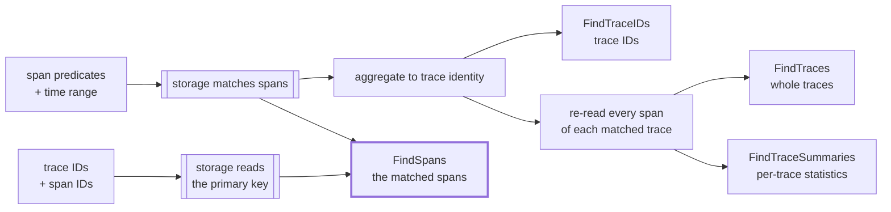

# RFC 0016: Span Search — Returning Matching Spans Instead of Traces

- **Status:** Draft
- **Author:** Yuri Shkuro
- **Created:** 2026-08-18
- **Last Updated:** 2026-08-18
- **Related:** [RFC 0005 (structured query filters)](0005-structured-query-filters.md) · [RFC 0011 (trace summary API)](0011-trace-summary-api.md) · [RFC 0014 (search result pagination)](0014-search-result-pagination.md) · [RFC 0001 (GenAI data layer)](0001-genai-data-layer.md) · [ADR-010](../adr/010-trace-summary-api.md) · [ADR-013 (storage capability declaration)](../adr/013-storage-capability-declaration.md)

---

## Abstract

Every trace search in Jaeger is already a span search. The api_v3 contract says so — "Fields are matched against individual spans, not the trace level" — and each backend implements it that way: it finds the spans that match, then throws away which spans those were and answers with trace identity. This RFC proposes **`FindSpans`**, a search that keeps them. Its request is a time range, [RFC 0005](0005-structured-query-filters.md)'s filter, and a page cursor — nothing else. A caller that already holds a span's identity is served by the same filter rather than by a second mechanism, because trace ID and span ID are intrinsic span fields: naming a span is comparing two of its fields. That needs one additive extension to RFC 0005, which lists span-level `spanID` but puts `traceID` only at the link level.

The immediate consumer is a GenAI evaluation UI that shows one row per experiment and needs the entry span of each experiment's trace, not the trace. What it can ask depends on what the evaluation harness recorded: a harness that stored the entry span's ID names the span, while one that stored only the trace ID searches within the trace for whatever attribute marks it. Both are filters over the same fields, so the API does not distinguish them — but backends do, and §9 sets out which storage structure each shape lands on.

The request carries no legacy scalar predicate fields either: this is a new surface with no callers to stay compatible with, so it starts with one filtering model rather than two. The response is the matching spans in OTLP, paginated by the keyset cursor of [RFC 0014](0014-search-result-pagination.md), in an envelope — which no existing RPC that returns spans has, and §4.4 shows what that already costs. The design also settles the shape of the request so that the result-shaping and aggregation tiers [RFC 0005 §4](0005-structured-query-filters.md#4-composition--the-query-complexity-continuum) deferred — a `SELECT` list and a `GROUP BY` over spans — can be added later over the same request message rather than as a second query model. Neither is built here.

---

## 1. Motivation

### 1.1 The requirement: one span per row, not one trace per row

A GenAI evaluation UI lists experiments, one row each, and each row carries the trace ID of the run it came from. What the row needs to display is the *entry span of the GenAI work* — the local root of the subtree where the model calls begin — with its attributes: the prompt version, the model name, the token counts, the evaluator scores. It does not need the rest of the trace, which for an agentic run can be thousands of spans and megabytes of payload. [RFC 0001 §10](0001-genai-data-layer.md) names that size problem directly when it discusses running evaluators inside Jaeger, and it correlates evaluation records to traces through attributes on the root span, then hands the evaluator the whole trace to traverse.

**The requirement arrives in two strengths, depending on what the producer recorded.** An evaluation harness that stored only the trace ID leaves the UI to search the trace for the entry span, by whatever attribute marks it. A harness that stored the span ID alongside the trace ID — which it can, since it is the code that started that span — lets the UI name the span outright. Naming it is the strictly easier question, it is worth steering a harness toward, and §9 shows it lands on storage that answers it far more directly. Neither replaces the other: a caller cannot always control the producer, and a search over marked spans is what answers "every LLM call in this experiment" rather than one span per run.

Neither existing endpoint answers either strength. `FindTraces` returns complete traces, which is the payload the UI is trying not to fetch. `FindTraceSummaries` ([RFC 0011](0011-trace-summary-api.md)) returns a fixed set of per-trace statistics — root service, span count, error count — and a summary is not a span: it carries none of the attributes the row displays, and its "root" is the trace's root, not the root of the GenAI subtree inside it. `GetTraces` takes the trace IDs the UI already has, but it too returns whole traces.

Jaeger already works around this internally, and it works around the *retrieval* case specifically. The MCP `get_span_details` tool takes a trace ID and a list of span IDs, calls `querysvc.GetTraces` for the whole trace, and picks the requested spans out of it in memory ([`handlers/get_span_details.go:69`](../../cmd/jaeger/internal/extension/jaegerquery/internal/mcptools/internal/handlers/get_span_details.go)). Its input schema even recommends asking for no more than twenty spans, which is a limit on the client's patience with the payload rather than on anything the storage cares about. The tool defines its own `SpanDetail` JSON type to return the result. So the need for "these spans, not their traces" is established inside the codebase; what is missing is a way to ask storage for it.

### 1.2 The search is already a span search

`TraceQueryParameters` in api_v3 is explicit about its own semantics:

> All fields form a conjunction … Fields are matched against individual spans, not the trace level. The results include traces with at least one matching span.

The predicates are span predicates. Only the *result* is aggregated up to trace identity, and each backend does that aggregation differently:

- **Elasticsearch/OpenSearch** runs the span query with `Size: 0` — asking for no documents at all — and reads the trace IDs out of a `terms` aggregation on the `traceID` field, ordered by the maximum `startTime` per bucket ([`core/reader.go:402`](../../internal/storage/v2/elasticsearch/tracestore/core/reader.go)). `FindTraces` then calls `FindTraceIDs` and re-reads the full traces by ID through `multiRead` ([`core/reader.go:257`](../../internal/storage/v2/elasticsearch/tracestore/core/reader.go)). The matching spans are found by the search and deliberately discarded before they cross the wire.
- **ClickHouse** builds `SELECT DISTINCT s.trace_id FROM spans s WHERE …` and, for `FindTraces`, wraps it as `WHERE s.trace_id IN (…)` around the span projection it already has ([`query_builder.go:116`](../../internal/storage/v2/clickhouse/tracestore/query_builder.go), [`sql/queries.go:214`](../../internal/storage/v2/clickhouse/sql/queries.go)). The `DISTINCT` is the aggregation.
- **Cassandra** intersects per-index sets of trace IDs, and its v1 reader returns `[]dbmodel.TraceID`. That is a property of the reader rather than of the schema: `tag_index` is keyed `((service_name, tag_key, tag_value), start_time, trace_id, span_id)` and so already records which span carried the tag, while `duration_index` and the two service indices stop at the trace ([`v004-go-tmpl.cql.tmpl`](../../internal/storage/v1/cassandra/schema/v004-go-tmpl.cql.tmpl)). So the span identity survives for a tag predicate and is discarded by the code, and does not exist for the others.
- **Badger** intersects index seeks whose keys end at the trace ID for every one of its four secondary indices ([ADR-005](../adr/005-badger-storage-record-layouts.md)). Here the span identity genuinely is not recorded.

So on the two backends that motivate this work, returning matching spans is not new machinery. It is the removal of a step. On ES/OS it means asking for the documents the query already matched instead of asking for none of them, which also drops the `terms` aggregation whose cross-shard approximation [RFC 0014 §1.2](0014-search-result-pagination.md) identifies as a correctness problem in its own right.



### 1.3 Retrieving spans is the shape analytics wants

A span search resembles a SQL query over a span table far more than a trace search does: a `WHERE` clause, a row per span, a limit, a cursor. Once results are spans rather than traces, the clauses that [RFC 0005 §4](0005-structured-query-filters.md#4-composition--the-query-complexity-continuum) ranked as tiers L3 and L4 — a projection list, and grouping with aggregates — become natural extensions of the same request instead of a separate query language. RFC 0005 deferred them for two reasons, and one of them was that "result shaping … is awkward against Jaeger's whole-trace result model". A span result model removes that awkwardness.

This RFC does not build them. It settles where they would attach, so that adding them later is a clause on an existing message rather than a second query API alongside this one. [RFC 0001 §7.2](0001-genai-data-layer.md) is where that matters: it rejected storing evaluation results as span attributes partly because "cross-sample aggregation and experiment comparison [is] impractical — each query would require a full span scan". A grouped aggregate pushed into ClickHouse is exactly the operation that assumption rules out, so the analytics tier changes that trade-off rather than merely adding a convenience.

---

## 2. Goals and non-goals

### Goals

- **G1 — Return matching spans.** A search whose result is the spans that satisfied the query, in OTLP, each with the resource and scope it was recorded under.
- **G2 — One query model, no second mechanism.** Everything a caller can ask is [RFC 0005](0005-structured-query-filters.md)'s filter: an attribute predicate, a duration bound, and a span's own identity alike. For a new surface that also means no legacy scalar predicate fields. Naming a span requires one additive extension to RFC 0005's field vocabulary (§4.3).
- **G3 — Paginate.** Spans are the unit a keyset cursor is natural over, so the search is paginated from the start, using [RFC 0014](0014-search-result-pagination.md)'s opaque page token.
- **G4 — Honest degradation.** A backend that cannot serve a query declares that through [ADR-013](../adr/013-storage-capability-declaration.md) and the query service refuses it, rather than the backend answering a different question.
- **G5 — Provision for result shaping and aggregation.** The request must be able to grow a `SELECT` list and a `GROUP BY` without a breaking change. Neither is delivered here.
- **G6 — Additive.** Nothing about `FindTraces`, `FindTraceIDs`, or `FindTraceSummaries` changes.

### Non-goals

- **Defining what a local root is.** Jaeger has no concept of a subtree root, and this RFC does not add one. The caller either recorded its entry span's ID or identifies it with its own attribute predicate (§8).
- **Structural predicates.** Ancestor, descendant, parent and sibling navigation is [RFC 0005](0005-structured-query-filters.md) tier L5 and stays out of scope. A local root cannot be *derived* by this API, only recorded by the producer or matched by a predicate.
- **Projection and aggregation themselves.** §5 reserves room for them and states what a later RFC has to define; it does not define it.
- **Metrics over spans.** Rate and quantile over time belong to the metrics/SPM subsystem, as RFC 0005 §4 concluded.
- **Trace-scoped enrichment of span results.** The query-time adjusters do not run on a span result set, and §7 explains why that is a design decision rather than a gap.
- **A new storage schema.** Every backend that can serve a span query can serve it from what it stores today.

---

## 3. What a span result is

**The container is OTLP, and OTLP is already a span container rather than a trace container.** `opentelemetry.proto.trace.v1.TracesData` is a list of `ResourceSpans`, each holding `ScopeSpans`, each holding spans. Nothing in it requires the spans to belong to one trace; Jaeger's own `tracestore.Reader` contract is what imposes that, and it imposes it per method — "A single `ptrace.Traces` chunk MUST NOT contain spans from multiple traces" is a rule stated for `GetTraces` and `FindTraces` ([`reader.go:26`](../../internal/storage/v2/api/tracestore/reader.go)). A span search does not inherit that rule: one response chunk holds spans from as many traces as matched.

**The resource and scope must travel with the span.** A bare span is not usable on its own: the service name lives in the resource attributes, and the instrumentation scope carries the library that produced it. So the response groups spans under the resource and scope they were recorded with, which is what the OTLP envelope is for, and what every backend already reconstructs per span document when it assembles a trace. Grouping several spans that share a resource under one `ResourceSpans` is an encoding optimization, not a requirement.

**A span identifies itself.** Trace ID and span ID are fields of the span, so a caller that asked about a set of traces groups the results by trace ID without any extra plumbing, and a caller that wants the enclosing trace passes the ID to `GetTrace`. No response-side index from query row to trace is needed.

**The result set is ordered, and the order is part of the contract**, because pagination depends on it (§6).

**The result is unbounded in a way a trace result is not.** `search_depth` caps traces; a span search over the same predicates can match every span of every one of those traces. A single trace-scoped lookup on an agentic run can match thousands of spans. So the page size is the only bound, and the server caps it (§6).

---

## 4. The API

### 4.1 A new RPC, not a flag on an existing one

Five ways to deliver span results were considered.

- **O1 — A new `FindSpans` RPC** returning OTLP spans.
- **O2 — Leave it to the caller:** `GetTraces` and filter client-side. This is the status quo, and what MCP `get_span_details` does today.
- **O3 — A flag on `FindTraces`** (`matching_spans_only`) that suppresses the re-read and returns only the spans that matched.
- **O4 — Extend `TraceSummary`** with a representative span per trace.
- **O5 — A general tabular query RPC** that returns rows, with a span being a row of columns.

| Criterion | O1 new RPC | O2 client-side | O3 flag on `FindTraces` | O4 summary field | O5 tabular RPC |
|---|:-:|:-:|:-:|:-:|:-:|
| Payload for the evaluation UI | 🟢 | 🔴 | 🟢 | 🟡¹ | 🟢 |
| Keeps full OTLP span fidelity | 🟢 | 🟢 | 🟢 | 🔴¹ | 🔴² |
| Result type says what it is | 🟢 | 🟢 | 🔴³ | 🟡 | 🟢 |
| Serves a query naming spans by identity | 🟢 | 🟡⁴ | 🔴⁵ | 🔴 | 🟢 |
| Fits a keyset cursor | 🟢 | 🔴⁶ | 🟡⁷ | 🟡⁷ | 🟢 |
| Grows into `SELECT`/`GROUP BY` | 🟢 | 🔴 | 🔴⁸ | 🔴 | 🟢 |
| Elasticsearch/OpenSearch | 🟢⁹ | 🟢 | 🟢⁹ | 🟡 | 🟡² |
| ClickHouse | 🟢⁹ | 🟢 | 🟢⁹ | 🟡 | 🟢 |
| Cassandra / Badger | 🟡¹⁰ | 🟢 | 🔴¹¹ | 🔴 | 🔴¹¹ |
| API surface cost | 🟡 | 🟢 | 🟢 | 🟡 | 🔴² |
| Consumer cost (UI, MCP) | 🟢 | 🟢 | 🟡³ | 🟡 | 🔴¹² |

Legend: 🟢 good · 🟡 partial · 🔴 poor

¹ one representative span per trace answers the evaluation row and nothing else, and `TraceSummary` is a flat statistics message, so carrying a span in it means either a second span encoding or a link back to `GetTrace`. ² a row result needs a typed value encoding and column metadata that Jaeger does not have, and it cannot represent a span's events and links without inventing a nesting model; on ES/OS it also collides with the metrics subsystem, as RFC 0005 §4 footnote 2 notes. ³ `FindTraces` answers `stream TracesData`, so a flag changes what the same type means at runtime with nothing in the type system to say which it is. This is the reason [RFC 0011](0011-trace-summary-api.md) rejected `summary=true` on `FindTraces` and made `FindTraceSummaries` a separate RPC; the reasoning has not changed. ⁴ correct but at whole-trace cost, which is the workaround `get_span_details` implements today. ⁵ a trace search cannot answer with the one span the caller named, whatever the predicate says. ⁶ the client would page traces and filter spans, so a page of results has an unpredictable number of rows and can be empty. ⁷ the token would have to mean "the next page of traces", not of spans, which is the wrong unit for a span result. ⁸ a projection or a grouping clause on `TraceQueryParameters` is meaningless for `FindTraces`, which is the RPC that message exists for. ⁹ the removal of a step, not new machinery — §1.2. ¹⁰ a query naming spans by identity is serviceable on both, and on Cassandra it is a native point read, while general predicate search is partial on Cassandra and unavailable on Badger (§9) — which is why neither declares the capability initially even though both could serve the shape that matters most. ¹¹ every option that returns predicate-matched spans from storage is refused there. ¹² every consumer would need a row decoder, and the UI and MCP already speak OTLP spans.

**Decision — O1.** `FindSpans` is a first-class RPC whose response type is spans, for the same reason `FindTraceSummaries` is one: the result shape belongs in the type system, not in a flag. O2 stays available and stays correct — it is the fallback a caller can always implement — but it is what the requirement exists to avoid. O5 is not rejected so much as postponed: §5 keeps a place for a row result, and §4.4 puts it in a sibling RPC over the same request message rather than in a competing API.

### 4.2 The name

Jaeger's reader vocabulary splits on how the caller names what it wants: `GetTrace` and `GetTraces` take IDs, while `FindTraces`, `FindTraceIDs` and `FindTraceSummaries` take a query. This method takes both, so neither prefix obviously applies, and two other names suggest themselves from the analytics direction of §5.

| Criterion | `FindSpans` | `GetSpans` | `SelectSpans` | `QuerySpans` | `SearchSpans` |
|---|:-:|:-:|:-:|:-:|:-:|
| Fits the existing `Get*`/`Find*` vocabulary | 🟢 | 🟢 | 🔴 | 🔴 | 🟡 |
| Accurate for the predicate pattern | 🟢 | 🔴 | 🟢 | 🟢 | 🟢 |
| Accurate for a query naming spans | 🟢¹ | 🟢 | 🟢 | 🟢 | 🔴² |
| Free of clause confusion | 🟢 | 🟢 | 🔴³ | 🟢 | 🟢 |
| Names the result this RPC returns | 🟢⁴ | 🟢⁴ | 🟡⁵ | 🔴⁶ | 🟢⁴ |
| Reads well on both services | 🟢 | 🟢 | 🟢 | 🟡⁷ | 🟢 |

Legend: 🟢 good · 🟡 partial · 🔴 poor

¹ because naming a span is a predicate: `span.traceID` and `span.spanID` are intrinsic span fields in RFC 0005's vocabulary, so a caller holding an identity is comparing two of the span's own fields (§4.3). It is a search whose predicate happens to be exact, which makes `Find` accurate rather than merely tolerable. ² "search" reads as scanning for unknowns, which is the opposite of naming a span you already hold. ³ `SELECT` is SQL's *projection* clause, and §5 reserves a `projection` field on this very message, so `SelectSpans` would name the method after a clause it also contains — and after the one clause it does not yet implement. ⁴ this RPC returns spans and only spans (§4.4), so a name promising spans is accurate rather than provisional. ⁵ accurate about the result, but §5.2 shows a projection is *also* what turns a span into something that is no longer one, so the word cuts both ways. ⁶ "query spans" names the subject rather than the result, which is the right choice for an RPC whose response shape varies — and the wrong one for an RPC whose response shape does not, since it says less than it could. ⁷ `QueryService.QuerySpans` stutters, though `TraceReader.QuerySpans` does not.

**Decision — `FindSpans`.** The name and the response shape are one decision, not two, and §4.4 settles it: this RPC returns spans, and a query that groups or computes goes to a separate aggregate RPC sharing the same request message. `QuerySpans` would be the right name for the other choice — an RPC whose response shape is decided by the request — and its only advantage disappears once that choice is not taken. What remains favors `FindSpans` on every axis: it stays inside the vocabulary the four sibling methods established, and it says what the response holds.

A caller naming a span is not a concession to the prefix either. It is asking Jaeger to find the span whose two intrinsic fields equal these values, which is a search with an exact predicate — the same operation the rest of the RPC performs, with a narrower filter.

### 4.3 The request

The span query is a new message rather than a reuse of `TraceQueryParameters`. Three of that message's fields do not carry over: `search_depth` counts traces, `raw_traces` selects between adjusted and stored traces where a span result is always as stored (§7), and its documented contract sentence — "The results include traces with at least one matching span" — is a statement about trace results. More importantly, the clauses §5 reserves are span-query clauses: a projection or a grouping on the message that `FindTraces` uses would be a field with no meaning for the RPC that message exists to serve.

**It also does not carry the legacy scalar predicate fields.** `service_name`, `operation_name`, `attributes`, `duration_min` and `duration_max` exist on `TraceQueryParameters` because callers depend on them. `FindSpans` has no callers, so putting them here would import RFC 0005 §7's mutual-exclusion rule and its two-way conversion into a surface that never needed either, and would leave the project maintaining two filtering models on a message that could have started with one. So the predicates are the `filter` and nothing else, which makes this the first Jaeger query surface with a single filtering model.

**And it carries no span selector.** Everything a caller wants to say about which spans it means is a predicate, including a span's own identity, so the message is a time range, a filter and a cursor.

```protobuf
// Query parameters to find spans. Field numbers are illustrative.
//
// Predicates are matched against individual spans, which is the same evaluation
// the trace search performs — what differs is that the matching spans are the
// result rather than an intermediate step toward trace identity.
message SpanQueryParameters {
  // The time range, as on TraceQueryParameters. Required — see below.
  google.protobuf.Timestamp start_time_min = 1;
  google.protobuf.Timestamp start_time_max = 2;

  // The predicates (RFC 0005): a single boolean-valued Call.
  jaeger.query.expression.v1.Call filter = 3;

  // The page size and cursor (RFC 0014). There is no search_depth: a span search
  // is bounded by its page size, and the server caps that.
  Pagination pagination = 4;

  // 5 to 15 are reserved for the result-shaping and aggregation clauses of
  // RFC 0016 §5: projection, group_by, having, order_by.
}

message FindSpansRequest {
  SpanQueryParameters query = 1;
}
```

**Naming a span is a predicate over its intrinsic fields.** Trace ID and span ID are values the data model defines directly, so they are built-in field references in RFC 0005's sense, and a caller that holds a span's identity compares them:

```json
{ "op": "or", "args": [
  { "call": { "op": "and", "args": [
      { "call": { "op": "eq", "args": [
          { "field": { "name": "traceID", "level": "span" } },
          { "scalar": { "value": "4bf92f3577b34da6a3ce929d0e0e4736" } } ] } },
      { "call": { "op": "eq", "args": [
          { "field": { "name": "spanID", "level": "span" } },
          { "scalar": { "value": "00f067aa0ba902b7" } } ] } } ] } } ] }
```

This needs **one additive extension to RFC 0005**: [§5.2](0005-structured-query-filters.md#52-built-in-fields) enumerates `spanID` at the span level but puts `traceID` only at the link level, where it means the *linked* trace. Span-level `traceID` joins the enumeration, which is the additive change that section provides for, and it is the only vocabulary change this RFC asks for.

Three consequences follow, and they are the price of one query model rather than two.

*The exact question needs `or`.* A set of `(trace, span)` pairs is a disjunction of conjunctions, as above. The tempting flattening — `and(traceID in […], spanID in […])` — is a cross product, asking whether *some* named span ID appears in *some* named trace, which is not what the caller means even if a collision is unlikely. A caller that wants every span of some traces needs only `traceID in […]`, which is a conjunction and therefore cheaper to serve.

*It is verbose.* Fifty rows are a fifty-arm `or` over two-arm `and`s. That is the AST's known cost, which RFC 0005 §6.2 accepts on the grounds that humans are not expected to author it by hand; a UI generating it does not care, and the shorthand parser is where a compact spelling would go if one is wanted.

*A backend has to recognize the shape to serve it well.* Given trace and span IDs, every backend can read its primary span storage — a partition, a key prefix, a bloom-filtered granule — which is a different and far cheaper plan than an index search (§9). Nothing in a boolean tree announces that, so the query builder has to match the pattern, and RFC 0005's capability declaration has to be able to say "this shape, though not `or` in general" — which today it cannot, since it declares whole operators. §9 records this as the second of two places where that granularity is too coarse, and §13 keeps it out of the initial delivery.

**The time range stays required**, because ES/OS selects which indices to read from it and ClickHouse prunes partitions with it — its `spans` table is `PARTITION BY toDate(start_time)` with a bloom-filter skip index on `trace_id`, so without a range a trace-ID predicate scans every partition. A caller that knows only trace IDs supplies a range wide enough to contain them. Dropping the selector also drops the per-trace time hints that `GetTraceParams` carries for backends that read a trace faster knowing roughly when it happened; the overall range is what remains, and Q3 in §14 asks whether a backend that needs no range should be able to say so.

### 4.4 The response, and why it is an envelope

**No RPC that returns spans has a response envelope, in either protocol.** `GetTrace` and `FindTraces` in api_v3 and `GetTraces` and `FindTraces` in `jaeger.storage.v2` all stream bare `opentelemetry.proto.trace.v1.TracesData`, while every RPC returning a Jaeger-defined type has an envelope — `GetServicesResponse`, `FindTraceIDsResponse`, `FindTraceSummariesResponse`. The dividing line is not what the response needs to say; it is whether the payload is an OTLP type. Reusing OTLP's own top-level message meant taking its shape, and that message belongs to OpenTelemetry, so Jaeger cannot add a field to it.

That is a limitation rather than a decision, and it already costs something. A trace truncated at `MaxTraceSize` is a fact about the *response*, and `markTraceTruncated` reports it by writing a warning attribute onto the trace's first span and returning after one span ([`aggregator.go:159`](../../internal/jptrace/aggregator.go)) — response metadata smuggled into the payload because there is nowhere else to put it. `AddWarnings`' own comment notes the attribute may round-trip through a storage backend and come back as a plain string, so the signal is not reliably distinguishable from stored span data. It is also why [RFC 0014 §4](0014-search-result-pagination.md) attaches pagination to `FindTraceIDs` and `FindTraceSummaries` and gives `FindTraces` no token: not because a trace search wants none, but because that response has no field to carry one.

Correcting it on the existing RPCs is a breaking change, since the streamed message type is part of the method signature, so this RFC does not propose it (§13 records it). What this RFC can do cheaply is not repeat it. A span search is paginated by construction, so it needs a response message of its own on day one, and that message is also where response-level warnings belong.

| Criterion | R1 bare `stream TracesData` | R2 envelope, `oneof` with one arm | R3 always tabular rows | R4 envelope, spans only; aggregates get their own RPC |
|---|:-:|:-:|:-:|:-:|
| The page token has a home | 🔴 | 🟢 | 🟢 | 🟢 |
| Full OTLP span fidelity | 🟢 | 🟢 | 🔴 | 🟢 |
| Room for aggregate results later | 🔴¹ | 🟢 | 🟢 | 🟢² |
| Caller knows which result it gets | 🟢 | 🟢 | 🟢 | 🟢 |
| Response type is what it says | 🟢 | 🟡³ | 🟢 | 🟢 |
| One query model, not two | 🟢 | 🟢 | 🟢 | 🟢² |

Legend: 🟢 good · 🟡 partial · 🔴 poor

¹ moving an existing top-level field into a new `oneof` keeps wire compatibility but changes the generated Go accessors, so it breaks every compiled consumer. ² a second RPC does not mean a second query model, because the two share one request message — which is what Jaeger already does: `FindTraces`, `FindTraceIDs` and `FindTraceSummaries` are three RPCs over one `TraceQueryParameters`, differing only in response type. ³ a `oneof` whose arm is decided by the request is a runtime discriminator for a distinction the RPC signature could have made statically, and it reads oddly while it has one arm.

**Decision — R4.** The envelope earns its place on its own, for the page token and for response-level warnings that today are written onto spans. What it does not need is the `oneof`: Jaeger's existing answer to "one query, several result shapes" is several RPCs sharing one request message, and that answer applies here unchanged. So `FindSpansResponse` carries spans, and a later aggregate RPC takes the same `SpanQueryParameters` with its grouping clauses set and returns rows. Each RPC then honors the clause subset it can shape and refuses the rest, and the boundary falls exactly where §5.2 finds it: a reference-only projection is still spans, while grouping and computed projections are not.

This replaces the reserved response arm with a reserved *RPC*, which is the better trade in three ways. The response type stops depending on a request field. The single-arm `oneof` disappears. And the method name stays true — a `FindSpans` that could return aggregate rows would be misnamed, which is the one criterion §4.2 could not settle from the name alone.

```protobuf
message FindSpansResponse {
  // The matching spans. A query that groups or computes does not return spans and
  // so does not belong on this RPC; it belongs on the aggregate RPC of RFC 0016
  // §5, which takes the same SpanQueryParameters and returns rows.
  opentelemetry.proto.trace.v1.TracesData spans = 1;

  // 2 is reserved for response-level warnings, which today are written onto a
  // span for want of anywhere else (§4.4).

  // The cursor to send as the next request's page_token, or empty when this page
  // is the last one (RFC 0014 §4). It is meaningful only on the page's final
  // chunk: a client reads it from the last chunk of the stream and ignores the
  // field on the earlier chunks, which leave it unset.
  string next_page_token = 3;
}
```

The RPC streams the envelope, as `FindTraceSummaries` does, so a large page is delivered in chunks and the last chunk of the page carries the token:

```protobuf
rpc FindSpans(FindSpansRequest) returns (stream FindSpansResponse) {
  option (google.api.http) = { get: "/api/v3/spans" };
}
```

### 4.5 The internal storage interface

`FindSpans` goes on `tracestore.Reader` itself, not on an optional interface. [ADR-010](../adr/010-trace-summary-api.md) records why: `FindTraceSummaries` shipped as an optional `SummaryReader` and was moved onto `Reader` in [#9067](https://github.com/jaegertracing/jaeger/pull/9067) because an optional interface taxes every decorator, and a decorator that fails to forward it silently downgrades the backend. [ADR-013](../adr/013-storage-capability-declaration.md) makes the same argument for `SearchCapabilities`. A required method means the compiler enumerates the implementations that have to answer.

```go
// FindSpans returns an iterator over pages of spans matching the query.
//
// Unlike FindTraces, a yielded ptrace.Traces may hold spans from many traces:
// the result is a set of spans, not a set of traces. Spans are returned as
// stored, with no query-time adjustment (RFC 0016 §7).
//
// A reader that cannot serve span queries yields errors.ErrUnsupported (wrapped
// with %w) as the first error before any page; such readers embed
// UnsupportedSpanSearch.
FindSpans(ctx context.Context, query SpanQueryParams) iter.Seq2[SpanPage, error]

// SpanPage is one chunk of a page of span results. NextPageToken is meaningful
// only on the page's final chunk, where an empty value means this page is the
// last; the earlier chunks leave it unset, so a caller reads it from the last
// chunk the iterator yields.
type SpanPage struct {
    Spans         ptrace.Traces
    NextPageToken string
}

type SpanQueryParams struct {
    StartTimeMin time.Time
    StartTimeMax time.Time
    Filter       *expression.Call   // RFC 0005
    Pagination   Pagination         // RFC 0014
}
```

`SpanPage` mirrors RFC 0014's `TraceIDPage` rather than inventing a second way to carry a cursor. The ownership rule in the `Reader` doc comment applies unchanged: the caller owns each yielded `ptrace.Traces`, so a reader that holds its own copy of the data yields a deep copy.

**One capability, because the query is one shape as far as the API is concerned.**

```go
type SearchCapabilities struct {
    WithoutServiceName bool   // ADR-013
    Paginated          bool   // RFC 0014
    SpanSearch         bool   // RFC 0016: FindSpans returns spans rather than ErrUnsupported
}
```

A single boolean is coarse, and §9 is where that shows: Cassandra and Badger can serve an identity predicate from their primary span storage while serving no general predicate search, and Cassandra can serve a tag-only conjunction at span granularity through `tag_index`. Declaring those needs a capability that describes predicate *shapes*, which is finer than ADR-013's per-backend granularity and finer than RFC 0005's per-level and per-operator `FilterCapabilities`. That extension is worth having and is not this RFC's to design, so `SpanSearch` is the whole declaration here and the backends that need the finer answer declare `false` (§13).

The query service enforces it before dispatch, in the one place ADR-013 put enforcement, and maps a refusal to `InvalidArgument` and HTTP 400. `UnsupportedSpanSearch` is the compile-time counterpart and the backstop, as `UnsupportedTraceSummaries` is for summaries: a reader that declares `false` still needs the method to exist, and a reader reached without the capability check still must not answer a narrower question.

The remote-storage protocol gets the matching `FindSpans` RPC on `jaeger.storage.v2.TraceReader` and the matching `span_search` field on `SearchCapabilities` in `capabilities.proto`. A plugin that predates either reads as least capable — its `Capabilities` service is absent, so ADR-013's client maps that to `ErrUnsupported` — and the query service therefore never sends it a span query.

### 4.6 The query service and the HTTP surface

`querysvc.QueryService` gains `FindSpans`, and it is a thinner path than `FindTraces`: validate the query, check the capability, dispatch, and pass the pages through. There is no aggregation step and no adjuster step (§7). This is also the first search the query service exposes whose storage counterpart is paginated, so it is where RFC 0014's token handling lands for real; `FindTraceIDs` has no query-service method today, which RFC 0014 has to add for its own milestones.

The HTTP route is `GET /api/v3/spans`, alongside `/api/v3/traces` and `/api/v3/trace-summaries`, with `query.filter` as RFC 0005 defines it and RFC 0014's page-size and page-token parameters. A filter naming many spans is long for a URL, so the `POST` binding the gRPC-gateway wrapper already provides for `FindTraces` matters more here than it does there. As with the other endpoints, the HTTP handler buffers a page through `jiter.FlattenWithErrors` while gRPC streams it; a page is a bounded unit, which is what makes buffering acceptable here.

---

## 5. Provisioning for `SELECT` and `GROUP BY`

RFC 0005 built the `WHERE` clause and mapped what lies beyond it: L3 result shaping, L4 aggregation, L5 structural navigation. This section states where L3 and L4 would attach to a span query, so that building them later does not require a second query model. It builds neither.

### 5.1 The clauses of a span query

| SQL | Span query | Status |
|---|---|---|
| `FROM` | implicit: every span in the time range | delivered |
| `WHERE` | `filter`, an RFC 0005 `Call` | delivered |
| `SELECT` | `projection`: a list of expressions with optional aliases | reserved (§4.3 field 6+) — reference-only on `FindSpans`, computed on the aggregate RPC (§5.2) |
| `GROUP BY` | `group_by`: a list of expressions | reserved — aggregate RPC only |
| `HAVING` | `having`: a `Call` over aggregates | reserved — aggregate RPC only |
| `ORDER BY` | `order_by`: expressions with a direction | partly delivered — a fixed sort order the cursor depends on (§6); a caller-chosen order is reserved |
| `LIMIT` / cursor | `pagination.page_size` and `pagination.page_token` | delivered |

Every reserved clause is a list of `Expression`s, which is the term RFC 0005 §6.1 designed to be reusable: "the expression is the one reusable term a future projection, grouping, or named function would operate on". Aggregate functions need no new message either — `count`, `sum`, `avg`, `min`, `max` and `quantile` are further `op` values on the same `Call` node, which is the extension path RFC 0005 §6.1 reserves for named functions.

### 5.2 Only aggregation needs a new result shape, and that is the RPC boundary

The important finding is that L3 and L4 do not need the same thing from the response.

**A projection over plain references still returns spans.** If every projected expression is an attribute or a built-in field, the result is a *sparse span*: the same span with only the requested fields populated. That is what TraceQL's `select()` returns, it needs no new result type, and it delivers most of what a projection is for — the evaluation UI asking for four attributes out of a span carrying two hundred. What a span cannot carry is a *computed* projection, because OTLP has no field for the value of `duration / 1000` or `json_extract(input, "model")`.

**Grouping always needs rows.** A group with a count is not a span, and no arrangement of `ResourceSpans` represents one. So L4 needs a row result, and a later RFC that adds `group_by` has to define three things this one does not: a typed value encoding for a cell, column metadata naming and typing each output column, and the aggregate `op` vocabulary. Paging over grouped results is a separate question again, and usually a non-question — a grouped result is small by construction, and the honest answer is likely to be a cap and a refusal rather than a cursor.

**So the clause split is also the RPC split** (§4.4). `FindSpans` honors the clauses whose result is still spans — `WHERE`, a reference-only `SELECT`, the ordering and the cursor — and refuses `group_by` and a computed projection with `InvalidArgument`. A future aggregate RPC takes the same `SpanQueryParameters`, honors all of them, and returns rows. Both read one query model; what differs is the shape each can express its answer in, and that is a property of the RPC rather than of a field inside the response.

### 5.3 What is not provisioned

Joins between spans, cross-trace correlation, structural predicates over the trace tree (RFC 0005 tier L5), and time-bucketed metrics all stay outside this shape. The first three need an execution model that assembles more than one span at a time, which is the reason RFC 0005 deferred L5 rather than judging it infeasible. The last belongs to the metrics/SPM subsystem, as RFC 0005 §4 concluded, and a span-analytics clause that grew a `rate()` would be duplicating it.

The analytics tier will also be a per-backend capability, like everything else here. ClickHouse can push a grouped aggregate down natively and is the reason to design for this at all. ES/OS has aggregations, and RFC 0005 §4 already flags that they overlap the metrics path. Cassandra and Badger cannot serve the predicate half of the span search at full fidelity (§9), so they will not serve grouping over it either.

---

## 6. Ordering and pagination

**The sort key is `(startTime desc, traceID asc, spanID asc)`.** RFC 0014 sorts traces by `(startTime desc, traceID asc)`, where the trace's `startTime` is the maximum among its matching spans — a definition that exists only because a trace has no single start time. A span has one, so the span key needs no such reconciliation, and the two ID components are the tie-breaker that makes the key unique. Neither ID alone suffices: span IDs are not unique across traces, and a client and server span in the same trace can legitimately share one, which is what `DeduplicateClientServerSpanIDs` exists to repair. Genuine duplicates — the same span written twice, which `DeduplicateSpans` exists for because ES archival produces them — collide on all three components and are returned twice rather than skipped, which is benign and worth documenting.

**The cursor is already implemented on ES/OS.** `buildTraceReadRequest` sets `SearchAfter = []any{cursor.startTime, cursor.spanID}` to page the spans of one oversized trace ([`core/reader.go:170`](../../internal/storage/v2/elasticsearch/tracestore/core/reader.go)). A span search is that same `search_after`, over the result set instead of within one trace, with the trace ID added to the key. This is the piece of RFC 0014's ES design that does not need the field collapse: RFC 0014 collapses on `traceID` because it wants one row per trace, and a span search wants the rows themselves. The two milestones build the same query and differ by one clause.

**The token is RFC 0014's token.** Opaque, base64 over a proto carrying the cursor, a fingerprint of the query, a backend tag and a version; a token presented against a different query is refused with `InvalidArgument`. Reusing it rather than defining a span-specific cursor is the point — one token format, one place that encodes and validates it.

**A filter that names its spans is self-bounding,** since it can match at most one span per `(traceID, spanID)` pair, so such a query normally completes in one page with an empty token. That is a property of the predicate rather than a mode of the API: the page size still applies, and what a caller needs in exchange is a bound on how large a filter may be, which is the same limit MCP's `get_span_details` states as advice today and should state as a rule.

**The forward-traversal guarantee is stronger here than for traces.** RFC 0014 accepts that a forward traversal may skip a trace, because a trace's max-keyed sort position rises as new spans arrive. A span's key never changes after it is written, so a span search skips nothing; a span written into an already-passed position is missed, which is the ordinary property of paging a time-ordered index backwards from now.

**The page size is capped by the server.** `search_depth` does not carry over (§4.3), so the page size is the only bound, and it needs a maximum for the same reason ClickHouse already rejects a `SearchDepth` above `MaxSearchDepth` and the query service already truncates oversized traces at `MaxTraceSize`.

**A backend that declares `Paginated=false`** serves one capped page with an empty token, and refuses a token with `InvalidArgument` — RFC 0014 §6.2's three-way degradation, unchanged.

---

## 7. Spans are returned as stored

The query service applies seven adjusters to a trace before returning it ([`adjuster/standard.go`](../../cmd/jaeger/internal/extension/jaegerquery/internal/adjuster/standard.go)), unless the caller asks for `raw_traces`. None of them runs on a span query result, for two independent reasons.

**Three of them need the complete trace.** The `Adjuster` contract says so: "The caller must ensure that all spans in the `ptrace.Traces` argument belong to the same trace and represent the complete trace" ([`adjuster.go:11`](../../cmd/jaeger/internal/extension/jaegerquery/internal/adjuster/adjuster.go)). `CorrectClockSkew` needs each span's parent to compute an offset, `DeduplicateClientServerSpanIDs` needs to see both members of a shared-ID pair, and `DeduplicateSpans` needs the whole set to know which copy to keep. A span result set is a partial set of spans from many traces, so these cannot run at all.

**The other four would make the result disagree with the query.** `MoveLibraryAttributes` moves `otel.library.name` from the span's attributes into the instrumentation scope; `NormalizeIPAttributes` rewrites a numeric IP attribute into a string. Both rewrite the attributes a predicate matched, so applying them would return a span that no longer satisfies the filter that selected it. For a trace result that is harmless, because the caller asked about the trace. For a span result it breaks the property that makes the result legible: **a returned span satisfies the query that returned it.**

So a span result is the span as stored, and there is no `raw_spans` flag because there is nothing to opt out of. One consequence is worth stating rather than discovering: for a trace where a client and server span share a span ID, `FindTraces` shows the span ID that `DeduplicateClientServerSpanIDs` rewrote and `FindSpans` shows the stored one, so the same span has two spellings depending on which endpoint a caller used. That also means a caller who reads a span ID out of a `FindTraces` result cannot always name that span in a `FindSpans` request. Whether that is worth an opt-in is Q2 in §14.

---

## 8. Identifying the local root

The motivating query asks for "the span where the GenAI portion of the trace starts". Jaeger has no such concept, and this RFC does not add one. There are four ways to get it, in descending order of preference.

**The producer records the span ID.** The code that starts the GenAI work knows the span it just started, so it can store that span ID next to the trace ID in the evaluation record. Then the UI names the span by its two intrinsic fields (§4.3), and no attribute convention is involved at all. This is the cheapest answer, the one that lands on storage every backend can reach directly, and the one to steer a harness toward. It is also a small addition to [RFC 0001](0001-genai-data-layer.md)'s data layer, which stores a trial's trace correlation today and would store a span ID beside it.

**The producer marks the span and the caller matches the marker.** Where the span ID was not recorded — a harness that cannot be changed, or spans marked by instrumentation rather than by the harness — the entry span carries an attribute the caller filters on, either a dedicated one or a distinguishing attribute the GenAI semantic conventions already put on entry spans. The query is then a conjunction of `span.traceID in […]` and the marker predicate. This is also what answers the questions that are searches rather than lookups: every LLM call in an experiment, or the entry spans of every run in the last hour.

**The query derives it structurally** — a span carrying attribute X whose parent does not carry X. That is a structural predicate, RFC 0005 tier L5, out of scope there and here. It is the only one of the four that answers the question for instrumentation that recorded and marked nothing.

**The caller derives it post-fetch,** by reading the trace and walking it. That is the payload cost the requirement exists to avoid.

Two properties of the batch query are the caller's to handle, and are worth stating so that a UI does not assume otherwise. Under the marker approach a trace may contain zero matching spans or several, so the mapping from a row to a span is not guaranteed one-to-one; the caller groups the result by trace ID and decides what to show for a trace with none or many. And a page boundary can fall inside a batch, so a caller that needs every row filled follows the token rather than assuming one page covers its request. An exact identity filter removes both properties, which is the third reason to prefer it.

---

## 9. Backends

The API asks one kind of question, but two filter shapes land on entirely different storage structures, so they are tabulated separately. A filter naming trace and span IDs reads the primary span storage. Any other predicate needs a secondary index that resolves to span granularity. This is the asymmetry a single `SpanSearch` boolean cannot express (§4.5).

**A filter naming trace and span IDs:**

| Backend | How | Verdict |
|---|---|:-:|
| **Cassandra** | `traces` is `PRIMARY KEY (trace_id, span_id, span_hash)` — partition by trace, clustered by span. A native point read, and the best any backend does on this operation | 🟢 |
| **Elasticsearch / OpenSearch** | `traceID` and `spanID` are indexed `keyword` fields, so an exact match on the pair is a cheap bool query. The `_id` is *prefixed* by `traceID_spanID_` but ends in a content hash of the document, so it cannot be reconstructed for an `mget` — as the writer's own comment notes, the composite key drives Cassandra's read path and an ES `_id` is not a read path | 🟢 |
| **memory** | a map lookup within the trace | 🟢 |
| **ClickHouse** | `spans` is `PARTITION BY toDate(start_time)`, `ORDER BY (service_name, name, start_time)`, with a `bloom_filter` skip index on `trace_id` and no index on the span-id column (`id`). So this is partition pruning plus granule skipping plus a filter, not a point read; the per-trace time hints and the `trace_id_timestamps` table are what make it cheap | 🟡 |
| **Badger** | the primary span key is `[0x80][traceID][startTime][spanID]`, so `startTime` precedes the span ID and a pair lookup is a prefix scan of the trace's keys with a filter, not a point get. Cheaper than today's path, which transfers the whole trace to the client, but it still reads the trace's keys | 🟡 |
| **gRPC remote** | forwards the call and the declaration | per backend |

**Searching spans by predicate:**

| Backend | How | Verdict |
|---|---|:-:|
| **Elasticsearch / OpenSearch** | the existing bool query from `buildFindTraceIDsQuery`, with `Size: page_size` instead of `Size: 0` and no `terms` aggregation. Strictly less work than today's trace-ID search, and it drops the aggregation's cross-shard approximation | 🟢 |
| **ClickHouse** | `SelectSpansQuery` with the predicates `buildFindTraceIDsQuery` already assembles, and without the `trace_id IN (…)` subquery — one round trip instead of a nested one. Its sort key is built for exactly this scan, and this is where `GROUP BY` (§5) would be native | 🟢 |
| **memory** | the linear scan already visits every span. Valuable out of proportion to its production use, because it unblocks the cross-backend conformance tests and the default distribution | 🟢 |
| **Cassandra** | partial, and more capable than the current reader suggests. `tag_index` is keyed `((service_name, tag_key, tag_value), start_time, trace_id, span_id)`, so a tag predicate resolves to `(trace_id, span_id)` pairs and the spans are then point-read from `traces`; intersecting two tag reads on those pairs is a same-span conjunction, which is stronger than the trace-granularity intersection it does today. But `duration_index` and the two service indices stop at the trace, so any query touching them degrades to trace granularity and the span identity is lost | 🟡 |
| **Badger** | not serviceable. All four secondary index keys end at the trace ID, so no span identity is recorded anywhere an index can return it | 🔴 |
| **gRPC remote** | forwards the call and the declaration | per backend |

**Two shapes on the flat backends are worth serving and cannot be declared yet.** Cassandra and Badger can both answer an identity filter from their primary span storage, and Cassandra can additionally answer a tag-only conjunction at span granularity through `tag_index`. Declaring either means saying "this predicate shape, though not `or` in general and not every operator" — finer than ADR-013's per-backend granularity and finer than RFC 0005's per-level, per-operator `FilterCapabilities`. Cassandra's case also bears on RFC 0005's `same_span_conjunction`, which it declares `false` today: a tag-only conjunction resolved through `tag_index` at `(trace_id, span_id)` granularity is same-span by construction.

That extension to the capability model is the load-bearing follow-up this RFC creates, and it is the cost of expressing identity as a predicate rather than as a request field: with a dedicated selector the query service could route on a field's presence, whereas a filter has to be classified by shape. Both readings agree that the shape is worth serving; only the mechanism for admitting it differs. The initial delivery declares `SpanSearch=false` on Cassandra and Badger (§13), so the requirement is served on ES/OS, ClickHouse and memory first.

A fallback for the 🔴 and 🟡 search cases is possible — read the candidate traces and re-evaluate the predicates against each span in memory, which is what MCP `get_span_details` does by hand today, and what [RFC 0011](0011-trace-summary-api.md)'s summary fallback does for its own shape. It would need an in-process evaluator for the RFC 0005 expression tree, which does not exist, and it would spend the storage read the requirement is trying to avoid while saving only the client hop. Refusing is honest and cheap; the fallback is listed as future work in §13.

---

## 10. Consumers

**The evaluation UI** is the requirement: one query per screen of rows, naming the spans it recorded, or scoped to the traces it recorded and filtered by the marker.

**MCP `get_span_details` becomes what its signature already claims.** Its input is a trace ID plus span IDs, and it currently satisfies it by fetching whole traces. Rewiring it onto `FindSpans` turns that into a filter naming those spans, which is cheap wherever the backend declares the capability and falls back to today's behavior elsewhere.

**MCP also gains a `find_spans` tool.** An agent investigating a trace can ask for "the LLM spans in these traces" or "the spans over two seconds in this service" in one call, where today it searches traces and then reads them.

**Evaluators reading their own traces.** [RFC 0001](0001-genai-data-layer.md) gives an introspective evaluator the full trace and notes the size problem for agentic runs. An evaluator that needs the entry span, or every LLM call span, asks for those instead.

**The Jaeger UI**, eventually, for a span-oriented result list. That is not part of this proposal; the API's first consumers reach it over api_v3 and MCP.

---

## 11. Compatibility

Everything here is additive. `FindTraces`, `FindTraceIDs` and `FindTraceSummaries` are untouched, `TraceQueryParameters` is untouched, and a caller that never sends `FindSpans` sees no change. The new interface method is the one non-additive piece: every `tracestore.Reader` implementation must supply it, at minimum by embedding `UnsupportedSpanSearch`, and every decorator must forward it — the same one-time cost `FindTraceSummaries` and `SearchCapabilities` each imposed, and the reason both are required methods rather than optional interfaces.

**All of it depends on RFC 0005.** Every query is a filter, so `FindSpans` inherits that RFC's AST, validation, `jaeger.query.structuredFilters` feature gate and capability rules wholesale rather than reproducing any of them, and it cannot ship before them. It also needs one additive extension to RFC 0005's vocabulary: `traceID` as a built-in field at the span level, which §5.2 there lists only at the link level.

That dependency is the price of one query model. A dedicated span selector would have let the motivating requirement ship first and independently, since naming a span needs no predicate language; expressing identity as a predicate instead buys a single filtering model and one spelling per question, and pays for it by putting the whole of this RFC behind RFC 0005's first two milestones and its feature gate.

**Pagination depends on RFC 0014**, and more tightly, because a span search is paginated from its first release rather than gaining pagination later. Both RFCs need the same two things: the `Pagination` message on the request, and the code that encodes, binds and validates the opaque token. Whichever milestone lands first introduces them and the second reuses them; what must not happen is a span-specific cursor beside a trace-specific one.

---

## 12. Considered alternatives

§4.1 and §4.4 hold the two structural decisions. Five narrower alternatives were rejected along the way.

**Carry the legacy scalar predicate fields on the span query** — `service_name`, `operation_name`, `attributes`, `duration_min`/`duration_max` — so that a search works before RFC 0005 lands. Rejected. Those fields exist on `TraceQueryParameters` because callers depend on them, and a new message has no callers to owe that to; including them would import RFC 0005 §7's mutual-exclusion rule and its two-way conversion permanently, to buy a transitional convenience.

**A dedicated span selector on the request** — a repeated message of a trace ID, span IDs and per-trace time hints, conjunctive with the filter. Rejected, though it wins on three counts worth recording, because a reader who knows the shape should see it was considered. It expresses the pair set exactly without `or`, so it reaches the flat backends under RFC 0005's existing capability rules where an `or` filter is refused. It announces the primary-key access path in a field the query builder reads first, rather than in a tree it has to classify. And it carries the per-trace time hints `GetTraceParams` already proves useful. What it costs is a second spelling for a question the filter can also ask, and RFC 0005 spent its §7 on exactly that problem for `service_name` against `resource.service` — a conversion in each direction, a mutual-exclusion rule, and two ways to say one thing on a surface that had the chance to have one. The three advantages are real but each is a matter of mechanism: the first two ask the capability model to describe predicate shapes (§9), which it should be able to do regardless, and the third is an optimization the overall time range covers.

**A separate `GetSpans` method** for identity, paralleling `GetTraces` against `FindTraces`. Rejected for the same reason as the selector, more strongly: identity is a predicate over `span.traceID` and `span.spanID`, so a second method would duplicate the time range, the response envelope, the "spans as stored" rule, the page cap and the capability plumbing, and then callers would have to know which method answers a query that mixes both. Mixing them is a real query, not a hypothetical: "the error spans among these fifty runs" names traces and a predicate together, and one filter says it in one place.

**Reuse `TraceQueryParameters` for the span query**, as `FindTraceSummaries` does. Rejected because `search_depth` and `raw_traces` mean nothing for a span result, and because the clauses §5 reserves would then hang off the message `FindTraces` uses, where they have no meaning.

**Return a flat list of spans with no OTLP envelope**, one message per span carrying its service name inline. Rejected because it invents a second span encoding for the project to maintain beside `TracesData`, and because losing the scope loses the instrumentation library.

**Make span search a fallback rather than a capability**, with the query service reading candidate traces and filtering in memory on the backends that cannot search spans. Deferred rather than rejected; §9 states the cost and §13 keeps it as future work.

---

## 13. Implementation roadmap

PR-sized milestones with exit bars. Everything here sits behind RFC 0005 M1 and M2, which deliver the filter AST and plumb it to the storage interface (§11).

**M0 — `span.traceID` in RFC 0005's field vocabulary.** The one additive change this RFC needs from RFC 0005: `traceID` joins the span level's enumerated built-in fields, beside the `spanID` already there (§4.3). *Exit:* a filter comparing `span.traceID` validates and reaches storage; nothing else about the vocabulary changes.

**M1 — Proto foundation (jaeger-idl).** `SpanQueryParameters`, `FindSpansRequest`, `FindSpansResponse` with the span payload and `next_page_token`, and the `FindSpans` RPC on `jaeger.api_v3.QueryService` with its `GET /api/v3/spans` binding and `POST` body; the same RPC on `jaeger.storage.v2.TraceReader`; the `span_search` field on `jaeger.storage.v2.SearchCapabilities`. *Exit:* generated types compile and vendor cleanly; existing api_v3 and storage.v2 callers byte-for-byte unaffected.

**M2 — Internal interface and query-service plumbing.** `Reader.FindSpans`, `SpanQueryParams`, `SpanPage`, `UnsupportedSpanSearch`, and `SearchCapabilities.SpanSearch`; every backend embeds the mixin and declares `false`; `querysvc.FindSpans` with validation and the capability refusal; the api_v3 gRPC handler, the HTTP route and the query parameters. *Exit:* a span query against any backend is refused with `InvalidArgument` naming the backend limitation; no existing search changes behavior.

**M3 — memory backend.** The first reader to declare `SpanSearch=true`, and the cross-backend conformance test that asserts the refusal on the others. *Exit:* an end-to-end span query works in the all-in-one distribution; the conformance test passes on every backend, serving or refusing.

**M4 — Elasticsearch/OpenSearch.** Documents instead of the `terms` aggregation, the sort key of §6, `search_after`, and recognition of an identity filter as a bool query on the two keyword fields; `SpanSearch=true`. Sequenced with [RFC 0014](0014-search-result-pagination.md) M3, which builds the same query with a `collapse` clause. *Exit:* both filter shapes return the matching spans with a working cursor; existing trace-search snapshots byte-identical.

**M5 — ClickHouse.** `SelectSpansQuery` with the existing predicate construction and the keyset cursor, and an identity filter lowered onto the `trace_id` skip index. *Exit:* the SQL snapshot tests cover the new query shapes; existing snapshots byte-identical.

**M6 — Remote-storage gRPC.** Client and server for the new RPC, and capability forwarding. *Exit:* a remote backend that declares support serves a span query end to end; one that does not, or that predates the declaration, is refused before dispatch.

**M7 — MCP.** A `find_spans` tool, and `get_span_details` rewired onto an identity filter where the backend declares support. *Exit:* an agent retrieves spans across traces in one call; `get_span_details` stops fetching whole traces on a declaring backend and is unchanged elsewhere.

**Out of scope (future, this design enables):**
- A response envelope for the four RPCs that return bare `TracesData` in api_v3 and `jaeger.storage.v2` (§4.4). It would give a trace search somewhere to put a page token, and truncation somewhere to be reported other than a warning attribute on the first span. It is a breaking change to both published protocols, so it needs its own proposal; what this RFC settles is only that the span RPC does not join them.
- A capability model that can declare predicate *shapes* rather than whole operators, which is what would let Cassandra and Badger serve an identity filter from their primary span storage, and Cassandra serve a tag-only conjunction through `tag_index` at `(trace_id, span_id)` granularity (§9). It bears on RFC 0005's `FilterCapabilities` and on its `same_span_conjunction`, so it belongs there rather than here.
- The aggregate RPC and the `projection`, `group_by` and `having` clauses (§5), including the value encoding and column metadata a row result needs. It shares `SpanQueryParameters` with `FindSpans`, so what it adds is a response type, not a query model.
- Sparse spans: a reference-only projection returning spans with only the requested fields (§5.2), which needs no new result type and so belongs on `FindSpans` itself.
- A caller-chosen `order_by`, which the fixed cursor sort order currently precludes.
- An in-memory expression evaluator, which would turn the search refusal into a fallback on Cassandra and Badger (§9).
- A `span_id` column on RFC 0001's evaluation records, so a harness records the entry span rather than searching for it (§8).
- A UI span-results view.
- Structural derivation of a local root (§8), which is RFC 0005 tier L5.

---

## 14. Open questions

1. **How large may a filter be?** An identity filter over fifty rows is a fifty-arm `or`, and nothing today bounds the size of a filter a caller may send. The bound is on the query rather than on the result, so the page size does not supply it, and it is a limit RFC 0005's validation stage is the natural place for.
2. **Should any adjustment be available on span results?** §7 argues for none, and accepts that `FindTraces` and `FindSpans` can therefore show different span IDs for the same span — which also means a span ID copied out of a `FindTraces` result may not name that span in a `FindSpans` request. An opt-in for the four span-scoped adjusters would close that gap and reintroduce the disagreement between a returned span and the query that matched it.
3. **Must the time range be required when the filter names its traces?** ES/OS needs it to select indices and ClickHouse to prune partitions, so today it is required (§4.3). Cassandra needs neither, since the trace ID is its partition key, so the requirement costs its best-case query nothing while asking the caller for a range it may not know. Whether a backend should be able to declare that it needs no range is the same capability-granularity question §9 raises.
4. **Should the identity shape be recognized in the query service or in each backend?** The query service could classify a filter once and hand a backend a normalized "these spans" plan, or each query builder could pattern-match for itself. The first centralizes the classification that §9's capability extension needs; the second keeps the query service ignorant of storage plans, which is where ADR-013 draws the line.

---

## 15. References

**Jaeger code**
- [`tracestore.Reader`](../../internal/storage/v2/api/tracestore/reader.go) — the storage interface, `TraceQueryParams`, `GetTraceParams`, `SearchCapabilities`, and the chunking and ownership contracts
- [`querysvc.QueryService`](../../cmd/jaeger/internal/extension/jaegerquery/querysvc/service.go) — validation, adjusters, and the summary fallback
- [`jaeger.storage.v2.TraceReader`](https://github.com/jaegertracing/jaeger-idl/blob/main/proto/storage/v2/trace_storage.proto) — the remote-storage RPCs, and the same missing envelope on the two that return `TracesData`
- [`jptrace.markTraceTruncated`](../../internal/jptrace/aggregator.go) and [`AddWarnings`](../../internal/jptrace/warning.go) — response-level metadata carried as a span attribute for want of an envelope
- [ES/OS trace-ID search](../../internal/storage/v2/elasticsearch/tracestore/core/reader.go) — `Size: 0` plus the `traceID` terms aggregation, and the intra-trace `search_after` cursor
- [ES/OS span writer](../../internal/storage/v2/elasticsearch/tracestore/core/writer.go) — the deterministic `_id` and why it is not a read path
- [ES/OS span mapping](../../internal/storage/elasticsearch/esclient/index_templates/jaeger-span.json) — `traceID` and `spanID` as indexed keyword fields
- [ClickHouse spans DDL](../../internal/storage/v2/clickhouse/sql/create_spans_table.sql) — the partition key, sort key, and the `trace_id` bloom-filter skip index
- [ClickHouse query builder](../../internal/storage/v2/clickhouse/tracestore/query_builder.go) and [SQL templates](../../internal/storage/v2/clickhouse/sql/queries.go) — the `DISTINCT trace_id` search and the span projection
- [Cassandra schema](../../internal/storage/v1/cassandra/schema/v004-go-tmpl.cql.tmpl) — `traces` keyed `(trace_id, span_id, span_hash)`, and `tag_index` carrying `span_id`
- [ADR-005](../adr/005-badger-storage-record-layouts.md) — Badger's primary span key and its four trace-granular indices
- [Standard adjusters](../../cmd/jaeger/internal/extension/jaegerquery/internal/adjuster/standard.go) and the [`Adjuster` contract](../../cmd/jaeger/internal/extension/jaegerquery/internal/adjuster/adjuster.go) — the complete-trace requirement
- [MCP `get_span_details`](../../cmd/jaeger/internal/extension/jaegerquery/internal/mcptools/internal/handlers/get_span_details.go) — the whole-trace fetch this RFC replaces
- [api_v3 HTTP gateway](../../cmd/jaeger/internal/extension/jaegerquery/internal/apiv3/http_gateway.go) and [query parser](../../cmd/jaeger/internal/extension/jaegerquery/internal/apiv3/query_parser.go)
- [#9067](https://github.com/jaegertracing/jaeger/pull/9067) — moved `FindTraceSummaries` onto `tracestore.Reader`, the precedent for a required method over an optional interface

**Jaeger design documents**
- [RFC 0005](0005-structured-query-filters.md) — the predicate model this query reuses, the intrinsic span fields identity is expressed over, and the L3/L4 tiers §5 provisions for
- [RFC 0011](0011-trace-summary-api.md) and [ADR-010](../adr/010-trace-summary-api.md) — why a new result shape gets its own RPC
- [RFC 0014](0014-search-result-pagination.md) — the page token, the keyset cursor, and the ES/OS query this search shares
- [RFC 0001](0001-genai-data-layer.md) — the GenAI evaluation data layer and its trace-size problem
- [ADR-013](../adr/013-storage-capability-declaration.md) — the capability declaration `SpanSearch` plugs into

**External**
- [Grafana TraceQL](https://grafana.com/docs/tempo/latest/traceql/) — `select()` as prior art for a projection returning sparse spans
- [Braintrust BTQL](https://www.braintrust.dev/docs/reference/btql) — prior art for a structured query with filter, projection and aggregation clauses over rows
