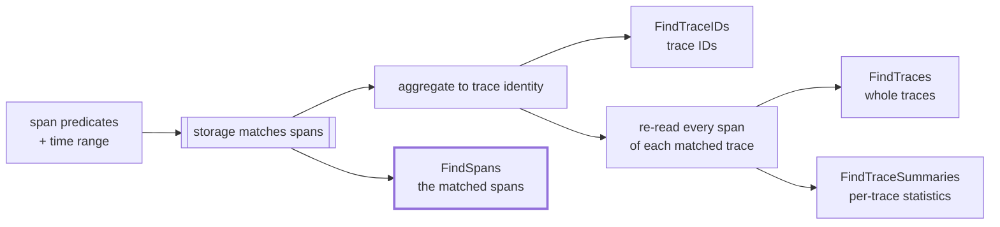

# RFC 0016: Span Search — Returning Matching Spans Instead of Traces

- **Status:** Draft
- **Author:** Yuri Shkuro
- **Created:** 2026-08-18
- **Last Updated:** 2026-08-18
- **Related:** [RFC 0005 (structured query filters)](0005-structured-query-filters.md) · [RFC 0011 (trace summary API)](0011-trace-summary-api.md) · [RFC 0014 (search result pagination)](0014-search-result-pagination.md) · [RFC 0001 (GenAI data layer)](0001-genai-data-layer.md) · [ADR-010](../adr/010-trace-summary-api.md) · [ADR-013 (storage capability declaration)](../adr/013-storage-capability-declaration.md)

---

## Abstract

Every trace search in Jaeger is already a span search. The api_v3 contract says so — "Fields are matched against individual spans, not the trace level" — and each backend implements it that way: it finds the spans that match, then throws away which spans those were and answers with trace identity. This RFC proposes **`FindSpans`**, a search that keeps them. The request is the same predicate model the trace search uses, extended with an optional set of trace IDs to scope the search to; the response is the matching spans themselves, in OTLP, paginated by the keyset cursor of [RFC 0014](0014-search-result-pagination.md). The immediate consumer is a GenAI evaluation UI that shows one row per experiment and needs the entry span of each experiment's trace, not the trace. The design also settles the shape of the request so that the result-shaping and aggregation tiers [RFC 0005 §4](0005-structured-query-filters.md#4-composition--the-query-complexity-continuum) deferred — a `SELECT` list and a `GROUP BY` over spans — can be added later as clauses on this query rather than as a second query API. Neither is built here.

---

## 1. Motivation

### 1.1 The requirement: one span per row, not one trace per row

A GenAI evaluation UI lists experiments, one row each, and each row carries the trace ID of the run it came from. What the row needs to display is the *entry span of the GenAI work* — the local root of the subtree where the model calls begin — with its attributes: the prompt version, the model name, the token counts, the evaluator scores. It does not need the rest of the trace, which for an agentic run can be thousands of spans and megabytes of payload. [RFC 0001 §10](0001-genai-data-layer.md) names that size problem directly when it discusses running evaluators inside Jaeger, and it correlates evaluation records to traces through attributes on the root span, then hands the evaluator the whole trace to traverse.

Neither existing endpoint answers this. `FindTraces` returns complete traces, which is the payload the UI is trying not to fetch. `FindTraceSummaries` ([RFC 0011](0011-trace-summary-api.md)) returns a fixed set of per-trace statistics — root service, span count, error count — and a summary is not a span: it carries none of the attributes the row displays, and its "root" is the trace's root, not the root of the GenAI subtree inside it. `GetTraces` takes the trace IDs the UI already has, but it too returns whole traces.

Jaeger already works around this internally. The MCP `get_span_details` tool takes a trace ID and a list of span IDs, calls `querysvc.GetTraces` for the whole trace, and picks the requested spans out of it in memory ([`handlers/get_span_details.go:69`](../../cmd/jaeger/internal/extension/jaegerquery/internal/mcptools/internal/handlers/get_span_details.go)). Its input schema even recommends asking for no more than twenty spans, which is a limit on the client's patience with the payload rather than on anything the storage cares about. The tool defines its own `SpanDetail` JSON type to return the result. So the need for "these spans, not their traces" is established inside the codebase; what is missing is a way to ask storage for it.

### 1.2 The search is already a span search

`TraceQueryParameters` in api_v3 is explicit about its own semantics:

> All fields form a conjunction … Fields are matched against individual spans, not the trace level. The results include traces with at least one matching span.

The predicates are span predicates. Only the *result* is aggregated up to trace identity, and each backend does that aggregation differently:

- **Elasticsearch/OpenSearch** runs the span query with `Size: 0` — asking for no documents at all — and reads the trace IDs out of a `terms` aggregation on the `traceID` field, ordered by the maximum `startTime` per bucket ([`core/reader.go:402`](../../internal/storage/v2/elasticsearch/tracestore/core/reader.go)). `FindTraces` then calls `FindTraceIDs` and re-reads the full traces by ID through `multiRead` ([`core/reader.go:257`](../../internal/storage/v2/elasticsearch/tracestore/core/reader.go)). The matching spans are found by the search and deliberately discarded before they cross the wire.
- **ClickHouse** builds `SELECT DISTINCT s.trace_id FROM spans s WHERE …` and, for `FindTraces`, wraps it as `WHERE s.trace_id IN (…)` around the span projection it already has ([`query_builder.go:116`](../../internal/storage/v2/clickhouse/tracestore/query_builder.go), [`sql/queries.go:214`](../../internal/storage/v2/clickhouse/sql/queries.go)). The `DISTINCT` is the aggregation.
- **Cassandra and Badger** intersect per-index sets of trace IDs. Their indices record trace IDs and nothing finer, so for them the matched span genuinely is not recoverable without reading the trace.

So on the two backends that motivate this work, returning matching spans is not new machinery. It is the removal of a step. On ES/OS it means asking for the documents the query already matched instead of asking for none of them, which also drops the `terms` aggregation whose cross-shard approximation [RFC 0014 §1.2](0014-search-result-pagination.md) identifies as a correctness problem in its own right.



### 1.3 Retrieving spans is the shape analytics wants

A span search resembles a SQL query over a span table far more than a trace search does: a `WHERE` clause, a row per span, a limit, a cursor. Once results are spans rather than traces, the clauses that [RFC 0005 §4](0005-structured-query-filters.md#4-composition--the-query-complexity-continuum) ranked as tiers L3 and L4 — a projection list, and grouping with aggregates — become natural extensions of the same request instead of a separate query language. RFC 0005 deferred them for two reasons, and one of them was that "result shaping … is awkward against Jaeger's whole-trace result model". A span result model removes that awkwardness.

This RFC does not build them. It settles where they would attach, so that adding them later is a clause on an existing message rather than a second query API alongside this one. [RFC 0001 §7.2](0001-genai-data-layer.md) is where that matters: it rejected storing evaluation results as span attributes partly because "cross-sample aggregation and experiment comparison [is] impractical — each query would require a full span scan". A grouped aggregate pushed into ClickHouse is exactly the operation that assumption rules out, so the analytics tier changes that trade-off rather than merely adding a convenience.

---

## 2. Goals and non-goals

### Goals

- **G1 — Return matching spans.** A search whose result is the spans that satisfied the predicates, in OTLP, each with the resource and scope it was recorded under.
- **G2 — Scope a search to known trace IDs.** The evaluation UI holds the trace IDs already; the search must be a lookup within those traces, not a scan of the time range.
- **G3 — Reuse the predicate model.** The same legacy predicate fields and the same [RFC 0005](0005-structured-query-filters.md) filter AST that trace search uses, with the same meaning. No second filtering model.
- **G4 — Paginate.** Spans are the unit a keyset cursor is natural over, so the search is paginated from the start, using [RFC 0014](0014-search-result-pagination.md)'s opaque page token.
- **G5 — Honest degradation.** A backend whose indices cannot identify matching spans declares that through [ADR-013](../adr/013-storage-capability-declaration.md) and the query service refuses the search, rather than the backend answering a different question.
- **G6 — Provision for result shaping and aggregation.** The request and response messages must be able to grow a `SELECT` list and a `GROUP BY` without a breaking change and without a second RPC. Neither is delivered here.
- **G7 — Additive.** Nothing about `FindTraces`, `FindTraceIDs`, or `FindTraceSummaries` changes.

### Non-goals

- **Defining what a local root is.** Jaeger has no concept of a subtree root, and this RFC does not add one. The caller identifies its entry spans with its own predicate (§8).
- **Structural predicates.** Ancestor, descendant, parent and sibling navigation is [RFC 0005](0005-structured-query-filters.md) tier L5 and stays out of scope. A local root cannot be *derived* by this API, only *matched* by a predicate the producer arranged for.
- **Projection and aggregation themselves.** §5 reserves room for them and states what a later RFC has to define; it does not define it.
- **Metrics over spans.** Rate and quantile over time belong to the metrics/SPM subsystem, as RFC 0005 §4 concluded.
- **Trace-scoped enrichment of span results.** The query-time adjusters do not run on a span result set, and §7 explains why that is a design decision rather than a gap.
- **A new storage schema.** Every backend that can serve this can serve it from what it indexes today.

---

## 3. What a span result is

**The container is OTLP, and OTLP is already a span container rather than a trace container.** `opentelemetry.proto.trace.v1.TracesData` is a list of `ResourceSpans`, each holding `ScopeSpans`, each holding spans. Nothing in it requires the spans to belong to one trace; Jaeger's own `tracestore.Reader` contract is what imposes that, and it imposes it per method — "A single `ptrace.Traces` chunk MUST NOT contain spans from multiple traces" is a rule stated for `GetTraces` and `FindTraces` ([`reader.go:26`](../../internal/storage/v2/api/tracestore/reader.go)). A span search does not inherit that rule: one response chunk holds spans from as many traces as matched.

**The resource and scope must travel with the span.** A bare span is not usable on its own: the service name lives in the resource attributes, and the instrumentation scope carries the library that produced it. So the response groups spans under the resource and scope they were recorded with, which is what the OTLP envelope is for, and what every backend already reconstructs per span document when it assembles a trace. Grouping several spans that share a resource under one `ResourceSpans` is an encoding optimization, not a requirement.

**A span identifies itself.** Trace ID and span ID are fields of the span, so a caller that asked about a set of traces groups the results by trace ID without any extra plumbing, and a caller that wants the enclosing trace passes the ID to `GetTrace`. No response-side index from query row to trace is needed.

**The result set is ordered, and the order is part of the contract**, because pagination depends on it (§6).

**The result is unbounded in a way a trace result is not.** `search_depth` caps traces; a span search over the same predicates can match every span of every one of those traces. A single trace-scoped lookup on an agentic run can match thousands of spans. So the page size is the only bound, and the server caps it (§6).

---

## 4. The API

### 4.1 A new RPC, not a flag on an existing one

Five ways to deliver span results were considered.

- **O1 — A new `FindSpans` RPC** returning OTLP spans.
- **O2 — Leave it to the caller:** `GetTraces` and filter client-side. This is the status quo, and what MCP `get_span_details` does today.
- **O3 — A flag on `FindTraces`** (`matching_spans_only`) that suppresses the re-read and returns only the spans that matched.
- **O4 — Extend `TraceSummary`** with a representative span per trace.
- **O5 — A general tabular query RPC** that returns rows, with a span being a row of columns.

| Criterion | O1 new RPC | O2 client-side | O3 flag on `FindTraces` | O4 summary field | O5 tabular RPC |
|---|:-:|:-:|:-:|:-:|:-:|
| Payload for the evaluation UI | 🟢 | 🔴 | 🟢 | 🟡¹ | 🟢 |
| Keeps full OTLP span fidelity | 🟢 | 🟢 | 🟢 | 🔴¹ | 🔴² |
| Result type says what it is | 🟢 | 🟢 | 🔴³ | 🟡 | 🟢 |
| Fits a keyset cursor | 🟢 | 🔴⁴ | 🟡⁵ | 🟡⁵ | 🟢 |
| Grows into `SELECT`/`GROUP BY` | 🟢 | 🔴 | 🔴⁶ | 🔴 | 🟢 |
| Elasticsearch/OpenSearch | 🟢⁷ | 🟢 | 🟢⁷ | 🟡 | 🟡² |
| ClickHouse | 🟢⁷ | 🟢 | 🟢⁷ | 🟡 | 🟢 |
| Cassandra / Badger | 🔴⁸ | 🟢 | 🔴⁸ | 🔴⁸ | 🔴⁸ |
| API surface cost | 🟡 | 🟢 | 🟢 | 🟡 | 🔴² |
| Consumer cost (UI, MCP) | 🟢 | 🟢 | 🟡³ | 🟡 | 🔴⁹ |

Legend: 🟢 good · 🟡 partial · 🔴 poor

¹ one representative span per trace answers the evaluation row and nothing else, and `TraceSummary` is a flat statistics message, so carrying a span in it means either a second span encoding or a link back to `GetTrace`. ² a row result needs a typed value encoding and column metadata that Jaeger does not have, and it cannot represent a span's events and links without inventing a nesting model; on ES/OS it also collides with the metrics subsystem, as RFC 0005 §4 footnote 2 notes. ³ `FindTraces` answers `stream TracesData`, so a flag changes what the same type means at runtime with nothing in the type system to say which it is. This is the reason [RFC 0011](0011-trace-summary-api.md) rejected `summary=true` on `FindTraces` and made `FindTraceSummaries` a separate RPC; the reasoning has not changed. ⁴ the client would page traces and filter spans, so a page of results has an unpredictable number of rows and can be empty. ⁵ the token would have to mean "the next page of traces", not of spans, which is the wrong unit for a span result. ⁶ a projection or a grouping clause on `TraceQueryParameters` is meaningless for `FindTraces`, which is the RPC that message exists for. ⁷ the removal of a step, not new machinery — §1.2. ⁸ their indices resolve to trace IDs only (§9); every option that returns spans from storage is refused there, and O2 works precisely because it does the work in the client. ⁹ every consumer would need a row decoder, and the UI and MCP already speak OTLP spans.

**Decision — O1.** `FindSpans` is a first-class RPC whose response type is spans, for the same reason `FindTraceSummaries` is one: the result shape belongs in the type system, not in a flag. O2 stays available and stays correct — it is the fallback a caller can always implement — but it is what the requirement exists to avoid. O5 is not rejected so much as postponed: §5 keeps a place for a row result inside `FindSpans`, so the tabular capability arrives as an arm of this RPC's response rather than as a competing API.

### 4.2 The request

The span query is a new message rather than a reuse of `TraceQueryParameters`, even though `FindTraceSummaries` reuses that message. Three of its fields do not carry over: `search_depth` counts traces, `raw_traces` selects between adjusted and stored traces where a span result is always as stored (§7), and its documented contract sentence — "The results include traces with at least one matching span" — is a statement about trace results. More importantly, the clauses §5 reserves are span-query clauses: a projection or a grouping on the message that `FindTraces` uses would be a field with no meaning for the RPC that message exists to serve.

```protobuf
// Query parameters to find spans. Field numbers are illustrative.
//
// The predicates form a conjunction, and they are matched against individual
// spans; a span is returned when it satisfies all of them. This is the same
// predicate model as jaeger.api_v3.TraceQueryParameters, evaluated the same way
// — what differs is that the matching spans are the result rather than an
// intermediate step toward trace identity.
message SpanQueryParameters {
  // Scope: restrict the search to these traces. Hex-encoded 64- or 128-bit
  // trace IDs. Optional; conjunctive with the predicates below.
  repeated string trace_ids = 1;

  // The time range, as on TraceQueryParameters. Required.
  google.protobuf.Timestamp start_time_min = 2;
  google.protobuf.Timestamp start_time_max = 3;

  // Predicates, legacy shape. Same fields and same meaning as on
  // TraceQueryParameters; mutually exclusive with `filter` (RFC 0005 §7).
  string service_name = 4;
  string operation_name = 5;
  map<string, string> attributes = 6;
  google.protobuf.Duration duration_min = 7;
  google.protobuf.Duration duration_max = 8;

  // Predicates, structured shape (RFC 0005). A single boolean-valued Call.
  jaeger.query.expression.v1.Call filter = 9;

  // The page size and cursor (RFC 0014). There is no search_depth: a span
  // search is bounded by its page size, and the server caps that.
  Pagination pagination = 10;

  // 11 to 19 are reserved for the result-shaping and aggregation clauses of
  // RFC 0016 §5: projection, group_by, having, order_by.
}

message FindSpansRequest {
  SpanQueryParameters query = 1;
}
```

**`trace_ids` is a scoping field, not a predicate, and that is why it is a field.** RFC 0005's rule is that predicates belong in the filter and dedicated scalar fields are legacy, and once `span.traceID` is a built-in field reference the same restriction is expressible as `in` over a list. Two things still argue for the field. It selects the storage access path rather than narrowing a scan: given trace IDs, every backend reads its trace-ID index or primary key, which is a different query plan from an attribute search, and a predicate buried in a boolean tree does not signal that. And it is the field that makes this RPC useful before RFC 0005's `filter` and its `jaeger.query.structuredFilters` feature gate reach a default deployment, which matters because the motivating query is a trace-scoped lookup and the legacy fields cannot express one at all. The cost is honest: it is a second spelling for what a `traceID in […]` predicate will also express, and the query service normalizes the two the same way RFC 0005 §7 normalizes `service_name` against `resource.service`. Whether that cost is worth paying is Q1 in §14.

The time range stays required even when `trace_ids` is given, because ES/OS selects which indices to read from it and ClickHouse prunes partitions with it. A caller that knows only the trace IDs must supply a range wide enough to contain them, exactly as `GetTraceRequest`'s optional `start_time`/`end_time` hints already assume. Q5 in §14 asks whether that should be relaxed.

### 4.3 The response, and why it is an envelope

`FindTraces` streams bare `TracesData`, which leaves nowhere to put anything that is not a span — which is why [RFC 0014 §4](0014-search-result-pagination.md) could not give `FindTraces` a page token and attached pagination to `FindTraceIDs` and `FindTraceSummaries` instead. A span search is paginated by construction, so it needs a response message of its own on day one. That message is also where a future row result attaches.

| Criterion | R1 bare `stream TracesData` | R2 envelope, `oneof` with one arm | R3 always tabular rows | R4 spans now, second RPC later |
|---|:-:|:-:|:-:|:-:|
| The page token has a home | 🔴 | 🟢 | 🟢 | 🟢 |
| Full OTLP span fidelity | 🟢 | 🟢 | 🔴 | 🟢 |
| Adds aggregate results without a break | 🔴¹ | 🟢 | 🟢 | 🟡² |
| Caller knows which result it gets | 🟢 | 🟢 | 🟢 | 🟢 |
| Surface cost now | 🟢 | 🟡³ | 🔴 | 🟢 |
| One query envelope, not two | 🟢 | 🟢 | 🟢 | 🔴⁴ |

Legend: 🟢 good · 🟡 partial · 🔴 poor

¹ moving an existing top-level field into a new `oneof` keeps wire compatibility but changes the generated Go accessors, so it breaks every compiled consumer. ² a second RPC is a clean break rather than a compatible extension, but it duplicates the time range, the predicates, the pagination and the capability declaration, and then the two must be kept in step. ³ a `oneof` with a single arm reads oddly until the second arm exists. ⁴ two RPCs over the same query means two request messages, or one request message serving an RPC that cannot honor half its clauses.

**Decision — R2.** The envelope exists for the page token whatever happens next, and declaring the `oneof` now costs one level of nesting and buys a compatible path to a row result.

```protobuf
message FindSpansResponse {
  oneof result {
    // The matching spans. This is the arm a query with no projection and no
    // grouping returns, which is every query this RFC delivers.
    opentelemetry.proto.trace.v1.TracesData spans = 1;

    // 2 is reserved for the tabular arm of RFC 0016 §5 — the result of a query
    // that groups or computes, which is not expressible as spans. Which arm a
    // response carries is determined by the request, so a caller always knows
    // which one to read before it sends the query.
  }

  // Set on the final chunk of a page; empty when there are no more pages
  // (RFC 0014 §4).
  string next_page_token = 3;
}
```

The RPC streams the envelope, as `FindTraceSummaries` does, so a large page is delivered in chunks and the last chunk of the page carries the token:

```protobuf
rpc FindSpans(FindSpansRequest) returns (stream FindSpansResponse) {
  option (google.api.http) = { get: "/api/v3/spans" };
}
```

### 4.4 The internal storage interface

`FindSpans` goes on `tracestore.Reader` itself, not on an optional interface. [ADR-010](../adr/010-trace-summary-api.md) records why: `FindTraceSummaries` shipped as an optional `SummaryReader` and was moved onto `Reader` in [#9067](https://github.com/jaegertracing/jaeger/pull/9067) because an optional interface taxes every decorator, and a decorator that fails to forward it silently downgrades the backend. [ADR-013](../adr/013-storage-capability-declaration.md) makes the same argument for `SearchCapabilities`. A required method means the compiler enumerates the implementations that have to answer.

```go
// FindSpans returns an iterator over pages of spans matching the query.
//
// Unlike FindTraces, a yielded ptrace.Traces may hold spans from many traces:
// the result is a set of spans, not a set of traces. Spans are returned as
// stored, with no query-time adjustment (RFC 0016 §7).
//
// A reader whose indices cannot identify which spans matched declares
// SpanSearch=false and yields errors.ErrUnsupported (wrapped with %w) as the
// first error before any page; such readers embed UnsupportedSpanSearch.
FindSpans(ctx context.Context, query SpanQueryParams) iter.Seq2[SpanPage, error]

// SpanPage is one chunk of a page of span results. NextPageToken is set on the
// final chunk of each page and empty on the others.
type SpanPage struct {
    Spans         ptrace.Traces
    NextPageToken string
}

type SpanQueryParams struct {
    TraceIDs      []pcommon.TraceID
    ServiceName   string
    OperationName string
    Attributes    pcommon.Map
    StartTimeMin  time.Time
    StartTimeMax  time.Time
    DurationMin   time.Duration
    DurationMax   time.Duration
    Filter        *expression.Call   // RFC 0005
    Pagination    Pagination         // RFC 0014
}
```

`SpanPage` mirrors RFC 0014's `TraceIDPage` rather than inventing a second way to carry a cursor. The ownership rule in the `Reader` doc comment applies unchanged: the caller owns each yielded `ptrace.Traces`, so a reader that holds its own copy of the data yields a deep copy.

Capability, declared through [ADR-013](../adr/013-storage-capability-declaration.md)'s existing mechanism, whose zero value is already the least capable backend:

```go
type SearchCapabilities struct {
    WithoutServiceName bool   // ADR-013
    Paginated          bool   // RFC 0014
    SpanSearch         bool   // RFC 0016: FindSpans returns spans rather than ErrUnsupported
}
```

The query service enforces it before dispatch, in the one place ADR-013 put enforcement, and maps the refusal to `InvalidArgument` and HTTP 400. `UnsupportedSpanSearch` is the compile-time counterpart and the backstop, exactly as `UnsupportedTraceSummaries` is for summaries: a reader that declares `false` still needs the method to exist, and a reader reached without the capability check still must not answer a narrower question.

The remote-storage protocol gets the matching `FindSpans` RPC on `jaeger.storage.v2.TraceReader` and the matching `span_search` field on `SearchCapabilities` in `capabilities.proto`. A plugin that predates either reads as least capable — its `Capabilities` service is absent, so ADR-013's client maps that to `ErrUnsupported` — and the query service therefore never sends it a span search.

### 4.5 The query service and the HTTP surface

`querysvc.QueryService` gains `FindSpans`, and it is a thinner path than `FindTraces`: validate the query, check the capability, dispatch, and pass the pages through. There is no aggregation step and no adjuster step (§7). This is also the first search the query service exposes whose storage counterpart is paginated, so it is where RFC 0014's token handling lands for real; `FindTraceIDs` has no query-service method today, which RFC 0014 has to add for its own milestones.

The HTTP route is `GET /api/v3/spans`, alongside `/api/v3/traces` and `/api/v3/trace-summaries`, with the same camelCase `query.*` parameters the existing parser uses plus `query.traceIDs` as a comma-separated list and RFC 0014's page-size and page-token parameters. As with the other endpoints, the HTTP handler buffers a page through `jiter.FlattenWithErrors` while gRPC streams it; a page is a bounded unit, which is what makes buffering acceptable here.

---

## 5. Provisioning for `SELECT` and `GROUP BY`

RFC 0005 built the `WHERE` clause and mapped what lies beyond it: L3 result shaping, L4 aggregation, L5 structural navigation. This section states where L3 and L4 would attach to a span query, so that building them later does not require a second query API. It builds neither.

### 5.1 The clauses of a span query

| SQL | Span query | Status |
|---|---|---|
| `FROM` | implicit: spans, within the time range, optionally scoped to `trace_ids` | delivered |
| `WHERE` | `filter`, an RFC 0005 `Call`, or the legacy predicate fields | delivered |
| `SELECT` | `projection`: a list of expressions with optional aliases | reserved (§4.2 field 11+) |
| `GROUP BY` | `group_by`: a list of expressions | reserved |
| `HAVING` | `having`: a `Call` over aggregates | reserved |
| `ORDER BY` | `order_by`: expressions with a direction | partly delivered — a fixed sort order the cursor depends on (§6); a caller-chosen order is reserved |
| `LIMIT` / cursor | `pagination.page_size` and `pagination.page_token` | delivered |

Every reserved clause is a list of `Expression`s, which is the term RFC 0005 §6.1 designed to be reusable: "the expression is the one reusable term a future projection, grouping, or named function would operate on". Aggregate functions need no new message either — `count`, `sum`, `avg`, `min`, `max` and `quantile` are further `op` values on the same `Call` node, which is the extension path RFC 0005 §6.1 reserves for named functions.

### 5.2 Only aggregation needs a new result shape

The important finding is that L3 and L4 do not need the same thing from the response.

**A projection over plain references can stay in the spans arm.** If every projected expression is an attribute or a built-in field, the result is a *sparse span*: the same span with only the requested fields populated. That is what TraceQL's `select()` returns, it needs no new result type, and it delivers most of what a projection is for — the evaluation UI asking for four attributes out of a span carrying two hundred. What cannot ride the spans arm is a *computed* projection, because OTLP has no field for the value of `duration / 1000` or `json_extract(input, "model")`.

**Grouping always needs rows.** A group with a count is not a span, and no arrangement of `ResourceSpans` represents one. So the tabular arm of §4.3 is what L4 needs, and a later RFC that adds `group_by` has to define three things this one does not: a typed value encoding for a cell, column metadata naming and typing each output column, and the aggregate `op` vocabulary. Paging over grouped results is a separate question again, and usually a non-question — a grouped result is small by construction, and the honest answer is likely to be a cap and a refusal rather than a cursor.

This is why the response is a `oneof` and not a `TracesData` with a bag of extras: the arm follows from the query, statically, and a caller knows which arm it will get before it sends the request. A query with no `projection` and no `group_by` returns spans. A query whose projection is references only returns sparse spans. A query that groups or computes returns rows.

### 5.3 What is not provisioned

Joins between spans, cross-trace correlation, structural predicates over the trace tree (RFC 0005 tier L5), and time-bucketed metrics all stay outside this shape. The first three need an execution model that assembles more than one span at a time, which is the reason RFC 0005 deferred L5 rather than judging it infeasible. The last belongs to the metrics/SPM subsystem, as RFC 0005 §4 concluded, and a span-analytics clause that grew a `rate()` would be duplicating it.

The analytics tier will also be a per-backend capability, like everything else here. ClickHouse can push a grouped aggregate down natively and is the reason to design for this at all. ES/OS has aggregations, and RFC 0005 §4 already flags that they overlap the metrics path. Cassandra and Badger cannot serve even the ungrouped span search (§9), so they will not serve this either.

---

## 6. Ordering and pagination

**The sort key is `(startTime desc, traceID asc, spanID asc)`.** RFC 0014 sorts traces by `(startTime desc, traceID asc)`, where the trace's `startTime` is the maximum among its matching spans — a definition that exists only because a trace has no single start time. A span has one, so the span key needs no such reconciliation, and the two ID components are the tie-breaker that makes the key unique. Neither ID alone suffices: span IDs are not unique across traces, and a client and server span in the same trace can legitimately share one, which is what `DeduplicateClientServerSpanIDs` exists to repair. Genuine duplicates — the same span written twice, which `DeduplicateSpans` exists for because ES archival produces them — collide on all three components and are returned twice rather than skipped, which is benign and worth documenting.

**The cursor is already implemented on ES/OS.** `buildTraceReadRequest` sets `SearchAfter = []any{cursor.startTime, cursor.spanID}` to page the spans of one oversized trace ([`core/reader.go:170`](../../internal/storage/v2/elasticsearch/tracestore/core/reader.go)). A span search is that same `search_after`, over the result set instead of within one trace, with the trace ID added to the key. This is the piece of RFC 0014's ES design that does not need the field collapse: RFC 0014 collapses on `traceID` because it wants one row per trace, and a span search wants the rows themselves. The two milestones build the same query and differ by one clause.

**The token is RFC 0014's token.** Opaque, base64 over a proto carrying the cursor, a fingerprint of the query, a backend tag and a version; a token presented against a different query is refused with `InvalidArgument`. Reusing it rather than defining a span-specific cursor is the point — one token format, one place that encodes and validates it.

**The forward-traversal guarantee is stronger here than for traces.** RFC 0014 accepts that a forward traversal may skip a trace, because a trace's max-keyed sort position rises as new spans arrive. A span's key never changes after it is written, so a span search skips nothing; a span written into an already-passed position is missed, which is the ordinary property of paging a time-ordered index backwards from now.

**The page size is capped by the server.** `search_depth` does not carry over (§4.2), so the page size is the only bound, and it needs a maximum for the same reason ClickHouse already rejects a `SearchDepth` above `MaxSearchDepth` and the query service already truncates oversized traces at `MaxTraceSize`. A trace-scoped lookup on an agentic run can match thousands of spans, and the honest answer is a capped page plus a token, not a large response.

**A backend that declares `Paginated=false` but `SpanSearch=true`** serves one capped page with an empty token, and refuses a token with `InvalidArgument` — RFC 0014 §6.2's three-way degradation, unchanged.

---

## 7. Spans are returned as stored

The query service applies seven adjusters to a trace before returning it ([`adjuster/standard.go`](../../cmd/jaeger/internal/extension/jaegerquery/internal/adjuster/standard.go)), unless the caller asks for `raw_traces`. None of them runs on a span search result, for two independent reasons.

**Three of them need the complete trace.** The `Adjuster` contract says so: "The caller must ensure that all spans in the `ptrace.Traces` argument belong to the same trace and represent the complete trace" ([`adjuster.go:11`](../../cmd/jaeger/internal/extension/jaegerquery/internal/adjuster/adjuster.go)). `CorrectClockSkew` needs each span's parent to compute an offset, `DeduplicateClientServerSpanIDs` needs to see both members of a shared-ID pair, and `DeduplicateSpans` needs the whole set to know which copy to keep. A span result set is a partial set of spans from many traces, so these cannot run at all.

**The other four would make the result disagree with the query.** `MoveLibraryAttributes` moves `otel.library.name` from the span's attributes into the instrumentation scope; `NormalizeIPAttributes` rewrites a numeric IP attribute into a string. Both rewrite the attributes a predicate matched, so applying them would return a span that no longer satisfies the filter that selected it. For a trace result that is harmless, because the caller asked about the trace. For a span result it breaks the property that makes the result legible: **a returned span satisfies the predicate that returned it.**

So a span result is the span as stored, and there is no `raw_spans` flag because there is nothing to opt out of. One consequence is worth stating rather than discovering: for a trace where a client and server span share a span ID, `FindTraces` shows the span ID that `DeduplicateClientServerSpanIDs` rewrote and `FindSpans` shows the stored one, so the same span has two spellings depending on which endpoint a caller used. Whether that is worth an opt-in is Q2 in §14.

---

## 8. Identifying the local root

The motivating query asks for "the span where the GenAI portion of the trace starts". Jaeger has no such concept, and this RFC does not add one. There are three ways to get it, and only one is in scope.

**The producer marks it, and the caller matches the marker.** The instrumentation that starts the GenAI work sets an attribute the caller can filter on, either a dedicated one or a distinguishing attribute the semantic conventions already put on entry spans. The query is then an ordinary conjunction — these trace IDs, and this attribute — which is what §4 delivers, and it works today with the legacy `attributes` map. This is the recommended approach, and it is where [RFC 0001](0001-genai-data-layer.md) already sits: it correlates evaluation records to traces with `jaeger.eval.trial_id` on the root span, so the marker-on-the-entry-span pattern is the one that RFC's data layer assumes.

**The query derives it structurally** — a span carrying attribute X whose parent does not carry X. That is a structural predicate, RFC 0005 tier L5, out of scope there and here. It is also the only one of the three that would let Jaeger answer the question for instrumentation that marked nothing.

**The caller derives it post-fetch,** by reading the trace and walking it. That is the payload cost the requirement exists to avoid.

Two properties of the batch query are the caller's to handle, and are worth stating so that a UI does not assume otherwise. A trace may contain zero matching spans or several, so the mapping from a row to a span is not guaranteed one-to-one; the caller groups the result by trace ID and decides what to show for a trace with none or many. And a page boundary can fall inside a batch of trace IDs, so a caller that needs every row filled must follow the token rather than assume one page covers its request.

---

## 9. Backends

| Backend | What a span search costs | Cursor | Declares |
|---|---|---|:-:|
| **Elasticsearch / OpenSearch** | the existing bool query from `buildFindTraceIDsQuery`, with `Size: page_size` instead of `Size: 0` and no `terms` aggregation. Strictly less work than today's trace-ID search, and it drops the aggregation's cross-shard approximation | `search_after` on the sort key, the mechanism `buildTraceReadRequest` already builds for intra-trace paging | 🟢 `SpanSearch`, `Paginated` |
| **ClickHouse** | `SelectSpansQuery` with the predicates `buildFindTraceIDsQuery` already assembles, and without the `trace_id IN (…)` subquery — one round trip instead of a nested one. This is also where `GROUP BY` (§5) would be native | keyset: `WHERE (start_time, trace_id, span_id) < cursor ORDER BY … LIMIT n` | 🟢 `SpanSearch`; `Paginated` per RFC 0014 |
| **memory** | the linear scan already visits every span, so the matching spans are in hand. Valuable out of proportion to its production use, because it unblocks the cross-backend conformance tests and the default distribution | in-memory offset over the scan order | 🟢 `SpanSearch` |
| **Cassandra** | not serviceable. `tag_index` is keyed by service, key and value and resolves to trace IDs; the matched span is not recoverable without reading the trace | — | 🔴 |
| **Badger** (via `v1adapter`) | not serviceable, for the same reason: every index seek resolves to trace IDs | — | 🔴 |
| **gRPC remote storage** | forwards the call and forwards the declaration; a plugin that predates either reads as least capable | whatever its backend does | per backend |

The two 🔴 rows are the reason §4.4 declares a capability instead of building a fallback. A fallback is possible — read the candidate traces and re-evaluate the predicates against each span in memory, which is what MCP `get_span_details` does by hand today, and what [RFC 0011](0011-trace-summary-api.md)'s summary fallback does for its own shape. It would need an in-process evaluator for the RFC 0005 expression tree, which does not exist, and it would spend the storage read the requirement is trying to avoid while saving only the client hop. Refusing is honest and cheap; the fallback is listed as future work in §13 for the case where universal availability turns out to matter more than the cost.

---

## 10. Consumers

**The evaluation UI** is the requirement: one query per screen of rows, scoped to the trace IDs it holds, returning one span per row.

**MCP gains a `find_spans` tool,** and this is arguably the larger win. An agent investigating a trace currently reaches for `search_traces` and then `get_span_details`, and the second fetches whole traces to return a few spans. A `find_spans` tool answers "the LLM spans in these traces" or "the spans over two seconds in this service" in one call, and `get_span_details` can be rewired onto it where the backend declares support. The `SpanDetail` JSON shape the MCP layer already defines is the projection such a tool returns.

**Evaluators reading their own traces.** [RFC 0001](0001-genai-data-layer.md) gives an introspective evaluator the full trace and notes the size problem for agentic runs. An evaluator that needs the entry span, or every LLM call span, can ask for those instead.

**The Jaeger UI**, eventually, for a span-oriented result list. That is not part of this proposal; the API's first consumers reach it over api_v3 and MCP.

---

## 11. Compatibility

Everything here is additive. `FindTraces`, `FindTraceIDs` and `FindTraceSummaries` are untouched, `TraceQueryParameters` is untouched, and a caller that never sends `FindSpans` sees no change. The new interface method is the one non-additive piece: every `tracestore.Reader` implementation must supply it, at minimum by embedding `UnsupportedSpanSearch`, and every decorator must forward it — the same one-time cost `FindTraceSummaries` and `SearchCapabilities` each imposed, and the reason both are required methods rather than optional interfaces.

The dependency on [RFC 0005](0005-structured-query-filters.md) is real but not blocking. `FindSpans` carries the `filter` field and inherits its validation, its feature gate and its capability rules, so the rich predicates arrive when RFC 0005's do. The legacy predicate fields plus `trace_ids` are enough for the motivating query, which is what lets these two efforts proceed on their own schedules rather than in series.

The dependency on [RFC 0014](0014-search-result-pagination.md) is tighter, because a span search is paginated from its first release rather than gaining pagination later. Both RFCs need the same two things: the `Pagination` message on the request, and the code that encodes, binds and validates the opaque token. Whichever milestone lands first introduces them, and the second reuses them; what must not happen is a span-specific cursor beside a trace-specific one.

---

## 12. Considered alternatives

§4.1 and §4.3 hold the two structural decisions. Four narrower alternatives were rejected along the way.

**Reuse `TraceQueryParameters` for the span query**, as `FindTraceSummaries` does. Rejected because `search_depth` and `raw_traces` mean nothing for a span result, and because the clauses §5 reserves would then hang off the message `FindTraces` uses, where they have no meaning. The cost of a separate message is five duplicated envelope fields; the predicates themselves are shared by construction, since they are the same `filter` AST and the same legacy fields with the same conversion code.

**A separate `GetSpans(trace_ids, filter)` method** paralleling `GetTraces`, leaving `FindSpans` for time-range searches. Rejected because it splits one operation in two on the basis of which predicate the caller happens to have: both are "spans matching a conjunction", and a backend distinguishes them by query plan, which the presence of `trace_ids` already tells it.

**Return a flat list of spans with no OTLP envelope**, one message per span carrying its service name inline. Rejected because it invents a second span encoding for the project to maintain beside `TracesData`, and because losing the scope loses the instrumentation library.

**Make `SpanSearch` a fallback rather than a capability**, with the query service reading candidate traces and filtering in memory on the backends that cannot search spans. Deferred rather than rejected; §9 states the cost and §13 keeps it as future work.

---

## 13. Implementation roadmap

PR-sized milestones with exit bars. M4 onward are parallelizable after M2.

**M1 — Proto foundation (jaeger-idl).** `SpanQueryParameters`, `FindSpansRequest`, `FindSpansResponse` with the `oneof` and `next_page_token`, and the `FindSpans` RPC on `jaeger.api_v3.QueryService` with its `GET /api/v3/spans` binding; the same RPC on `jaeger.storage.v2.TraceReader`; the `span_search` field on `jaeger.storage.v2.SearchCapabilities`. *Exit:* generated types compile and vendor cleanly; existing api_v3 and storage.v2 callers byte-for-byte unaffected.

**M2 — Internal interface and query-service plumbing.** `Reader.FindSpans`, `SpanQueryParams`, `SpanPage`, `UnsupportedSpanSearch`, and `SearchCapabilities.SpanSearch`; every backend embeds the mixin and declares `false`; `querysvc.FindSpans` with validation and the capability refusal; the api_v3 gRPC handler, the HTTP route and the query-parser parameters. *Exit:* a span search against any backend is refused with `InvalidArgument` and a message naming the backend limitation; no existing search changes behavior.

**M3 — memory backend.** The first reader to declare `SpanSearch=true`, and the harness for a cross-backend conformance test that asserts the refusal on the others. *Exit:* an end-to-end span search works in the all-in-one distribution; the conformance test passes on every backend, serving or refusing.

**M4 — Elasticsearch/OpenSearch.** Documents instead of the `terms` aggregation, the sort key of §6, and `search_after`. Sequenced with [RFC 0014](0014-search-result-pagination.md) M3, which builds the same query with a `collapse` clause. *Exit:* a span search returns the matching spans with a working cursor; existing trace-search snapshots byte-identical.

**M5 — ClickHouse.** `SelectSpansQuery` with the existing predicate construction and the keyset cursor. *Exit:* the SQL snapshot tests cover the new query shape; existing snapshots byte-identical.

**M6 — Remote-storage gRPC.** Client and server for the new RPC, and capability forwarding. *Exit:* a remote backend that declares support serves a span search end to end; one that does not, or that predates the declaration, is refused before dispatch.

**M7 — MCP `find_spans` tool.** The tool, and `get_span_details` rewired onto it where the backend declares support, falling back to its present trace-fetch otherwise. *Exit:* an agent retrieves spans across traces in one call; the existing tool's behavior is unchanged on backends that cannot search spans.

**Out of scope (future, this design enables):**
- The tabular result arm and the `projection`, `group_by` and `having` clauses (§5), including the value encoding and column metadata a row result needs.
- Sparse spans: a reference-only projection returning spans with only the requested fields (§5.2), which needs no new result type.
- A caller-chosen `order_by`, which the fixed cursor sort order currently precludes.
- An in-memory expression evaluator, which would turn the capability refusal into a fallback on Cassandra and Badger (§9).
- Per-trace-ID time hints on `trace_ids`, mirroring `GetTraceParams.Start`/`End`, if a backend turns out to need them.
- A UI span-results view.
- Structural derivation of a local root (§8), which is RFC 0005 tier L5.

---

## 14. Open questions

1. **Does `trace_ids` earn its place?** It is a second spelling for a `span.traceID in […]` predicate once RFC 0005 lands (§4.2). Keeping it makes the motivating query answerable before that RFC's feature gate opens and signals the trace-ID access path explicitly; dropping it means one predicate model and a wait. The recommendation is to keep it and treat it as legacy from the day the predicate exists, the way `service_name` is.
2. **Should any adjustment be available on span results?** §7 argues for none, and accepts that `FindTraces` and `FindSpans` can therefore show different span IDs for the same span. An opt-in for the four span-scoped adjusters would close that gap and reintroduce the disagreement between a returned span and the predicate that matched it.
3. **Default and maximum page size.** A screenful of evaluation rows is tens of spans; an agent asking for every LLM call in a trace wants hundreds. Whether the maximum is shared with the existing search caps or configured separately is open.
4. **Does the tabular result belong in this RPC?** §4.3 reserves an arm for it, which keeps one query envelope. A later RFC that finds the row encoding large may still prefer its own RPC, in which case the reserved arm is simply never used.
5. **Must the time range be required when `trace_ids` is given?** ES/OS needs it to select indices and ClickHouse to prune partitions, so today it is required (§4.2). A caller holding only trace IDs has to guess a range wide enough, and a backend that can resolve a trace ID without one gains nothing from the requirement.

---

## 15. References

**Jaeger code**
- [`tracestore.Reader`](../../internal/storage/v2/api/tracestore/reader.go) — the storage interface, `TraceQueryParams`, `SearchCapabilities`, and the chunking and ownership contracts
- [`querysvc.QueryService`](../../cmd/jaeger/internal/extension/jaegerquery/querysvc/service.go) — validation, adjusters, and the summary fallback
- [ES/OS trace-ID search](../../internal/storage/v2/elasticsearch/tracestore/core/reader.go) — `Size: 0` plus the `traceID` terms aggregation, and the intra-trace `search_after` cursor
- [ClickHouse query builder](../../internal/storage/v2/clickhouse/tracestore/query_builder.go) and [SQL templates](../../internal/storage/v2/clickhouse/sql/queries.go) — the `DISTINCT trace_id` search and the span projection
- [Standard adjusters](../../cmd/jaeger/internal/extension/jaegerquery/internal/adjuster/standard.go) and the [`Adjuster` contract](../../cmd/jaeger/internal/extension/jaegerquery/internal/adjuster/adjuster.go) — the complete-trace requirement
- [MCP `get_span_details`](../../cmd/jaeger/internal/extension/jaegerquery/internal/mcptools/internal/handlers/get_span_details.go) — the whole-trace fetch this RFC replaces
- [api_v3 HTTP gateway](../../cmd/jaeger/internal/extension/jaegerquery/internal/apiv3/http_gateway.go) and [query parser](../../cmd/jaeger/internal/extension/jaegerquery/internal/apiv3/query_parser.go)
- [#9067](https://github.com/jaegertracing/jaeger/pull/9067) — moved `FindTraceSummaries` onto `tracestore.Reader`, the precedent for a required method over an optional interface

**Jaeger design documents**
- [RFC 0005](0005-structured-query-filters.md) — the predicate model this search reuses, and the L3/L4 tiers §5 provisions for
- [RFC 0011](0011-trace-summary-api.md) and [ADR-010](../adr/010-trace-summary-api.md) — why a new result shape gets its own RPC
- [RFC 0014](0014-search-result-pagination.md) — the page token, the keyset cursor, and the ES/OS query this search shares
- [RFC 0001](0001-genai-data-layer.md) — the GenAI evaluation data layer and its trace-size problem
- [ADR-013](../adr/013-storage-capability-declaration.md) — the capability declaration `SpanSearch` plugs into

**External**
- [Grafana TraceQL](https://grafana.com/docs/tempo/latest/traceql/) — `select()` as prior art for a projection returning sparse spans
- [Braintrust BTQL](https://www.braintrust.dev/docs/reference/btql) — prior art for a structured query with filter, projection and aggregation clauses over rows
