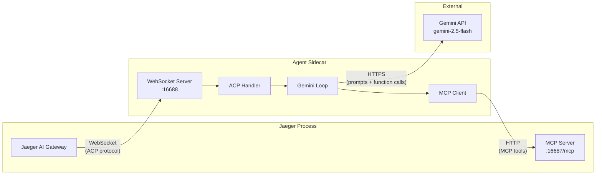
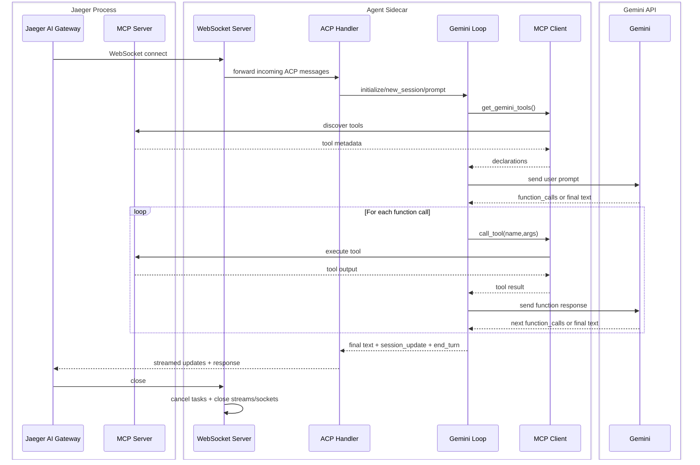

# Python Sidecar (ACP Agent)

This folder contains the Python ACP sidecar used by the Jaeger AI gateway.

The sidecar:
- Listens on `ws://localhost:16688` by default
- Runs a Gemini-backed ACP agent
- Uses Jaeger MCP tools from `http://127.0.0.1:16687/mcp`

## Prerequisites

- Python 3.14+
- [`uv`](https://docs.astral.sh/uv/) installed
- A Gemini API key

## Required Environment Variable

Set your Gemini API key before starting the server:

```bash
export GEMINI_API_KEY="your_api_key_here"
```

Without this key, the sidecar cannot create the Gemini client.

Optional MCP endpoint override:

```bash
export JAEGER_MCP_URL="http://127.0.0.1:16687/mcp"
```

If unset, the sidecar defaults to `http://127.0.0.1:16687/mcp`.

Optional MCP discovery timeout override:

```bash
export JAEGER_MCP_DISCOVERY_TIMEOUT_SEC="15"
```

This controls the timeout for a single MCP tool discovery attempt.

## Tracing

The sidecar emits OpenTelemetry traces under service name `jaeger-gemini-sidecar`. Spans cover prompt handling, the agentic Gemini loop, MCP tool discovery, and MCP tool calls. Gemini calls are auto-instrumented via `opentelemetry-instrumentation-google-generativeai` and use the OTel GenAI semantic conventions.

Traces are exported over OTLP/gRPC. The default target (`http://localhost:4317`) matches the Jaeger all-in-one OTLP receiver, which makes the sidecar appear as its own service in the Jaeger UI.

| Flag | Env var | Default | Purpose |
| --- | --- | --- | --- |
| `--otlp-endpoint` | `OTEL_EXPORTER_OTLP_ENDPOINT` | `http://localhost:4317` | OTLP/gRPC collector endpoint |
| `--otlp-insecure` / `--no-otlp-insecure` | `OTEL_EXPORTER_OTLP_INSECURE` | `true` | Skip TLS when exporting (set to false + provide TLS at the collector for production) |

Example pointing at a remote collector with TLS:

```bash
uv run python main.py \
  --otlp-endpoint https://otel.example.com:4317 \
  --no-otlp-insecure
```

Metrics are intentionally not exported — Jaeger does not accept OTLP metrics. Metric export can be added once a metrics backend is available (see [#8397](https://github.com/jaegertracing/jaeger/issues/8397)).

## Install Dependencies

From this directory:

```bash
uv sync
```

`uv sync` is the only supported dependency install method for this sidecar.

## Run The Sidecar Server

You can start the same server using either entrypoint:

```bash
uv run python main.py
```

Expected startup log:

```text
Jaeger ACP Sidecar listening on ws://localhost:16688
```

Useful runtime flags:

```bash
uv run python main.py \
  --host localhost --port 16688 \
  --mcp-url http://127.0.0.1:16687/mcp \
  --mcp-discovery-timeout-sec 15 \
  --otlp-endpoint http://localhost:4317 --otlp-insecure
```

## Code Layout

- `main.py`: entrypoint, CLI/env parsing, WebSocket server bootstrap.
- `sidecar.py`: ACP agent handlers and WebSocket transport bridge.
- `mcp_bridge.py`: MCP discovery/call bridge used by the agent.
- `sidecar_config.py`: validated runtime configuration model.
- `sidecar_helpers.py`: tool serialization/declaration helper functions.

## Architecture



### Sequence Diagram




## End-to-End Test

1. Start Jaeger CMD in another terminal.
2. Start this sidecar.
3. Run the pytest workflow test, which monkeypatches the agent and drives the ACP prompt flow end to end:

```bash
uv run pytest -q test_sidecar_workflow.py
```

The test connects to the sidecar over WebSocket, sends `initialize`, `session/new`, and `session/prompt`, and verifies the streamed ACP updates and end-of-turn marker.
