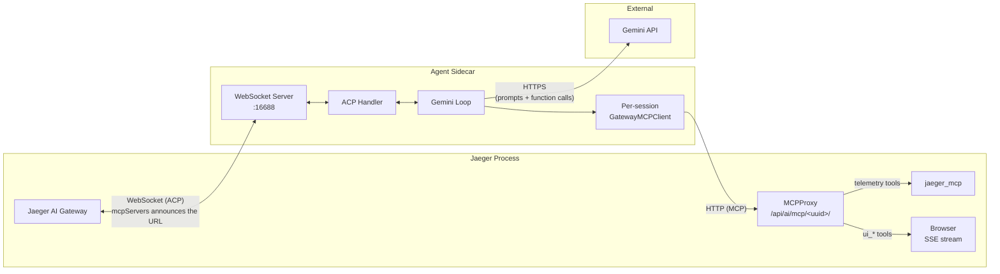
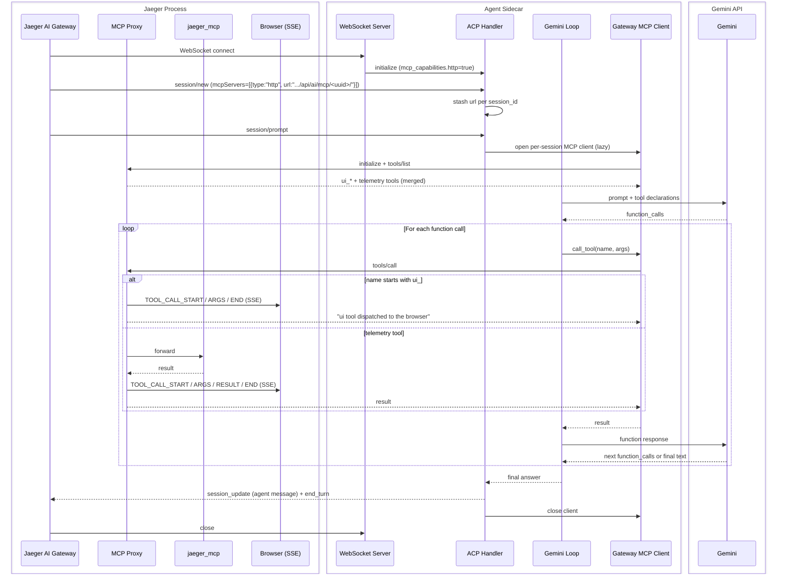

# Python Sidecar (ACP Agent)

This folder contains the Python ACP sidecar used by the Jaeger AI gateway.

The sidecar:
- Listens on `ws://localhost:16688` by default.
- Runs a Gemini-backed ACP agent.
- Consumes the Jaeger AI gateway's per-session MCP endpoint as its **single**
  tool source. The gateway announces the URL in
  `NewSessionRequest.mcpServers`; the sidecar dials it for both telemetry
  tools (forwarded by the gateway to `jaeger_mcp`) and frontend-supplied UI
  tools (dispatched by the gateway to the browser).

The sidecar holds no MCP routing logic of its own — every tool call flows
through the gateway, which is the single owner of tracing, auth, and
unified UI-vs-telemetry dispatch.

## Prerequisites

- Python 3.14+
- [`uv`](https://docs.astral.sh/uv/) installed
- A Gemini API key

## Required Environment Variable

```bash
export GEMINI_API_KEY="your_api_key_here"
```

Without this key, the sidecar cannot create the Gemini client.

There is no MCP URL knob — the URL is announced per turn by the gateway.

Optional MCP handshake timeout:

```bash
export JAEGER_MCP_DISCOVERY_TIMEOUT_SEC="15"
```

Bounds the per-turn handshake against the gateway (initialize + tools/list).
Default 15s.

## Tracing

The sidecar emits OpenTelemetry traces under service name
`jaeger-gemini-sidecar`. Spans cover prompt handling, the agentic Gemini
loop, the per-turn MCP handshake (`gateway_mcp.discover_tools`), and each
MCP tool call (`gateway_mcp.call_tool`). Gemini calls are auto-instrumented
via `opentelemetry-instrumentation-google-generativeai` and use the OTel
GenAI semantic conventions.

Traces are exported over OTLP/gRPC. The default target
(`http://localhost:4317`) matches the Jaeger all-in-one OTLP receiver, so
the sidecar appears as its own service in the Jaeger UI.

| Flag | Env var | Default | Purpose |
| --- | --- | --- | --- |
| `--otlp-endpoint` | `OTEL_EXPORTER_OTLP_ENDPOINT` | `http://localhost:4317` | OTLP/gRPC collector endpoint |
| `--otlp-insecure` / `--no-otlp-insecure` | `OTEL_EXPORTER_OTLP_INSECURE` | `true` | Skip TLS when exporting (set to false + provide TLS at the collector for production) |

Example pointing at a remote collector with TLS:

```bash
uv run python main.py \
  --otlp-endpoint https://otel.example.com:4317 \
  --no-otlp-insecure
```

Metrics are intentionally not exported — Jaeger does not accept OTLP
metrics. Metric export can be added once a metrics backend is available
(see [#8397](https://github.com/jaegertracing/jaeger/issues/8397)).

## Install Dependencies

```bash
uv sync
```

## Run

### One-command launcher

From the repository root:

```bash
export GEMINI_API_KEY=…
make run-ai-gemini
```

Bootstraps the Python toolchain, starts Jaeger with the example config,
waits for it to be ready, then runs the sidecar in the foreground. Ctrl-C
stops both.

### Manual

```bash
uv run python main.py
```

Expected startup log:

```text
Jaeger ACP Sidecar listening on ws://localhost:16688
```

Useful runtime flags:

```bash
uv run python main.py \
  --host localhost --port 16688 \
  --mcp-discovery-timeout-sec 15 \
  --otlp-endpoint http://localhost:4317 --otlp-insecure
```

## Code Layout

- `main.py` — entrypoint, CLI/env parsing, WebSocket server bootstrap.
- `sidecar.py` — `JaegerSidecarAgent`, the ACP handlers, the agentic
  Gemini loop, WS-to-ACP transport bridge.
- `gateway_mcp_client.py` — per-session MCP client that dials the
  gateway's announced URL. Replaces the historical `JaegerMCPBridge`,
  which dialed `jaeger_mcp` directly.
- `sidecar_config.py` — validated runtime configuration.
- `sidecar_helpers.py` — small validation/serialization helpers.

## Architecture



### Sequence



## End-to-End Test

1. Start Jaeger in another terminal.
2. Start this sidecar.
3. Run the pytest workflow test (monkeypatches the agent and drives the
   ACP prompt flow end to end):

```bash
uv run pytest -q test_sidecar_workflow.py
```

The test connects to the sidecar over WebSocket, sends `initialize`,
`session/new`, and `session/prompt`, and verifies the streamed ACP updates
and the end-of-turn marker.
