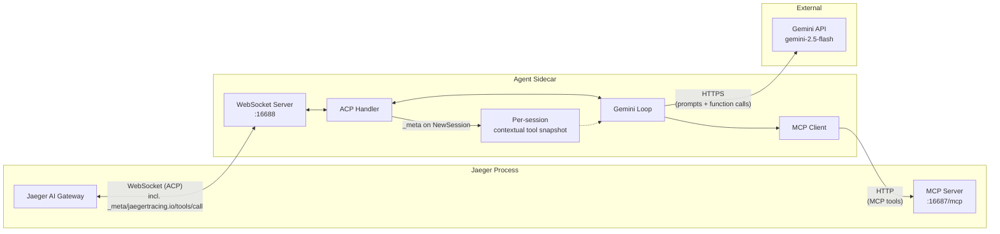
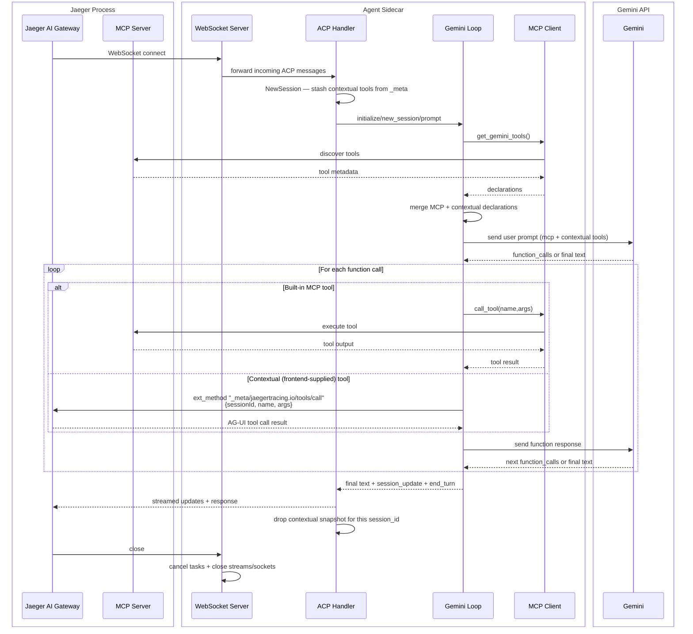

# Python Sidecar (ACP Agent)

This folder contains the Python ACP sidecar used by the Jaeger AI gateway.

The sidecar:
- Listens on `ws://localhost:16688` by default
- Runs a Gemini-backed ACP agent
- Uses Jaeger MCP tools from `http://127.0.0.1:16687/mcp`
- Registers per-turn **contextual (AG-UI) tools** the gateway attaches via
  `NewSessionRequest._meta`, and dispatches their invocations back to the
  gateway over an ACP **extension method** (`_meta/jaegertracing.io/tools/call`)

## Prerequisites

- Python 3.14+
- [`uv`](https://docs.astral.sh/uv/) installed
- A Gemini API key

## Required Environment Variable

Set your Gemini API key before starting the server:

```bash
export GEMINI_API_KEY="your_api_key_here"
```

Without this key, the sidecar cannot create the Gemini client.

Optional MCP endpoint override:

```bash
export JAEGER_MCP_URL="http://127.0.0.1:16687/mcp"
```

If unset, the sidecar defaults to `http://127.0.0.1:16687/mcp`.

Optional MCP discovery timeout override:

```bash
export JAEGER_MCP_DISCOVERY_TIMEOUT_SEC="15"
```

This controls the timeout for a single MCP tool discovery attempt.

## Tracing

The sidecar emits OpenTelemetry traces under service name `jaeger-gemini-sidecar`. Spans cover prompt handling, the agentic Gemini loop, MCP tool discovery, MCP tool calls, and contextual tool dispatches. Gemini calls are auto-instrumented via `opentelemetry-instrumentation-google-generativeai` and use the OTel GenAI semantic conventions.

Traces are exported over OTLP/gRPC. The default target (`http://localhost:4317`) matches the Jaeger all-in-one OTLP receiver, which makes the sidecar appear as its own service in the Jaeger UI.

| Flag | Env var | Default | Purpose |
| --- | --- | --- | --- |
| `--otlp-endpoint` | `OTEL_EXPORTER_OTLP_ENDPOINT` | `http://localhost:4317` | OTLP/gRPC collector endpoint |
| `--otlp-insecure` / `--no-otlp-insecure` | `OTEL_EXPORTER_OTLP_INSECURE` | `true` | Skip TLS when exporting (set to false + provide TLS at the collector for production) |

Example pointing at a remote collector with TLS:

```bash
uv run python main.py \
  --otlp-endpoint https://otel.example.com:4317 \
  --no-otlp-insecure
```

Metrics are intentionally not exported — Jaeger does not accept OTLP metrics. Metric export can be added once a metrics backend is available (see [#8397](https://github.com/jaegertracing/jaeger/issues/8397)).

## Install Dependencies

From this directory:

```bash
uv sync
```

`uv sync` is the only supported dependency install method for this sidecar.

## Run The Sidecar Server

You can start the same server using either entrypoint:

```bash
uv run python main.py
```

Expected startup log:

```text
Jaeger ACP Sidecar listening on ws://localhost:16688
```

Useful runtime flags:

```bash
uv run python main.py \
  --host localhost --port 16688 \
  --mcp-url http://127.0.0.1:16687/mcp \
  --mcp-discovery-timeout-sec 15 \
  --otlp-endpoint http://localhost:4317 --otlp-insecure
```

## Code Layout

- `main.py`: entrypoint, CLI/env parsing, WebSocket server bootstrap.
- `sidecar.py`: ACP agent handlers, contextual-tool routing, WebSocket transport bridge.
- `mcp_bridge.py`: MCP discovery/call bridge used by the agent.
- `sidecar_config.py`: validated runtime configuration model.
- `sidecar_helpers.py`: tool serialization/declaration helper functions.

## Architecture



### Sequence Diagram



## Contextual Tools

In addition to the built-in Jaeger MCP tools, the sidecar supports
**contextual tools** that the Jaeger UI attaches per chat turn. The flow:

1. **Receive snapshot.** When the gateway calls `NewSession`, it may include
   `_meta` (parsed by the Python ACP runtime as `field_meta`) containing the
   namespaced key `jaegertracing.io/contextual-tools` with shape:
   ```json
   { "tools": [ { "name": "...", "description": "...", "parameters": { ... } } ] }
   ```
   The sidecar stashes this list per `session_id` in
   `JaegerSidecarAgent._contextual_tools`.

2. **Register with Gemini.** During `prompt`, the sidecar builds a Gemini
   `Tool` from the contextual snapshot's `FunctionDeclaration`s and merges it
   with the discovered MCP tools before passing them to `chats.create()`.

3. **Route on call.** When Gemini emits a `function_call`, the sidecar checks
   the name against the contextual set:
   - **MCP name** → call the Jaeger MCP server directly (existing path).
   - **Contextual name** → dispatch the ACP extension method
     `_meta/jaegertracing.io/tools/call` back to the gateway with
     `{sessionId, name, args}`. The Python ACP runtime adds the leading
     underscore at send-time, so the constant in `sidecar.py` reads
     `meta/jaegertracing.io/tools/call`.

4. **Stream progress.** The sidecar emits `session_update` events
   (`start_tool_call` then `update_tool_call`) so the gateway can render
   tool progress in the chat stream just like it does for MCP tools.

5. **Cleanup.** After `prompt` returns (success or error), the sidecar
   `pop`s the snapshot for the session_id so the per-session dict does not
   grow unboundedly. The gateway opens one ACP session per chat request and
   never reuses the session_id, so the cleanup is unconditional.

The gateway treats contextual tool dispatches as **fire-and-forget side
effects**: it acknowledges immediately with `{result: {acknowledged: true},
isError: false}` so Gemini's agentic loop continues with a real function
response and produces a final answer in the same turn. The browser sees the
`TOOL_CALL_*` AG-UI events on its SSE stream and performs the side effect
locally (navigate, render, etc.) without sending a tool-result back. UI tools
are commands rather than queries, so this matches the natural semantic.

## End-to-End Test

1. Start Jaeger CMD in another terminal.
2. Start this sidecar.
3. Run the pytest workflow test, which monkeypatches the agent and drives the ACP prompt flow end to end:

```bash
uv run pytest -q test_sidecar_workflow.py
```

The test connects to the sidecar over WebSocket, sends `initialize`, `session/new`, and `session/prompt`, and verifies the streamed ACP updates and end-of-turn marker.
