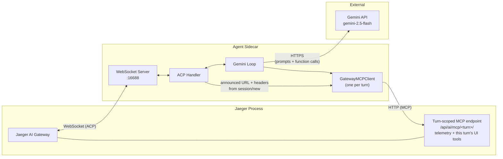
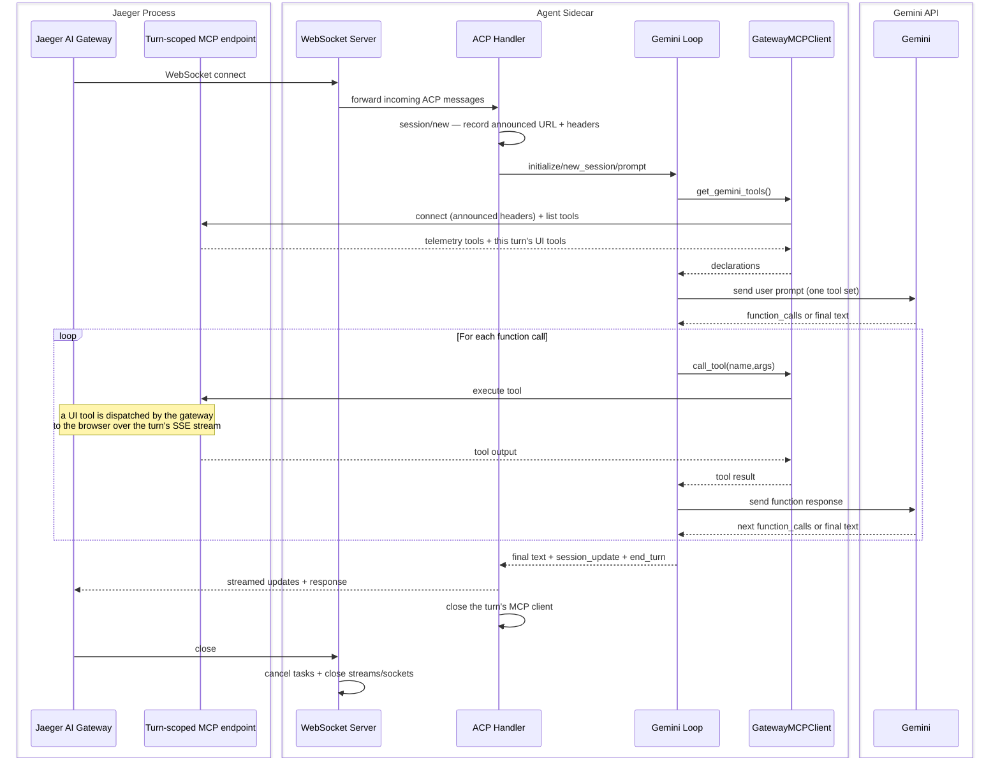

# Python Sidecar (ACP Agent)

This folder contains the Python ACP sidecar used by the Jaeger AI gateway.

The sidecar:
- Listens on `ws://localhost:16688` by default
- Runs a Gemini-backed ACP agent
- Calls every tool through the gateway's turn-scoped MCP endpoint, whose URL the
  gateway announces in `session/new` — telemetry tools and the browser's per-turn
  UI tools arrive as one flat tool set, over one connection

## Prerequisites

- Python 3.14+. On macOS, the Gemini sidecar requires Apple silicon because
  [`cryptography` 49+ no longer supports Intel macOS](https://cryptography.io/en/latest/changelog/#v49-0-0).
- [`uv`](https://docs.astral.sh/uv/) installed
- A Gemini API key

## Required Environment Variable

Set your Gemini API key before starting the server:

```bash
export GEMINI_API_KEY="your_api_key_here"
```

Without this key, the sidecar cannot create the Gemini client.

There is no MCP endpoint to configure. The gateway announces the URL of the
turn-scoped MCP endpoint in every `session/new`, and the sidecar dials what it
was given — so the sidecar holds no Jaeger address of its own.

Optional MCP connect timeout override:

```bash
export JAEGER_MCP_DISCOVERY_TIMEOUT_SEC="15"
```

This controls how long the sidecar waits when connecting to the announced
endpoint and listing its tools.

## Tracing

The sidecar emits OpenTelemetry traces under service name `jaeger-gemini-sidecar`. Spans cover prompt handling, the agentic Gemini loop, connecting to the announced MCP endpoint, and MCP tool calls. Each MCP request carries the current trace context in its `_meta`, so the gateway's `tools/list` and `tools/call` spans appear under the sidecar spans that sent them, in the same trace. Gemini calls are auto-instrumented via `opentelemetry-instrumentation-google-generativeai` and use the OTel GenAI semantic conventions.

Traces are exported over OTLP/gRPC. The default target (`http://localhost:4317`) matches the Jaeger all-in-one OTLP receiver, which makes the sidecar appear as its own service in the Jaeger UI.

| Flag | Env var | Default | Purpose |
| --- | --- | --- | --- |
| `--otlp-endpoint` | `OTEL_EXPORTER_OTLP_ENDPOINT` | `http://localhost:4317` | OTLP/gRPC collector endpoint |
| `--otlp-insecure` / `--no-otlp-insecure` | `OTEL_EXPORTER_OTLP_INSECURE` | `true` | Skip TLS when exporting (set to false + provide TLS at the collector for production) |

Example pointing at a remote collector with TLS:

```bash
uv run python main.py \
  --otlp-endpoint https://otel.example.com:4317 \
  --no-otlp-insecure
```

Metrics are intentionally not exported — Jaeger does not accept OTLP metrics. Metric export can be added once a metrics backend is available (see [#8397](https://github.com/jaegertracing/jaeger/issues/8397)).

## Install Dependencies

From this directory:

```bash
uv sync
```

`uv sync` is the only supported dependency install method for this sidecar.

## Run The Sidecar Server

### One-command launcher (recommended)

From the repository root:

```bash
export GEMINI_API_KEY=…
make run-ai-gemini
```

This bootstraps the Python toolchain (`uv sync`), starts Jaeger with the
example config, waits for it to be ready, then runs the sidecar in the
foreground. Ctrl-C stops both.

### Manual

If you'd rather run the two processes yourself (e.g., to point the sidecar
at a remote Jaeger), start the server directly:

```bash
uv run python main.py
```

Expected startup log:

```text
Jaeger ACP Sidecar listening on ws://localhost:16688
```

Useful runtime flags:

```bash
uv run python main.py \
  --host localhost --port 16688 \
  --mcp-discovery-timeout-sec 15 \
  --otlp-endpoint http://localhost:4317 --otlp-insecure
```

## Code Layout

- `main.py`: entrypoint, CLI/env parsing, WebSocket server bootstrap.
- `sidecar.py`: ACP agent handlers, Gemini agentic loop, WebSocket transport bridge.
- `gateway_mcp_client.py`: per-turn MCP client for the endpoint the gateway announced.
- `sidecar_config.py`: validated runtime configuration model.
- `sidecar_helpers.py`: announcement parsing and tool serialization helpers.

## Architecture

Every tool the agent can call is served by the gateway, at one turn-scoped MCP
endpoint whose URL arrives in `session/new`. The sidecar has a single tool
egress and no Jaeger address of its own — it cannot reach past the gateway, and
the gateway sees every call.


```mermaid
graph LR
    subgraph Jaeger Process
        GW[Jaeger AI Gateway]
        MCP["Turn-scoped MCP endpoint<br/>/api/ai/mcp/&lt;turn&gt;/<br/>telemetry + this turn's UI tools"]
        GW --- MCP
    end

    subgraph Agent Sidecar
        WS[WebSocket Server<br/>:16688]
        ACP[ACP Handler]
        Loop[Gemini Loop]
        Client["GatewayMCPClient<br/>(one per turn)"]
    end

    subgraph External
        Gemini[Gemini API<br/>gemini-2.5-flash]
    end

    GW <-- "WebSocket (ACP)" --> WS
    WS <--> ACP
    ACP -- "announced URL + headers<br/>from session/new" --> Client
    ACP <--> Loop
    Loop --> Client
    Client -- "HTTP (MCP)" --> MCP
    Loop -- "HTTPS<br/>(prompts + function calls)" --> Gemini
```

### Sequence Diagram


```mermaid
sequenceDiagram
    box Jaeger Process
        participant GW as Jaeger AI Gateway
        participant JMCP as Turn-scoped MCP endpoint
    end
    box Agent Sidecar
        participant HW as WebSocket Server
        participant ACP as ACP Handler
        participant GL as Gemini Loop
        participant MCP as GatewayMCPClient
    end
    box Gemini API
        participant GEM as Gemini
    end

    GW->>HW: WebSocket connect
    HW->>ACP: forward incoming ACP messages
    ACP->>ACP: session/new — record announced URL + headers
    ACP->>GL: initialize/new_session/prompt

    GL->>MCP: get_gemini_tools()
    MCP->>JMCP: connect (announced headers) + list tools
    JMCP-->>MCP: telemetry tools + this turn's UI tools
    MCP-->>GL: declarations

    GL->>GEM: send user prompt (one tool set)
    GEM-->>GL: function_calls or final text

    loop For each function call
        GL->>MCP: call_tool(name,args)
        MCP->>JMCP: execute tool
        note over GW,JMCP: a UI tool is dispatched by the gateway<br/>to the browser over the turn's SSE stream
        JMCP-->>MCP: tool output
        MCP-->>GL: tool result
        GL->>GEM: send function response
        GEM-->>GL: next function_calls or final text
    end

    GL-->>ACP: final text + session_update + end_turn
    ACP-->>GW: streamed updates + response
    ACP->>ACP: close the turn's MCP client

    GW->>HW: close
    HW->>HW: cancel tasks + close streams/sockets
```

## UI Tools

The Jaeger UI can attach its own tools to a chat turn — "UI tools", which run in
the browser rather than on the server. The sidecar needs no special handling for
them, and that is the point of this design:

1. **The gateway merges them in.** The turn-scoped MCP endpoint advertises the
   built-in telemetry tools *plus* whatever UI tools the frontend declared for
   that turn. The sidecar lists tools once and sees one flat set.

2. **The sidecar calls them like any other tool.** When Gemini emits a
   `function_call`, the sidecar dispatches it to the MCP endpoint. It does not
   inspect the name or choose a route — there is only one route.

3. **The gateway dispatches to the browser.** For a UI tool, the gateway
   forwards the call over the turn's SSE stream as `TOOL_CALL_*` AG-UI events;
   the browser executes it locally. The sidecar emits no `session_update` of its
   own, because the gateway is the single source of those events — emitting from
   both sides would double every event on the wire.

Earlier revisions of this sidecar dispatched UI tools back through the ACP
extension method `_meta/jaegertracing.io/tools/call` and kept a per-session
snapshot of the frontend's tools. Both are gone: the extension method was a
second dispatch path that the gateway could not observe uniformly, which is the
inversion-of-control problem RFC 0008 set out to remove.

## End-to-End Test

1. Start Jaeger CMD in another terminal.
2. Start this sidecar.
3. Run the pytest workflow test, which monkeypatches the agent and drives the ACP prompt flow end to end:

```bash
uv run pytest -q test_sidecar_workflow.py
```

The test connects to the sidecar over WebSocket, sends `initialize`, `session/new`, and `session/prompt`, and verifies the streamed ACP updates and end-of-turn marker.
