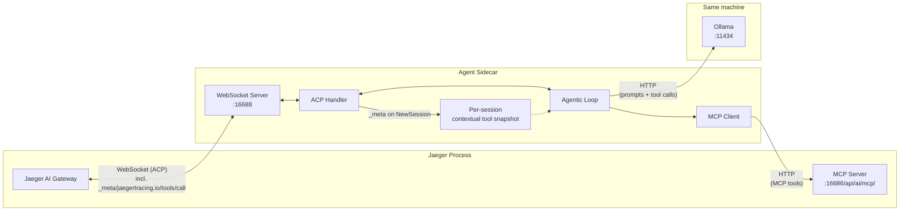

# Ollama Sidecar (ACP Agent)

This folder contains a Python ACP sidecar that runs the Jaeger AI chat
experience against a **local model** served by [Ollama](https://ollama.com).

It is the [`gemini/`](../gemini) reference sidecar with the LLM swapped, per
[Path A](../README.md#path-a-swap-the-llm) of the sidecar guide. Same gateway
contract, same Jaeger MCP tools, same contextual-tool routing — the difference
is where inference happens:

|                | [`gemini/`](../gemini)      | `ollama/` (this one)          |
| -------------- | --------------------------- | ----------------------------- |
| Model          | Hosted Gemini API           | Local, via Ollama             |
| Credentials    | `GEMINI_API_KEY` required   | None                          |
| Prompts leave the machine? | Yes           | No                            |
| Tool schemas   | Converted to Gemini's `FunctionDeclaration` | Passed through as JSON Schema |

Because MCP advertises `inputSchema` as plain JSON Schema and Ollama accepts
JSON Schema, this sidecar has no schema translation layer at all.

The sidecar:
- Listens on `ws://localhost:16688` by default
- Runs an Ollama-backed ACP agent
- Uses Jaeger MCP tools from `http://localhost:16686/api/ai/mcp/`
- Registers per-turn **contextual (AG-UI) tools** the gateway attaches via
  `NewSessionRequest._meta`, and dispatches their invocations back to the
  gateway over an ACP **extension method** (`_meta/jaegertracing.io/tools/call`)

## Prerequisites

- Python 3.14+
- [`uv`](https://docs.astral.sh/uv/) installed
- [Ollama](https://ollama.com/download) installed and running
- A pulled model that **supports tool calling**

No API key. Nothing to sign up for.

```bash
ollama serve          # usually already running after install
ollama pull qwen3:8b
```

Tool calling is not optional: without it the agent cannot query Jaeger's MCP
tools, so it could only answer from its own weights — which is exactly the kind
of answer this sidecar exists to avoid. `qwen3`, `llama3.1`, `mistral-nemo`,
and `qwen2.5` are known-good families; see
[Ollama's tool-calling list](https://ollama.com/search?c=tools).

## Run The Sidecar Server

### One-command launcher (recommended)

From the repository root:

```bash
make run-ai-ollama
```

This runs the preflight check (Ollama reachable, model pulled), bootstraps the
Python toolchain (`uv sync`), starts Jaeger with the example config, waits for
it to be ready, then runs the sidecar in the foreground. Ctrl-C stops both.

### Manual

```bash
uv sync
uv run python main.py
```

Expected startup log:

```text
Jaeger ACP Sidecar listening on ws://localhost:16688 (model=qwen3:8b via http://localhost:11434)
```

### Configuration

| Flag | Env var | Default | Purpose |
| --- | --- | --- | --- |
| `--ollama-url` | `JAEGER_AI_OLLAMA_URL` | `http://localhost:11434` | Ollama server base URL |
| `--model` | `JAEGER_AI_MODEL` | `qwen3:8b` | Model to run; must support tool calling |
| `--ollama-timeout-sec` | `JAEGER_AI_OLLAMA_TIMEOUT_SEC` | `300` | Timeout for one chat request |
| `--mcp-url` | `JAEGER_MCP_URL` | `http://localhost:16686/api/ai/mcp/` | Jaeger MCP endpoint |
| `--mcp-discovery-timeout-sec` | `JAEGER_MCP_DISCOVERY_TIMEOUT_SEC` | `15` | Timeout for one MCP discovery attempt |
| `--otlp-endpoint` | `OTEL_EXPORTER_OTLP_ENDPOINT` | `http://localhost:4317` | OTLP/gRPC collector endpoint |
| `--otlp-insecure` / `--no-otlp-insecure` | `OTEL_EXPORTER_OTLP_INSECURE` | `true` | Skip TLS when exporting |

Run a different model, or reach Ollama on another host:

```bash
uv run python main.py --model llama3.1:8b --ollama-url http://gpu-box:11434
```

### Choosing a model

Bigger models follow the "call a tool, then explain the evidence" instruction
more reliably; small ones are likelier to answer without calling anything, or
to call a tool with malformed arguments. If answers look invented, try a larger
model before suspecting the sidecar — and check the trace: a turn with no
`sidecar.execute_tool` span means the model never consulted Jaeger.

## Tracing

The sidecar emits OpenTelemetry traces under service name
`jaeger-ollama-sidecar`. Spans cover prompt handling, the agentic loop, MCP tool
discovery, MCP tool calls, and contextual tool dispatches.

Unlike the Gemini sidecar there is no auto-instrumentation for the model client,
so the model call is described by the sidecar's own `sidecar.agentic_loop` span,
which carries the OTel GenAI attributes (`gen_ai.provider.name = ollama`,
`gen_ai.request.model`, `gen_ai.conversation.id`).

Traces are exported over OTLP/gRPC. The default target (`http://localhost:4317`)
matches the Jaeger all-in-one OTLP receiver, which makes the sidecar appear as
its own service in the Jaeger UI — so the first thing you can ask the chat about
is the chat itself.

Metrics are intentionally not exported — Jaeger does not accept OTLP metrics.
Metric export can be added once a metrics backend is available (see
[#8397](https://github.com/jaegertracing/jaeger/issues/8397)).

## Code Layout

- `main.py`: entrypoint, CLI/env parsing, WebSocket server bootstrap.
- `sidecar.py`: ACP agent handlers, contextual-tool routing, and WebSocket transport bridge.
- `llm.py`: Ollama chat client and the model-turn types the agentic loop consumes.
- `mcp_bridge.py`: MCP discovery/call bridge used by the agent.
- `sidecar_config.py`: validated runtime configuration model.
- `sidecar_helpers.py`: tool declaration/serialization helper functions.

## Architecture



## Tests

```bash
uv run pytest -q
```

The suite drives the full `initialize` → `session/new` → `session/prompt` flow
over a real WebSocket, and exercises the tool-calling loop against a fake Ollama
server that speaks the real `/api/chat` wire format — so no multi-GB model is
needed to run it.
